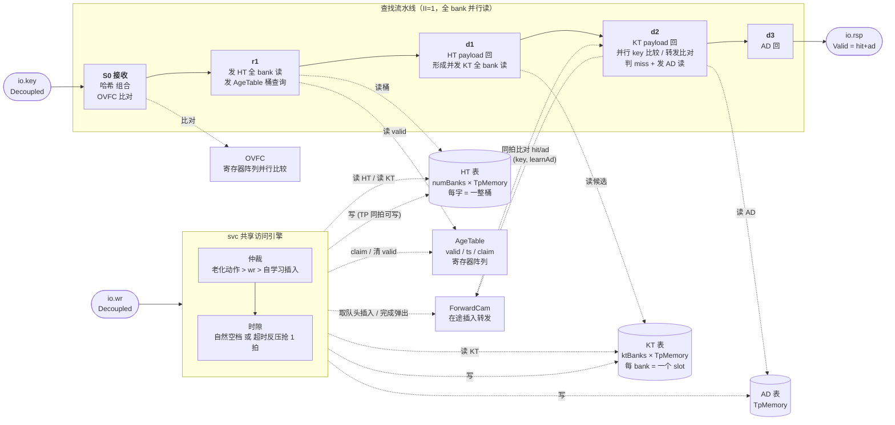
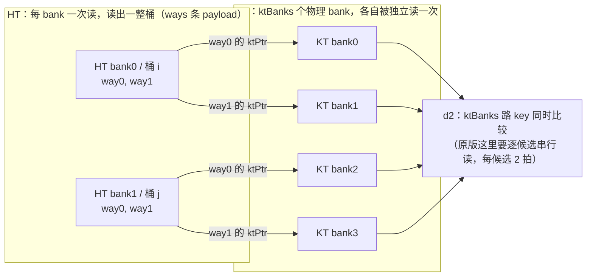
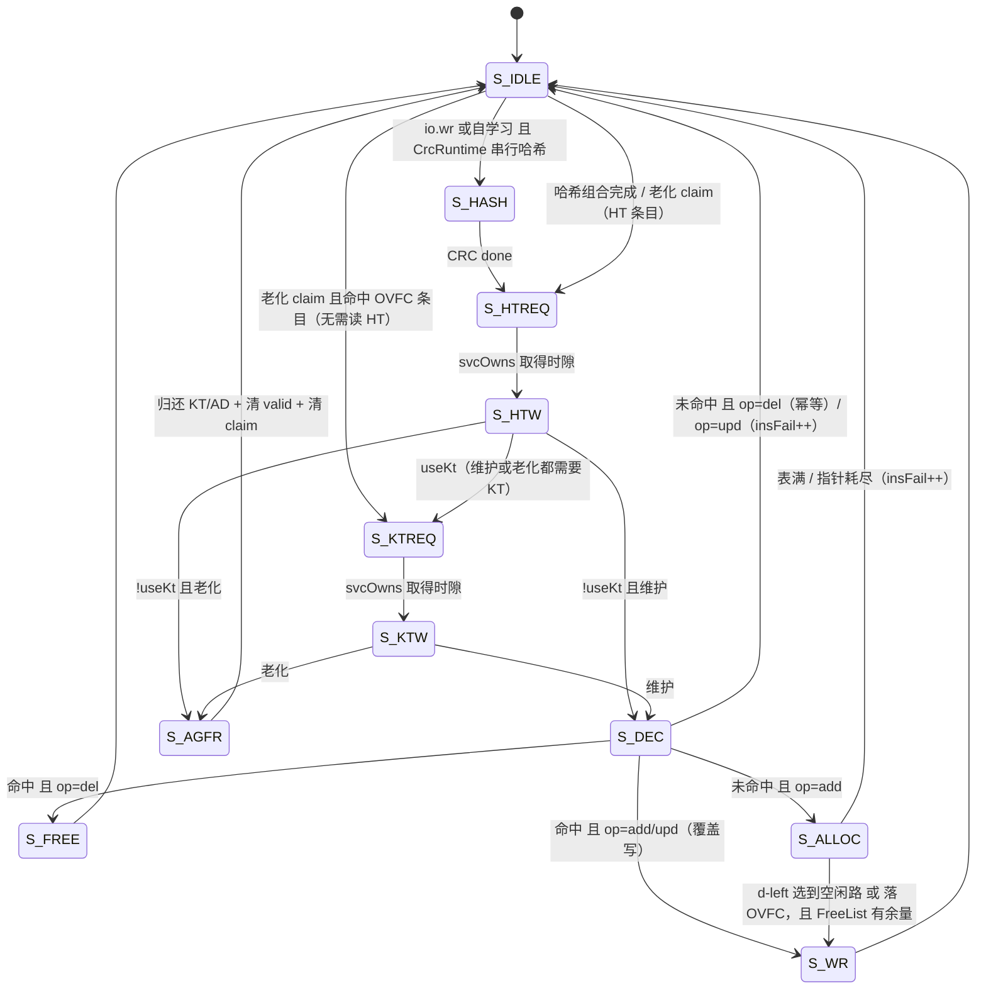
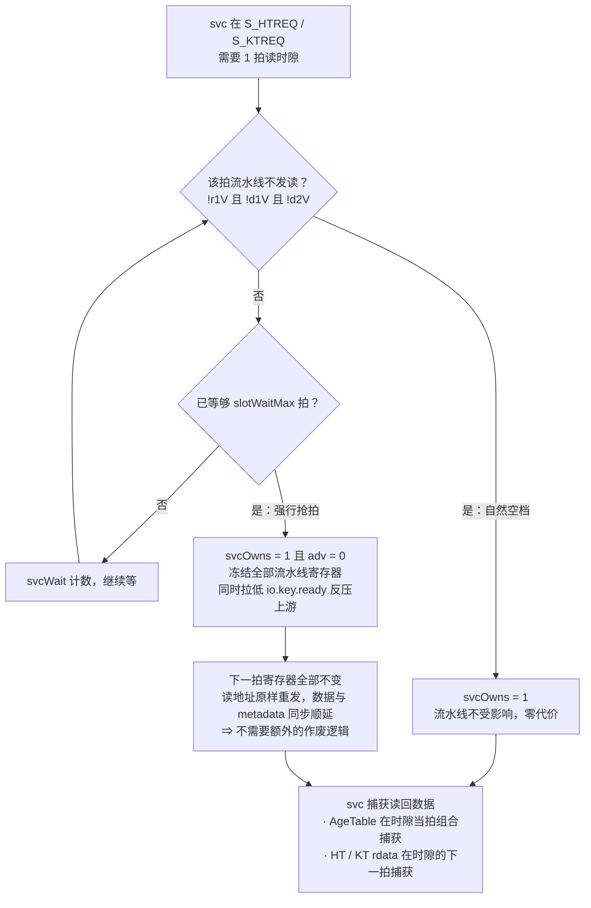
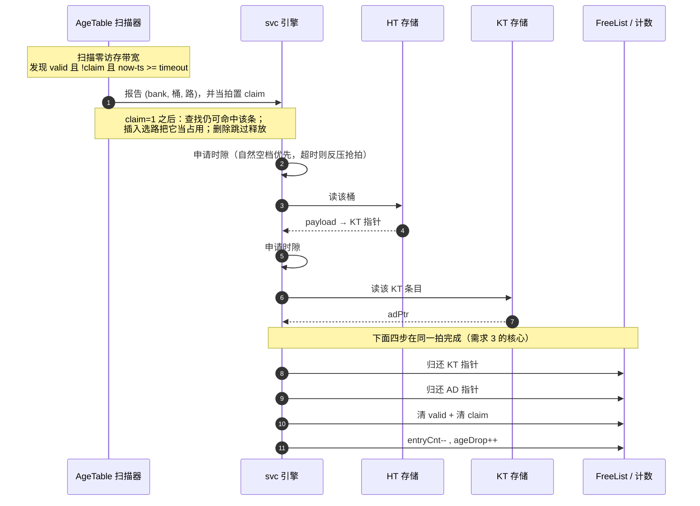
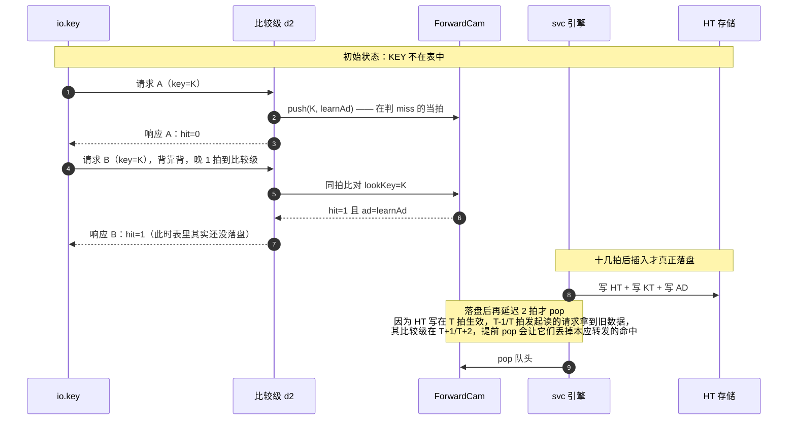

# 14 em —— EM（Exact Match）查表引擎（流水线版）

> 覆盖目录：`src/main/scala/BaseCbb/em/`，包 `em`
> 生成入口：`sbt "runMain em.EmGen <outDir> <preset>"`（build.sbt 只有 root 工程，**没有 `em/` 子工程**，不能用 `em/runMain`）
> 依赖：`BaseCbb.memory`（`Memory` / `TpMemoryWrap3`）
> 测试：`src/test/scala/em/ExactMatchSpec.scala`（`sbt "testOnly em.ExactMatchSpec"`）
> 本轮改造：把原"单请求串行 FSM"版本重构为**流水线版**，修复三条不满足项（见 §14）。

---

## 1. 模块清单

| 文件 | 内容 |
|------|------|
| `EmParams.scala` | `CrcMode`/`CrcHardwired`/`CrcRuntime`、`AgingParams`、`LearningParams`、`TiePolicy`、`EmParams`、`EmLayout` |
| `Crc.scala` | `Crc.hardwired`（逐位展开、纯组合）+ `CrcSerial`（运行时可配、串行 LFSR） |
| `FreeList.scala` | 空闲条目栈（每个 KT slot / AD 各一个实例） |
| `AgeTable.scala` | **新增**：HT 老化信息（valid/ts/claim）寄存器阵列 + 后台扫描器 |
| `ForwardCam.scala` | **新增**：在途插入转发 CAM（背靠背同 KEY 先 Miss 后 Hit 的关键） |
| `ExactMatch.scala` | 顶层：查找流水线 + svc 共享访问引擎 + OVFC |
| `EmGen.scala` | Verilog 产出入口 + 6 个预设 |

---

## 2. 总体结构



存储：

| 级别 | 存储 | 结构 |
|------|------|------|
| **HT** | Hash Table | `numBanks` 个 `TpMemoryWrap3`，每个 `bankDepth` 深 × **`htWordW = htPayW*ways` 位（一整桶）**；只存 payload |
| **KT** | Key Table | **`ktBanks = numBanks*ways` 个 `TpMemoryWrap3`**，各 `ktDepth/ktBanks` 深 × `ktEntryW` 位 |
| **AD** | Action Data | 1 个 `TpMemoryWrap3`（**由 SP 改 TP**） |
| **Age** | 老化信息 | `AgeTable` 寄存器阵列（`htDepth*ways` 项 × valid/ts/claim） |
| **OVFC** | 溢出 TCAM | 寄存器阵列并行比较 |

**三种存储全部是 TP（同拍 1 读 + 1 写）**，所以维护写与流水线读不互斥，**只有"读"需要时隙仲裁**。

---

## 3. 相对串行版的四点关键改动

1. **KT 按 (bank, way) 分 bank**：插入桶 (b) 路 (w) 的条目固定落在 KT bank `b*ways+w`，
   于是查找时 `ktBanks` 个候选**必然落在不同 bank，一次全并行读**，彻底去掉"逐候选串行扫描"
   （原版每候选 2 拍，是吞吐的主要瓶颈）。代价：每个 slot 的 KT 容量独立、不再是全局共享池，
   必须满足 `ktDepth/ktBanks >= bankDepth + ovfcDepth`（已加强制 `require`）。
2. **HT 的 valid / 时间戳移出 SRAM**，放进 `AgeTable` 寄存器阵列：
   - 查找时 valid 从寄存器组合读出（与 SRAM 读延迟同拍，天然对齐）
   - **老化扫描只扫寄存器，零访存带宽**，不与查找抢读端口
   - 副作用：命中刷新只写 `ts`、**不写 valid** → 结构上不可能"复活"已被老化的条目（见 §14.3）
3. **AD 由 SP 改 TP**：维护写 AD 与流水线读 AD 同拍并行。
4. **入口去掉 key FIFO**：`io.key` 改 `Decoupled`，靠 `ready` 反压；不再静默丢请求。

KT 分 bank 后"候选必然异 bank"的对应关系（这是并行读成立的前提）：



> slot 号 `s = b*ways + w` 既是 HT 里的扁平槽位，也就是该条目对应的 KT 物理 bank 号 —— 两者是同一个编号，不需要额外映射表。

---

## 4. 参数与位宽布局

### 4.1 `EmParams`

| 参数 | 默认 | 说明 |
|------|------|------|
| `keyWidth` / `adWidth` | 48 / 32 | 查找 key / 动作数据位宽 |
| `htDepth` / `htWays` | 1024 / 4 | HT 总桶数（被 numBanks 均分）/ 每桶路数 |
| `numBanks` | 1 | d-left 子表数（1 = 关闭） |
| `dLeftTie` | `Random` | 并列仲裁：`Leftmost`/`Random`(LFSR)/`RoundRobin` |
| `ktDepth` | 4096 | KT 总条目数（**= ktBanks 个 slot 之和**） |
| `useKt` / `useAd` | true / true | false = 该级内联进上一级 |
| `adDepth` | 1024 | AD 条目数 |
| `ovfcDepth` | 0 | HT 溢出 TCAM 深度（0 = 关闭） |
| `crcWidth` / `crc` | 32 / `CrcHardwired.crc32` | 哈希位宽 / 形态 |
| `learnFwdDepth` | 8 | 在途插入转发 CAM 深度 |
| `slotWaitMax` | 8 | svc 等空时隙的上限拍数，超时则反压抢一拍（越小＝维护/老化越跟得上，代价是查找出现少量气泡） |
| `aging` / `learning` / `memProtect` | None / None / ProtNone | 老化 / 自学习 / 存储保护 |

`EmLayout` 的硬约束：

- `htDepth / ktDepth / adDepth / bankDepth` 必须是 2 的幂（`Memory.addrWidth = log2Ceil(depth)`）
- `htDepth % numBanks == 0`、`idxW*numBanks <= crcWidth`
- `ktDepth % ktBanks == 0` 且 `ktDepth/ktBanks >= bankDepth + ovfcDepth`

### 4.2 关键位宽

| 字段 | 公式 | 说明 |
|------|------|------|
| `bankDepth` / `idxW` | `htDepth/numBanks` / `log2Ceil(bankDepth)` | 每 bank 桶数 / 桶索引 |
| `ktBanks` | `numBanks*ways` | KT 物理 bank 数 = 一次查找并行读的候选数 |
| `ktDepthReal` / `ktPtrW` | `ktDepth/ktBanks` / `log2Ceil(ktDepthReal)` | 每 slot 容量 / slot 内索引 |
| `htPayW` / `htWordW` | `useKt ? ktPtrW : keyW+(useAd?adPtrW:adW)` / `htPayW*ways` | HT 单条 payload / **整桶字** |
| `ageEntryW` | `1 + ageW + 1` | valid + ts + claim |
| `ktPayW` / `ktEntryW` | `useAd ? adPtrW : adW` / `keyW+ktPayW` | KT payload / 整条目 |
| `ovfcPayW` | `useKt ? ktPtrW+slotW : (useAd?adPtrW:adW)` | OVFC 负载（**useKt 时要额外记 KT 落在哪个 bank**） |
| `lookupLatency` | `2 + (useKt?1:0) + (useAd?1:0)` | 接受 → rsp 的拍数（不含串行 CRC） |

### 4.3 预设

| preset | 用途 | ktDepth 分配 |
|--------|------|--------------|
| `basic` | 三级齐全，无学习无老化 | 4096 = 4×1024 |
| `2left` | d-left(2) + 学习 + 老化 | 8192 = 8×1024 |
| `inline` | 单级（key+AD 都内联 HT，无 KT/AD） | —— |
| `noad` | 两级（AD 内联 KT） | 4096 = 4×1024 |
| `crcrt` | 运行时可配 CRC（串行 LFSR） | 4096 = 4×1024 |
| `tb` | 功能仿真小尺寸（HT 打得满，能覆盖 OVFC 路径） | 128 = 4×32 |

---

## 5. 对外接口

| 端口 | 方向 | 语义 |
|------|------|------|
| `key: Decoupled[UInt(keyW)]` | in | 查表请求。**有 ready，不再丢请求**；svc 抢时隙时反压 |
| `rsp: Valid[UInt(1+adW)]` | out | `Cat(hit, ad)`，**单拍脉冲** |
| `wr: Decoupled[EmWrCmd]` | in | 维护口：`op`(add/del/upd) + key + ad；busy 时靠 ready 反压，不再静默丢弃 |
| `learnAd` / `learnEn` | in | 自学习 AD（**与 io.key 同拍对齐，随包携带**）/ 开关 |
| `ageEn` | in | 老化开关（同时门控命中刷新与扫描器） |
| `memInit` / `memInitDone` | in/out | 广播到各级 `dfx.init`；全高且 `!memInit` 才算 ready |
| `crcPoly/Init/Xor` | in | 仅 `CrcRuntime` 生效 |
| `status` | out | 见 §10 |

> **行为变更**：`learnAd` 现在在**接收当拍**采样并随请求穿过流水线（旧版在 LK_DONE 采样，与实际包不对齐）。

---

## 6. 查找流水线与影子寄存器

存储读延迟 1 拍（`flopIn/flopOut/CheckIn/CheckOut` 全关），因此"发起读的那一级"和"用数据的那一级"
必然错开一拍，metadata 需要影子寄存器跟随：

| 拍 | 级 | 动作 |
|----|----|------|
| T | S0 | 握手接收：哈希（组合）+ OVFC 比对 → `acq` |
| T+1 | — | `acq` → `r1`（`r1V := acqV`），**HT 读在此拍发起** |
| T+2 | d1 | HT rdata 有效；d1 携带 {key, idx, OVFC, **valid 位图**（AgeTable 同拍组合读）}；用 HT payload 组合形成 **KT 读地址并当拍发起** |
| T+3 | d2 | KT rdata 有效；**并行 key 比较 + 转发 CAM 比对（miss 判定在此拍）**；形成 AD 读地址并当拍发起 |
| T+4 | d3 | AD rdata 有效 → 输出 `rsp` |

- 影子级数随配置裁剪：`d1` 恒有；`useKt||useAd` 才有 `d2`；`useKt&&useAd` 才有 `d3`。
- `!useKt` 时比较发生在 d1（对 HT payload 里的 key 做并行比较），没有 KT 级。

稳态时序（横轴为拍号，A/B/C 三个请求背靠背错开一拍 → **每拍都能收一个新请求、每拍都出一个响应**）：

```mermaid
gantt
    title 查找流水线稳态时序（II=1）
    dateFormat X
    axisFormat %s
    section 请求 A
    T1 接收 哈希 + OVFC 比对 :1, 1
    T2 r1 发 HT 全 bank 读   :2, 1
    T3 d1 发 KT 全 bank 读   :3, 1
    T4 d2 比较 判 miss 发 AD 读 :4, 1
    T5 d3 输出 rsp           :5, 1
    section 请求 B
    T2 接收 哈希 + OVFC 比对 :2, 1
    T3 r1 发 HT 全 bank 读   :3, 1
    T4 d1 发 KT 全 bank 读   :4, 1
    T5 d2 比较 判 miss 发 AD 读 :5, 1
    T6 d3 输出 rsp           :6, 1
    section 请求 C
    T3 接收 哈希 + OVFC 比对 :3, 1
    T4 r1 发 HT 全 bank 读   :4, 1
    T5 d1 发 KT 全 bank 读   :5, 1
    T6 d2 比较 判 miss 发 AD 读 :6, 1
    T7 d3 输出 rsp           :7, 1
```



为什么必须引入影子寄存器 —— 读延迟 1 拍天然让"发地址的拍"和"用数据的拍"错开：

```mermaid
gantt
    title 读延迟 1 拍 ⇒ 地址级与数据级错开，metadata 靠影子跟随
    dateFormat X
    axisFormat %s
    section 地址 / 元数据
    T1 r1 持有 idx 并驱动 HT raddr :1, 1
    T2 d1 用 HT payload 形成 KT 地址 :2, 1
    T3 d2 用 KT payload 做比较     :3, 1
    section 存储数据 latency=1
    T2 HT rdata 有效               :2, 1
    T3 KT rdata 有效               :3, 1
    section AgeTable 组合读
    T1 valid 位图读出 随 d1 打一拍  :1, 1
```



> 关键点：AgeTable 是**组合读的寄存器阵列**，在 r1 拍读出、随影子寄存器进入 d1，
> 与 HT rdata 到达 d1 的时机**天然同拍**，不需要额外对齐逻辑。

⚠️ **两个实测踩过的坑**（都由本轮新增的 testbench 抓到）：

- `r1V` 必须**无条件**跟随 `acqV`（写成 `when(acqV){ r1V := ... }` 会让 valid 只置位不清零，
  整条流水线卡死、`rsp.valid` 常高，而且"每拍都有响应"的断言会**假通过**）。
- HT 存储宽度必须是**整桶字** `htWordW`（写成 `htPayW` 会导致只有 way0 能写进去、
  way1 永远读回 0，表现为"插进去的 key 查不到"）。

---

## 7. svc 共享访问引擎与时隙仲裁

三个客户，优先级 **老化动作 > 维护口 `wr` > 自学习插入**：



**时隙**：一次操作需要 2 次读（① HT 桶 + AgeTable 查询 ② KT 并行候选），svc 取时隙的规则：



> **写不需要时隙**：HT / KT / AD 都是 TP 存储，同拍支持"流水线读另一个地址 + svc 写"，
> 所以维护/老化的写动作随时可以做，只有**读**要走上面的仲裁。

**d-left 选路**（S_ALLOC）：按各子表 `PopCount(valid||claim)` 选占用最少的子表，并列按 `dLeftTie`
（`Leftmost` / 16 位 LFSR `Random` / `RoundRobin`）；本子表无空闲路则落 OVFC（OVFC 也要 KT，
从轮转基址起找一个还有空位的 KT slot）。

---

## 8. 老化（Aging）

`AgeTable` 内部扫描器逐 (bank, 桶, 路) 自增，发现 `valid && !claim && (now - ts) >= timeout`
就报告；扫描本身**不占任何访存带宽**。老化动作：

| 步骤 | 动作 |
|------|------|
| 1 | 扫描器报告候选 → **置 claim**（不清 valid，查找仍可命中；claim 阻止插入复用该路） |
| 2 | 申请时隙读 HT 桶，取该路 payload → KT 指针 |
| 3 | 申请时隙读 KT，取 AD 指针 |
| 4 | **同一拍**：归还 KT 指针 + 归还 AD 指针 + 清 `valid` + 清 `claim` + `entryCnt--` + `ageDrop++` |



- 命中刷新只写 `ts`（不写 valid）→ 老化中的条目不会被"复活"。
- 维护删除遇到 `claim=1` 的路会跳过释放（交给扫描器）；插入选路把 claim 当占用 →
  两者目标集合天然互斥，**不会二次压栈**。
- OVFC 条目有独立的扫描游标与 claim 位（`ovfcC`）。
- `aging=None` 时过期判据恒 false（不能用 `timeout=0` 兜底，否则全表被删）。

---

## 9. 自学习与转发 CAM（需求 2 的关键）

问题：自学习插入要十几拍（分配 KT/AD → 写 HT），而流水线接受间隔只有 1 拍。
第 2 个同 KEY 请求进入流水线时插入还在半路，按裸表查**必然 Miss**。

解法：`ForwardCam` —— 在**判定 Miss 的当拍**（比较级 d2）把 `(key, learnAd)` 压进 CAM；
后续查找在**同一级**并行比对 CAM，命中即当 Hit 返回 CAM 里的 AD。

- 比对与压入同拍 → 背靠背的下一个请求（比它晚 1 拍到比较级）立刻可见。
- 同 key 多条时取**最新**一条；插入完成时弹出，且**延迟 2 拍再弹**：
  HT 写在 T 拍落盘，T-1/T 拍发起 HT 读的请求拿到的是旧数据，其比较级在 T+1/T+2，
  若 T 拍就弹出会丢掉这些请求本应转发来的命中。
- CAM 满时丢弃并计 `learnDrop`（不阻塞流水线）；`io.key` 不再因 FIFO 满而丢包。



---

## 10. 状态与统计（`EmStatus`）

| 字段 | 位宽 | 含义 |
|------|------|------|
| `entries` | `log2Ceil(htDepth*htWays+ovfcDepth+1)` | HT+OVFC 当前条目数 |
| `insert` / `insFail` | 16 | 维护口插入次数 / 失败次数（表满、指针耗尽、upd 未命中） |
| `delete` / `learn` / `ageDrop` | 16 | 删除 / 自学习插入 / 老化删除 |
| `learnDrop` | 16 | 转发 CAM 满导致的漏学次数（原 `keyDrop` 随 FIFO 移除而取消） |
| `ovfcUse` | `log2Ceil(ovfcDepth+1)` | OVFC 占用数 |
| `fwdUse` | `log2Ceil(learnFwdDepth+1)` | 转发 CAM 占用数 |
| `ktFree` / `adFree` | `log2Ceil(ktDepth+1)` / `log2Ceil(adDepth+1)` | KT/AD 空闲条目总数（**用来验证"老化确实回收了资源"**） |
| `lkBusy` / `mtBusy` | Bool | 查找流水线非空 / svc 非空闲 |

---

## 11. CRC / 哈希

统一"左移 MSB 先"，`refin/refout` 组合出标准 reflected CRC（以太网 CRC-32）。

| 形态 | 硬件 | 延迟 | 对 II 的影响 |
|------|------|------|--------------|
| `CrcHardwired` | 逐位展开纯 XOR 树 | 组合，0 拍 | **II=1** |
| `CrcRuntime` | 串行 LFSR `CrcSerial` | `dataWidth` 拍 | ⚠️ **无法 II=1**：接收级被 stall `keyWidth` 拍 |

查找与维护各用一个 CRC 实例（`lkCrc`/`svCrc`）。哈希只用到低位 `idxW*numBanks` 位。

---

## 12. 存储保护与 DFX

`Memory` 统一配置 `flopIn/flopOut/CheckIn/CheckOut = false` → `latency = 1`，流水线按 1 拍对齐。
`cpu`/`dfx` 侧端口由 `driveAux` 统一置无效，`dfx.init` 接 `io.memInit`。
`memProtect` 透传（ECC/Parity 只改位宽与组合编解码，不改端口数与读延迟）。

---

## 13. Verilog 产出（`EmGen`）

```
sbt "runMain em.EmGen <outDir> <preset>"      # outDir 默认 out/a3，preset 默认 basic
  ChiselStage(--target chirrtl) → <outDir>/<preset>/ExactMatch.fir
  firtool --verilog             → <outDir>/<preset>/ExactMatch.v
```

必须带 `--lowering-options=disallowLocalVariables`，否则函数内变量生成 `automatic`，
iverilog 会以 "Overriding the default variable lifetime" 报 unsupported、非零退出且**不产出 vvp**。

---

## 14. 功能符合性检查（本轮修复结果）

> 结论来自 `src/test/scala/em/ExactMatchSpec.scala`，命令 `sbt "testOnly em.ExactMatchSpec"`，
> 后端 `chisel3.simulator.EphemeralSimulator`（Verilator）。

### 14.1 需求 1：支持每拍处理一个请求 —— ✅ **已满足**

- 结构：查找改为 4 级流水线（§6），KT 分 bank 并行读，去掉逐候选串行扫描。
- 收益（tb 预设，查 8 个请求的总拍数）：

```mermaid
gantt
    title 查 8 个请求所需拍数对比（横轴为拍号）
    dateFormat X
    axisFormat %s
    section 旧版 串行 FSM
    8 个请求串行执行 每个 12 拍 合计 96 拍 :0, 96
    section 新版 流水线
    前 4 拍填充流水线 延迟 4 :0, 4
    之后每拍出 1 个 再出 7 个 :4, 7
```



同组数字（万一渲染器不支持 gantt 时看这张表）：

| 版本 | 单请求延迟 | 接受间隔 II | 查 8 个请求总拍数 | 背靠背同 KEY |
|------|-----------|-------------|-------------------|--------------|
| 旧版 串行 FSM | 12 拍（miss 最坏） | 12 拍 | 96 拍 | ❌ 第 2 个也 miss |
| 新版 流水线 | 4 拍 | **1 拍** | 11 拍 | ✅ 第 2 个 hit |
- 用例 `需求1 每拍一请求`：连续 60 拍灌命中流量，断言 `rsp.valid` 每拍都为 1（`rspCnt == 60`）
  且 `io.key.ready` 从未拉低（`readyDrop == 0`）；另加**排空断言**（停灌后 `rsp.valid` 必须在 20 拍内落下）
  —— 专门用来防止"valid 常高"式的假通过（开发过程中这条断言确实抓到过一次真 bug）。
- **边界条件（诚实说明）**：
  - II=1 成立于**命中流量**。持续全 Miss + 自学习时，插入路径受 svc 读时隙限制
    （每次插入 2 个时隙），吞吐会低于 1 —— 这是端口物理限制，不是实现缺陷。
  - `CrcRuntime` 下无法 II=1（串行 CRC 占 `keyWidth` 拍）。
  - svc 抢拍时 `io.key.ready` 会拉低（有意的反压，不是丢包）。

### 14.2 需求 2：背靠背同 KEY，第 1 个 Miss、第 2 个 Hit —— ✅ **已满足**

- 结构：`ForwardCam` 在 Miss 判定当拍压入、同拍比对（§9）。
- 用例 `需求2 背靠背同 KEY`：连续两拍发同一个未插入的 KEY，断言第 1 个响应 `hit=0`、
  第 2 个响应 `hit=1` 且 `ad == learnAd`；同时断言第 2 拍 `ready=1`（真背靠背）。

### 14.3 需求 3：HT 老化，老化满足后同时释放 KT 资源 —— ✅ **已满足**

- 结构：老化信息进寄存器阵列（扫描零带宽）；老化动作第 4 步**同拍**归还 KT/AD 指针与清 valid（§8）。
- 用例 `需求3 老化`：插入 1 条 → 开老化 → 等超时，断言 `entries==0`、
  **`ktFree` 回到满值 `ktDepth`**、**`adFree` 回到满值 `adDepth`**、`ageDrop` 递增；
  再断言"老化后立刻重新插入同 KEY 成功"。
- 原版的三个缺陷全部结构性消除：

| 原缺陷 | 现状 |
|--------|------|
| `swOvIdx` 未初始化 → 首轮扫完后 sweep 卡死（4 态仿真） | 该 FSM 已删除；`AgeTable` 扫描游标 `RegInit(0)`，OVFC 游标 `RegInit(0)` |
| KT 已归还 / HT 还 valid 的 1 拍窗口 | 归还 KT/AD 与清 valid **同拍**完成 |
| 命中刷新可"复活"已老化条目 → FreeList 二次压栈 | 刷新只写 `ts` 不写 valid，复活路径不存在；用例 `老化与命中并发` 持续断言 `ktFree/adFree` 不超过总容量 |

### 14.4 其它已覆盖的行为

- `add / lookup / del / upd` 语义、**覆盖同一 key 时条目数不变**、`del` 幂等、
  `upd` 未命中记 `insFail`。
- 四种裁剪组合（`basic` / `inline`(useKt=F,useAd=F) / `noad`(useAd=F) / `2left`）参数化回归。
- OVFC 溢出：插 80 条（容量 72），断言 `ovfcUse>0`、`entries == 成功条数`、
  **所有插入成功的 key 都查得到**。
- 6 个预设均能产出 Verilog（`sbt "runMain em.EmGen out/em <preset>"`），无 Chisel 告警。

---

## 15. 已知限制与后续可做项

1. **面积**：`AgeTable` = `htDepth*ways*(1+ageW+claim)` 个 flop（basic 预设 ≈ 74k flop），
   比 HT SRAM 本身还大。这是"扫描零带宽、查找零干扰"的代价。若要省面积，可退化为
   "ts 留在 SRAM + 机会式扫描"，代价是扫描要占读时隙、II 损失约 1~2%。
   （与 `FreeList` 一样属行为级建模；真做硅应换 bitmap + 优先编码器。）
2. **持续全 Miss + 学习的吞吐**受插入路径限制（见 14.1）。
3. **`rdLat > 1` 的存储**：流水线目前按 1 拍硬编码；换真 SRAM 若打开 `flopIn/flopOut/CheckOut`，
   需按 `rdLat` 插入等待级。
4. **跨请求的桶级竞态**：后到的查找可能读到"插入前"的桶而 Miss（软件语义允许）；
   同 KEY 的在途插入由转发 CAM 覆盖。若需要更强一致性，可把转发 CAM 扩展成完整的写后读跟踪。
5. `CrcRuntime` 未做 II=1 优化（可改并行 CRC，或把串行 CRC 放到流水线外的旁路）。
