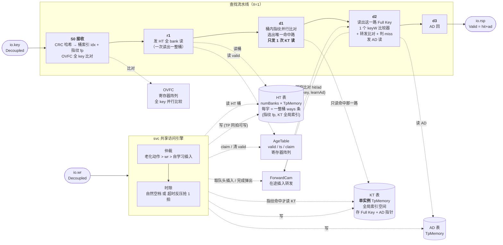
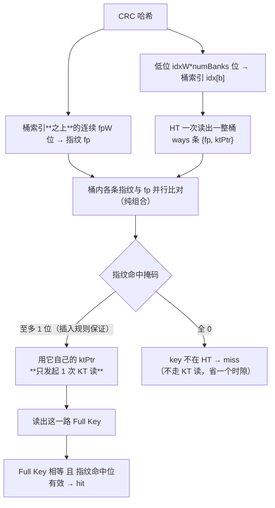
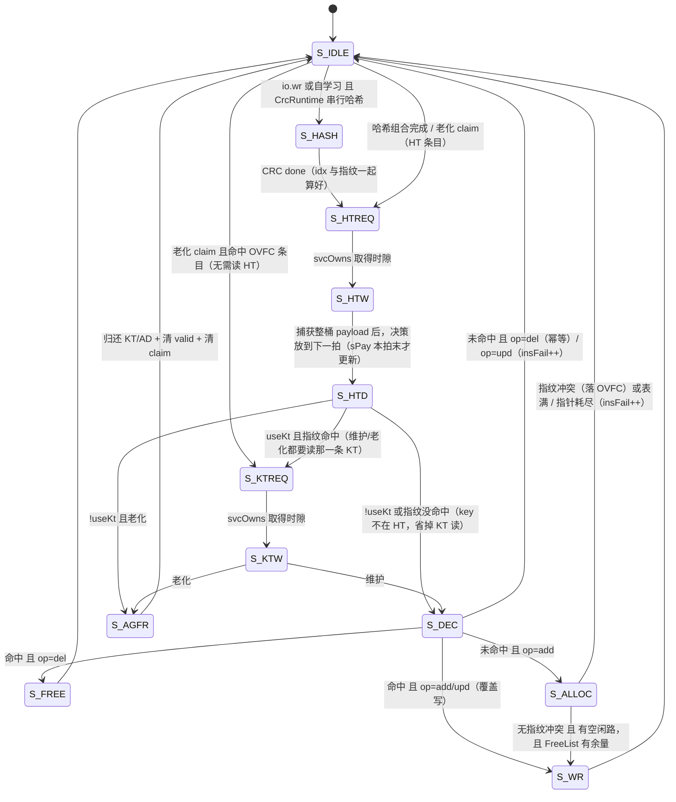
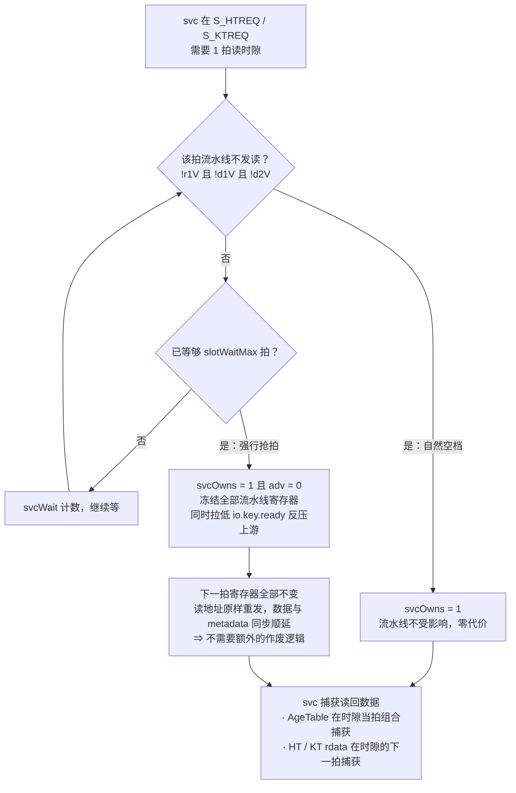
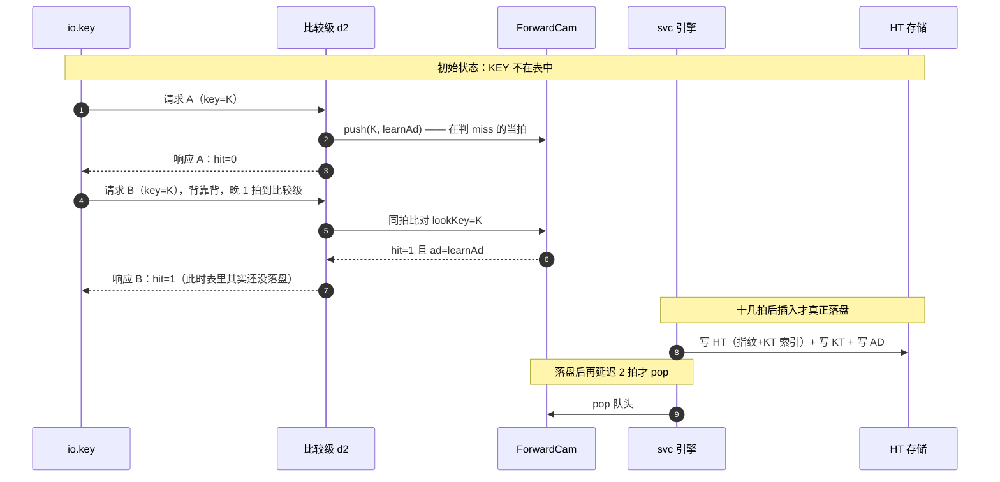

# 14 em —— EM（Exact Match）查表引擎（流水线 + 指纹过滤版）

> 覆盖目录：`src/main/scala/BaseCbb/em/`，包 `em`
> 生成入口：`sbt "runMain em.EmGen <outDir> <preset>"`（build.sbt 只有 root 工程，**没有 `em/` 子工程**，不能用 `em/runMain`）
> 依赖：`BaseCbb.memory`（`Memory` / `TpMemoryWrap3`）
> 测试：`src/test/scala/em/ExactMatchSpec.scala` + `CrcSpec.scala`（共 16 组用例，`sbt "testOnly em.*"`，约 75s）
> 本版要点：**HT 存指纹 + KT 索引，查找先用指纹筛选候选，只读命中的那一路 KT 的 Full Key**。

---

## 1. 模块清单

| 文件 | 内容 |
|------|------|
| `EmParams.scala` | `CrcMode`/`CrcHardwired`/`CrcRuntime`、`AgingParams`、`LearningParams`、`TiePolicy`、`EmParams`、`EmLayout`（含指纹与插入规则说明） |
| `Crc.scala` | `Crc.hardwired`（逐位展开、纯组合）+ `CrcSerial`（运行时可配、串行 LFSR） |
| `FreeList.scala` | 空闲条目栈（KT 一个全局实例 + AD 一个） |
| `AgeTable.scala` | HT 老化信息（valid/ts/claim）寄存器阵列 + 后台扫描器 |
| `ForwardCam.scala` | 在途插入转发 CAM（背靠背同 KEY 先 Miss 后 Hit 的关键） |
| `ExactMatch.scala` | 顶层：查找流水线 + svc 共享访问引擎 + OVFC |
| `EmGen.scala` | Verilog 产出入口 + 6 个预设 |

---

## 2. 总体结构



存储：

| 级别 | 存储 | 结构 |
|------|------|------|
| **HT** | Hash Table | `numBanks` 个 `TpMemoryWrap3`，每个 `bankDepth` 深 × **`htWordW = htPayW*ways` 位（一整桶）**；每条只存 `{指纹 fp, KT 全局索引}`，valid/ts 在 AgeTable |
| **KT** | Key Table | **1 个** `TpMemoryWrap3`，`ktDepth` 深 × `ktEntryW` 位（Full Key + AD 指针）；**全局索引 + 单个全局 FreeList** |
| **AD** | Action Data | 1 个 `TpMemoryWrap3` |
| **Age** | 老化信息 | `AgeTable` 寄存器阵列（`htDepth*ways` 项 × valid/ts/claim） |
| **OVFC** | 溢出 TCAM | 寄存器阵列，**全 key** 并行比较 |

**三种存储都是 TP（同拍 1 读 + 1 写）**，所以维护写与流水线读不互斥，**只有"读"需要时隙仲裁**。

---

## 3. 核心：指纹过滤（为什么只读 1 路 KT）

### 3.1 流程



### 3.2 相比"读多路 KT 一起比"省了什么

| | 读多路 KT 并行比全 key | 本设计（指纹过滤） |
|---|---|---|
| KT 读端口 | `ktBanks` 路（每拍全读） | **1 路** |
| 比较器 | `ktBanks` 个 `keyW` 宽 | `ktBanks` 个 `fpW` 宽 + **1 个 `keyW`** |
| 命中选择 | `ktBanks` 路 `ktEntryW` 宽 mux | 1 路，无需 mux |
| KT 存储组织 | 需按 (bank,way) 分 bank 才能并行读 | **单实例 + 全局 FreeList**（容量全局共享） |

### 3.3 插入规则 —— 保证"指纹命中即唯一"，让 1 次 KT 读是精确的

指纹是压缩信息，桶里可能有两条**不同 key 但同指纹**的条目。若只读其中一路，
就可能把另一条（真正要查的）误判成 miss。为避免这个失效，规则是：

> **插入 K 时，若 K 的全部候选槽位（`numBanks` 个桶 × ways 路）里已存在另一条 valid 条目、其指纹等于 `fp(K)`，
> 则本次插入不进 HT** —— 落 OVFC（OVFC 用全 key 比较，精确），OVFC 关闭/满则 `insFail++`，
> 并计 `status.fpClash`。

于是对任意在表条目，其候选槽位集合里"同指纹"的条目**至多它自己**：

- 查找：指纹命中掩码至多 1 位 → 只读 1 路 KT 就是精确判定；
- 维护（add/del/upd）：判断"是否已存在"时同理，至多读 1 路 KT；指纹没命中则直接判"不在表"，连 KT 读都省掉。

该关系是**对称**的：`E 落在 K 的候选桶 ⇔ 两者在该 bank 的桶索引相同 ⇔ K 落在 E 的候选桶`，
所以插入时检查一次即可，不会被后续插入破坏。

**代价**：指纹撞车的那次插入只能落 OVFC / 失败；撞车概率 ≈ 候选槽位数 × 2^-fpW
（fpW=12、4 路时约 0.1%，且只影响"插入"，不影响查找正确性）。

### 3.4 与 OVFC 的关系

OVFC 条目用**全 key** 比较，天然精确，不参与指纹规则；查找时 OVFC 命中优先于 HT。
所以"指纹撞车 → 落 OVFC"这条路对查找是完全透明的。

---

## 4. 参数与位宽布局

### 4.1 `EmParams`

| 参数 | 默认 | 说明 |
|------|------|------|
| `keyWidth` / `adWidth` | 48 / 32 | 查找 key / 动作数据位宽 |
| `htDepth` / `htWays` | 1024 / 4 | HT 总桶数（被 numBanks 均分）/ 每桶路数 |
| `numBanks` | 1 | d-left 子表数（1 = 关闭） |
| `dLeftTie` | `Random` | 并列仲裁：`Leftmost`/`Random`(LFSR)/`RoundRobin` |
| `ktDepth` | 4096 | KT 总条目数（**单实例、全局共享**；须为 2 的幂） |
| `useKt` / `useAd` | true / true | false = 该级内联进上一级（`useKt=false` 时不需要指纹） |
| `adDepth` | 1024 | AD 条目数 |
| `ovfcDepth` | 0 | HT 溢出 TCAM 深度（0 = 关闭） |
| `crcWidth` / `crc` | 32 / `CrcHardwired.crc32` | 哈希位宽 / 形态 |
| `fpWidth` | 12 | **指纹位宽**：HT 每条存一份；取得哈希里桶索引之上的连续 `fpWidth` 位 |
| `learnFwdDepth` | 8 | 在途插入转发 CAM 深度 |
| `slotWaitMax` | 8 | svc 等空时隙的上限拍数，超时则反压抢一拍 |
| `aging` / `learning` / `memProtect` | None / None / ProtNone | 老化 / 自学习 / 存储保护 |
| `memFlopIn` / `memFlopOut` / `memCheckIn` / `memCheckOut` | 全 false | **存储读通路的插拍**（透传 `Memory` 的同名配置）→ `rdLat = CheckIn+flopIn+1+flopOut+CheckOut`，默认 1 拍。流水线各级之间按 `rdLat` 自动延拍，不需要改别的地方；宏访问时间收不住时打开（典型只开 `memFlopOut` → 2 拍）。见 §6.1 |

`EmLayout` 的硬约束：

- `htDepth / ktDepth / adDepth / bankDepth` 必须是 2 的幂（`Memory.addrWidth = log2Ceil(depth)`）
- `htDepth % numBanks == 0`
- `idxW*numBanks <= crcWidth`
- **`idxW*numBanks + fpWidth <= crcWidth`**（桶索引与指纹都取自同一个 CRC 的不同位段）

### 4.2 关键位宽

| 字段 | 公式 | 说明 |
|------|------|------|
| `bankDepth` / `idxW` | `htDepth/numBanks` / `log2Ceil(bankDepth)` | 每 bank 桶数 / 桶索引位宽 |
| `ktBanks` | `numBanks*ways` | 一次查找的**候选槽位数**（不再是 KT 物理 bank 数） |
| `fpW` | `useKt ? fpWidth : 0` | 指纹位宽 |
| `ktDepthReal` / `ktPtrW` | `ktDepth` / `log2Ceil(ktDepth)` | KT 单实例深度 / 全局索引位宽 |
| `htPayW` / `htWordW` | `useKt ? fpW+ktPtrW : keyW+(useAd?adPtrW:adW)` / `htPayW*ways` | HT 单条负载 / **整桶字** |
| `ageEntryW` | `1 + ageW + 1` | valid + ts + claim |
| `ktPayW` / `ktEntryW` | `useAd ? adPtrW : adW` / `keyW+ktPayW` | KT 负载 / 整条目 |
| `ovfcPayW` | `useKt ? ktPtrW : (useAd?adPtrW:adW)` | OVFC 负载（KT 已是全局索引，不需要记 bank） |
| `lookupLatency` | `2 + (useKt?1:0) + (useAd?1:0)` | 接受 → rsp 的拍数（不含串行 CRC） |

`EmLayout.fpOf(h)` 就是"从哈希取指纹"，与插入/查找共用同一个函数，保证两边一致。

### 4.3 预设

| preset | 用途 | 指纹/容量 |
|--------|------|-----------|
| `basic` | 三级齐全，无学习无老化 | fpW=12，HT 1024×4，KT 4096（全局） |
| `2left` | d-left(2) + 学习 + 老化 | fpW=12，HT 1024×4 / 2 bank，KT 8192 |
| `inline` | 单级（key+AD 都内联 HT，无 KT/AD，无指纹） | HT 1024×4 |
| `noad` | 两级（AD 内联 KT） | fpW=12 |
| `crcrt` | 运行时可配 CRC（串行 LFSR） | fpW=12 |
| `tb` | 功能仿真小尺寸（能覆盖 OVFC 与指纹冲突） | fpW=12，HT 32×2 / 2 bank，OVFC 8 |

---

## 5. 对外接口

| 端口 | 方向 | 语义 |
|------|------|------|
| `key: Decoupled[UInt(keyW)]` | in | 查表请求。**有 ready，不再丢请求**；svc 抢时隙时反压 |
| `rsp: Valid[UInt(1+adW)]` | out | `Cat(hit, ad)`，**单拍脉冲** |
| `wr: Decoupled[EmWrCmd]` | in | 维护口：`op`(add/del/upd) + key + ad |
| `learnAd` / `learnEn` | in | 自学习 AD（**与 io.key 同拍对齐，随包携带**）/ 开关 |
| `ageEn` | in | 老化开关（同时门控命中刷新与扫描器） |
| `memInit` / `memInitDone` | in/out | 广播到各级 `dfx.init` |
| `crcPoly/Init/Xor` | in | 仅 `CrcRuntime` 生效 |
| `memUErr` / `memUErrSrc` | out | **存储不可纠错误（UE）上报**：单拍脉冲 + 来源（0=HT 1=KT 2=AD，见 `EmUErrSrc`）。与"这一拍上报的响应"同拍，见 §12 |
| `injUerrEn` / `injUerrSrc` | in | **UE 注入**（DFX / RAS 验证用，正常工作时恒 0）。语义同 `MemoryDfxPort.injUerrEn`：在"发起读"那一拍拉高就让该次读报错；`injUerrSrc` 选中注到哪张表 |
| `status` | out | 见 §10 |

---

## 6. 查找流水线与影子寄存器

存储读延时 1 拍，因此"发起读的那一级"和"用数据的那一级"必然错开一拍，metadata 用影子寄存器跟随。
⚠️ 有一个例外：**存储的 `uecErr` 与 `rdata` 同拍**，所以它在"用数据的那一级"是**组合有效**，
不能按流水捕获（详见 §12.3）。

| 拍 | 级 | 动作 |
|----|----|------|
| T | S0 | 握手接收：CRC 哈希 → 桶索引 + 指纹；OVFC 全 key 比对 → `acq` |
| T+1 | — | `acq` → `r1`（`r1V := acqV`），**HT 读在此拍发起** |
| T+2 | d1 | HT rdata 有效；d1 携带 {key, idx, fp, OVFC, valid 位图}；**桶内指纹并行比对 → 选出唯一命中路 → 只发 1 次 KT 读**（用该路的 ktPtr；OVFC 命中时改用 OVFC 的 ktPtr，且优先） |
| T+3 | d2 | KT rdata 有效；**只比这 1 条 Full Key** + 转发 CAM 比对（miss 判定在此拍）→ 发 AD 读 |
| T+4 | d3 | AD rdata 有效 → 输出 `rsp` |

- 影子级数随配置裁剪：`d1` 恒有；`useKt||useAd` 才有 `d2`；`useKt&&useAd` 才有 `d3`。
- `!useKt` 时没有指纹与 KT：key 内联在 HT payload 里，在 d1 拍对桶内 key 并行比较，没有 d2 的 KT 级。
- ⚠️ **两个实测踩过的坑**：
  - `r1V` 必须**无条件**跟随 `acqV`（写成 `when(acqV){ r1V := ... }` 会让 valid 只置位不清零，
    整条流水线卡死、`rsp.valid` 常高，而"每拍都有响应"的断言会**假通过**）。详见 §14.1。
  - **HT 存储宽度必须是整桶字** `htWordW`（写成 `htPayW` 会让只有 way0 能写进去、way1 永远读回 0）。
  - **指纹比对结果不要存成"与 d1Val 同拍更新"的寄存器**：`d1Val` 与本拍比对是同一个边沿更新的，
    存下来会拿到"上一拍 valid 位（上一个请求）"的比对结果。直接在 d1 拍组合算好、捕获进 d2。

稳态时序（横轴为拍号，A/B/C 三个请求背靠背错开一拍 → **每拍都能收一个新请求、每拍都出一个响应**）：


为什么必须引入影子寄存器 —— 读延迟 1 拍天然让"发地址的拍"和"用数据的拍"错开：

```mermaid
gantt
    title 读延迟 1 拍 ⇒ 地址级与数据级错开，metadata 靠影子跟随
    dateFormat X
    axisFormat %s
    section 地址 / 元数据
    T1 r1 持有 idx 并驱动 HT raddr :1, 1
    T2 d1 用 HT payload 的指纹选路 并驱动 KT raddr :2, 1
    T3 d2 用 KT payload 比 Full Key            :3, 1
    section 存储数据 latency=1
    T2 HT rdata 有效               :2, 1
    T3 KT rdata 有效               :3, 1
    section AgeTable 组合读
    T1 valid 位图读出 随 d1 打一拍  :1, 1
```



> AgeTable 是寄存器阵列（组合读），在 r1 拍读出、随影子寄存器进入 d1，与 HT rdata 到达 d1 **天然同拍**，
> 所以指纹比对可以直接用 d1 拍的 valid 位图与 HT payload，不需要额外对齐逻辑。

### 6.1 读延时是参数化的（`memFlop*`）

默认 `rdLat = 1`（四个插拍全关，上面的时序图就是这一档）。打开任意一个插拍后
`rdLat = CheckIn + flopIn + 1 + flopOut + CheckOut`，流水线**自动跟着延长**：

| 位置 | 怎么跟着变 |
|------|-----------|
| 各级之间的 metadata 影子 | `shadow(x) = RegEnable(x, adv)` × `(rdLat-1)`（`rdLat==1` 时退化成原来的 `RegNext`）。`acq → r1` 与存储无关，仍是 1 拍 |
| HT 的 valid 位图（`AgeTable` 组合读） | 与 metadata 同样延 `rdLat`，保持"到 d1 拍与 HT rdata 同拍" |
| svc 的 HT/KT 读 | `S_HTW`/`S_KTW` 先等 `rdLat-1` 拍再捕获（等待期间不占时隙，查找照常跑） |
| UE 影子 | 同样按 `rdLat` 延拍；UE 判定卡在"捕获那一拍" |

- 两个 `rdLat` 的定义（`EmLayout.rdLat` 与 `Memory.readLatency`）在 elaboration 期**互相 require 校验**，
  公式漂移会直接报错。
- 用 `RegEnable` 而不是 `ShiftRegister`：① 不给已经很重的复位网络再加负载；② 链上每一级都跟 `adv` 冻结。
- 回归：`EmRdLatSpec` 逐个打开每一级（2 拍）+ 默认 Memory 配置（3 拍）+ 全开（5 拍），
  每组都验 add/lookup/del、背靠背转发（需求 2）、稳态 II=1、老化（需求 3）。
  影子延拍写错最先在"稳态 II=1"那条暴露（会出气泡或命中错）。

---

## 7. svc 共享访问引擎与时隙仲裁

三个客户，优先级 **老化动作 > 维护口 `wr` > 自学习插入**：



**时隙**：一次操作最多 2 次读（① HT 桶 + AgeTable 查询 ② 指纹命中时读那 1 条 KT），取时隙规则：



> **写不需要时隙**：HT / KT / AD 都是 TP 存储，同拍支持"流水线读另一个地址 + svc 写"，
> 所以维护/老化的写动作随时可以做，只有**读**要走上面的仲裁。

**d-left 选路**（S_ALLOC）：先判指纹冲突（冲突则整个 HT 都不放，落 OVFC）；
无冲突时按各子表 `PopCount(valid||claim)` 选占用最少的子表，并列按 `dLeftTie`
（`Leftmost` / 16 位 LFSR `Random` / `RoundRobin`）。

---

## 8. 老化（Aging）

`AgeTable` 内部扫描器逐 (bank, 桶, 路) 自增，发现 `valid && !claim && (now - ts) >= timeout`
就报告；扫描本身**不占任何访存带宽**。老化动作：

| 步骤 | 动作 |
|------|------|
| 1 | 扫描器报告候选 → **置 claim**（不清 valid，查找仍可命中；claim 阻止插入复用该路） |
| 2 | 申请时隙读 HT 桶，取该路 payload 里的 KT 指针 |
| 3 | 申请时隙读 KT，取 AD 指针 |
| 4 | **同一拍**：归还 KT 指针 + 归还 AD 指针 + 清 `valid` + 清 `claim` + `entryCnt--` + `ageDrop++` |


- 命中刷新只写 `ts`（不写 valid）→ 老化中的条目不会被"复活"。
- 维护删除遇到 `claim=1` 的路会跳过释放（交给扫描器）；插入选路把 claim 当占用 →
  两者目标集合天然互斥，**不会二次压栈**。
- OVFC 条目有独立的扫描游标与 claim 位（`ovfcC`）。
- `aging=None` 时过期判据恒 false（不能用 `timeout=0` 兜底，否则全表被删）。

---

## 9. 自学习与转发 CAM（需求 2 的关键）

问题：自学习插入要十几拍（分配 KT/AD → 写 HT），而流水线接受间隔只有 1 拍。
第 2 个同 KEY 请求进入流水线时插入还在半路，按裸表查**必然 Miss**。

解法：`ForwardCam` —— 在**判定 Miss 的当拍**（比较级 d2）把 `(key, learnAd)` 压进 CAM；
后续查找在**同一级**并行比对 CAM，命中即当 Hit 返回 CAM 里的 AD。

- 比对与压入同拍 → 背靠背的下一个请求（比它晚 1 拍到比较级）立刻可见。
- 同 key 多条时取**最新**一条；插入完成时弹出，且**延迟 2 拍再弹**：
  HT 写在 T 拍落盘，T-1/T 拍发起 HT 读的请求拿到的是旧数据，其比较级在 T+1/T+2，
  若 T 拍就弹出会丢掉这些请求本应转发来的命中。
- CAM 满时丢弃并计 `learnDrop`（不阻塞流水线）。



---

## 10. 状态与统计（`EmStatus`）

| 字段 | 位宽 | 含义 |
|------|------|------|
| `entries` | `log2Ceil(htDepth*htWays+ovfcDepth+1)` | HT+OVFC 当前条目数 |
| `insert` / `insFail` | 16 | 维护口插入次数 / 失败次数（指纹冲突、表满、指针耗尽、upd 未命中） |
| `delete` / `learn` / `ageDrop` | 16 | 删除 / 自学习插入 / 老化删除 |
| `learnDrop` | 16 | 转发 CAM 满导致的漏学次数 |
| `fpClash` | 16 | **因"候选槽位里已有同指纹条目"而无法进 HT 的次数**（落 OVFC/insFail） |
| `ovfcUse` | `log2Ceil(ovfcDepth+1)` | OVFC 占用数 |
| `fwdUse` | `log2Ceil(learnFwdDepth+1)` | 转发 CAM 占用数 |
| `ktFree` / `adFree` | `log2Ceil(ktDepth+1)` / `log2Ceil(adDepth+1)` | KT/AD 空闲条目总数（验证"老化确实回收了资源"） |
| `lkBusy` / `mtBusy` | Bool | 查找流水线非空 / svc 非空闲（`mtBusy` 含"UE 作废还没清完"） |
| `uerrCnt` | 16 | **存储不可纠错误（UE）次数**：查找 + 维护合计，见 §12 |

---

## 11. CRC / 哈希

统一"左移 MSB 先"，`refin/refout` 组合出标准 reflected CRC（以太网 CRC-32）。

| 形态 | 硬件 | 延迟 | 对 II 的影响 |
|------|------|------|--------------|
| `CrcHardwired` | 逐位展开纯 XOR 树 | 组合，0 拍 | **II=1** |
| `CrcRuntime` | 串行 LFSR `CrcSerial` | `dataWidth` 拍 | ⚠️ **无法 II=1**：接收级被 stall `keyWidth` 拍 |

同一份哈希被切成三段互不重叠：桶索引（低位 `idxW*numBanks`）、指纹（其上的 `fpW` 位）、其余位不用。
**不额外做哈希**，所以指纹没有任何额外面积/延迟代价（只是多存 `fpW` 位）。

---

## 12. 存储保护、DFX 与 UE 处理

### 12.1 配置

`Memory` 的四个插拍由 `EmParams.memFlopIn/memFlopOut/memCheckIn/memCheckOut` 参数化，
默认全 false → `rdLat = 1`，流水线按 1 拍对齐（elaboration 期把 `EmLayout.rdLat` 与
`Memory.readLatency` 互相校验）。要收 SRAM 访问时间的时序就打开相应插拍，流水线会自动延拍（见 §6.1）。
`cpu` 侧端口由 `driveAux` 统一置无效，`dfx.init` 接 `io.memInit`。

`memProtect` 默认 **`ProtNone`**：EM 表是配置态数据，开 ECC 会加 SRAM 位宽 + 读路径上一级组合汉明译码，
需要后端按 §15 重新核时序，所以默认不开、由集成方按 RAS 需求打开。
**ECC/Parity 不改变读延时**（编解码是组合的），所以打开后流水线无需改动。

### 12.2 UE 的语义（来自 `TpMemoryWrap3`）

| 信号 | 语义 |
|------|------|
| `lgc.uecErr` | 单拍脉冲：**这一拍 `rdata` 不可纠**，与 `rdata` **同拍** |
| `dfx.eccErr` / `eccUerr` | 单比特错（已纠）/ 双比特错 |
| `dfx.eccErrAddr` | **出错那次读的地址**（已修：曾报"下一个读地址"） |

⚠️ **UE 时 `rdata` 仍是"看起来完全合法"的错值** —— 只有显式标记能分辨。EM 的应对见 12.3。

### 12.3 EM 的处理（三层，全部 fail-safe）

**① 命中判定：宁可 miss，绝不用坏数据**

三张表的 `uecErr` 按各自数据拍采样：HT 在 d1、KT 在 d2、AD 在 d3（`!useKt` 时在 d2）。
⚠️ 采样拍子有个坑：`uecErr` 与 `rdata` 同拍，所以 HT 的错在 **d1 拍是组合有效**（与 `htNow` 同源），
**不能像 metadata 那样"在 r1 拍按流水捕获"**——那会采到上一拍的 0。要带过 d2/d3 才用影子寄存器。

| 位置 | 处理 |
|------|------|
| `tblHit` | `&& !cmUe`（cmUe = 决策拍已知的 UE）→ 连带管住 `hit` / 命中刷新 / 自学习判定 / `d2Hit` / `d3Hit` |
| 响应 | UE 时 **强制 miss 且 ad 清零**，坏数据一律不外传 |
| svc 维护/老化 | 读到 UE → 进 `S_MEMERR` 放弃本次任务，**绝不拿坏数据写回** |

**② 上报**：`memUErr` 脉冲 + `memUErrSrc`（HT/KT/AD），与"这一拍上报的响应"同拍；
`status.uerrCnt` 计数。因为遇到 UE 的请求一定被强制 miss，消费方**看到脉冲就知道刚刚那个 miss
是"因为存储坏了"**，不需要额外的 `rsp.error` 位。

**③ UE 自愈：作废坏掉的 HT 槽位**（`invPend/invBk/invIdx/invMask`，由 svc 在空闲时执行，一拍清一路）

| 哪张表报错 | 能定位到什么 | 作废范围 |
|---|---|---|
| HT 桶字 | 只知道桶（整桶字不可信，判断不出哪一路） | 该桶**全部 way** |
| KT | 指纹命中的那一路 | **那一路** |
| AD | 发起 AD 读时选中的槽位（随流水带过来） | **那一路** |

清 valid + claim，并**同步减 `entries`**（靠 `AgeTable.clrWasValid` 只减真的清掉了的，避免虚高）。

> **快路径**：开了 `learning` 时不需要上面这套也会自愈 —— UE 被强制 miss 后该 key 会重新压进转发 CAM，
> svc 走一次 `add`；对已存在的条目会把 HT payload / KT 条目 / AD 数据整条重写，等于修好了。

⚠️ **已知代价：自愈不归还 KT/AD。** 指针来自不可信数据（HT 字已坏 / KT 读坏了），
乱释放会污染 FreeList —— 那比泄漏严重得多，所以选择**有界泄漏**：
`ktFree/adFree` 与 `entries` 之间会出现偏差。UE 本身是需系统介入的致命事件（见 12.4），
所以这个泄漏量在设计上是可接受的。

### 12.4 系统层（需集成方配合）

UE 是不可纠的数据完整性事件，硬件只能保证"不外传坏数据 + 可观测 + 尽量自愈"。**必须**配合：

1. `memUErr` 接到中断/告警寄存器，`memUErrSrc` + 各表 `dfx.eccErrAddr` 做 **first-error 捕获**；
2. SW 读 `uerrCnt` / 地址后决定是否 repair（若宏有 spare row/column）或复位、重建该表；
3. 反复报同一地址说明自愈没生效（例如该桶一直有别的坏字），需要 SW 兜底。

### 12.5 一处顺带修掉的集成隐患

`htMems(b).io.lgc.re` 原本写死 `Mux(svcOwns, false.B, htRdUsed)`：
仿真里因为 `SimMemory` 的 `rdata` 恒等于 `RegNext(m(raddr))`、**不按 `re` 门控**而"看起来能用"，
但 (a) 换成物理 SRAM 后 svc 的 HT 读会拿不到数据，(b) `uecErr` 被 `reFlopped` 门掉，
svc 的 UE 永远不上报。已改成 `Mux(svcOwns, sState === S_HTREQ, htRdUsed)`（与 KT 那处写法一致）。

---

## 13. Verilog 产出（`EmGen`）

```
sbt "runMain em.EmGen <outDir> <preset>"      # outDir 默认 out/a3，preset 默认 basic
  ChiselStage(--target chirrtl) → <outDir>/<preset>/ExactMatch.fir
  firtool --verilog             → <outDir>/<preset>/ExactMatch.v
```

必须带 `--lowering-options=disallowLocalVariables`，否则函数内变量生成 `automatic`，
部分工具链会报 unsupported（iverilog 会以 "Overriding the default variable lifetime" 非零退出）。

⚠️ **产出的 Verilog 请用 Verilator 仿真，不要用 iverilog**：`AgeTable` / `FreeList` 这类
寄存器阵列被 firtool 展成"连续赋值里对数组做变量下标读"，iverilog 要求那里必须是常量下标，
实测报 11 个 elaboration error。Verilator 完全接受（单元测试就是它跑的）。

### 13.1 看波形

仿真和波形都在 Scala 侧，一条 sbt 命令走完。

```bash
sbt "testOnly em.EmWaveSpec"          # 跑 P1..P7 场景 + dump 波形 + 打印各阶段观测值
surfer -c tools/em_tb/em_wave.sucl out/em_wave/workdir-verilator/trace.vcd
```

`EmWaveSpec` 的场景与 `ExactMatchSpec` 共用一份驱动脚手架（`EmTestSupport`），
所以**场景只有一处、跟功能断言不会漂**。

波形开关需要**同时**打开两处（都在 `src/test/scala/em/WaveSimulator.scala`）：

| 位置 | 作用 |
|------|------|
| 编译期 `Backend.CompilationSettings(traceStyle = Some(TraceStyle.Vcd()))` | 给 Verilator 加 `--trace` 并定义 `SVSIM_ENABLE_VCD_TRACING` |
| 运行期 `controller.setTraceEnabled(true)` | 触发 DPI 回调里的 `$dumpfile` / `$dumpvars` |

不想出波形就去掉 `traceStyle`（Verilator 不加 `--trace` 时 `$dumpfile/$dumpvars` 被直接忽略，
0 报错、不落文件，仿真更快）。dump 的信号集合由 svsim 生成的 `testbench.sv`
（`$dumpvars(0, dut)`，DUT 全层次 1100+ 信号）决定，Scala 侧不能裁剪。

⚠️ 两条必须知道的代价：

1. **只能出 VCD，没有 FST** —— svsim 的 Verilator 后端只提供 `TraceStyle.Vcd`，
   拿不到 FST 的体积优势（同一份场景 306KB vs 28KB）。
2. **不能对波形做"输入与时钟沿同拍"类的自动检查** —— svsim 通过 DPI poke 输入，
   Verilator trace 给这些信号的时间戳是 eval 序号而非真实仿真时间，poke 的落点相对时钟
   采样沿会偏移（实测 55 个请求按同拍判据只能数出 49 个，响应拍数也少 2）。
   **看波形不受影响**（脉冲与响应都在、顺序也对），但不能拿同拍判据去数。
   所以这类检查放在 Scala 断言里：`EmTestSupport.tick()` 每拍回调一次 `onCycle`，
   `EmWaveSpec` 用它统计"握手拍数 == 响应拍数"（`peek` 拿的是仿真器的真实值），
   比在波形上数更权威。

`EmWaveSpec` 覆盖 7 个阶段并逐阶段打印观测值（没有波形查看器也能读）：复位+初始化握手 →
add（含覆盖写）→ 命中/未命中查找 → **背靠背同 KEY（需求 2）** → 连续灌命中流量（需求 1）
→ **老化并观察 KT/AD 归还（需求 3）** → **打满 HT+OVFC**。

预设视图 `tools/em_tb/em_wave.sucl` 按"时钟握手 / 查找流水线 / svc 引擎 / 计数状态"
分好组并 `zoom_fit`。⚠️ 里面的信号路径与仿真来源绑定：Scala 侧波形是
`TOP.svsimTestbench.<端口>` / `TOP.svsimTestbench.dut.<内部信号>`，换来源时这一处要跟着改。

波形里可直接看到的关键行为（已 dump `sState`/流水线 valid/计数器等内部信号）：

| 现象 | 波形里的样子 |
|------|--------------|
| 指纹过滤生效 | 新插入时 `sState` 走 `S_HTREQ→S_HTW→S_HTD→S_DEC→S_ALLOC→S_WR`（**没有 S_KTREQ**，因为指纹没命中，省掉 KT 读）；覆盖写时多出 `S_KTREQ→S_KTW`（指纹命中 → 读那 1 路 KT） |
| 需求 2 转发 | 两个同 KEY 请求的响应分别为 `hit=0`（miss）与 `hit=1`（转发 CAM） |
| 需求 3 老化 | `entries` 归 0 的同时 `ktFree/adFree` 回到满值（同一拍） |
| OVFC 溢出 | 插 80 条后 `entries=70`、`ovfcUse=8`、`insFail=10` |
| II=1 与 svc 抢拍 | 连续灌流量时 `rsp_valid` 每拍都高；唯一 1 拍气泡处 `sState=S_KTREQ`、`mtBusy=1`（svc 在插条目，正常） |
| 响应必须单拍 | svc 冻结流水线时 `rsp_valid` 被 `adv` 门控顺延，**不会**连高多拍（见 §14.6） |

---

## 14. 功能符合性检查

> 结论来自 `src/test/scala/em/` 下的 5 个 spec：`ExactMatchSpec` / `EmWaveSpec` / `CrcSpec` /
> `EmUErrSpec` / `EmRdLatSpec`，命令 `sbt "testOnly em.*"`（30 组用例全绿），
> 后端 `chisel3.simulator`（Verilator）。
> 驱动 DUT 的公共脚手架在 `EmTestSupport.scala`，波形场景与功能断言共用。
> Memory 侧的读通路契约由 `BaseCbb.memory.MemoryWrap3ReadPathSpec` 覆盖（见 `04_memory.md`）。

### 14.1 需求 1：支持每拍处理一个请求 —— ✅ **已满足**

- 结构：4 级流水线（§6）+ KT 单实例只读 1 路，每拍都能收新请求、出响应。
- 用例：连续 60 拍灌命中流量，断言 `rsp.valid` 每拍都为 1、`io.key.ready` 从未拉低，
  **并且逐个核对每个响应都是 hit 且 ad 正确**（按请求顺序 in-order 回读），
  另加**排空断言**（停灌后 `rsp.valid` 必须在 20 拍内落下）。
  > 这两条保护是必要的：开发过程中"`r1V` 只置位不清零"的 bug 会让 `rsp.valid` 常高，
  > 只看"每拍都有响应"会**假通过**。
- 边界：II=1 成立于命中流量；持续全 Miss + 自学习受插入路径时隙限制；`CrcRuntime` 无法 II=1。

### 14.2 需求 2：背靠背同 KEY，第 1 个 Miss、第 2 个 Hit —— ✅ **已满足**

用例：连续两拍发同一个未插入的 KEY，断言第 1 个响应 `hit=0`、第 2 个 `hit=1` 且 `ad == learnAd`，
并断言第 2 拍 `ready=1`（真背靠背）。

### 14.3 需求 3：HT 老化，老化满足后同时释放 KT 资源 —— ✅ **已满足**

用例：插入 1 条 → 开老化 → 等超时，断言 `entries==0`、`ktFree` 回到满值 `ktDepth`、
`adFree` 回到满值、`ageDrop` 递增；再断言"老化后立刻重新插入同 KEY 成功"。
另一个用例持续"边命中边老化"，断言 `ktFree/adFree` 始终不超过总容量（二次释放的典型症状）。

### 14.4 指纹过滤的正确性（本版新增）

- `需求1` 用例已逐个核对响应，任何"误报 miss"都会被抓到。
- **指纹冲突专测**：按 DUT 的 CRC 实算挑出"同桶索引且同指纹"的 key 组
  （fpW=1 时 `0x1003/0x1012/0x1021/0x1030` 同为 (idx=0,fp=1)），构造出必然发生的冲突，分两种配置断言：
  - OVFC 关闭：冲突条目插入失败（`fpClash>0`、`insFail` 增加），**已插入的 key 全部查得到**、
    **未插入的 key 不误报 hit**；
  - OVFC 打开：冲突条目被 OVFC 接住，**同样查得到**。

### 14.5 CRC 正确性（本版新增 `CrcSpec`）

- **等价性**：改写后的平衡 XOR 树与"逐位串行参考模型"对 30 个 key（含 0/全 1/单比特/伪随机）
  逐值一致，反射与非反射两种形态都覆盖 —— 证明这次改深度没有改数值。
- **标准锚点**：`CRC-32("123456789") = 0xCBF43926`，钉住"就是标准 reflected CRC-32"这个约定。
- **串行 vs 固化**：`CrcSerial`（CrcRuntime 形态）与固化 CRC 同参数下逐值一致，
  同时覆盖了 `CrcSerial` 的 `done/out` 同拍与 `refin` 喂位顺序。
- **端到端**：`CrcRuntime 模式` 用例跑通 add/lookup/del（这条路径此前完全没有覆盖）。

### 14.6 波形 review 发现的缺陷（已修）

生成波形 review 时发现：**svc 抢时隙会把整条流水线冻结（`adv=0`），停在 d3 的响应会被
一直保持 `valid`** —— 实测出现某次 `rsp_valid` 连续高 3 拍，下游按 valid 计数会把一个请求
当成多个响应。

- 修法：`io.rsp.valid` 用 `adv` 门控（冻结那拍不报、解冻后补一拍）→ 响应被顺延而不会重复。
- 回归（两层）：
  1. `需求2 背靠背同 KEY` 与 `EmWaveSpec` 的 P4 都在收完 2 个响应后再观察 20 拍，
     断言**没有多余响应拍**。已确认这条断言有效（临时撤掉门控即失败：
     "出现多余响应拍 1 was not equal to 0"）。
  2. `EmWaveSpec` 全程每拍统计"握手拍数 == 响应拍数"（见 §13.1）——
     这条原来是在波形上用 `vcd_check.py` 数的，现在搬进 Scala 断言，覆盖整条波形而不只是 P4。

### 14.7 其它已覆盖的行为

- `add / lookup / del / upd` 语义、覆盖同一 key 时条目数不变且 AD 更新、`del` 幂等、`upd` 未命中记 `insFail`。
- 四种裁剪组合（useKt/useAd 的四种取值）参数化回归。
- OVFC 溢出：插 80 条（容量 72），断言 `ovfcUse>0`、`entries == 成功条数`、所有成功插入的 key 都查得到。
- 6 个预设均能产出 Verilog，无 Chisel 告警。

### 14.8 存储 UE（不可纠错误）的处理（本版新增 `EmUErrSpec`）

用 `io.injUerrEn` / `injUerrSrc` 对三张表分别注入（语义见 §12.2），逐张验证：

| 用例 | 断言 |
|------|------|
| `KT 读 UE` | **不返回假命中**（注入只置错误标志、数据本身没坏，验的正是"标志一置就不认命中"）+ ad=0 + 1 次脉冲 + 来源=KT + `uerrCnt` 递增 + 自愈作废该槽位（`entries` 下降，之后不再注入也 miss 且不再报错） |
| `HT 读 UE` | 强制 miss + ad=0 + 来源=HT + 自愈作废整桶 |
| `AD 读 UE` | 强制 miss + **ad 清零**（绝不外传坏 ad）+ 来源=AD + 自愈作废该槽位 |
| `UE 自愈` | **不误伤别的条目**：作废 K1 后 K2 仍能正常命中、且不再报 UE |
| `svc 维护读 UE` | 维护任务被放弃（`entries` 不变、无半成品）+ 上报 + 关掉注入后重下同一命令能成功（说明 claim 已被 `S_MEMERR` 放掉、不会卡死） |
| `EM + ECC` | 开 ECC 后普通 add/lookup/del 仍正确，且无注入时 `uerrCnt` 恒 0（保护不改变功能） |

⚠️ 采样拍子是这个特性最容易写错的地方（见 §12.3）：HT 的 `uecErr` 在 d1 拍是**组合**有效，
按"随 metadata 打拍"去采会采到上一拍的 0（本版踩过，表现为注入完全无效）。

### 14.9 存储读延时参数化（本版新增 `EmRdLatSpec`）

`EmParams.memFlopIn/Out/CheckIn/Out` 逐个打开（`rdLat` = 2/2/2/2）+ 默认 Memory 配置（3 拍）+
全开（5 拍），每组都重跑一遍核心场景：

| 断言 | 为什么这条能抓住延拍写错 |
|------|--------------------------|
| add / lookup / del 往返 | 影子错位会让数据与 metadata 对不上 → 命中错或读到别人的 ad |
| 背靠背同 KEY：第 1 个 miss、第 2 个 hit | 转发 CAM 的比对拍与 miss 判定拍必须仍同拍 |
| 稳态 II=1（填满后每拍都有响应、`key_ready` 不掉） | 延拍写错会在窗口里出气泡 |
| 老化：`entries` 归零且 KT/AD 全部归还，之后重插同一 KEY 成功 | svc 侧要等满 `rdLat` 才捕获 HT/KT 数据、且不误报 UE |

另有 `EM[rdLat=3 + ECC]` 验 UE 的 fail-safe 与自愈在深流水下仍对齐。

> ⚠️ `lookupLatency` 的口径也变了：现在含 `rdLat`（`2 + rdLat×(HT+KT+AD 级数)`），
> 测试用它当"填满流水线"的上界，所以比原来略大（rdLat=1、三级时 5 拍 vs 原来的 4 拍）。

---

## 15. 时序与工艺（目标 7nm / 1.2GHz）

周期 833ps。7nm 下一级简单门（含合理线延）按 ~20ps 估，逻辑深度要控制在 ~25 级以内才稳。

### 15.1 关键路径盘点

| 路径 | 改前 | 现状 | 备注 |
|------|------|------|------|
| 接收级：`key → CRC → idx/fp` | **~96 级 XOR（≈1.9ns）❌ 必挂** | **~7 级 XOR（≈0.14ns）✅** | 逐位串行链 → 平衡 XOR 树（§15.2） |
| 接收级：`key → OVFC 全 key 比较 → PriorityEncoder` | ~6~7 级 | 同 | ovfcDepth=8 时；深度随 ovfcDepth 对数增长 |
| r1→d1：`r1Idx → AgeTable flat() → 4096:1 读 mux → d1Val` | ~15 级（≈0.3ns）⚠️ | 同 | 见 §15.3 |
| d1：`HT rdata → payload 提取 → 指纹比较(12b) → PE(4) → ktPtr mux → KT 地址` | ~9 级 | 同 | ✅ |
| d2：`KT rdata → 48b Full Key 比较 → AD 地址` | ~5 级 | 同 | ✅ 只比一路 |
| d2：`cmKey → ForwardCam(8×48 比较) → PE → ad mux → fwdAd` | ~15 级 | 同 | 中等；CAM 深度加大时同步变长 |
| S_ALLOC：d-left 选路 + FreeList alloc | ~18 级（≈0.36ns） | 同 | 慢路径，不影响 II |
| FreeList：`sp → sp-1 → 4096:1 mux → sKtPtr` | ~17 级 | 同 | 见 §15.3 |
| 老化：`sPay → ktRelPtr → FreeList free` | ~5 级 | 同 | ✅ |
| 响应级：`d3Hit / AD rdata → rsp` | ~3 级 | 同 | ✅ |

结论：**除 CRC 外没有超周期的路径**，但有三处需要在后端确认/改造（§15.3）。
（以上是手算的逻辑级数估计，不是 STA 结果；落地前需用真实工艺库跑一遍综合。）

### 15.2 CRC：从串行链改成平衡 XOR 树

原 `Crc.hardwired` 是逐位展开的**串行链**：每个输入位要"算反馈位 + 更新状态"= 2 级，
48 位 key 就是 **96 级 XOR**，7nm 下约 1.9ns，1.2GHz 完全不可能。

为什么可以换：CRC 的状态更新 `s' = A·s ⊕ b·v` 对输入位是**仿射**的，所以

```
终态 = A^n·init  ⊕  Σ_p  inBit(p) · A^(n-1-p)·v
```

即"每位输入有固定的 32 位贡献向量"。于是整个 CRC 就是**一组输入位的 XOR 组合**，
逐位串行链可以换成 **⌈log2(n)⌉ 级平衡 XOR 树**：48 位 → **6 级**（加常数项异或共 ~7 级）。

- 面积：约 `crcW × n / 2` 个 XOR2（48×32 → ~1.5k 门），比原来的链式还少（链式同样是 2kn 个门但没有共享）。
- **数值完全不变**：由 `CrcSpec` 与"逐位串行参考模型"逐值比对保证（含非反射形态），
  并用标准 `CRC-32("123456789") = 0xCBF43926` 钉住约定。
- 实现位置：`Crc.hardwired` 在 elaboration 期用 BigInt 算出 `constSt` 与各 `contrib(p)`
  （只做 48 次 48 步的标量计算，不进硬件），硬件里只有 XOR 树。

### 15.3 后端要注意的四处

1. **`AgeTable` / `FreeList` 是寄存器阵列 + 大 mux**（行为级建模）：
   - `FreeList`：`stack(sp-1)` 是 4096:1 × 12bit mux，本身 ~12 级；加上 `sp-1` 的减法共 ~17 级。
     面积上 `ktDepth` 个 `addrW` 位寄存器（basic 预设 ≈ 49k flop）。
     **建议**：换 bitmap + 优先编码器（`ktDepth` 个 1bit flop + PE），面积降一个量级。
   - `AgeTable`：每条读口是 4096:1 × 18bit mux（~12 级），area ≈ 74k flop。
     **建议**：把时间戳放回 SRAM（用带宽换面积），或做成小 SRAM + 但保留扫描口。
   - 这两处时序上勉强能过（0.3~0.36ns），但**面积与复位树**是主要问题。
2. **SRAM 访问时间假设**：默认 `memFlop*` 全关 → `rdLat = 1` 拍，
   即"地址在时钟沿出发 → 数据在同周期内出来 → 下一拍被逻辑使用"。
   ktDepth=4096 × 58bit 的宏在 7nm 下原始访问约 300~500ps，加上 d2 的 ~5 级逻辑（~100ps）
   约 600ps，**在 833ps 内但余量不大**。
   **余量不够就直接打开 `memFlopOut`（`rdLat` 变 2 拍）** —— 流水线会自动延拍（§6.1），
   不需要手工插级；`EmRdLatSpec` 覆盖了 2/3/5 拍。
   ⚠️ 代价是流水线加深（多一份 ~90bit 的 metadata 影子 + svc 每次读多占 `rdLat-1` 拍，
   因为 svc 在 `S_HTW`/`S_KTW` 等数据时不占时隙，所以查找 II 不受影响）。
   两个 `rdLat` 定义在 elaboration 期互相 require 校验，公式漂移会直接报错。
3. **开启 ECC/Parity 时的编解码路径**：`memProtect != ProtNone` 会插入组合的 ECC 编解码。
   编码是校验位树（~7 级）没问题；**译码的纠错路径**（syndrome + 逐位纠错 mux）对 96bit 字
   约 10~14 级，需要考虑是否开 `CheckOut` 把它寄存一拍。默认 `ProtNone` 时不涉及。
   ⚠️ 注意读延时与"谁来插这一拍"：`ECC 不改变 readLatency`（译码是组合的），所以开 ECC 后
   1 拍的读窗口里多了一级组合译码 —— **这条路径要重新核**（SRAM 输出 → 译码 → 指纹/Full Key 比较 → 打拍）。
   若过不去，开 `CheckOut` 把它寄存一拍（`readLatency` 变 2），同时 EM 的流水线要相应加一级
   （`require` 会拦住，不会静默错位）。
4. **UE 处理带来的组合路径**（本版新增，默认 `ProtNone` 时不涉及）：
   `uecErr` → `tblHit` 的门控、`memUErr`/`uerrCnt` 的结算都很短；
   但 `invFireHt` 里的 `PriorityEncoder(htUErrV)`（numBanks 路）与 `AgeTable` 的
   `clrWasValid`（多读一路 4096:1 的 valid 位）要注意 —— 后者与既有 `clrIdxE` 共用译码，
   面积上只多一根线。

其它需要后端留意的点：

- `io.key` 的 48 位扇出较大（CRC ~48×2 + OVFC `ovfcDepth`×48 ≈ 500 负载），需要驱动/缓冲树；
  OVFC 若做深（如 64）扇出会到 3k 量级。
- 大面积 `RegInit`（AgeTable 74k + FreeList 49k flop）意味着**复位网络扇出很大**，
  1.2GHz 下需要复位缓冲树/降低复位负载，或改用带复位分区的宏。

### 15.4 CrcRuntime（串行 CRC）的两个约束

1. **必须先由 CSR 写 poly/init/xor 再使能查表**：`poly=0` 会让 CRC 恒为 0，
   于是所有 key 挤进同一个桶、指纹全同 → 触发指纹冲突规则、表迅速失效。
   （实测踩过：测试里忘记 poke CSR 就复现了这个现象。）
2. 它是真串行：`dataWidth+1` 拍出结果，**会拉低查找接受节奏**（II ≈ keyWidth+1），
   故只适合控制面/低频场景；要用在数据面请用 `CrcHardwired`。
   另外 `CrcSerial` 的 `refin/refout` 必须与固化形态传同一套值，
   否则两种形态对同一个 key 会算出**不同的哈希**（已修：之前固定 MSB 先喂位）。

---

## 16. 已知限制与后续可做项

1. **指纹撞车会拒绝插入**：撞车时该 key 无法进 HT（落 OVFC 或 `insFail`）。fpW=12、4 路时约 0.1%
   的插入会走这条路。若要进一步降低，可加宽 fpW（受 `idxW*numBanks + fpW <= crcWidth` 约束）
   或把 OVFC 做大。
2. **面积**：`AgeTable` = `htDepth*ways*(1+ageW+claim)` 个 flop（basic 预设约 74k flop），
   比 HT SRAM 本身还大 —— 这是"扫描零带宽、查找零干扰"的代价。可退化为"ts 留 SRAM + 机会式扫描"。
   （与 `FreeList` 一样属行为级建模；真做硅应换 bitmap + 优先编码器。）
3. **`rdLat > 1` 的存储**：已支持参数化（`memFlopIn/Out/CheckIn/Out`，见 §6.1），
   流水线自动延拍，`EmRdLatSpec` 覆盖 2/3/5 拍。代价是 metadata 影子按 `rdLat-1` 复制、
   以及 svc 每次读多等 `rdLat-1` 拍（不占查找时隙）。
4. **跨请求的桶级竞态**：后到的查找可能读到"插入前"的桶而 Miss（软件语义允许）；
   同 KEY 的在途插入由转发 CAM 覆盖。
5. `CrcRuntime` 未做 II=1 优化（可改并行 CRC，或把串行 CRC 放到流水线外的旁路）。
6. **UE 自愈不归还 KT/AD**（§12.3）：坏桶/坏 KT 的指针不可信，宁可有界泄漏也不乱释放 FreeList，
   所以 `ktFree/adFree` 与 `entries` 之间会有偏差。若 UE 频发导致 KT 耗尽，需系统层介入（复位/重建表）。
7. **UE 上报没有响应级 error 位**：遇到 UE 的请求被强制判 miss，消费方只能靠 `memUErr` 脉冲
   （同拍）区分"真 miss"和"因错 miss"。若下游需要异步区分，再加 `rsp.error` 位或给 memory 加 poison 位。
8. **UE 注入端口在顶层**（`injUerrEn/injUerrSrc`）：为可测性保留，集成时若不需要可 tie 0 或删除。
