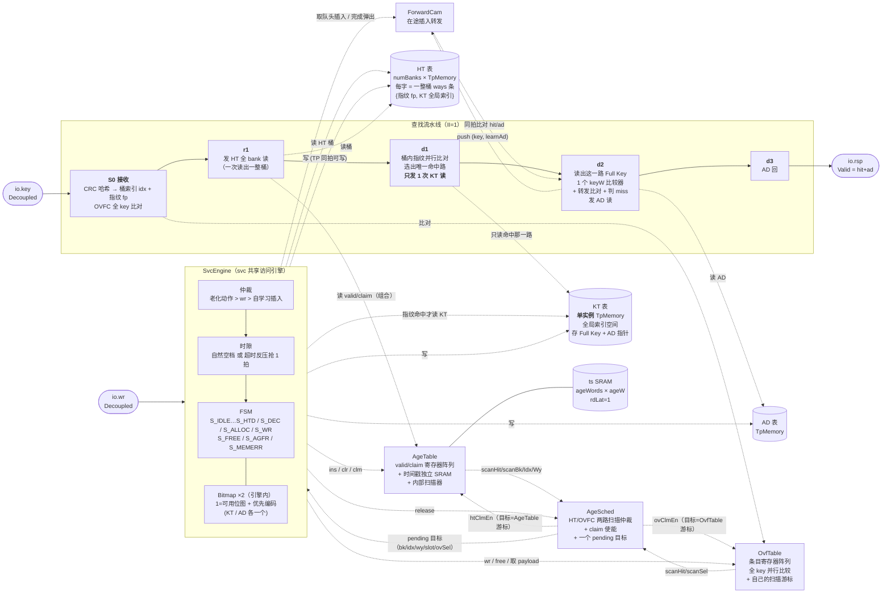
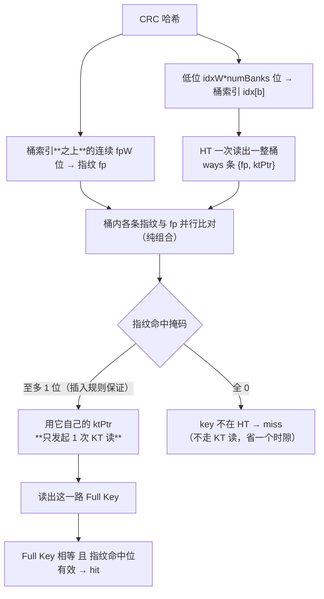
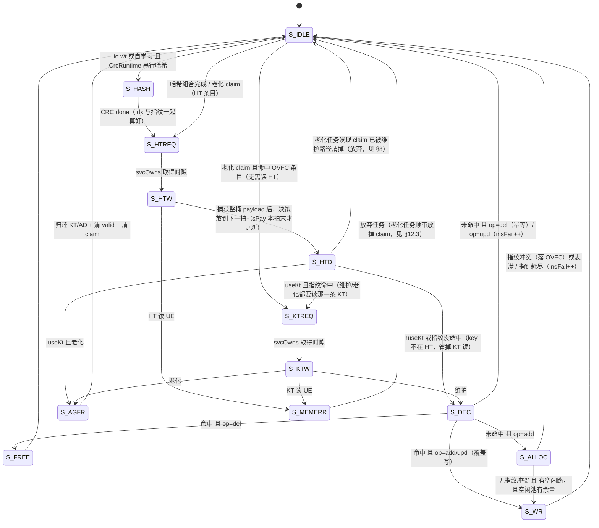
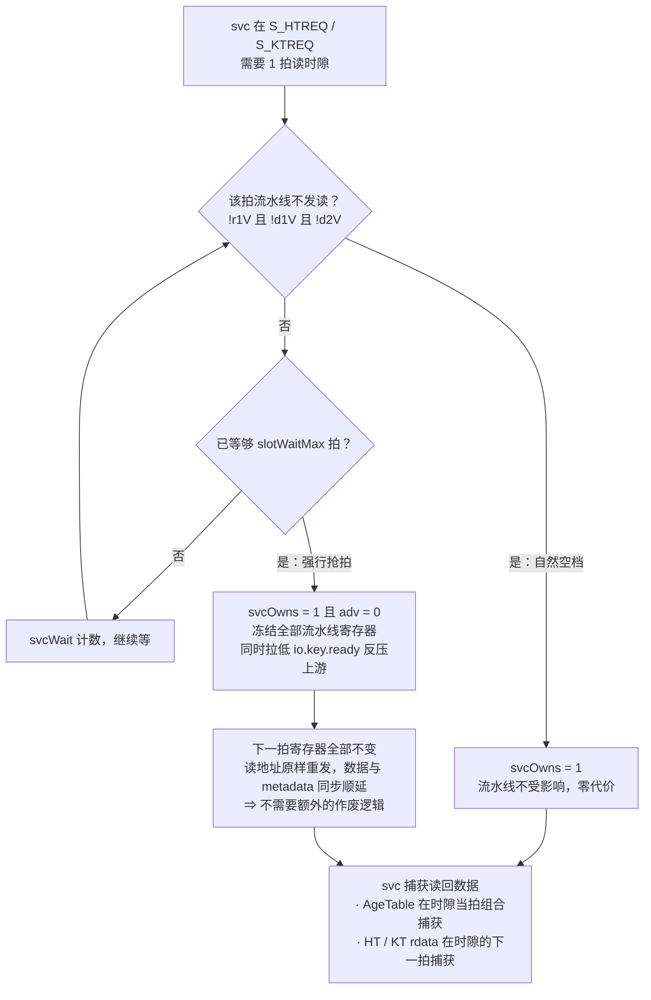
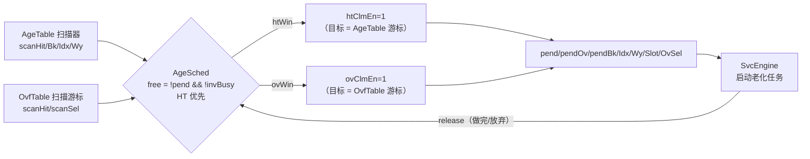
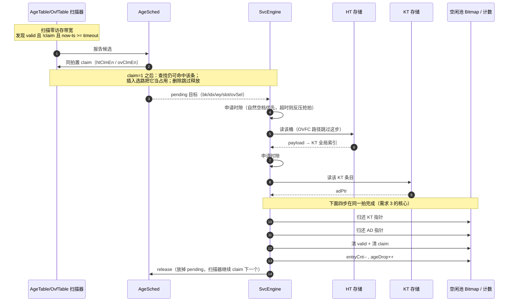
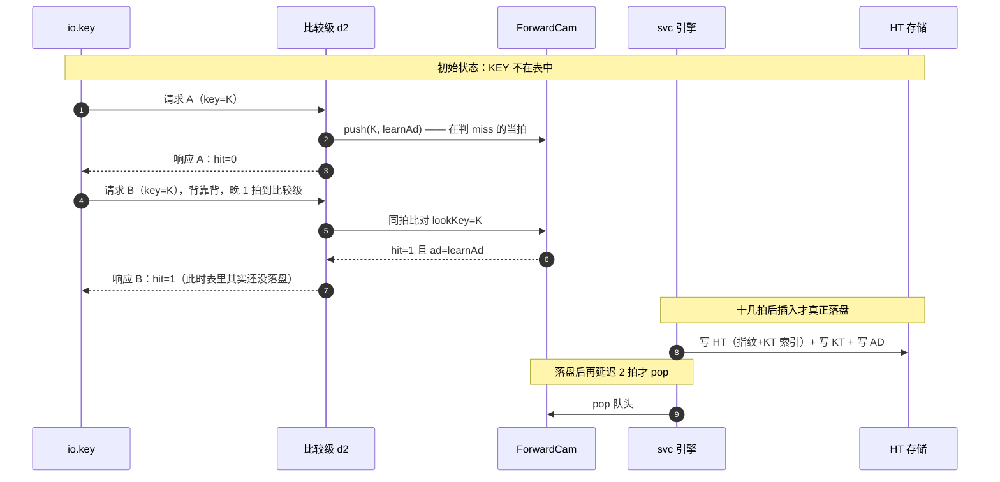

# 14 em —— EM（Exact Match）查表引擎（流水线 + 指纹过滤版）

> 覆盖目录：`src/main/scala/BaseCbb/em/`，包 `em`
> 生成入口：`sbt "runMain em.EmGen <outDir> <preset>"`（build.sbt 只有 root 工程，**没有** **`em/`** **子工程**，不能用 `em/runMain`）
> 依赖：`BaseCbb.memory`（`Memory` / `TpMemoryWrap3`）
> 测试：`src/test/scala/em/` 下 5 个 spec（`ExactMatchSpec` / `EmWaveSpec` / `CrcSpec` / `EmUErrSpec` / `EmRdLatSpec`），**共 31 组用例**，`sbt "testOnly em.*"`，约 90s
> 本版要点：**HT 存指纹 + KT 索引，查找先用指纹筛选候选，只读命中的那一路 KT 的 Full Key**；
> 且已按「Bug 修复 → 优化 → 重构」做了三轮收敛：抽出 `OvfTable` / `AgeSched` / `SvcEngine` 三个子模块，
> `AgeTable` 时间戳移入独立 SRAM，空闲池复用 `memory/Bitmap`（自研 `FreeList` 已删），见 §2.1 与 §17；
> 并已从 Chisel 5.3.0 升级到 **7.15.0**（波形改 FST、firtool 1.158.0 自动解析，见 §13 / §17.5）。

***

## 1. 模块清单

| 文件                 | 行数  | 内容                                                                                                                 |
| ------------------ | --- | ------------------------------------------------------------------------------------------------------------------ |
| `EmParams.scala`   | 302 | `CrcMode`/`CrcHardwired`/`CrcRuntime`、`AgingParams`、`LearningParams`、`TiePolicy`、`EmParams`、`EmLayout`（含指纹与插入规则说明） |
| `Crc.scala`        | 167 | `Crc.hardwired`（逐位展开、纯组合）+ `CrcSerial`（运行时可配、串行 LFSR）                                                              |
| `FreeList.scala`   | —   | **已删除**（与 `memory/Bitmap` 功能重复，空闲池改用共享实现）                                                                          |
| `AgeTable.scala`   | 176 | HT 老化信息：**valid/claim 寄存器阵列 + 时间戳独立 SRAM** + 后台扫描器                                                                 |
| `OvfTable.scala`   | 137 | **HT 溢出表（OVFC）**：条目寄存器阵列 + 全 key 并行匹配 + 空闲选择 + 自己的扫描游标                                                             |
| `AgeSched.scala`   | 84  | **老化调度器**：把 HT/OVFC 两路扫描结果仲裁成一个 pending 目标 + claim 胶水                                                              |
| `SvcEngine.scala`  | 629 | **svc 共享访问引擎**：维护口 / 自学习插入 / 老化动作的状态机与决策；**内含** **`memory/Bitmap`** **×2**                                         |
| `ForwardCam.scala` | 95  | 在途插入转发 CAM（背靠背同 KEY 先 Miss 后 Hit 的关键）                                                                              |
| `ExactMatch.scala` | 903 | 顶层：存储实例 + 查找流水线 + 顶层 svc↔流水线仲裁 + 计数聚合                                                                              |
| `EmGen.scala`      | 107 | Verilog 产出入口 + 6 个预设                                                                                               |

子模块依赖关系：`ExactMatch` 例化 `OvfTable` / `AgeTable` / `AgeSched` / `SvcEngine` / `ForwardCam`；
`SvcEngine` 内部例化 `memory/Bitmap` ×2（KT / AD 各一个）。
`OvfTable` / `AgeTable` / `AgeSched` / `SvcEngine` / `ForwardCam` 都是**叶子模块**（互不例化）。

***

## 2. 总体结构



存储：

| 级别       | 存储          | 结构                                                                                                                                                                       |
| -------- | ----------- | ------------------------------------------------------------------------------------------------------------------------------------------------------------------------ |
| **HT**   | Hash Table  | `numBanks` 个 `TpMemoryWrap3`，每个 `bankDepth` 深 × **`htWordW = htPayW*ways`** **位（一整桶）**；每条只存 `{指纹 fp, KT 全局索引}`；**valid/claim 在** **`AgeTable`** **寄存器阵列、时间戳在独立 ts SRAM** |
| **KT**   | Key Table   | **1 个** `TpMemoryWrap3`，`ktDepth` 深 × `ktEntryW` 位（Full Key + AD 指针）；**全局索引 + 单个全局空闲池（`memory/Bitmap`）**                                                                 |
| **AD**   | Action Data | 1 个 `TpMemoryWrap3`；空闲池同 KT                                                                                                                                              |
| **Age**  | 老化信息        | `AgeTable`：**valid/claim 寄存器阵列**（`ageWords` 项 × 2 位，查找/维护要同拍组合读）+ **时间戳独立 SRAM**（`ageWords × ageW`，rdLat=1，只给扫描器用）                                                       |
| **OVFC** | 溢出 TCAM     | `OvfTable` 内的条目寄存器阵列（valid/claim/key/payload/ts），**全 key** 并行比较                                                                                                          |

**三张数据表（HT/KT/AD）都是 TP（同拍 1 读 + 1 写）**，所以维护写与流水线读不互斥，**只有"读"需要时隙仲裁**。
`ts SRAM` 有自己的读写端口，扫描读它**不占** HT/KT/AD 的任何带宽。

### 2.1 子模块架构与接口

> 三个子模块是「Bug 修复 → 优化 → 重构」抽出来的，边界按"能不能自包含"划分：
> `OvfTable` / `AgeSched` 完全自包含；`SvcEngine` 只搬状态机与决策，**存储实例与读写地址 mux 留在顶层**。

#### 2.1.1 `OvfTable` —— HT 溢出表（自包含）

`OvfTable(l, timeout)`。为什么需要它：插入时若"候选槽位里已有同指纹条目"（见 §3.3）或 HT 已满，
条目进不了 HT，落这里用**全 key** 精确兜住（不存在指纹误判），代价是顺序扫描、容量小。

| 端口组                                                                             | 方向     | 说明                                        |
| ------------------------------------------------------------------------------- | ------ | ----------------------------------------- |
| `now`                                                                           | in     | 老化时间基准                                    |
| `lkKey → lkHit/lkSel/lkPay`                                                     | in/out | **查找接收拍**的并行匹配口（用 `io.key.bits`）          |
| `svKey → svHit/svSel/svPay`                                                     | in/out | **svc 任务启动拍**的并行匹配口（用 wr/学习 head 的 key）   |
| `hasFree` / `allocSel`                                                          | out    | 找一条空闲（`!valid && !claim`）                 |
| `scanEn/scanHold/scanBlock → scanHit/scanSel`                                   | in/out | 内部扫描游标：自增，发现 `valid && !claim && 过期` 报命中  |
| `clmEn/clmSel`、`wrEn/wrSel/wrKey/wrPay/wrCountUp`、`rfEn/rfSel`、`freeEn/freeSel` | in     | 写口（claim / 写入覆盖 / 命中刷新 / 释放）              |
| `agSel → agPay/agClaim`、`svPaySel → svPayQ`、`count`                             | in/out | 按序号查询（老化 pending 项 / 维护路径取 payload / 占用数） |

- **两个独立匹配口**：查找接收拍与 svc 任务启动拍**可能同拍**发生，共用一个口会互相踩。
- 写优先级 **`clm < wr`**：同拍都指向同一条时，`wr` 的清 claim 生效 —— 即"刚写进去的条目不该被老化掉"。
- claim 语义与 HT 侧（`AgeTable`）同义：先置 claim（**不清 valid**，查找仍可命中）→ 老化动作完成后同拍清 valid + claim。

#### 2.1.2 `AgeSched` —— 老化调度器（自包含）

`AgeSched(l)`。两路扫描器各自报"游标处有过期条目"（HT 槽位 / OVFC 项），本模块把它们仲裁成
**一个 pending 目标**（**HT 优先**），并在选中的同拍给对应条目置 claim，一直保持到下游用 `release` 放掉。

| 端口                                                     | 方向  | 说明                                                        |
| ------------------------------------------------------ | --- | --------------------------------------------------------- |
| `scanEn` / `invBusy`                                   | in  | 扫描使能（已含 `ageEn && sweepEnable && memReady` 门控）/ 有 UE 作废在跑 |
| `htHit/htBk/htIdx/htWy`、`ovHit/ovSel`                  | in  | 两路扫描结果                                                    |
| `release`                                              | in  | 下游释放（老化完成 / UE 放弃 / 发现 claim 已丢）                          |
| `htClmEn` / `ovClmEn`                                  | out | claim 使能（地址由两个表用自己的扫描游标给出，所以无地址端口）                        |
| `pend/pendOv/pendBk/pendIdx/pendWy/pendSlot/pendOvSel` | out | pending 目标                                                |

⚠️ **核心不变式**：claim 与"记录目标"必须**同拍、且共用同一套优先级**。HT 命中时只能 claim HT，
OVFC 那一路**必须不置 claim**；否则 OVFC 项会被 claim 住却没记下序号 —— 该项既不会被扫描器
再次发现（`scanHit` 要求 `!claim`），插入又把它当占用，于是**永久不可用（OVFC 容量泄漏）**。
这正是把"claim 使能"与"仲裁"写在同一个模块里的原因。

`release` 与 claim 同拍时取 claim 优先（`pend` 保持为真、目标不丢）。实际不可能同拍：
所有 release 来源都要求 `pend` 已为 1，而 claim 要求 `pend=0`；取 claim 优先只是"万一撞上也不泄漏"的保险。

#### 2.1.3 `SvcEngine` —— svc 共享访问引擎（阶段 3 重构）

`SvcEngine(l, params)`。搬的是\*\*「svc 状态机 + 决策 + 选路/分配」\*\*，存储实例与读写地址 mux 留在 `ExactMatch`：

- **引擎输出**「svc 侧」的读请求（`htRe/htRaddr`、`ktRe/ktRaddr`）与**全部写口**（HT/KT/AD 写、AgeTable ins/clr、
  OVFC wr/free、AgeSched release）；顶层用 `Mux(svcOwns, eng.*, 流水线)` 接进存储。
- **KT/AD 空闲池（复用** **`memory/Bitmap`）整个在引擎里**：分配（S\_ALLOC）与归还（S\_FREE/S\_AGFR）的时机完全由状态机决定，
  放顶层只会多出 8 个"过一手"的端口；顶层只读 `ktCount/adCount` 聚合进 status。
- **顶层保留**：存储实例、查找流水线、UE 自愈寄存器（`invPend/invBk/invIdx/invMask`）、计数与 `entryCnt`。
- 计数与条目数由引擎给**单拍脉冲**（`insDone/insFail/delDone/learnDone/ageDrop/fpClash/entryInc/entryDec/ueFire/lrnPop/invGo`），
  实体留在顶层，便于 `status` 聚合。

主要输入（约 42 个端口，分 8 组）：

| 组          | 端口                                                         | 说明                                          |
| ---------- | ---------------------------------------------------------- | ------------------------------------------- |
| 时隙         | `pipeFree` / `memReady`                                    | 流水线本拍是否不发读 / 存储初始化完成                        |
| 命令         | `wrValid/wrOp/wrKey/wrAd`                                  | 维护口                                         |
| 学习 head    | `fwdPend/fwdKey/fwdAd`                                     | 转发 CAM 队头                                   |
| 老化 pending | `agPend/agOv/agOvSel/agSlot/agBk/agIdx/agWy/agClaim/agPay` | 来自 `AgeSched` 与 `OvfTable`                  |
| OVFC 查询    | `ovSvHit/ovSvSel/ovSvPay/ovSvPayQ/ovHasFree/ovAlloc`       | svc 启动拍的匹配与分配                               |
| 存储回读       | `htRdata/ktRdata/htQEnt/htUErr/ktUErr`                     | HT 桶字、KT 条目、AgeTable 的 `{claim,valid}` 位、UE |
| UE 自愈      | `invBusy/invBk/invIdx/invWy/clrWasValid`                   | 顶层寄存器透传                                     |
| CRC        | `crcPoly/crcInit/crcXor`                                   | 仅 `CrcRuntime`；维护侧串行 CRC（`svCrc`）也在引擎内      |

主要输出：svc 侧读请求、全部写口、`svcOwns`（顶层据此 `adv = !svcOwns`）、`agRelease`、`wrReady`、`busy`
（`mtBusy` 的一部分）、`ktCount/adCount`（空闲池可用条目数）以及上述统计脉冲。

> 端口仍然偏多（约 42 个），因为 svc 引擎与存储的**每个**端口都有耦合，无法像 `OvfTable`/`AgeSched`
> 那样自包含。换来的是 `ExactMatch` 从「1259 行、状态机与流水线交织」变成「903 行、只看流水线 + 接线」。
> （"把 FreeList 搬进引擎"这项取舍**已采纳**：分配/归还时机完全由状态机决定，不存在越界问题，
> 净省 8 个端口。）

#### 2.1.4 空闲池 —— 复用 `memory/Bitmap`（自研 `FreeList` 已删）

KT/AD 的空闲条目池**不再自研**：原 `em/FreeList.scala`（bitmap + 优先编码器，54 行）与共享模块
[`memory/Bitmap`](../../src/main/scala/BaseCbb/memory/Bitmap.scala) 功能重复，已删除，`SvcEngine` 直接例化 `Bitmap(RscNum)`。

两者语义本来就一致，替换是端口改名 + 补一个输出：

| em/FreeList（已删）  | memory/Bitmap                                   | 说明                                                                      |
| ---------------- | ----------------------------------------------- | ----------------------------------------------------------------------- |
| `alloc`          | `req_vld`                                       | 分配请求（取**最低可用位**并清 0）                                                    |
| `addr`           | `req_ptr`                                       | 分配到的地址                                                                  |
| `ok`             | `!full`                                         | ⚠️ **不是** **`!empty`**：`empty = 全部可用（池空）`，`full = 无可用位`；"有空闲" = `!full` |
| `free` / `faddr` | `ret_vld` / `ret_ptr`                           | 归还（对应位置 1）                                                              |
| `count`          | `cnt`（本版给 Bitmap 新增，走 `BitmapKernel.freeCount`） | 当前可用条目数（EM 的 `status.ktFree/adFree` 用）                                  |

- ⚠️ **分配必须带** **`!full`** **门控**：Bitmap 满时若仍拉 `req_vld`，会去清 `req_ptr`(=0) 那一位 ——
  已分配的资源被误标成可用、后续重复分配。旧 FreeList 内部有 `alloc && okNow` 门控，
  现在由调用方（`SvcEngine`）补上。
- 同拍 `req + ret`：Bitmap 是"分配清 0 生效"（`(bitmap | set) & ~clr`），旧 FreeList 是归还优先；
  EM 里二者分属 `S_ALLOC` 与 `S_FREE/S_AGFR`，状态互斥，不可能同拍同址，行为等价。
- 位图是**单条宽 UInt 寄存器**（不是 Vec 阵列），没有 AgeTable 那种"变量下标读数组"的 iverilog 问题。

***

## 3. 核心：指纹过滤（为什么只读 1 路 KT）

### 3.1 流程



### 3.2 相比"读多路 KT 一起比"省了什么

| <br />  | 读多路 KT 并行比全 key              | 本设计（指纹过滤）                                |
| ------- | ---------------------------- | ---------------------------------------- |
| KT 读端口  | `ktBanks` 路（每拍全读）            | **1 路**                                  |
| 比较器     | `ktBanks` 个 `keyW` 宽         | `ktBanks` 个 `fpW` 宽 + **1 个** **`keyW`** |
| 命中选择    | `ktBanks` 路 `ktEntryW` 宽 mux | 1 路，无需 mux                               |
| KT 存储组织 | 需按 (bank,way) 分 bank 才能并行读   | **单实例 + 全局空闲池**（容量全局共享）                  |

### 3.3 插入规则 —— 保证"指纹命中即唯一"，让 1 次 KT 读是精确的

指纹是压缩信息，桶里可能有两条**不同 key 但同指纹**的条目。若只读其中一路，
就可能把另一条（真正要查的）误判成 miss。为避免这个失效，规则是：

> **插入 K 时，若 K 的全部候选槽位（`numBanks`** **个桶 × ways 路）里已存在另一条 valid 条目、其指纹等于** **`fp(K)`，
> 则本次插入不进 HT** —— 落 OVFC（OVFC 用全 key 比较，精确），OVFC 关闭/满则 `insFail++`，
> 并计 `status.fpClash`。

于是对任意在表条目，其候选槽位集合里"同指纹"的条目**至多它自己**：

- 查找：指纹命中掩码至多 1 位 → 只读 1 路 KT 就是精确判定；
- 维护（add/del/upd）：判断"是否已存在"时同理，至多读 1 路 KT；指纹没命中则直接判"不在表"，连 KT 读都省掉。

该关系是**对称**的：`E 落在 K 的候选桶 ⇔ 两者在该 bank 的桶索引相同 ⇔ K 落在 E 的候选桶`，
所以插入时检查一次即可，不会被后续插入破坏。

**代价**：指纹撞车的那次插入只能落 OVFC / 失败；撞车概率 ≈ 候选槽位数 × 2^-fpW
（fpW=12、4 路时约 0.1%，且只影响"插入"，不影响查找正确性）。

### 3.4 与 OVFC 的关系

OVFC 条目用**全 key** 比较，天然精确，不参与指纹规则；查找时 OVFC 命中优先于 HT。
所以"指纹撞车 → 落 OVFC"这条路对查找是完全透明的。

***

## 4. 参数与位宽布局

### 4.1 `EmParams`

| 参数                                                        | 默认                        | 说明                                                                                                                                                             |
| --------------------------------------------------------- | ------------------------- | -------------------------------------------------------------------------------------------------------------------------------------------------------------- |
| `keyWidth` / `adWidth`                                    | 48 / 32                   | 查找 key / 动作数据位宽                                                                                                                                                |
| `htDepth` / `htWays`                                      | 1024 / 4                  | HT 总桶数（被 numBanks 均分）/ 每桶路数                                                                                                                                    |
| `numBanks`                                                | 1                         | d-left 子表数（1 = 关闭）                                                                                                                                             |
| `dLeftTie`                                                | `Random`                  | 并列仲裁：`Leftmost`/`Random`(LFSR)/`RoundRobin`                                                                                                                    |
| `ktDepth`                                                 | 4096                      | KT 总条目数（**单实例、全局共享**；须为 2 的幂）                                                                                                                                  |
| `useKt` / `useAd`                                         | true / true               | false = 该级内联进上一级（`useKt=false` 时不需要指纹）                                                                                                                         |
| `adDepth`                                                 | 1024                      | AD 条目数                                                                                                                                                         |
| `ovfcDepth`                                               | 0                         | HT 溢出 TCAM 深度（0 = 关闭）                                                                                                                                          |
| `crcWidth` / `crc`                                        | 32 / `CrcHardwired.crc32` | 哈希位宽 / 形态                                                                                                                                                      |
| `fpWidth`                                                 | 12                        | **指纹位宽**：HT 每条存一份；取得哈希里桶索引之上的连续 `fpWidth` 位                                                                                                                    |
| `learnFwdDepth`                                           | 8                         | 在途插入转发 CAM 深度                                                                                                                                                  |
| `slotWaitMax`                                             | 8                         | svc 等空时隙的上限拍数，超时则反压抢一拍                                                                                                                                         |
| `aging` / `learning` / `memProtect`                       | None / None / ProtNone    | 老化 / 自学习 / 存储保护                                                                                                                                                |
| `memFlopIn` / `memFlopOut` / `memCheckIn` / `memCheckOut` | 全 false                   | **存储读通路的插拍**（透传 `Memory` 的同名配置）→ `rdLat = CheckIn+flopIn+1+flopOut+CheckOut`，默认 1 拍。流水线各级之间按 `rdLat` 自动延拍，不需要改别的地方；宏访问时间收不住时打开（典型只开 `memFlopOut` → 2 拍）。见 §6.1 |

`EmLayout` 的硬约束：

- `htDepth / ktDepth / adDepth / bankDepth` 必须是 2 的幂（`Memory.addrWidth = log2Ceil(depth)`）
- `htDepth % numBanks == 0`
- `idxW*numBanks <= crcWidth`
- **`idxW*numBanks + fpWidth <= crcWidth`**（桶索引与指纹都取自同一个 CRC 的不同位段）
- 老化参数（`aging` 打开时）：`ageWidth >= 1`、`timeout >= 1`、**`timeout < 2^ageW1`**
  （否则时间戳装不下、被静默截断，语义完全变掉）、`tickDiv >= 1`、`ageWords = htDepth*ways >= 2`
  （ts SRAM 只有一层地址译码，深度 1 会让 `addrWidth=0`、端口宽度对不上）
- `learnFwdDepth >= 1`、`slotWaitMax >= 1`

### 4.2 关键位宽

| 字段                          | 公式                                                             | 说明                                                                         |
| --------------------------- | -------------------------------------------------------------- | -------------------------------------------------------------------------- |
| `bankDepth` / `idxW`        | `htDepth/numBanks` / `log2Ceil(bankDepth)`                     | 每 bank 桶数 / 桶索引位宽                                                          |
| `ktBanks`                   | `numBanks*ways`                                                | 一次查找的**候选槽位数**（不再是 KT 物理 bank 数）                                           |
| `fpW`                       | `useKt ? fpWidth : 0`                                          | 指纹位宽                                                                       |
| `ktDepthReal` / `ktPtrW`    | `ktDepth` / `log2Ceil(ktDepth)`                                | KT 单实例深度 / 全局索引位宽                                                          |
| `htPayW` / `htWordW`        | `useKt ? fpW+ktPtrW : keyW+(useAd?adPtrW:adW)` / `htPayW*ways` | HT 单条负载 / **整桶字**                                                          |
| `ageWords`                  | `htDepth*ways`                                                 | 老化条目总数（= HT 总条目数）                                                          |
| `ageRegW`                   | `2`                                                            | **valid + claim**（寄存器阵列；时间戳不在这里）                                           |
| `ageTsDepth` / `ageTsAddrW` | `ageWords` / `log2Ceil(ageWords)`                              | **时间戳独立 SRAM** 的深度 / 地址位宽                                                  |
| `ktPayW` / `ktEntryW`       | `useAd ? adPtrW : adW` / `keyW+ktPayW`                         | KT 负载 / 整条目                                                                |
| `ovfcPayW`                  | `useKt ? ktPtrW : (useAd?adPtrW:adW)`                          | OVFC 负载（KT 已是全局索引，不需要记 bank）                                               |
| `ovfcSelW` / `ovfcCntW`     | `log2Ceil(max(1,ovfcDepth))` / `log2Ceil(ovfcDepth+1)`         | **序号位宽** / **计数位宽**（计数必须能表达 `ovfcDepth` 本身，否则扫描游标到不了终点）                    |
| `rdLat`                     | `CheckIn+flopIn+1+flopOut+CheckOut`                            | 存储端到端读延时（见 §6.1）                                                           |
| `lookupLatency`             | `2 + rdLat × (1 + (useKt?1:0) + (useAd?1:0))`                  | 接受 → rsp 的拍数（不含串行 CRC）。⚠️ 现在含 `rdLat`，测试用它当"填满流水线"的上界，所以比 rdLat=1 之前的旧口径略大 |

`EmLayout.fpOf(h)` 就是"从哈希取指纹"，与插入/查找共用同一个函数，保证两边一致。
⚠️ 旧的 `ageEntryW`（`1+ageW+1`，valid+ts+claim 打包）已删除：时间戳移入独立 SRAM 后，
寄存器阵列只留 valid/claim 两位，`AgeTable` 对外只暴露 `{claim,valid}` 2 位（见 §8）。

### 4.3 预设

| preset   | 用途                            | 指纹/容量                             |
| -------- | ----------------------------- | --------------------------------- |
| `basic`  | 三级齐全，无学习无老化                   | fpW=12，HT 1024×4，KT 4096（全局）      |
| `2left`  | d-left(2) + 学习 + 老化           | fpW=12，HT 1024×4 / 2 bank，KT 8192 |
| `inline` | 单级（key+AD 都内联 HT，无 KT/AD，无指纹） | HT 1024×4                         |
| `noad`   | 两级（AD 内联 KT）                  | fpW=12                            |
| `crcrt`  | 运行时可配 CRC（串行 LFSR）            | fpW=12                            |
| `tb`     | 功能仿真小尺寸（能覆盖 OVFC 与指纹冲突）       | fpW=12，HT 32×2 / 2 bank，OVFC 8    |

***

## 5. 对外接口

| 端口                           | 方向     | 语义                                                                                                      |
| ---------------------------- | ------ | ------------------------------------------------------------------------------------------------------- |
| `key: Decoupled[UInt(keyW)]` | in     | 查表请求。**有 ready，不再丢请求**；svc 抢时隙时反压                                                                       |
| `rsp: Valid[UInt(1+adW)]`    | out    | `Cat(hit, ad)`，**单拍脉冲**                                                                                 |
| `wr: Decoupled[EmWrCmd]`     | in     | 维护口：`op`(add/del/upd) + key + ad                                                                        |
| `learnAd` / `learnEn`        | in     | 自学习 AD（**与 io.key 同拍对齐，随包携带**）/ 开关                                                                      |
| `ageEn`                      | in     | 老化开关（同时门控命中刷新与扫描器）                                                                                      |
| `memInit` / `memInitDone`    | in/out | 广播到各级 `dfx.init`                                                                                        |
| `crcPoly/Init/Xor`           | in     | 仅 `CrcRuntime` 生效                                                                                       |
| `memUErr` / `memUErrSrc`     | out    | **存储不可纠错误（UE）上报**：单拍脉冲 + 来源（0=HT 1=KT 2=AD，见 `EmUErrSrc`）。与"这一拍上报的响应"同拍，见 §12                           |
| `injUerrEn` / `injUerrSrc`   | in     | **UE 注入**（DFX / RAS 验证用，正常工作时恒 0）。语义同 `MemoryDfxPort.injUerrEn`：在"发起读"那一拍拉高就让该次读报错；`injUerrSrc` 选中注到哪张表 |
| `status`                     | out    | 见 §10                                                                                                   |

***

## 6. 查找流水线与影子寄存器

存储读延时 1 拍，因此"发起读的那一级"和"用数据的那一级"必然错开一拍，metadata 用影子寄存器跟随。
⚠️ 有一个例外：**存储的** **`uecErr`** **与** **`rdata`** **同拍**，所以它在"用数据的那一级"是**组合有效**，
不能按流水捕获（详见 §12.3）。

| 拍   | 级  | 动作                                                                                                                            |
| --- | -- | ----------------------------------------------------------------------------------------------------------------------------- |
| T   | S0 | 握手接收：CRC 哈希 → 桶索引 + 指纹；OVFC 全 key 比对 → `acq`                                                                                  |
| T+1 | —  | `acq` → `r1`（`r1V := acqV`），**HT 读在此拍发起**                                                                                     |
| T+2 | d1 | HT rdata 有效；d1 携带 {key, idx, fp, OVFC, valid 位图}；**桶内指纹并行比对 → 选出唯一命中路 → 只发 1 次 KT 读**（用该路的 ktPtr；OVFC 命中时改用 OVFC 的 ktPtr，且优先） |
| T+3 | d2 | KT rdata 有效；**只比这 1 条 Full Key** + 转发 CAM 比对（miss 判定在此拍）→ 发 AD 读                                                              |
| T+4 | d3 | AD rdata 有效 → 输出 `rsp`                                                                                                        |

- 影子级数随配置裁剪：`d1` 恒有；`useKt||useAd` 才有 `d2`；`useKt&&useAd` 才有 `d3`。
- `!useKt` 时没有指纹与 KT：key 内联在 HT payload 里，在 d1 拍对桶内 key 并行比较，没有 d2 的 KT 级。
- ⚠️ **两个实测踩过的坑**：
  - `r1V` 必须**无条件**跟随 `acqV`（写成 `when(acqV){ r1V := ... }` 会让 valid 只置位不清零，
    整条流水线卡死、`rsp.valid` 常高，而"每拍都有响应"的断言会**假通过**）。详见 §14.1。
  - **HT 存储宽度必须是整桶字** `htWordW`（写成 `htPayW` 会让只有 way0 能写进去、way1 永远读回 0）。
  - **指纹比对结果不要存成"与 d1Val 同拍更新"的寄存器**：`d1Val` 与本拍比对是同一个边沿更新的，
    存下来会拿到"上一拍 valid 位（上一个请求）"的比对结果。直接在 d1 拍组合算好、捕获进 d2。

稳态时序（横轴为拍号，A/B/C 三个请求背靠背错开一拍 → **每拍都能收一个新请求、每拍都出一个响应**）：


为什么必须引入影子寄存器 —— 读延迟 1 拍天然让"发地址的拍"和"用数据的拍"错开：

```mermaid
gantt
    title 读延迟 1 拍 ⇒ 地址级与数据级错开，metadata 靠影子跟随
    dateFormat X
    axisFormat %s
    section 地址 / 元数据
    T1 r1 持有 idx 并驱动 HT raddr :1, 1
    T2 d1 用 HT payload 的指纹选路 并驱动 KT raddr :2, 1
    T3 d2 用 KT payload 比 Full Key            :3, 1
    section 存储数据 latency=1
    T2 HT rdata 有效               :2, 1
    T3 KT rdata 有效               :3, 1
    section AgeTable 组合读
    T1 valid 位图读出 随 d1 打一拍  :1, 1
```



> AgeTable 是寄存器阵列（组合读），在 r1 拍读出、随影子寄存器进入 d1，与 HT rdata 到达 d1 **天然同拍**，
> 所以指纹比对可以直接用 d1 拍的 valid 位图与 HT payload，不需要额外对齐逻辑。

### 6.1 读延时是参数化的（`memFlop*`）

默认 `rdLat = 1`（四个插拍全关，上面的时序图就是这一档）。打开任意一个插拍后
`rdLat = CheckIn + flopIn + 1 + flopOut + CheckOut`，流水线**自动跟着延长**：

| 位置                            | 怎么跟着变                                                                                               |
| ----------------------------- | --------------------------------------------------------------------------------------------------- |
| 各级之间的 metadata 影子             | `shadow(x) = RegEnable(x, adv)` × `(rdLat-1)`（`rdLat==1` 时退化成原来的 `RegNext`）。`acq → r1` 与存储无关，仍是 1 拍 |
| HT 的 valid 位图（`AgeTable` 组合读） | 与 metadata 同样延 `rdLat`，保持"到 d1 拍与 HT rdata 同拍"                                                      |
| svc 的 HT/KT 读                 | `S_HTW`/`S_KTW` 先等 `rdLat-1` 拍再捕获（等待期间不占时隙，查找照常跑）                                                   |
| UE 影子                         | 同样按 `rdLat` 延拍；UE 判定卡在"捕获那一拍"                                                                       |

- 两个 `rdLat` 的定义（`EmLayout.rdLat` 与 `Memory.readLatency`）在 elaboration 期**互相 require 校验**，
  公式漂移会直接报错。
- 用 `RegEnable` 而不是 `ShiftRegister`：① 不给已经很重的复位网络再加负载；② 链上每一级都跟 `adv` 冻结。
- 回归：`EmRdLatSpec` 逐个打开每一级（2 拍）+ 默认 Memory 配置（3 拍）+ 全开（5 拍），
  每组都验 add/lookup/del、背靠背转发（需求 2）、稳态 II=1、老化（需求 3）。
  影子延拍写错最先在"稳态 II=1"那条暴露（会出气泡或命中错）。

***

## 7. svc 共享访问引擎与时隙仲裁

> 本节的状态机与时隙仲裁**实现在** **`SvcEngine`** **模块里**（阶段 3 重构抽出，见 §2.1.3）。
> `ExactMatch` 只保留存储实例与读写地址 mux，用 `Mux(svcOwns, eng.*, 流水线)` 二选一。

三个客户，优先级 **老化动作 > 维护口** **`wr`** **> 自学习插入**：



⚠️ `S_HTD` 必须独立于 `S_HTW`：`sPay` 是 `S_HTW` 当拍末才写入的，在 `S_HTW` 当拍就用
`sFpHit/sFpSel` 判断会拿到**上一轮**的桶数据。
⚠️ `S_MEMERR` 存在的意义：老化任务此时已经把目标槽位（或 OVFC 项）claim 住了，直接回 `S_IDLE`
会让 claim 永久占位（插入把 claim 当占用 → 那一路再也分配不出去），所以必须专门走一拍把它放掉。

**时隙**：一次操作最多 2 次读（① HT 桶 + AgeTable 查询 ② 指纹命中时读那 1 条 KT），取时隙规则：



> **写不需要时隙**：HT / KT / AD 都是 TP 存储，同拍支持"流水线读另一个地址 + svc 写"，
> 所以维护/老化的写动作随时可以做，只有**读**要走上面的仲裁。

**d-left 选路**（S\_ALLOC）：先判指纹冲突（冲突则整个 HT 都不放，落 OVFC）；
无冲突时按各子表 `PopCount(valid||claim)` 选占用最少的子表，并列按 `dLeftTie`
（`Leftmost` / 16 位 LFSR `Random` / `RoundRobin`）。

***

## 8. 老化（Aging）

老化信息分两块存（见 §2.1 / §4.2）：

- **valid / claim**：`AgeTable` 内的寄存器阵列（2 位/条）。查找与维护都要在**同拍组合**读到它
  （d1 的指纹比对要 valid，`S_HTD` 的选路要 valid+claim），所以必须在寄存器里。
- **时间戳 ts**：只被后台扫描器使用，查找/维护完全不碰 → 放**独立 SRAM**（`ageWords × ageW`，rdLat=1）。
  逐条 ts 用寄存器是 `ageWords×ageW` 个 flop（2left 预设 4×1024×16 = 65536 flop，比 HT SRAM 还大），
  换 SRAM 后寄存器只剩 2 位/条，面积降约 3 倍。ts SRAM 有自己的读写端口，**扫描读它不占 HT/KT/AD 带宽**。

> 为什么 ts 不塞回 HT SRAM：那样扫描就得读 HT 的读端口，只能做成"机会式扫描"（等查找流水线有空档才读）
> ——**拿查找带宽换面积**，II=1 无法保证。独立 SRAM 完整保留了"扫描不占访存带宽"这个设计目标。
> 因为 ts 在 SRAM 里回读要 1 拍，`AgeTable` 的扫描器维护一条**延迟 1 拍的游标** `dCur*`，
> 用它与回读的 ts 配对做判定（"发起读"和"推进游标"必须同拍）。

`AgeTable` 内部扫描器逐 (bank, 桶, 路) 自增，发现 `valid && !claim && (now - ts) >= timeout`
就报告；扫描本身**不占任何访存带宽**。

### 8.1 两路扫描 → 一个 pending 目标（`AgeSched`）

HT 槽位（`AgeTable` 内部扫描器）与 OVFC 项（`OvfTable` 内部游标）**各自**报"游标处有过期条目"。
`AgeSched` 把它们仲裁成**一个 pending 目标**（**HT 优先**），并在选中的同拍给对应条目置 claim：



⚠️ **核心不变式**：claim 与"记录目标"必须**同拍、且共用同一套优先级**（HT 命中时只 claim HT，
OVFC 那一路必须不置 claim）。否则 OVFC 项会被 claim 住却没记下序号 —— 该项既不会被扫描器再次发现
（`scanHit` 要求 `!claim`），插入又把它当占用，于是**永久不可用**。这正是把"claim 使能"与"仲裁"
写在同一个模块（`AgeSched`）里的原因。

`AgeTable.io.clmEn` 因此**没有地址端口** —— claim 目标恒为扫描游标处那条，直接复用 `dCur*`。

### 8.2 老化动作

| 步骤 | 动作                                                                               |
| -- | -------------------------------------------------------------------------------- |
| 1  | 扫描器报告候选 → `AgeSched` **置 claim**（不清 valid，查找仍可命中；claim 阻止插入复用该路）                 |
| 2  | `SvcEngine` 启动老化任务（HT 路径先读 HT 桶取 KT 指针；OVFC 路径直接用条目里的 payload）                   |
| 3  | 申请时隙读 KT，取 AD 指针                                                                 |
| 4  | **同一拍**：归还 KT 指针 + 归还 AD 指针 + 清 `valid` + 清 `claim` + `entryCnt--` + `ageDrop++` |



- 命中刷新只写 `ts`（不写 valid）→ 老化中的条目不会被"复活"。
  ⚠️ 这也是 ts 独立成 SRAM 后自然消失的一个隐患：原实现给刷新也写了 `valid=1`，
  查找读到某槽位有效之后、刷新写回之前，该槽位若被老化清除并重新插入成**另一个 key**，
  刷新就会把一个不属于它的槽位标成 valid → 假命中。
- 维护删除遇到 `claim=1` 的路会跳过释放（交给扫描器）；插入选路把 claim 当占用 →
  两者目标集合天然互斥，**不会二次压栈**。
- OVFC 条目有独立的扫描游标与 claim 位（在 `OvfTable` 内部）。

### 8.3 claim 复核 —— 老化与维护的竞态（本版修复）

扫描器 claim 之后、老化任务真正读到数据之前，可能有**先启动的**维护任务动过同一个条目：

| 维护动作           | 对 claim 的影响                     | 若老化不复核会怎样                                            |
| -------------- | ------------------------------- | ---------------------------------------------------- |
| `del`          | `clrEn` 顺带清 claim **并归还 KT/AD** | 老化再归还一次 → **双重释放**（空闲池出现重复地址 → 后续 alloc 撞车 → 静默数据损坏） |
| `add`/`upd` 覆盖 | `insEn` 清 claim 并刷新 ts          | 老化把刚刷新的条目删掉，且 `entryCnt` 多减一次                        |

修法（两处复核）：

- **HT 路径**：`S_HTD` 用 `stillClm` 复核 —— `Mux(agOv, ovf.io.agClaim, sClm(agSlot))`（claim 位随桶数据一起捕获）。
- **OVFC 路径**：`S_IDLE` 启动老化前就复核 `ovf.io.agClaim`（无需读 HT 就能判）。

claim 已丢 ⇒ 该条目已被维护路径处理完，本次老化任务**整体放弃**：不释放、不减计数，直接回 `S_IDLE`，
同时 `release` 让扫描器继续。

- `aging=None` 时过期判据恒 false（不能用 `timeout=0` 兜底，否则全表被删）。

***

## 9. 自学习与转发 CAM（需求 2 的关键）

问题：自学习插入要十几拍（分配 KT/AD → 写 HT），而流水线接受间隔只有 1 拍。
第 2 个同 KEY 请求进入流水线时插入还在半路，按裸表查**必然 Miss**。

解法：`ForwardCam` —— 在**判定 Miss 的当拍**（比较级 d2）把 `(key, learnAd)` 压进 CAM；
后续查找在**同一级**并行比对 CAM，命中即当 Hit 返回 CAM 里的 AD。

- 比对与压入同拍 → 背靠背的下一个请求（比它晚 1 拍到比较级）立刻可见。
- 同 key 多条时取**最新**一条；插入完成时弹出，且**延迟 2 拍再弹**：
  HT 写在 T 拍落盘，T-1/T 拍发起 HT 读的请求拿到的是旧数据，其比较级在 T+1/T+2，
  若 T 拍就弹出会丢掉这些请求本应转发来的命中。
- CAM 满时丢弃并计 `learnDrop`（不阻塞流水线）。
- ⚠️ **插入失败时同样必须弹出**（本版修复）：`lrnPop = (S_WR) || (S_ALLOC && !sAllocOk)`。
  只写 `S_WR` 的话，表满时 head 一直不变、`fwdPending` 恒真，`S_IDLE` 会一次次启动同一个
  必然失败的任务 —— svc 引擎永远空转在这一个 key 上：后面排队的 key 全被饿死，且因为
  `svcOwns` 反复冻结流水线而拉低查找吞吐，`insFail` 还会一直涨到回绕。
  本次丢弃计入 `insFail`（不再另计 `learnDrop`，那不是 CAM 满）。回归用例见 §14.10。



***

## 10. 状态与统计（`EmStatus`）

| 字段                             | 位宽                                            | 含义                                             |
| ------------------------------ | --------------------------------------------- | ---------------------------------------------- |
| `entries`                      | `log2Ceil(htDepth*htWays+ovfcDepth+1)`        | HT+OVFC 当前条目数                                  |
| `insert` / `insFail`           | 16                                            | 维护口插入次数 / 失败次数（指纹冲突、表满、指针耗尽、upd 未命中）           |
| `delete` / `learn` / `ageDrop` | 16                                            | 删除 / 自学习插入 / 老化删除                              |
| `learnDrop`                    | 16                                            | 转发 CAM 满导致的漏学次数                                |
| `fpClash`                      | 16                                            | **因"候选槽位里已有同指纹条目"而无法进 HT 的次数**（落 OVFC/insFail） |
| `ovfcUse`                      | `log2Ceil(ovfcDepth+1)`                       | OVFC 占用数                                       |
| `fwdUse`                       | `log2Ceil(learnFwdDepth+1)`                   | 转发 CAM 占用数                                     |
| `ktFree` / `adFree`            | `log2Ceil(ktDepth+1)` / `log2Ceil(adDepth+1)` | KT/AD 空闲条目总数（验证"老化确实回收了资源"）                    |
| `lkBusy` / `mtBusy`            | Bool                                          | 查找流水线非空 / svc 非空闲（`mtBusy` 含"UE 作废还没清完"）       |
| `uerrCnt`                      | 16                                            | **存储不可纠错误（UE）次数**：查找 + 维护合计，见 §12              |

***

## 11. CRC / 哈希

统一"左移 MSB 先"，`refin/refout` 组合出标准 reflected CRC（以太网 CRC-32）。

| 形态             | 硬件                  | 延迟            | 对 II 的影响                               |
| -------------- | ------------------- | ------------- | -------------------------------------- |
| `CrcHardwired` | 逐位展开纯 XOR 树         | 组合，0 拍        | **II=1**                               |
| `CrcRuntime`   | 串行 LFSR `CrcSerial` | `dataWidth` 拍 | ⚠️ **无法 II=1**：接收级被 stall `keyWidth` 拍 |

同一份哈希被切成三段互不重叠：桶索引（低位 `idxW*numBanks`）、指纹（其上的 `fpW` 位）、其余位不用。
**不额外做哈希**，所以指纹没有任何额外面积/延迟代价（只是多存 `fpW` 位）。

***

## 12. 存储保护、DFX 与 UE 处理

### 12.1 配置

`Memory` 的四个插拍由 `EmParams.memFlopIn/memFlopOut/memCheckIn/memCheckOut` 参数化，
默认全 false → `rdLat = 1`，流水线按 1 拍对齐（elaboration 期把 `EmLayout.rdLat` 与
`Memory.readLatency` 互相校验）。要收 SRAM 访问时间的时序就打开相应插拍，流水线会自动延拍（见 §6.1）。
`cpu` 侧端口由 `driveAux` 统一置无效，`dfx.init` 接 `io.memInit`。

`memProtect` 默认 **`ProtNone`**：EM 表是配置态数据，开 ECC 会加 SRAM 位宽 + 读路径上一级组合汉明译码，
需要后端按 §15 重新核时序，所以默认不开、由集成方按 RAS 需求打开。
**ECC/Parity 不改变读延时**（编解码是组合的），所以打开后流水线无需改动。

### 12.2 UE 的语义（来自 `TpMemoryWrap3`）

| 信号                       | 语义                                                |
| ------------------------ | ------------------------------------------------- |
| `lgc.uecErr`             | 单拍脉冲：**这一拍** **`rdata`** **不可纠**，与 `rdata` **同拍** |
| `dfx.eccErr` / `eccUerr` | 单比特错（已纠）/ 双比特错                                    |
| `dfx.eccErrAddr`         | **出错那次读的地址**（已修：曾报"下一个读地址"）                       |

⚠️ **UE 时** **`rdata`** **仍是"看起来完全合法"的错值** —— 只有显式标记能分辨。EM 的应对见 12.3。

### 12.3 EM 的处理（三层，全部 fail-safe）

**① 命中判定：宁可 miss，绝不用坏数据**

三张表的 `uecErr` 按各自数据拍采样：HT 在 d1、KT 在 d2、AD 在 d3（`!useKt` 时在 d2）。
⚠️ 采样拍子有个坑：`uecErr` 与 `rdata` 同拍，所以 HT 的错在 **d1 拍是组合有效**（与 `htNow` 同源），
**不能像 metadata 那样"在 r1 拍按流水捕获"**——那会采到上一拍的 0。要带过 d2/d3 才用影子寄存器。

| 位置        | 处理                                                                          |
| --------- | --------------------------------------------------------------------------- |
| `tblHit`  | `&& !cmUe`（cmUe = 决策拍已知的 UE）→ 连带管住 `hit` / 命中刷新 / 自学习判定 / `d2Hit` / `d3Hit` |
| 响应        | UE 时 **强制 miss 且 ad 清零**，坏数据一律不外传                                           |
| svc 维护/老化 | 读到 UE → 进 `S_MEMERR` 放弃本次任务，**绝不拿坏数据写回**                                    |

**② 上报**：`memUErr` 脉冲 + `memUErrSrc`（HT/KT/AD），与"这一拍上报的响应"同拍；
`status.uerrCnt` 计数。因为遇到 UE 的请求一定被强制 miss，消费方**看到脉冲就知道刚刚那个 miss
是"因为存储坏了"**，不需要额外的 `rsp.error` 位。
svc 侧的 `memUErr` 脉冲由 `SvcEngine` 的 `ueFire/ueSrc`（`sState === S_MEMERR`）给出。

**③ UE 自愈：作废坏掉的 HT 槽位**（`invPend/invBk/invIdx/invMask` 留在顶层；作废请求由
`SvcEngine` 在 `S_IDLE` 里发起，掩码推进在顶层，一拍清一路）

| 哪张表报错 | 能定位到什么                | 作废范围         |
| ----- | --------------------- | ------------ |
| HT 桶字 | 只知道桶（整桶字不可信，判断不出哪一路）  | 该桶**全部 way** |
| KT    | 指纹命中的那一路              | **那一路**      |
| AD    | 发起 AD 读时选中的槽位（随流水带过来） | **那一路**      |

清 valid + claim，并**同步减** **`entries`**（靠 `AgeTable.clrWasValid` 只减真的清掉了的，避免虚高）。

⚠️ **两条必须有的门控（本版修复）**：

1. **AD 读只在"表内命中"时才发**：`adRdNeed = adRdUsed && tblHit && !fwdHit`。
   miss / 纯转发命中时 AD 数据用不上，而地址来自 `tblAdPtr`（`useKt` 且指纹未命中时是 `KT[0]` 里的
   垃圾指针）—— 既白占一次 AD 带宽，又可能在一个无关地址上撞出 UE，进而触发"AD UE 自愈"去
   **作废不相干的槽位**。
2. **AD UE 自愈必须限定"该槽位确实来自 HT 槽位匹配"**：新增 `adSValid` 随流水带过
   （`useD3` 取 `d2FpOk`，`!useKt && useAd` 取 `cmHit`）。OVFC 命中 / miss 时 `adSBk/adSWy` 是无效值，
   拿它去作废会**误删一个毫不相干的条目**。

> **快路径**：开了 `learning` 时不需要上面这套也会自愈 —— UE 被强制 miss 后该 key 会重新压进转发 CAM，
> svc 走一次 `add`；对已存在的条目会把 HT payload / KT 条目 / AD 数据整条重写，等于修好了。

⚠️ **已知代价：自愈不归还 KT/AD。** 指针来自不可信数据（HT 字已坏 / KT 读坏了），
乱释放会污染空闲池 —— 那比泄漏严重得多，所以选择**有界泄漏**：
`ktFree/adFree` 与 `entries` 之间会出现偏差。UE 本身是需系统介入的致命事件（见 12.4），
所以这个泄漏量在设计上是可接受的。

⚠️ **`S_MEMERR`** **的作废必须限定"当前任务确实是老化任务"**（`sTask === T_AGE`，本版修复）。
原来只判 `agPend` 是错的：维护任务在途时扫描器也可能已 claim（`agPend=1`），此时维护任务读到 UE
会误把**扫描器的 claim 槽位**清掉 —— 那是一个合法条目被无效化、且它的 KT/AD 永远不会归还（泄漏）。
维护任务自己没有 claim，遇 UE 只需回 `S_IDLE`（命令静默失败，靠 `memUErr` 脉冲告知）。
同理 `agSched.io.release` 也只在"当前是老化任务"时才拉高，否则清掉 pending 会让那条 claim 永远悬空。
另外 `S_MEMERR` 放弃路径必须**同步回退** **`entryCnt`**（本版修复；这两条路径不走 `relEn`，漏掉会让 `entries` 虚高）。

### 12.4 系统层（需集成方配合）

UE 是不可纠的数据完整性事件，硬件只能保证"不外传坏数据 + 可观测 + 尽量自愈"。**必须**配合：

1. `memUErr` 接到中断/告警寄存器，`memUErrSrc` + 各表 `dfx.eccErrAddr` 做 **first-error 捕获**；
2. SW 读 `uerrCnt` / 地址后决定是否 repair（若宏有 spare row/column）或复位、重建该表；
3. 反复报同一地址说明自愈没生效（例如该桶一直有别的坏字），需要 SW 兜底。

### 12.5 一处顺带修掉的集成隐患

`htMems(b).io.lgc.re` 原本写死 `Mux(svcOwns, false.B, htRdUsed)`：
仿真里因为 `SimMemory` 的 `rdata` 恒等于 `RegNext(m(raddr))`、**不按** **`re`** **门控**而"看起来能用"，
但 (a) 换成物理 SRAM 后 svc 的 HT 读会拿不到数据，(b) `uecErr` 被 `reFlopped` 门掉，
svc 的 UE 永远不上报。已改成 `Mux(svcOwns, eng.io.htRe, htRdUsed)`（与 KT 那处写法一致；
`eng.io.htRe = (sState === S_HTREQ)`）。

***

## 13. Verilog 产出（`EmGen`）

```
sbt "runMain em.EmGen <outDir> <preset>"      # outDir 默认 out/a3，preset 默认 basic
  ChiselStage(--target chirrtl)      → <outDir>/<preset>/ExactMatch.fir
  ChiselStage(--target systemverilog) → <outDir>/<preset>/ExactMatch.sv
```

chisel 7.15.0 钉 firtool **1.158.0**，由 firtool-resolver 自动下载并缓存
（要用自带版本设 `CHISEL_FIRTOOL_PATH` 指向包含 firtool 的目录）。
⚠️ 不要手动调 PATH 上的旧 firtool：1.62.0 解析不了 chisel7 的 CHIRRTL（新 `layer` 语法，实测报
"expected ':' after layer definition"）。

必须带 `--lowering-options=disallowLocalVariables`，否则函数内变量生成 `automatic`，
部分工具链会报 unsupported（iverilog 会以 "Overriding the default variable lifetime" 非零退出）。

⚠️ **产出的 Verilog 请用 Verilator 仿真，不要用 iverilog**：`AgeTable` 这类
寄存器阵列被 firtool 展成"连续赋值里对数组做变量下标读"，iverilog 要求那里必须是常量下标，
实测报 11 个 elaboration error。Verilator 完全接受（单元测试就是它跑的）。

### 13.1 看波形

仿真和波形都在 Scala 侧，一条 sbt 命令走完。

```bash
sbt "testOnly em.EmWaveSpec"          # 跑 P1..P7 场景 + dump 波形 + 打印各阶段观测值
surfer -c tools/em_tb/em_wave.sucl out/em_wave/workdir-verilator/trace.fst
```

`EmWaveSpec` 的场景与 `ExactMatchSpec` 共用一份驱动脚手架（`EmTestSupport`），
所以**场景只有一处、跟功能断言不会漂**。

波形开关需要**同时**打开两处（都在 `src/test/scala/em/WaveSimulator.scala`）：

| 位置                                         | 作用                                                         |
| ------------------------------------------ | ---------------------------------------------------------- |
| 编译期 `TraceStyle(kind = TraceKind.Fst())`   | 给 Verilator 加 `--trace-fst` 并定义 `SVSIM_ENABLE_FST_TRACING` |
| 运行期 `dut.controller.setTraceEnabled(true)` | 触发 DPI 回调里的 `$dumpfile` / `$dumpvars`                      |

不想出波形就去掉 `traceStyle`（Verilator 不加 `--trace-fst` 时 `$dumpfile/$dumpvars` 被直接忽略，
0 报错、不落文件，仿真更快）。dump 的信号集合由 svsim 生成的 `testbench.sv`
（`$dumpvars(0, dut)`，DUT 全层次 1100+ 信号）决定，Scala 侧不能裁剪。

⚠️ 一条必须知道的代价：

- **不能对波形做"输入与时钟沿同拍"类的自动检查** —— svsim 通过 DPI poke 输入，
  Verilator trace 给这些信号的时间戳是 eval 序号而非真实仿真时间，poke 的落点相对时钟
  采样沿会偏移（实测 55 个请求按同拍判据只能数出 49 个，响应拍数也少 2）。
  **看波形不受影响**（脉冲与响应都在、顺序也对），但不能拿同拍判据去数。
  所以这类检查放在 Scala 断言里：`EmTestSupport.tick()` 每拍回调一次 `onCycle`，
  `EmWaveSpec` 用它统计"握手拍数 == 响应拍数"（`peek` 拿的是仿真器的真实值），
  比在波形上数更权威。

`EmWaveSpec` 覆盖 7 个阶段并逐阶段打印观测值（没有波形查看器也能读）：复位+初始化握手 →
add（含覆盖写）→ 命中/未命中查找 → **背靠背同 KEY（需求 2）** → 连续灌命中流量（需求 1）
→ **老化并观察 KT/AD 归还（需求 3）** → **打满 HT+OVFC**。

预设视图 `tools/em_tb/em_wave.sucl` 按"时钟握手 / 查找流水线 / svc 引擎 / 计数状态"
分好组并 `zoom_fit`。⚠️ 里面的信号路径与仿真来源绑定：Scala 侧波形是
`TOP.svsimTestbench.<端口>` / `TOP.svsimTestbench.dut.<内部信号>`，换来源时这一处要跟着改。
⚠️ 阶段 3 重构后，**svc 状态机与 OVFC 的内部信号都移到了子模块层次**：
`dut.eng.*`（`sState` / `svcOwns` / `sUseOv` / …；内含 `dut.eng.ktFree.*` / `dut.eng.adFree.*`）、
`dut.ovf.*`（`scIdx` / `use_0` / …）、
`dut.agSched.*`（`pend` / `pendOv` / …）、`dut.ageTab.*`。
`em_wave.sucl` 里的路径已按这个层次更新（并逐条对照实际波形的 `$scope`/`$var` 校验通过，
38/38 路径全部命中）。

波形里可直接看到的关键行为（已 dump `sState`/流水线 valid/计数器等内部信号）：

| 现象            | 波形里的样子                                                                                                                             |
| ------------- | ---------------------------------------------------------------------------------------------------------------------------------- |
| 指纹过滤生效        | 新插入时 `sState` 走 `S_HTREQ→S_HTW→S_HTD→S_DEC→S_ALLOC→S_WR`（**没有 S\_KTREQ**，因为指纹没命中，省掉 KT 读）；覆盖写时多出 `S_KTREQ→S_KTW`（指纹命中 → 读那 1 路 KT） |
| 需求 2 转发       | 两个同 KEY 请求的响应分别为 `hit=0`（miss）与 `hit=1`（转发 CAM）                                                                                    |
| 需求 3 老化       | `entries` 归 0 的同时 `ktFree/adFree` 回到满值（同一拍）                                                                                        |
| OVFC 溢出       | 插 80 条后 `entries=70`、`ovfcUse=8`、`insFail=10`                                                                                      |
| II=1 与 svc 抢拍 | 连续灌流量时 `rsp_valid` 每拍都高；唯一 1 拍气泡处 `sState=S_KTREQ`、`mtBusy=1`（svc 在插条目，正常）                                                         |
| 响应必须单拍        | svc 冻结流水线时 `rsp_valid` 被 `adv` 门控顺延，**不会**连高多拍（见 §14.6）                                                                            |

***

## 14. 功能符合性检查

> 结论来自 `src/test/scala/em/` 下的 5 个 spec：`ExactMatchSpec` / `EmWaveSpec` / `CrcSpec` /
> `EmUErrSpec` / `EmRdLatSpec`，命令 `sbt "testOnly em.*"`（**31 组用例全绿**），
> 后端 `chisel3.simulator`（Verilator）。
> 驱动 DUT 的公共脚手架在 `EmTestSupport.scala`，波形场景与功能断言共用。
> Memory 侧的读通路契约由 `BaseCbb.memory.MemoryWrap3ReadPathSpec` 覆盖（见 `04_memory.md`）。
> 6 个预设的 Verilog 产出（`runMain em.EmGen`）也纳入每次改动的验证清单。

### 14.1 需求 1：支持每拍处理一个请求 —— ✅ **已满足**

- 结构：4 级流水线（§6）+ KT 单实例只读 1 路，每拍都能收新请求、出响应。
- 用例：连续 60 拍灌命中流量，断言 `rsp.valid` 每拍都为 1、`io.key.ready` 从未拉低，
  **并且逐个核对每个响应都是 hit 且 ad 正确**（按请求顺序 in-order 回读），
  另加**排空断言**（停灌后 `rsp.valid` 必须在 20 拍内落下）。
  > 这两条保护是必要的：开发过程中"`r1V` 只置位不清零"的 bug 会让 `rsp.valid` 常高，
  > 只看"每拍都有响应"会**假通过**。
- 边界：II=1 成立于命中流量；持续全 Miss + 自学习受插入路径时隙限制；`CrcRuntime` 无法 II=1。

### 14.2 需求 2：背靠背同 KEY，第 1 个 Miss、第 2 个 Hit —— ✅ **已满足**

用例：连续两拍发同一个未插入的 KEY，断言第 1 个响应 `hit=0`、第 2 个 `hit=1` 且 `ad == learnAd`，
并断言第 2 拍 `ready=1`（真背靠背）。

### 14.3 需求 3：HT 老化，老化满足后同时释放 KT 资源 —— ✅ **已满足**

用例：插入 1 条 → 开老化 → 等超时，断言 `entries==0`、`ktFree` 回到满值 `ktDepth`、
`adFree` 回到满值、`ageDrop` 递增；再断言"老化后立刻重新插入同 KEY 成功"。
另一个用例持续"边命中边老化"，断言 `ktFree/adFree` 始终不超过总容量（二次释放的典型症状）。

### 14.4 指纹过滤的正确性（本版新增）

- `需求1` 用例已逐个核对响应，任何"误报 miss"都会被抓到。
- **指纹冲突专测**：按 DUT 的 CRC 实算挑出"同桶索引且同指纹"的 key 组
  （fpW=1 时 `0x1003/0x1012/0x1021/0x1030` 同为 (idx=0,fp=1)），构造出必然发生的冲突，分两种配置断言：
  - OVFC 关闭：冲突条目插入失败（`fpClash>0`、`insFail` 增加），**已插入的 key 全部查得到**、
    **未插入的 key 不误报 hit**；
  - OVFC 打开：冲突条目被 OVFC 接住，**同样查得到**。

### 14.5 CRC 正确性（本版新增 `CrcSpec`）

- **等价性**：改写后的平衡 XOR 树与"逐位串行参考模型"对 30 个 key（含 0/全 1/单比特/伪随机）
  逐值一致，反射与非反射两种形态都覆盖 —— 证明这次改深度没有改数值。
- **标准锚点**：`CRC-32("123456789") = 0xCBF43926`，钉住"就是标准 reflected CRC-32"这个约定。
- **串行 vs 固化**：`CrcSerial`（CrcRuntime 形态）与固化 CRC 同参数下逐值一致，
  同时覆盖了 `CrcSerial` 的 `done/out` 同拍与 `refin` 喂位顺序。
- **端到端**：`CrcRuntime 模式` 用例跑通 add/lookup/del（这条路径此前完全没有覆盖）。

### 14.6 波形 review 发现的缺陷（已修）

生成波形 review 时发现：**svc 抢时隙会把整条流水线冻结（`adv=0`），停在 d3 的响应会被
一直保持** **`valid`** —— 实测出现某次 `rsp_valid` 连续高 3 拍，下游按 valid 计数会把一个请求
当成多个响应。

- 修法：`io.rsp.valid` 用 `adv` 门控（冻结那拍不报、解冻后补一拍）→ 响应被顺延而不会重复。
- 回归（两层）：
  1. `需求2 背靠背同 KEY` 与 `EmWaveSpec` 的 P4 都在收完 2 个响应后再观察 20 拍，
     断言**没有多余响应拍**。已确认这条断言有效（临时撤掉门控即失败：
     "出现多余响应拍 1 was not equal to 0"）。
  2. `EmWaveSpec` 全程每拍统计"握手拍数 == 响应拍数"（见 §13.1）——
     这条原来是在波形上用 `vcd_check.py` 数的，现在搬进 Scala 断言，覆盖整条波形而不只是 P4。

### 14.7 其它已覆盖的行为

- `add / lookup / del / upd` 语义、覆盖同一 key 时条目数不变且 AD 更新、`del` 幂等、`upd` 未命中记 `insFail`。
- 四种裁剪组合（useKt/useAd 的四种取值）参数化回归。
- OVFC 溢出：插 80 条（容量 72），断言 `ovfcUse>0`、`entries == 成功条数`、所有成功插入的 key 都查得到。
- 6 个预设均能产出 Verilog，无 Chisel 告警。

### 14.8 存储 UE（不可纠错误）的处理（本版新增 `EmUErrSpec`）

用 `io.injUerrEn` / `injUerrSrc` 对三张表分别注入（语义见 §12.2），逐张验证：

| 用例           | 断言                                                                                                                          |
| ------------ | --------------------------------------------------------------------------------------------------------------------------- |
| `KT 读 UE`    | **不返回假命中**（注入只置错误标志、数据本身没坏，验的正是"标志一置就不认命中"）+ ad=0 + 1 次脉冲 + 来源=KT + `uerrCnt` 递增 + 自愈作废该槽位（`entries` 下降，之后不再注入也 miss 且不再报错） |
| `HT 读 UE`    | 强制 miss + ad=0 + 来源=HT + 自愈作废整桶                                                                                             |
| `AD 读 UE`    | 强制 miss + **ad 清零**（绝不外传坏 ad）+ 来源=AD + 自愈作废该槽位                                                                              |
| `UE 自愈`      | **不误伤别的条目**：作废 K1 后 K2 仍能正常命中、且不再报 UE                                                                                       |
| `svc 维护读 UE` | 维护任务被放弃（`entries` 不变、无半成品）+ 上报 + 关掉注入后重下同一命令能成功（说明 claim 已被 `S_MEMERR` 放掉、不会卡死）                                             |
| `EM + ECC`   | 开 ECC 后普通 add/lookup/del 仍正确，且无注入时 `uerrCnt` 恒 0（保护不改变功能）                                                                   |

⚠️ 采样拍子是这个特性最容易写错的地方（见 §12.3）：HT 的 `uecErr` 在 d1 拍是**组合**有效，
按"随 metadata 打拍"去采会采到上一拍的 0（本版踩过，表现为注入完全无效）。

### 14.9 存储读延时参数化（本版新增 `EmRdLatSpec`）

`EmParams.memFlopIn/Out/CheckIn/Out` 逐个打开（`rdLat` = 2/2/2/2）+ 默认 Memory 配置（3 拍）+
全开（5 拍），每组都重跑一遍核心场景：

| 断言                                        | 为什么这条能抓住延拍写错                          |
| ----------------------------------------- | ------------------------------------- |
| add / lookup / del 往返                     | 影子错位会让数据与 metadata 对不上 → 命中错或读到别人的 ad |
| 背靠背同 KEY：第 1 个 miss、第 2 个 hit             | 转发 CAM 的比对拍与 miss 判定拍必须仍同拍            |
| 稳态 II=1（填满后每拍都有响应、`key_ready` 不掉）         | 延拍写错会在窗口里出气泡                          |
| 老化：`entries` 归零且 KT/AD 全部归还，之后重插同一 KEY 成功 | svc 侧要等满 `rdLat` 才捕获 HT/KT 数据、且不误报 UE |

另有 `EM[rdLat=3 + ECC]` 验 UE 的 fail-safe 与自愈在深流水下仍对齐。

> ⚠️ `lookupLatency` 的口径也变了：现在含 `rdLat`（`2 + rdLat×(HT+KT+AD 级数)`），
> 测试用它当"填满流水线"的上界，所以比原来略大（rdLat=1、三级时 5 拍 vs 原来的 4 拍）。

### 14.10 自学习表满 livelock 回归（本版新增）

用例：`自学习` should `表满后插入失败时转发 CAM 能排空（不空转在必然失败的 head 上）`。

- 场景：把 HT/OVFC/KT 都填满，然后持续发**新的**（未在表中的）KEY 触发自学习。
- 断言：转发 CAM 能**排空**（`fwdUse` 回落到 0），`insFail` 不再无限增长。
- 这条是 §9 那个 livelock 的回归：**旧代码在表满时永远空转在同一个 head 上**（`fwdUse` 卡住），
  已验证"旧代码失败、新代码通过"。修法是 `lrnPop` 增加 `(S_ALLOC && !sAllocOk)` 分支。

### 14.11 本版三轮收敛后的回归覆盖

「Bug 修复 → 优化 → 重构」的每一步都跑同一套门禁，**重构不改变行为**：

| 门禁                                | 内容                                                                   |
| --------------------------------- | -------------------------------------------------------------------- |
| `sbt "testOnly em.*"`             | 31 组用例全绿（含 `EmRdLatSpec` 的 rdLat≥2 档）                                |
| `runMain em.EmGen <dir> <preset>` | 6 个预设（basic/2left/inline/noad/crcrt/tb）全部 elaboration OK 并产出 Verilog |

> ⚠️ 血泪教训：`AgeSched` 抽出的过程中曾把 `pendBk`（bank 号）当成桶索引传给 `sIdx`（应为 `pendIdx`），
> 结果 rdLat≥2 时 4 条条目老化不掉 —— 只有跑**全量** `em.*`（而非只跑 rdLat=1 的用例）才抓得到。
> 所以每次改动都必须跑全量 + 6 个预设。

***

## 15. 时序与工艺（目标 7nm / 1.2GHz）

周期 833ps。7nm 下一级简单门（含合理线延）按 \~20ps 估，逻辑深度要控制在 \~25 级以内才稳。

### 15.1 关键路径盘点

| 路径                                                                 | 改前                         | 现状                      | 备注                                                              |
| ------------------------------------------------------------------ | -------------------------- | ----------------------- | --------------------------------------------------------------- |
| 接收级：`key → CRC → idx/fp`                                           | **\~96 级 XOR（≈1.9ns）❌ 必挂** | **\~7 级 XOR（≈0.14ns）✅** | 逐位串行链 → 平衡 XOR 树（§15.2）                                         |
| 接收级：`key → OVFC 全 key 比较 → PriorityEncoder`                        | \~6\~7 级                   | 同                       | ovfcDepth=8 时；深度随 ovfcDepth 对数增长                                |
| r1→d1：`r1Idx → AgeTable flat() → 4096:1 读 mux → d1Val`             | \~15 级（≈0.3ns）⚠️           | 同                       | 只读 2 位（valid/claim），见 §15.3                                     |
| d1：`HT rdata → payload 提取 → 指纹比较(12b) → PE(4) → ktPtr mux → KT 地址` | \~9 级                      | 同                       | ✅                                                               |
| d2：`KT rdata → 48b Full Key 比较 → AD 地址`                            | \~5 级                      | 同                       | ✅ 只比一路                                                          |
| d2：`cmKey → ForwardCam(8×48 比较) → PE → ad mux → fwdAd`             | \~15 级                     | 同                       | 中等；CAM 深度加大时同步变长                                                |
| S\_ALLOC：d-left 选路 + 空闲池分配                                         | \~18 级（≈0.36ns）            | 同                       | 慢路径，不影响 II                                                      |
| 空闲池：`bitmap → PE → 最低可用位`                                          | \~17 级                     | **\~12 级（PE 树）✅**       | 已从"栈 + 4096:1 mux"换成 bitmap（现复用 `memory/Bitmap`，§2.1.4 / §15.3） |
| 老化：`sPay → ktRelPtr → 空闲池归还`                                       | \~5 级                      | 同                       | ✅                                                               |
| 响应级：`d3Hit / AD rdata → rsp`                                       | \~3 级                      | 同                       | ✅                                                               |

结论：**除 CRC 外没有超周期的路径**，但仍有一处需要在后端确认（§15.3 第 3/4 条）。
（以上是手算的逻辑级数估计，不是 STA 结果；落地前需用真实工艺库跑一遍综合。）

### 15.2 CRC：从串行链改成平衡 XOR 树

原 `Crc.hardwired` 是逐位展开的**串行链**：每个输入位要"算反馈位 + 更新状态"= 2 级，
48 位 key 就是 **96 级 XOR**，7nm 下约 1.9ns，1.2GHz 完全不可能。

为什么可以换：CRC 的状态更新 `s' = A·s ⊕ b·v` 对输入位是**仿射**的，所以

```
终态 = A^n·init  ⊕  Σ_p  inBit(p) · A^(n-1-p)·v
```

即"每位输入有固定的 32 位贡献向量"。于是整个 CRC 就是**一组输入位的 XOR 组合**，
逐位串行链可以换成 **⌈log2(n)⌉ 级平衡 XOR 树**：48 位 → **6 级**（加常数项异或共 \~7 级）。

- 面积：约 `crcW × n / 2` 个 XOR2（48×32 → \~1.5k 门），比原来的链式还少（链式同样是 2kn 个门但没有共享）。
- **数值完全不变**：由 `CrcSpec` 与"逐位串行参考模型"逐值比对保证（含非反射形态），
  并用标准 `CRC-32("123456789") = 0xCBF43926` 钉住约定。
- 实现位置：`Crc.hardwired` 在 elaboration 期用 BigInt 算出 `constSt` 与各 `contrib(p)`
  （只做 48 次 48 步的标量计算，不进硬件），硬件里只有 XOR 树。

### 15.3 后端要注意的四处

1. **`AgeTable`** **/ 空闲池的面积已在本版优化掉**（原来是行为级建模的寄存器阵列 + 大 mux）：
   - 空闲池：原来是 `stack(sp-1)` 的 4096:1 × 12bit mux（\~12 级 + `sp-1` 减法共 \~17 级），
     面积 `ktDepth` 个 `addrW` 位寄存器（basic 预设 ≈ 49k flop）。
     **已改成 bitmap + 优先编码器**（`depth` 个 1bit flop + 一棵 PE 树），面积降一个数量级；
     且已删除自研 `FreeList`、直接复用 `memory/Bitmap`（与 IDPool/BitmapCacheMem 共享 `BitmapKernel`）。
     代价：分配顺序从 LIFO 变成"最低编号优先"（对外语义等价）。
   - `AgeTable`：原来是每条读口一个 4096:1 × 18bit mux（\~12 级），area ≈ 74k flop。
     **已把时间戳移入独立 SRAM**（`ageWords × ageW`，rdLat=1），寄存器阵列只剩 valid/claim 2 位/条；
     且对外只暴露 `{claim,valid}` 2 位，读 mux 从 18bit 降到 2bit。
   - 剩下 `r1→d1` 的 `AgeTable flat() → 读 mux → d1Val` 仍有 \~15 级（4096:1 × 2bit），
     但位宽小、扇出可控，**时序上可过**；真做硅时这 2 位还可进一步换成小 CAM（只记"正在老化"的槽位）。
2. **SRAM 访问时间假设**：默认 `memFlop*` 全关 → `rdLat = 1` 拍，
   即"地址在时钟沿出发 → 数据在同周期内出来 → 下一拍被逻辑使用"。
   ktDepth=4096 × 58bit 的宏在 7nm 下原始访问约 300\~500ps，加上 d2 的 \~5 级逻辑（\~100ps）
   约 600ps，**在 833ps 内但余量不大**。
   **余量不够就直接打开** **`memFlopOut`（`rdLat`** **变 2 拍）** —— 流水线会自动延拍（§6.1），
   不需要手工插级；`EmRdLatSpec` 覆盖了 2/3/5 拍。
   ⚠️ 代价是流水线加深（多一份 \~90bit 的 metadata 影子 + svc 每次读多等 `rdLat-1` 拍，
   因为 svc 在 `S_HTW`/`S_KTW` 等数据时不占时隙，所以查找 II 不受影响）。
   两个 `rdLat` 定义在 elaboration 期互相 require 校验，公式漂移会直接报错。
3. **开启 ECC/Parity 时的编解码路径**：`memProtect != ProtNone` 会插入组合的 ECC 编解码。
   编码是校验位树（\~7 级）没问题；**译码的纠错路径**（syndrome + 逐位纠错 mux）对 96bit 字
   约 10\~14 级，需要考虑是否开 `CheckOut` 把它寄存一拍。默认 `ProtNone` 时不涉及。
   ⚠️ 注意读延时与"谁来插这一拍"：`ECC 不改变 readLatency`（译码是组合的），所以开 ECC 后
   1 拍的读窗口里多了一级组合译码 —— **这条路径要重新核**（SRAM 输出 → 译码 → 指纹/Full Key 比较 → 打拍）。
   若过不去，开 `CheckOut` 把它寄存一拍（`readLatency` 变 2），同时 EM 的流水线要相应加一级
   （`require` 会拦住，不会静默错位）。
4. **UE 处理带来的组合路径**（本版新增，默认 `ProtNone` 时不涉及）：
   `uecErr` → `tblHit` 的门控、`memUErr`/`uerrCnt` 的结算都很短；
   但 `invFireHt` 里的 `PriorityEncoder(htUErrV)`（numBanks 路）与 `AgeTable` 的
   `clrWasValid`（多读一路 4096:1 的 valid 位）要注意 —— 后者与既有 `clrIdxE` 共用译码，
   面积上只多一根线。

其它需要后端留意的点：

- `io.key` 的 48 位扇出较大（CRC \~48×2 + OVFC `ovfcDepth`×48 ≈ 500 负载），需要驱动/缓冲树；
  OVFC 若做深（如 64）扇出会到 3k 量级。
- 大面积 `RegInit` 已大幅收敛（`AgeTable` 的 ts 移入 SRAM、空闲池换 bitmap 后，
  basic 预设的寄存器从 \~123k flop 降到 `htDepth*ways*2 + ktDepth + adDepth` 量级），
  但复位网络仍需按实际规模评估缓冲树。

### 15.4 CrcRuntime（串行 CRC）的两个约束

1. **必须先由 CSR 写 poly/init/xor 再使能查表**：`poly=0` 会让 CRC 恒为 0，
   于是所有 key 挤进同一个桶、指纹全同 → 触发指纹冲突规则、表迅速失效。
   （实测踩过：测试里忘记 poke CSR 就复现了这个现象。）
2. 它是真串行：`dataWidth+1` 拍出结果，**会拉低查找接受节奏**（II ≈ keyWidth+1），
   故只适合控制面/低频场景；要用在数据面请用 `CrcHardwired`。
   另外 `CrcSerial` 的 `refin/refout` 必须与固化形态传同一套值，
   否则两种形态对同一个 key 会算出**不同的哈希**（已修：之前固定 MSB 先喂位）。
   维护侧的串行 CRC（`svCrc`）现在在 `SvcEngine` 内，查找侧（`lkCrc`）仍在 `ExactMatch`。

***

## 16. 已知限制与后续可做项

1. **指纹撞车会拒绝插入**：撞车时该 key 无法进 HT（落 OVFC 或 `insFail`）。fpW=12、4 路时约 0.1%
   的插入会走这条路。若要进一步降低，可加宽 fpW（受 `idxW*numBanks + fpW <= crcWidth` 约束）
   或把 OVFC 做大。
2. **`AgeTable`** **的 valid/claim 仍是逐条寄存器**：`htDepth*ways*2` 个 flop（basic 预设约 8k flop，
   已比原来的 74k 小一个数量级 —— 时间戳移入 SRAM、对外只暴露 2 位）。真做硅时这 2 位还可进一步
   换成小 CAM（只记"正在老化"的槽位列表），但会牺牲"查找同拍组合读 valid"这条性质，需要权衡。
   `FreeList` 已换成 bitmap（不再是限制项；现复用 `memory/Bitmap`，见 §2.1.4）。
3. **`rdLat > 1`** **的存储**：已支持参数化（`memFlopIn/Out/CheckIn/CheckOut`，见 §6.1），
   流水线自动延拍，`EmRdLatSpec` 覆盖 2/3/5 拍。代价是 metadata 影子按 `rdLat-1` 复制、
   以及 svc 每次读多等 `rdLat-1` 拍（不占查找时隙）。
4. **跨请求的桶级竞态**：后到的查找可能读到"插入前"的桶而 Miss（软件语义允许）；
   同 KEY 的在途插入由转发 CAM 覆盖。
5. `CrcRuntime` 未做 II=1 优化（可改并行 CRC，或把串行 CRC 放到流水线外的旁路）。
6. **UE 自愈不归还 KT/AD**（§12.3）：坏桶/坏 KT 的指针不可信，宁可有界泄漏也不乱释放空闲池，
   所以 `ktFree/adFree` 与 `entries` 之间会有偏差。若 UE 频发导致 KT 耗尽，需系统层介入（复位/重建表）。
7. **UE 上报没有响应级 error 位**：遇到 UE 的请求被强制判 miss，消费方只能靠 `memUErr` 脉冲
   （同拍）区分"真 miss"和"因错 miss"。若下游需要异步区分，再加 `rsp.error` 位或给 memory 加 poison 位。
8. **UE 注入端口在顶层**（`injUerrEn/injUerrSrc`）：为可测性保留，集成时若不需要可 tie 0 或删除。

***

## 17. 本版修改记录（Bug 修复 → 优化 → 重构）

> 三轮收敛的完整清单。**重构阶段逐行等价搬迁，不改变行为**；每步都跑 `testOnly em.*`（31 组）+ 6 个预设。

### 17.1 Bug 修复

| # | 现象 / 风险                                              | 根因                                             | 修法                                                                     | 详见          |
| - | ---------------------------------------------------- | ---------------------------------------------- | ---------------------------------------------------------------------- | ----------- |
| 1 | 老化与维护删除/覆盖竞争 → **KT/AD 双重释放**（空闲池重复地址 → 静默数据损坏）      | 扫描器 claim 后、老化任务读数据前，维护路径已处理同一条目               | `S_HTD` 用 `stillClm` 复核 claim；OVFC 路径在 `S_IDLE` 启动处复核 `ovf.io.agClaim` | §8.3        |
| 2 | miss / 转发命中时误发 AD 读；AD UE 自愈**误作废无关槽位**              | AD 读未按"表内命中"门控；`adSBk/adSWy` 在 OVFC/miss 时是无效值 | `adRdNeed = adRdUsed && tblHit && !fwdHit`；新增 `adSValid` 随流水带过         | §12.3       |
| 3 | `S_MEMERR` 放弃路径**未回退** **`entryCnt`** → `entries` 虚高 | 该路径不走 `relEn`                                  | 补 `entryDec` 脉冲（`abortClrHt && clrWasValid` / `abortClrOv`）            | §12.3       |
| 4 | 维护任务遇 UE 时**误清扫描器的 claim 槽位** → 合法条目被无效化 + KT/AD 泄漏  | `abortClrHt/abortClrOv` 只判 `agPend`，未限定任务类型    | 限定 `sTask === T_AGE`；`agSched.io.release` 同理                           | §12.3       |
| 5 | 自学习**表满 livelock**：svc 永远空转在必然失败的 head 上             | `lrnPop` 只覆盖 `S_WR`，分配失败不弹 CAM                 | `lrnPop` 增加 `(S_ALLOC && !sAllocOk)` 分支                                | §9 / §14.10 |

### 17.2 优化（面积）

| 项               | 改前                                                 | 改后                                                                   | 收益                                     |
| --------------- | -------------------------------------------------- | -------------------------------------------------------------------- | -------------------------------------- |
| 空闲池             | 寄存器栈 + `sp`：`depth × addrW` flop（KT 4096×12 ≈ 49k） | **bitmap + 优先编码器**（现复用 `memory/Bitmap`，与 IDPool/BitmapCacheMem 统一内核） | 面积降一个数量级                               |
| `AgeTable` 时间戳  | 逐条 ts 寄存器：`ageWords × ageW`（2left 预设 65536 flop）   | **独立 SRAM**（`ageWords × ageW`，rdLat=1）                               | 寄存器降约 3 倍；扫描仍不占访存带宽                    |
| `AgeTable` 桶查询口 | 每条读口 18bit 宽 mux                                   | 只暴露 **`{claim,valid}`** **2 位**                                      | 读 mux 位宽大降                             |
| `EmLayout` 约束   | 缺 `timeout/tickDiv/ageWidth/ageWords` 的 require    | 补齐（防止时间戳被静默截断、`addrWidth=0`）                                         | elaboration 期拦住配置错误；删除已无用的 `ageEntryW` |

### 17.3 重构（模块化）

| 阶段  | 新模块                     | 搬出的内容                                       | 边界原则                                                                                                         |
| --- | ----------------------- | ------------------------------------------- | ------------------------------------------------------------------------------------------------------------ |
| 1   | `OvfTable`              | OVFC 条目阵列、双匹配口、空闲选择、内部扫描游标、写口               | **完全自包含**                                                                                                    |
| 2   | `AgeSched`              | HT/OVFC 两路扫描的仲裁 + claim 使能 + pending 目标     | **完全自包含**；把"claim 与记录目标同拍同优先级"这条不变式收在一个模块里                                                                   |
| 3   | `SvcEngine`             | svc 状态机、决策、选路/分配、写口生成、维护侧串行 CRC             | 只搬状态机与决策，**存储实例与读写地址 mux 留在顶层**                                                                              |
| 3.1 | （空闲池入 `SvcEngine`）      | KT/AD 空闲池的分配/归还                             | 分配（S\_ALLOC）与归还（S\_FREE/S\_AGFR）的时机完全由状态机决定 → 不存在"越界管存储"的问题；净省 8 个端口，顶层只读 `ktCount/adCount`                  |
| 3.2 | （空闲池改用 `memory/Bitmap`） | 删除自研 `em/FreeList.scala`（与共享 `Bitmap` 功能重复） | 位图语义一致（1=可用、最低位优先分配）；给 `Bitmap` 补 `cnt` 输出（`BitmapKernel.freeCount`）供 `status` 聚合；⚠️ 分配须带 `!full` 门控（§2.1.4） |

结果：`ExactMatch` 1259 → **903 行**（只剩存储实例 + 查找流水线 + 顶层仲裁 + 计数聚合）；
新增 `OvfTable` 137 / `AgeSched` 84 / `SvcEngine` 629 行（内含 `memory/Bitmap` ×2）；
删除 `FreeList.scala`（54 行）。

### 17.4 刻意保持不变的行为

- svc 状态机逐行等价：claim 复核、`S_MEMERR` 只清 `T_AGE` 的 claim、`S_HTD` 独立成拍、
  rdLat 等待 `sRdw`、`lrnPop` 含分配失败分支、`invGo` 每拍清一路、clr > clm > ins 优先级。
- UE 上报语义、fail-safe 强制 miss、KT/AD 有界泄漏策略。
- 存储读写时序与 `Mux(svcOwns, svc, 流水线)` 的仲裁口径。
- 因此既有 31 个回归用例（含 `EmRdLatSpec` 的 rdLat≥2 档）在重构后**全部保持通过**。

### 17.5 Chisel 7 升级（5.3.0 → 7.15.0，2026-09-24）

| 项 | 说明 |
|---|---|
| 波形格式 | **VCD → FST**：svsim 的 Verilator 后端自 chisel 7 支持 `TraceKind.Fst`（5.3/6.x 只有 VCD）。同场景 ~351KB → ~41KB。`WaveSimulator` 改用 `TraceStyle(kind = TraceKind.Fst())`，`simulate` body 按 chisel7 API 改为单参 `SimulatedModule`（`dut.wrapped` 取 DUT、`dut.controller` 控制） |
| 随机化语义 | ⚠️ chisel7 ChiselSim 默认 `Randomization.random`（未初始化寄存器/存储上电**随机**），打破 5.3 "未复位为 0" 语义。新增 `BaseCbb.Sim`（= EphemeralSimulator + `Randomization.uninitialized`），40 个测试文件统一换用；`WaveSimulator` 同步固定 |
| FIRRTL 注解 | chisel7 移除 SFC/`ChiselAnnotation`/`firrtl.annotations`：删除 `BaseCbb/annotation/`（含 `Annotated`）与 `Demo/testAnn.scala`；`DescribedSRAM` 改为 elaboration 期打印 |
| API 断点 | `MuxLookup` 改柯里化（RegCore）；`chisel3.internal.requireIsChiselType` 移除（RecordMap 删内部检查）；`chisel3.stage.ChiselGeneratorAnnotation` 仍可用 |
| firtool | chisel 7.15.0 钉 firtool 1.158.0，firtool-resolver 自动下载（PATH 版本不匹配自动忽略）；`EmGen` 不再手动调 PATH firtool，产物 `.v` → `.sv`。⚠️ PATH 上的 1.62.0 解析不了 chisel7 CHIRRTL（新 layer 语法） |
| 遗留问题 | `ParserCoreSpec` 的 mildTiming/aggressiveTiming 6 个用例触发 **firtool 段错误**（CIRCT crash，exit 139，1.100~1.159 均复现）。⚠️ 这在升级前就存在：chisel 5.3 + PATH firtool 1.62 下该 spec 19/19 全崩（README 旧记录）；升级后 13/19 恢复、6 个仍崩。已定位为 FIRRTL→HW lowering 的 CIRCT bug（`--ir-hw` 即崩，与模块体无关），待上游或改写触发构造 |

