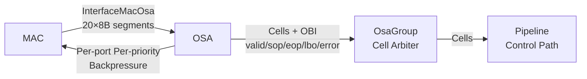
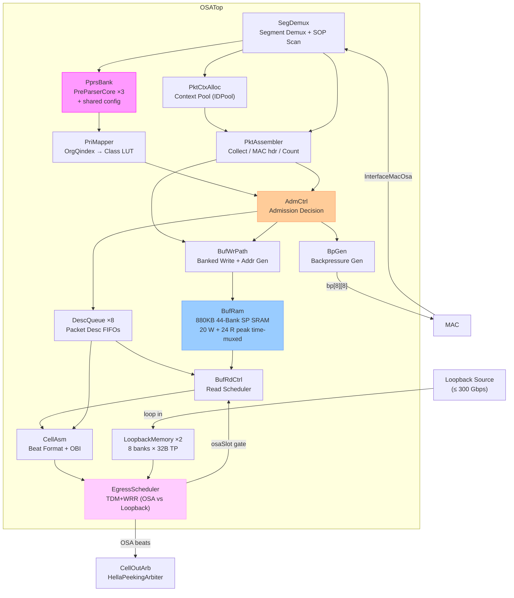
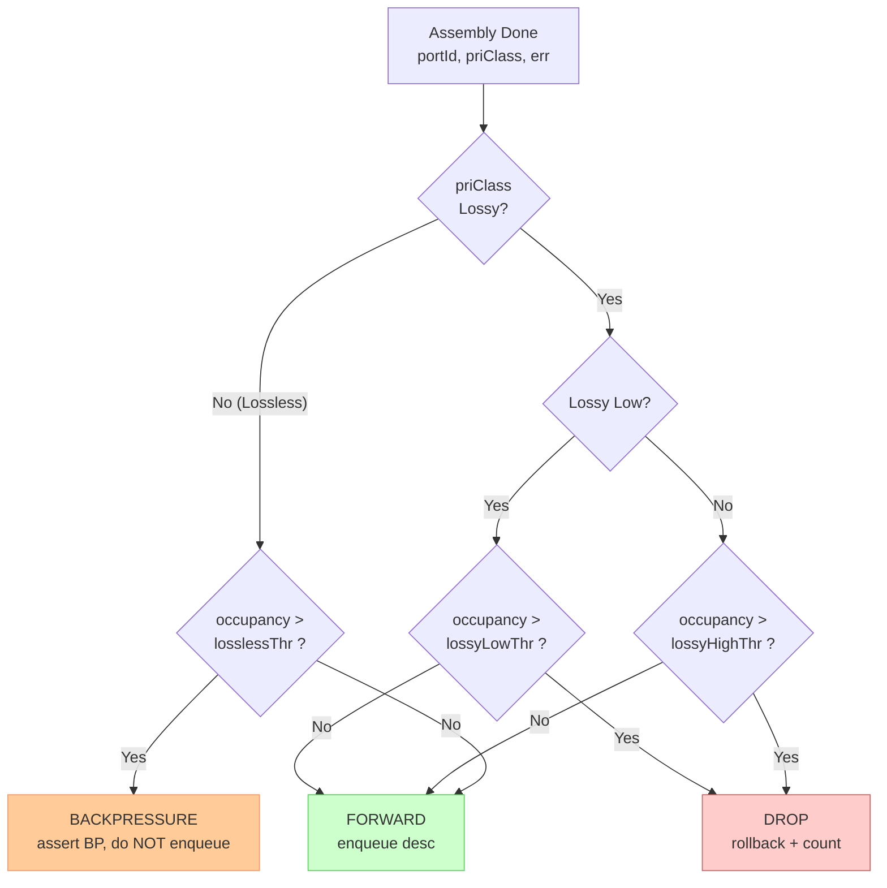
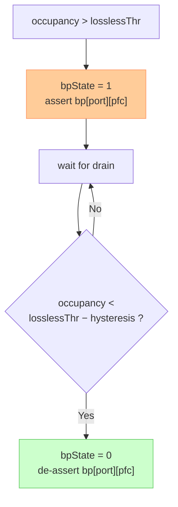
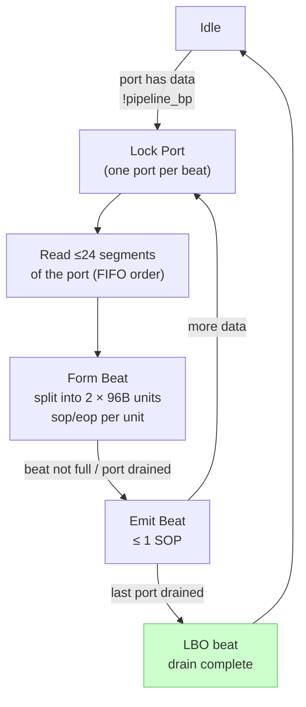
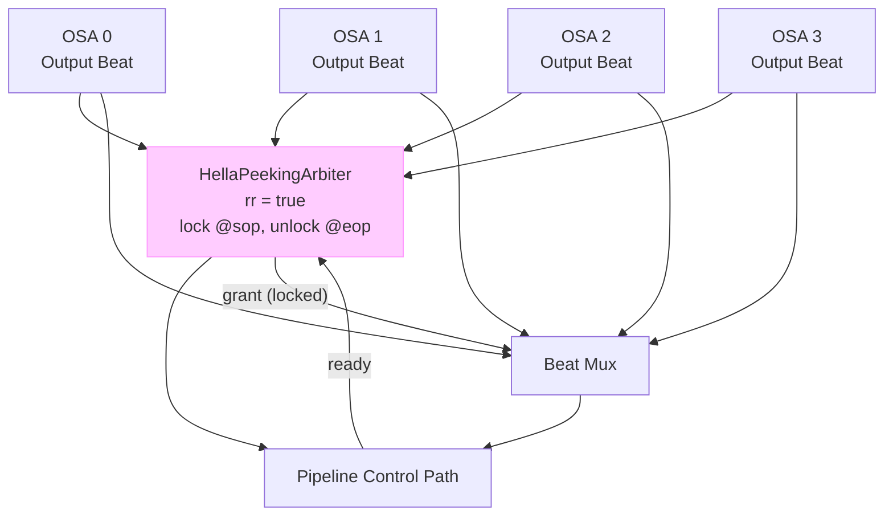

# Over Subscription Buffer (OSA) Design Document

## Revision History

| Version | Date | Author | Description |
|---------|------|--------|-------------|
| 1.0 | 2026-05-16 | - | Initial draft |
| 1.1 | 2026-05-16 | - | Fixed mermaid packet diagrams (packet → packet-beta); rewritten buffer capacity calculation with XOFF/XON/MTU analysis, previous-chip delay (614ns), and MAC delay (170ns) |
| 1.2 | 2026-05-17 | - | Reworked sub-module breakdown and hardware architecture from the Feature List: 20-way banked write SRAM (fixes 160B/cycle vs 8B/cycle write-port inconsistency), packet-context pool (IDPool, 8 ports × 3 slots), delayed admission with buffer rollback, PPRS shared-config bank (PreParserCore ×3), explicit read scheduler / descriptor queues / group arbiter, BaseCbb reuse map, per-module exception handling |
| 1.3 | 2026-05-17 | - | Buffer switched from dual-port (TP) to **single-port (SP) SRAM** for PPA (TP is typically ≥1.5× SP area): per-bank write-priority arbitration, 1-deep read defer + busy-mask scheduling, ReorderQueue-based read response reassembly, read-elasticity analysis (writes are hard real-time, reads are deferrable) |
| 1.4 | 2026-05-17 | - | **1.6 Tbps read+write bandwidth guarantee**: audit showed the v1.3 read path could not sustain 1.6 Tbps — (a) the cell output was only 8B/cycle (80 Gbps) and (b) SP banks allow only 20 accesses/cycle total vs. the required 20 writes + 20 reads. Fixed by (a) widening the output interface to 20×8B = 160B/cycle (packet-level segment stream, `outSegPerCycle = 20`) and (b) running the SP banks at 2× the logic clock with a **write phase + read phase per logic cycle** (temporal dual-port: 20 W + 20 R = 320B/cycle total bank access, still SP area). Read defer / busy-mask / ReorderQueue machinery removed (phase-separated accesses are conflict-free and order-preserving) |
| 1.5 | 2026-05-17 | - | **2× SRAM clock (2.5 GHz) is not feasible in the target process — replaced with a 40-bank time-multiplexed SP design at 1× clock**: 40 banks × 8B SP SRAM at the logic clock (1.25 GHz) provide 40 access slots/cycle, partitioned 20 write (hard real-time) + 20 read (elastic). Writes are conflict-free by position interleave; reads that collide with a same-cycle write are queued (read queue) and executed in later cycles' free slots — sustained read throughput provably reaches 20 segments/cycle (steady-state backlog ≤ 20, self-correcting), with ReorderQueue reassembly. Area ≈ 0.7× of the 20-bank TP alternative (still better PPA than dual-port) |
| 1.6 | 2026-05-17 | - | **Output interface changed to 2 × 96B per beat** (per downstream requirement): the two 96B units of a beat belong to the same port, may span two packets (tail + head), and never both start a packet (≤ 1 SOP/beat). Impacts: banks 40 → **44** (20 write slots + ≤ 24 read slots for a full 2 × 96B beat; 112,640/44 = 2,560 rows/bank), read scheduler locks one port per beat and cuts beats at the second SOP boundary, CellAsm packs ≤ 24 segments into 2 × 96B units, OBI narrowed to 1 valid/beat, `CellOutputBundle` redefined as `Vec(2, Osa96bUnit)` + portId, sustained read ≥ 160B/cycle (1.6 Tbps) with 192B/cycle peak (§1.1/§2.1/§2.4/§3.7/§3.10/§3.11/§3.13/§4.3/§5.1/§6/§8/§9/Appendices) |
| 1.7 | 2026-05-17 | - | **Arbitration policy and performance guarantees made explicit (§6.3, new)**: the design is **write-priority** (writes are hard real-time — data on the wire cannot be recovered; reads are elastic — Decoupled output tolerates delay; read-first would overflow a bounded input FIFO). Window-overlap analysis: sustained read 20 segments/cycle (1.6 Tbps) is **guaranteed** (δ self-corrects to a conflict-free fixed point; worst-case transient backlog ≤ 24 segments ≈ 1.2 cycles); the 192B/beat peak (24 segments/cycle) is sustainable only when writes are below line rate (drain mode) — at sustained W = 20 the physical read ceiling is 20/cycle (corrected prior over-stated "peak 192B/cycle"). §6.1 item 4 / §3.7 / §3.10 / §7.8 updated; §6.3→6.4→6.5 renumbered |
| 1.8 | 2026-05-17 | - | **Cycle-accurate performance model + validation suite added (`tools/osa_sim/`)**: 8 tests (steady state, write-full + read-24, drain mode, δ=0 self-correction, latency bound, PFC burst loop, random long-run, (W,R) matrix) — all pass and **correct the v1.7 read ceiling**: out-of-order execution means any read demand R ≤ 24 is served at R segments/cycle while data is available, **even with writes at line rate** (a ≥ 44-segment queue backlog covers every bank, so all 24 free slots fill regardless of δ). The only limit is data availability (R=24 drains the buffer at 4 seg/c), not arbitration. §6.1 item 4 / §6.3 / §3.10 updated. **Plus per-read latency analysis (tests T9/T10)**: a read whose bank is being written waits **≤ 1 cycle** (the write window rotates 20 banks/cycle, so no bank is written two cycles in a row); total queueing delay ≤ 2 cycles under write-full + read-24 stress (99.55% of reads ≤ 1 cycle); a pathological single-bank read hotspot is an input anomaly (T10) impossible with sequential read generation. §6.3 "Per-read latency under bank conflicts" added |
| 1.9 | 2026-05-17 | - | **Read-side egress TDM+WRR scheduling with a loopback port (≤ 300 Gbps)**: new EgressScheduler (§3.14) + LoopbackQueue (§3.15) share the 2 × 96B egress — fixed TDM frame (default 32 = 27 OSA slots + 5 loopback slots) gives the loopback 5×192B/32 = 300 Gbps and keeps the OSA read at 27/32×192 = 1.62 Tbps (≥ 1.6 Tbps); WRR weights configurable; idle-slot handover both ways; `loopQueueDepth = 128` (≥ one frame of injection, peak backlog 105). Model extended + tests T11–T15 (OSA+loopback coexistence 20.00 seg/c + 300 Gbps, loopback-only 300 Gbps exact, handover full-frame 24 seg/c, drain cap 20.25 seg/c, random+loopback conservation) — 15/15 pass. Feature 10 added; §2.2/§2.4/§5.1/§6.1/§6.3 updated |
| 2.0 | 2026-05-17 | - | **Two loopback ports (2 × 300 Gbps) + lane port-granularity (min 200 Gbps; 8×200G / 4×400G / 2×800G / 1×1.6T per lane)**: audit showed 2×96B = 1.92T egress cannot carry OSA 1.6T + loopback 0.6T = 2.2T simultaneously → egress widened to **2 × 96B = 192B/cycle = 2.88 Tbps** (24 segments/cycle) and banks 44 → **64** (20 W + 36 R peak; 112,640/64 = 2,560 rows; `bank = addr mod 44` is free). Port granularity: per-port config at 200G/400G/800G/1.6T steps (§6.5) |
| 2.1 | 2026-05-17 | - | **Loopback data moved to dedicated TP memories** (per user spec: 2 loopback ports, each with **8 banks × 32B dual-port SRAM**, separate from the main buffer — loopback consumes no main-buffer bandwidth/storage). Loopback TP read port = 256 B/cycle (32 seg/c). §3.15 updated |
| 2.2 | 2026-05-17 | - | **Egress reverted to 2 × 96B bus + work-conserving loopback** (per user): the egress stays **2 × 96B = 192B/cycle** (banks back to **44**, 20 W + 24 R peak); the OSA read has **strict priority** on all 24 segments/cycle and the two loopback ports are **work-conserving**, rate-limited to **300 Gbps each** by token buckets — a loopback reaches its cap **only when the network read is below 1.32 Tbps** (leftover ≥ 7.5 seg/c); at the full 1.6 Tbps read the leftover 320 Gbps is split (≈ 160 Gbps each). Fixed TDM frame removed (token buckets are the mean-equivalent). **No packet packing in a 96B unit**: every unit belongs to exactly one packet (unit-aligned packets, final unit padded). Model: strict-priority + token buckets, tests T11–T15 rewritten — **15/15 pass** (T11 OSA 20.00 seg/c + loopbacks 4 seg/c; T12 network idle → 3.75 each = 300 Gbps; T13 full read → loopbacks 0; T14 OSA 1.32T → 3.75 each). §3.10/§3.11/§3.14/§5.1/§6.1/§6.3/§8/feature 10 updated |

---

## 1. Feature List

### 1.1 Core Features

1. **Multi-Port Packet Input**
   - Receives packet segments from MAC via `InterfaceMacOsa`
   - 20 segments × 8B = 160B per cycle at 1.6 Tbps
   - Up to 3 new packets per cycle (SOP detection)
   - Support 200G / 400G / 800G / 1.6T port speeds

2. **Built-in PPRS Priority Extraction**
   - PreParser instantiated as internal sub-block
   - 3 parallel PreParser datapaths for multi-packet per cycle
   - Extracts 4-bit OrgQindex from first 32B per packet

3. **Configurable Priority Class Mapping**
   - 16-entry LUT maps OrgQindex[3:0] → 2-bit priority class
   - 4 priority classes: Lossy Low, Lossy High, Lossless Low, Lossless High
   - Each class maps to a configurable PFC priority level (0–7)

4. **Packet Assembly and Filtering**
   - SOP/EOP-based segment grouping into packets
   - 8B MAC header extraction (4B timestamp + 4B reserved)
   - Minimum packet size filtering (configurable `minPktSize`, default 64B)

5. **Shared Buffer with Per-Port Management**
   - Total capacity: 880 KB (absorbs 70m fiber at 1.6 Tbps)
   - 8B resolution write/read; 44-way banked SP SRAM sustains **160B/cycle write** (1.6 Tbps) and **160B/cycle sustained read** (peak 192B/cycle)
   - Per-port occupancy tracking and threshold management

6. **Admission Control**
   - Per-port configurable thresholds: lossy low, lossy high, lossless
   - Drop lossy packets when occupancy exceeds corresponding threshold
   - Assert backpressure when lossless threshold exceeded

7. **Backpressure Generation**
   - Per-port, per-priority (8 PFC priorities) backpressure signals to MAC
   - MAC encapsulates PFC frames based on OSA backpressure
   - Configurable mapping from OSA 4-class to PFC 8-priority

8. **Cell Assembly and Output**
   - Output interface: **2 × 96B = 192B/beat** (24 × 8B segments per beat)
   - The two 96B units of a beat always belong to **the same port**; they may
     belong to different packets (tail of one + head of the next) but **never
     both start a packet** (≤ 1 SOP per beat)
   - Per-unit data + valid/sop/eop/error + per-segment byte-enable + packet-level
     lbo + out-of-band info (OBI, ≤ 1 new packet per beat, rides the SOP unit)
   - MAC header stripped from payload, sent as out-of-band info
   - Cells (configurable `cellSize`, 192B–256B) are assembled downstream from
     the packet-boundary-tagged segment stream

9. **Multi-OSA Output Arbitration**
   - 2–4 OSA instances share one pipeline control path
   - Round-robin arbitration with packet-level locking (SOP→EOP)
   - Backpressure from pipeline propagates to OSA read path

10. **Egress Scheduling with Two Loopback Ports (Work-Conserving)**
    - The read-side egress (2 × 96B beat stream) is shared between the OSA
      buffer read and **two loopback ports**: the OSA read has **strict
      priority**; the loopback ports are **work-conserving**, using only the
      egress leftover, each rate-limited to **300 Gbps**
    - Loopback data lives in **dedicated TP memories (8 banks × 32B each)**,
      separate from the OSA main buffer
    - A loopback port reaches its 300 Gbps cap **only when the network read
      is below line rate** (leftover ≥ 7.5 seg/cycle, i.e. OSA ≤ 1.32 Tbps);
      at the full 1.6 Tbps read the leftover (320 Gbps) is split between the
      ports (≈ 160 Gbps each) — per the requirement that loopback bandwidth
      is only available when the network is not saturated
    - The OSA 1.6 Tbps read guarantee is never weakened (strict priority on
      all 24 egress segments/cycle)
    - Loopback memory depth 8 × 32B × 128 rows = 32 KB per port (≥ one frame
      of injection)

11. **Lane Port Granularity (Network Ports)**
    - Network ports are configured in 200 Gbps steps; each 1.6 Tbps lane can
      carry 8 × 200G, 4 × 400G, 2 × 800G, or 1 × 1.6T ports
    - Per-port thresholds, backpressure and read scheduling scale with the
      configured port speed (§6.5)

### 1.2 Feature → Sub-Module Traceability

Every feature in §1.1 is owned by one or more of the sub-modules defined in §3.
This mapping is the contract between the feature list and the RTL hierarchy:

| Feature | Owning Sub-Modules |
|---------|--------------------|
| 1. Multi-port packet input | SegDemux (§3.1), PktCtxAlloc (§3.2) |
| 2. PPRS priority extraction | PprsBank (§3.3) |
| 3. Priority class mapping | PriMapper (§3.4) |
| 4. Packet assembly & filtering | PktAssembler (§3.5) |
| 5. Shared buffer management | BufWrPath (§3.6), BufRam (§3.7), DescQueue (§3.8), BufRdCtrl (§3.10) |
| 6. Admission control | AdmCtrl (§3.9) |
| 7. Backpressure generation | BpGen (§3.12) |
| 8. Cell assembly & output | CellAsm (§3.11) |
| 9. Multi-OSA arbitration | CellOutArb / OsaGroup (§3.13) |
| 10. Egress TDM+WRR + two loopbacks | EgressScheduler (§3.14), LoopbackMemory (§3.15) |
| 11. Lane port granularity (200G steps) | per-port config (§6.5), AdmCtrl (§3.9), BpGen (§3.12) |

---

## 2. Top-Level Architecture

### 2.1 Position in the System

The OSA sits between the MAC layer and the pipeline control path of a 1.6 Tbps
packet processing system. It receives raw packet segments via `InterfaceMacOsa`,
extracts packet priority with the built-in PPRS bank, buffers packets in a
shared 880 KB banked SRAM, applies admission control based on priority and
per-port occupancy, and emits a **2 × 96B = 192B/beat** packet-level segment
stream with out-of-band information to the downstream pipeline — sustaining
**1.6 Tbps in and ≥1.6 Tbps out** (sustained read 160B/cycle, peak 192B/cycle;
see the bandwidth verification in §6.1). Several OSA instances (2–4) are
grouped by `OsaGroup`, which arbitrates their output streams onto one pipeline
control path.



### 2.2 Sub-Module Hierarchy

The OSA is decomposed into **12 sub-modules inside `OSATop`** plus the
group-level **`CellOutArb`** (inside `OsaGroup`). The decomposition follows
three rules:

1. **One bandwidth function per module**: the 160B/cycle input stream, the
   160B/cycle output stream and the control plane (priority / admission /
   backpressure) are kept in separate modules so each can be sized
   independently.
2. **Store outside the control logic**: SRAM and deep queues are attached
   through `TpMemoryPort` / `SpMemoryPort` (BaseCbb convention), so every
   sub-module is synthesizable and simulatable with a behavioral memory model.
3. **Reuse BaseCbb kernels**: allocators, arbiters, FIFOs, latency pipes and
   counters are instantiated from BaseCbb instead of being re-implemented
   (see §2.6).



### 2.3 Write-Path Dataflow (per cycle)

The write path is **position-parallel**: all 20 input segments are tagged and
written in the same cycle they arrive. There is no intermediate gather buffer —
the shared SRAM itself is the staging area.

```
S0  InterfaceMacOsa sample (20 × 8B, valid/sop/eop/err)
    │  SegDemux: scan 20 positions, detect ≤ 3 SOPs
    │  (BaseCbb math.Compress / PrefixSum based priority scan)
S1  PktCtxAlloc: per new packet, allocate a context slot
    │            from the port's 3-slot sub-pool (IDPool, position-ordered)
    │  PprsBank: dispatch first 32B of each new packet (3 lanes)
    │  BufWrPath: generate per-position address = base(slot) + offset(slot)
    │            44 banks, ≤ 20 writes per cycle (bank = addr mod 44)
S2  SRAM write completes (mem latency 1–2 cyc)
    │  PktAssembler: per slot, latch MAC header, accumulate byte count,
    │                capture EOP/err
P0–P3  PPRS pipeline (pprsLatency) → OrgQindex per slot
S3  Admission decision (at EOP ∧ priValid, aligned by LatencyPipe):
    │   FORWARD → enqueue PacketDesc to port's DescQueue (SyncFifo)
    │   DROP    → roll back wrPtr by packet length, release context slot
```

Key property: **delayed admission with buffer rollback**. Because the PPRS
priority is only known `pprsLatency` cycles after the SOP, every packet is
written to the buffer speculatively and the final accept/drop decision is made
when both the priority and the EOP are known. A drop frees the packet's
contiguous buffer range by rewinding the port write pointer (modular
subtraction). The rollback is always safe: the dropped packet is at the write
frontier, so `wrPtr − len ≥ rdPtr` holds as long as occupancy ≥ len.

### 2.4 Read-Path Dataflow

```
R0  BufRdCtrl: round-robin over ports with pending data, locking one port per
    │           output beat (both 96B units of a beat come from this port)
R1  read scheduling: generate up to 24 new segment reads per beat, merged
    │   with the pending-read queue; of the merged set, execute only reads
    │   whose bank is not being written this cycle (write mask from BufWrPath);
    │   colliding reads stay queued and are retried in later cycles' free slots
    │   (read generation is gated by the EgressScheduler's osaSlot signal:
    │   OSA reads only run in OSA slots, §3.14)
R2  each executed read is tagged with an issue sequence; responses return
    │   after a fixed memLatency with variable queueing delay → ReorderQueue
    │   reassembles segments in issue order → ≤ 24 segments/beat read bus
R3  CellAsm formats the 2 × 96B beat: the ≤ 24 in-order segments of the locked
    │   port are split into two 96B units (12 segments each); per-unit
    │   sop/eop/error, per-segment byteEn, packet-level lbo, OBI rides the SOP
    │   unit (≤ 1 SOP per beat); MAC header (8B) skipped, never in payload
R3.5 EgressScheduler (strict priority + work-conserving): the OSA beat (from
    │   R3) uses the 2 × 96B egress first every cycle; the leftover egress is
    │   offered to the loopback beats (from LoopbackMemory ×2), each
    │   rate-limited to ≤ 300 Gbps by a token bucket (§3.14); backpressure
    │   stalls both sources
R4  OsaGroup CellOutArb arbitrates OSA+loopback beats onto the pipeline;
    │   pipeline backpressure (ready=0) stalls the owning OSA read path
```

### 2.5 Clocking

All sub-modules run in a single clock domain derived from the MAC data clock.
The `InterfaceMacOsa` segments, the cell output and the buffer SRAM share this
clock (**no faster SRAM clock is required**).

- The ≥1.6 Tbps read bandwidth is achieved by **44 SP banks** at the logic
  clock: each bank contributes one 8B access per cycle, giving 44 access slots
  per cycle, partitioned 20 (writes, hard real-time) + up to 24 (reads,
  elastic with queueing on bank conflicts) — see the bandwidth analysis in
  §6.1.
- Backpressure outputs (`bp[port][pfc]`) are combinational functions of
  occupancy/thresholds in the same domain; if the MAC control logic resides in
  a different clock domain, insert `BaseCbb.async.SynchronizerReg` /
  `ResetCatchAndSync` at the OSA boundary (configurable, off by default).
- CSR writes arrive in the same domain (AXI-Lite from the management CPU via
  RegCbb); a 2-flop synchronizer is placed on the CSR bus if it crosses clocks.

### 2.6 BaseCbb Reuse Map

All reusable building blocks are drawn from BaseCbb (`src/main/scala/BaseCbb/`).
No OSA sub-module re-implements a BaseCbb primitive.

| BaseCbb Module | Package / File | OSA Usage | Notes |
|----------------|----------------|-----------|-------|
| `GenModule` / `GenBundle` | `data/GenBundle.scala` | Base classes of every OSA sub-module and bundle | — |
| `SpMemoryPort` / `SpMemoryLgcPort` | `memory/Memory.scala` | Logical port of each of the 44 SP buffer banks (1 access/cycle) | 44 banks → 44 access slots/cycle at 1× clock (§6.1) |
| `SpMemoryWrap3` | `memory/Memory.scala` | Per-bank SP SRAM wrapper: ECC/parity, DFX init, CPU access arbitration | see §6.2 |
| `TpMemoryPort` | `memory/Memory.scala` | Descriptor SRAM of the per-port `SyncFifo` queues | small (≤ ~130 KB total), low traffic, TP kept for simplicity |
| `Memory` | `memory/Memory.scala` | SRAM configuration object (depth, width, ECC) | — |
| `IDPool` | `memory/IDPool.scala` | Packet context slot allocator (24 ids) | §3.2 |
| `BitmapKernel` | `memory/BitmapKernel.scala` | `firstFree/hasFree/freeCount` helpers for context pool status | §3.2 |
| `SyncFifo` | `fifo/SyncFifos.scala` | Per-port packet descriptor queues (external SRAM) | §3.8 |
| `RegisterBasedFifo` | `fifo/SyncFifos.scala` | Shallow BP-event / debug queues | §3.12 |
| `RR` | `arbiter/arbiter.scala` (root `BaseCbb`) | Read scheduler round-robin across ports | §3.10 |
| `HellaPeekingArbiter` | `arbiter/HellaArbiters.scala` | Multi-OSA cell arbitration with SOP→EOP locking | §3.13 |
| `LatencyPipe` / `LatencyPipeV` | `misc/LatencyPipe.scala` | Align segment stream with PPRS priority; align occupancy snapshot with BP | §3.3, §3.12 |
| `ReorderQueue` | `misc/ReorderQueue.scala` | Reassemble read responses (variable queueing delay on bank conflicts) into issue order | §3.10 |
| `ShiftQueue` | `misc/ShiftQueue.scala` | Optional per-slot segment staging (small configs) | §3.5 |
| `Compress` / `Scatter` | `math/Compress.scala` | SOP/valid position compression for window extraction | §3.1 |
| `DensePrefixSum` | `math/PrefixSum.scala` | Position-scan prefix sums (SOP rank per cycle) | §3.1 |
| `MuxTable` | `math/MuxLiteral.scala` | OrgQindex LUT implementation (16 static entries) | §3.4 |
| `ZCounter` / `WideCounter` | `math/Counters.scala` | Byte counters, occupancy counters, watchdog timers | §3.5, §3.10 |
| `DecoupledHelper` / `ValidMux` | `misc/Misc.scala` | Handshake synthesis, multi-valid merge | §3.6, §3.11 |
| `ShiftReg` / `ShiftRegInit` | `misc/ShiftReg.scala` | Pipeline alignment registers (named stages) | §3.3, §3.5 |
| `RegCbb` (DSL + hw) | `RegCbb/` | CSR register block: thresholds, LUTs, status, counters, interrupts | §5 |
| `SynchronizerReg` | `async/SynchronizerReg.scala` | Optional CDC on BP outputs and CSR bus | §2.5 |

> **Reuse cautions** (known BaseCbb issues, see `docs/BaseCbb_设计文档/`):
> - Do **not** use `memory/BitmapCacheMem.scala` for the buffer allocator — its
>   `sWrite` state is unreachable and allocation-hits are not written back
>   (double-allocation risk). This design therefore uses per-port ring
>   pointers (§6.4) instead of a free-list allocator.
> - Do **not** use `arbiter/RegulariSlip` — its pointer initializes to 0 which
>   deadlocks `RrLogic`; use `RR` (initialized to 1) instead.
> - `SpMemoryWrap3` with `CheckIn = true` only samples the address on `we`
>   (pure-read addresses are lost). The OSA therefore instantiates it with
>   `CheckIn = false` and registers we/re/addr inside the per-bank access
>   controller (BankArb, §6.2), which is the correct place for the timing path
>   anyway.
> - `SyncFifo` exposes explicit `clk/rst_n` and its `readLatency=1` `dout` is a
>   combinational mux (0 when not reading) — acceptable for descriptor queues,
>   do not rely on `dout` retention across cycles.

---

## 3. Sub-Module Functional Specification

### 3.1 SegDemux — Segment Demultiplexer

**Function.** Receives the raw `InterfaceMacOsa` stream (20 × 8B) and produces a
**tagged segment stream** plus up to 3 new-packet windows per cycle:

- Scans all 20 positions for SOP assertions (max 3/cycle) using a position-scan
  network (`DensePrefixSum` + `Compress` from BaseCbb).
- Assigns each new packet a context slot (see §3.2) **in stream order**: SOPs
  are allocated from position 0 upward, so a slot released by a packet that
  ends at position *p* can be reused by a packet that starts at position *q > p*
  in the same cycle.
- Tags every valid segment with `{portId, slotId, sop, eop, err}` and a sticky
  `drop` flag for packets that must never reach the buffer (context-full drop,
  see §3.2). Dropped packets' segments are still tracked by the assembler state
  so the stream stays aligned, but they are gated off the write path.
- For each new packet, extracts the first 32B (positions 0–3 relative to the
  SOP) and forwards them to the PprsBank dispatch port.

**Interface.**

```scala
class SegDemux(config: OSAConfig) extends GenModule {
  val io = IO(new Bundle {
    val mac     = Flipped(new InterfaceMacOsa)          // 20×8B raw stream
    // Tagged stream to write path / assembler
    val segs    = Output(Vec(config.segmentsPerCycle, new TaggedSeg))
    // New-packet dispatch to PPRS bank (≤ 3 per cycle)
    val newPkt  = Vec(config.maxNewPktPerCycle, new NewPacketWindow)
    val newPktValid = Vec(config.maxNewPktPerCycle, Bool())
    // Context allocation handshake with PktCtxAlloc
    val alloc   = new PktCtxAllocPort(config)
    // Status
    val sopOverflow  = Output(Bool())   // > 3 SOPs in one cycle
    val segErrorCnt  = Output(UInt(32.W))  // segments with err=1 (EOP)
  })
}

class TaggedSeg extends GenBundle {
  val data   = UInt(64.W)   // 8B segment
  val byteEn = UInt(8.W)    // byte enable (valid only for last segment of packet)
  val portId = UInt(3.W)
  val slotId = UInt(2.W)    // context slot within port (0..2)
  val sop    = Bool()
  val eop    = Bool()
  val err    = Bool()
  val drop   = Bool()       // gated off buffer (ctx-full drop)
  val valid  = Bool()
}

class NewPacketWindow extends GenBundle {
  val portId   = UInt(3.W)
  val slotId   = UInt(2.W)
  val first32B = UInt(256.W)   // SOP + next 3 segments
  val sopPos   = UInt(5.W)     // segment position of the SOP in this cycle
}
```

**Architecture details.**

- SOP scan: 20 valid bits → `Compress` with `DensePrefixSum` gives the rank of
  each SOP (0..2); the 4th+ SOP asserts `sopOverflow` (handled in §7.1).
- The tagged stream is *position-true*: `segs(p)` corresponds to MAC position
  `p`. Later stages use `slotId` only for address generation and bookkeeping,
  which keeps the data path a pure `Vec(20)` bus with no crossbar.
- No storage inside: everything is combinational except small pipeline
  registers inserted at the S0→S1 boundary for timing.

**BaseCbb reuse:** `math.DensePrefixSum`, `math.Compress`, `data.GenBundle`.

### 3.2 PktCtxAlloc — Packet Context Allocator

**Function.** Manages the **packet context pool**: 24 entries
(8 ports × 3 slots). Each context slot holds the per-packet assembly state:

```scala
class PktCtxEntry extends GenBundle {
  val portId     = UInt(3.W)
  val busy       = Bool()
  val dropped    = Bool()          // sticky: segments gated off buffer
  val macHeader  = UInt(64.W)      // captured at SOP (first 8B)
  val byteCount  = UInt(16.W)      // incl. 8B MAC header
  val orgQindex  = UInt(4.W)       // from PPRS (valid after pprsLatency)
  val priClass   = UInt(2.W)       // after PriMapper
  val priValid   = Bool()          // priority result arrived
  val eopSeen    = Bool()
  val err        = Bool()
  val bufBase    = UInt(17.W)      // write pointer value at SOP (rollback anchor)
  val segCount   = UInt(16.W)      // segments written so far (also byteCount/8)
}
```

The allocator is **position-ordered** within a cycle: SegDemux processes SOPs
from position 0 upward and requests a slot per SOP. A request succeeds iff the
port's sub-pool has a free slot at that point in the cycle (slots released by
same-cycle EOPs are already visible). On failure the packet is marked
`dropped` (its segments still consume stream positions, but never reach the
buffer).

**Interface.**

```scala
class PktCtxAllocPort extends Bundle {
  val reqSlot    = Input(Vec(config.maxNewPktPerCycle, Valid(UInt(3.W))))  // portId
  val grantSlot  = Output(Vec(config.maxNewPktPerCycle, Valid(UInt(2.W)))) // slotId, valid=false → drop
  val release    = Flipped(Valid(UInt(4.W)))   // ctxId = {portId, slotId}
  val full       = Output(Bool())              // pool full (global status)
}
```

**Architecture details.**

- Backed by `BaseCbb.memory.IDPool(24)`. The per-port sub-pool limit of 3 is
  enforced by the position-ordered allocation policy in SegDemux; the IDPool
  itself is a flat 24-id pool (a context id = `{portId[2:0], slotId[1:0]}`),
  so `IDPool.alloc`/`free` is the only shared resource.
- `IDPool` parameters: `numIds=24`, `lateValid=true` (alloc.valid reflects
  has-free), `revocableSelect=false`.
- Freeing happens at EOP+decision time (both admit and drop paths), i.e. at the
  admission decision stage, not at EOP itself — a dropped packet's context must
  stay alive until its buffer rollback completes.

**Exceptions.** Context-full new packet → drop (§7.2); pool lockup guard (§7.3).

**BaseCbb reuse:** `memory.IDPool`, `memory.BitmapKernel`.

### 3.3 PprsBank — Priority Extraction Bank

**Function.** Extracts the 4-bit `OrgQindex` from the first 32B of every new
packet. Three packets may start in one cycle, so the datapath is replicated
**3 times**, while the configuration storage is **shared**:

- **Shared storage (1 copy):** per-port `portConfigs` (trustMode / tcamEnable /
  defaultPri), TCAM entries (16 × 112b), VLAN LUT (128 × 4b), DSCP LUT
  (512 × 4b), OpaqueTag LUT (256 × 4b). All CSR-programmed once, read by all
  lanes.
- **Replicated datapath (3 copies):** `PreParserCore` (combinational parse
  tree, VLAN/Opaque/DSCP/TCAM matching) — pure combinational, no registers.

Register-file reads are combinational index muxes, so one storage + 3 readers
costs ~3× the mux area but only 1× the flops, versus 3 full `PreParserTop`
instances. The existing `PreParserTop` (FPP/OSA/PreParser) can be used as-is by
instantiating 3 copies for a quick bring-up, but the recommended netlist is the
shared-storage form above.

```scala
class PprsBank(config: OSAConfig) extends GenModule {
  val io = IO(new Bundle {
    val in   = Vec(config.maxNewPktPerCycle, Flipped(Valid(new NewPacketWindow)))
    // shared config storage write (CSR via RegCbb)
    val cfg  = new PprsCfgPort
    // per-lane results, pprsLatency cycles later
    val out  = Vec(config.maxNewPktPerCycle, Valid(new PriResult))
  })
}

class PriResult extends GenBundle {
  val portId    = UInt(3.W)
  val slotId    = UInt(2.W)
  val orgQindex = UInt(4.W)
  val src       = UInt(3.W)   // 0=default,1=tcam,2=vlan,3=dscp,4=opaque
  val err       = Bool()      // PPRS internal error (PreParserErrorCode != None)
}
```

**Architecture details.**

- Lane *i* processes the *i*-th new packet in cycle order. Lane → slot binding
  is `slotId` (delivered with the result), so lanes are interchangeable and a
  lane may be idle when fewer than 3 packets start.
- Pipeline latency `pprsLatency` (default 4): result registers + optional
  stages inside `PreParserCore` (the current core is combinational; the
  parameter reserves timing margin). The result path carries `{portId, slotId}`
  through a `LatencyPipeV` so PktAssembler can match the priority to the
  correct context slot.
- Timeout watchdog: if `out(i).valid` is not asserted within
  `pprsLatency + margin` cycles of dispatch, the slot falls back to
  `portConfigs(portId).defaultPri` (§7.4).
- PPRS internal failures (`PreParserErrorCode` ≠ None, e.g. `VlanTcamMiss`,
  `InvalidEtherType`, `VlanOverflow`) also fall back to `defaultPri` and are
  counted.

**BaseCbb reuse:** `FPP.OSA.PreParser.PreParserCore` (datapath),
`misc.LatencyPipeV`, `misc.ShiftReg`, `RegCbb` (config storage).

### 3.4 PriMapper — Priority Class Mapper

**Function.** Maps the 4-bit `OrgQindex` from PPRS to the 2-bit priority class
via a 16-entry configurable LUT.

**Priority classes:**

| Class | Encoding | Description | Default PFC Priority |
|-------|----------|-------------|---------------------|
| Lossy Low | 0b00 | Best-effort, dropped first | 0 |
| Lossy High | 0b01 | Premium best-effort | 1 |
| Lossless Low | 0b10 | Low-priority lossless | 4 |
| Lossless High | 0b11 | High-priority lossless | 7 |

**Architecture details.**

- Implemented as a 16 × 2b register LUT (RegCbb-backed) — equivalent to
  `math.MuxTable` over the 16 static indices; the register form allows CSR
  read-back and is preferred here because the table is tiny.
- Purely combinational: `priClass = lut(orgQindex)`.
- Default (reset) mapping: `OrgQindex[3:2]` selects lossy/lossless,
  `OrgQindex[1:0]` selects low/high.

```scala
class PriMapper extends GenModule {
  val io = IO(new Bundle {
    val orgQindex = Input(UInt(4.W))
    val priClass  = Output(UInt(2.W))
  })
}
```

**BaseCbb reuse:** `RegCbb` (LUT registers), `math.MuxTable` (alternative).

### 3.5 PktAssembler — Packet Assembler

**Function.** Tracks the up-to-24 in-flight packet contexts, collects per-packet
metadata and drives the write path:

- Captures the 8B MAC header at SOP (4B timestamp + 4B reserved).
- Accumulates `byteCount` (including MAC header) and segment count.
- Latches `eop`/`err` flags; computes the min-size check at EOP.
- Publishes the **assembly complete** event
  `{portId, slotId, byteCount, macHeader, err, priClass, orgQindex, bufBase,
  segCount}` when `eopSeen ∧ priValid` (aligned via `LatencyPipe`).

**Interface.**

```scala
class PktAssembler(config: OSAConfig) extends GenModule {
  val io = IO(new Bundle {
    val segs      = Flipped(Vec(config.segmentsPerCycle, new TaggedSeg))
    val pri       = Flipped(Vec(config.maxNewPktPerCycle, Valid(new PriResult)))
    val ctx       = new PktCtxAllocPort            // release on completion/drop
    val done      = Output(Valid(new PktAssemblyDone))
    val wrInfo    = Output(new WrPathInfo)         // per-position write gating
  })
}

class PktAssemblyDone extends GenBundle {
  val portId   = UInt(3.W)
  val slotId   = UInt(2.W)
  val macHeader = UInt(64.W)
  val byteCount = UInt(16.W)
  val segCount  = UInt(16.W)
  val orgQindex = UInt(4.W)
  val priClass  = UInt(2.W)
  val err       = Bool()
  val tooSmall  = Bool()        // byteCount < minPktSize
}
```

**Architecture details.**

- Per-slot state is stored in the context pool (§3.2); the assembler is the
  only writer of the metadata fields. It runs at the S1 pipeline stage, one
  cycle behind SegDemux.
- The write-enable mask for BufWrPath is derived per position:
  `we(p) = segs(p).valid ∧ ¬segs(p).drop ∧ ¬(slot busy ∧ dropped)`. The
  assembler holds a **per-port drop-window register** so that a packet marked
  `dropped` at SOP keeps its segments off the buffer for the whole packet
  (up to 3 windows per port, one per slot). A separate **overflow-drop
  tracker** per port gates the segments of a >3-SOP/cycle excess packet until
  the stream's next EOP (§7.1).
- Min-size check (`byteCount < minPktSize`) is evaluated at EOP; a short packet
  is treated as a DROP (§7.5). A packet whose MAC header is incomplete
  (byteCount < 8B, i.e. SOP=EOP with no payload) is also dropped.
- If an EOP is never observed for a slot, a **watchdog timer** force-closes the
  context after `pktOpenTimeout` cycles (§7.6).

**BaseCbb reuse:** `math.ZCounter`/`WideCounter` (byte counters, watchdog),
`misc.LatencyPipe`.

### 3.6 BufWrPath — Buffer Write Path

**Function.** Converts the tagged segment stream into per-bank SRAM writes:

- Computes the absolute buffer address of each position:
  `addr(p) = ctx(slot(p)).bufBase + offset(slot(p))`, where the per-slot offset
  counts the number of earlier positions in this cycle that belong to the same
  slot (`DensePrefixSum` over the slot-match mask).
- Maps the absolute entry index to `{bank, row}`: `bank = addr mod 44`,
  `row = addr / 44`. Any 20 consecutive addresses hit 20 distinct banks (20 <
  44), so a full 20-segment cycle issues 20 writes to 20 different banks — no
  write-vs-write conflicts by construction, and at most 20 of the 44 banks are
  written in a cycle (leaving ≥ 24 slots for reads, §6.1).
- Asserts `we` per bank with `wdata = seg.data`, `waddr = row`; the EOP segment
  additionally carries `byteEn` and the EOP marker for the read side.

```scala
class BufWrPath(config: OSAConfig) extends GenModule {
  val io = IO(new Bundle {
    val segs    = Flipped(Vec(config.segmentsPerCycle, new TaggedSeg))
    val ctxBase = Input(Vec(config.portCount * config.ctxPerPort, UInt(config.bufAddrWidth.W))) // slot → base
    val bankWe  = Output(Vec(config.banks, Bool()))
    val bankAddr= Output(Vec(config.banks, UInt(config.bankRowAddrW.W)))
    val bankData= Output(Vec(config.banks, UInt(64.W)))
    val bankEop = Output(Vec(config.banks, Bool()))   // EOP marker (with byteEn)
    val bankBen = Output(Vec(config.banks, UInt(8.W)))
  })
}
```

**Architecture details.**

- The `addr mod 44` / `div 44` decomposition is computed per position with a
  small constant-divider network (repeated subtraction; 17-bit inputs, cheap).
  Because consecutive addresses are handled in parallel, the shared quotient
  can be generated incrementally per slot.
- Writes are issued at S1 and complete at S2 (memory latency); rollback on
  drop rewinds the port `wrPtr` by `segCount` at decision time (§3.9) — no
  buffer cleanup is needed because the data is simply overwritten when the
  region wraps.

**BaseCbb reuse:** `misc.DecoupledHelper` (we synthesis), `math.DensePrefixSum`
(per-slot offset).

### 3.7 BufRam — Shared Buffer SRAM

**Function.** The 880 KB shared packet buffer, implemented as **44 banks × 8B
of single-port (SP) SRAM at the logic clock** (1× clock — no faster SRAM clock
is required, see §6.1). Each bank is a 64-bit × 2560-row SP SRAM wrapped by
`SpMemoryWrap3` (ECC + DFX init + CPU access). The 44 banks provide **44
access slots per cycle**, partitioned as:

- **20 slots → writes** (hard real-time): the 20 input segments are written in
  the same cycle they arrive; position interleave (`bank = addr mod 44`)
  guarantees 20 distinct banks, so writes never conflict with each other.
- **up to 24 slots → reads** (elastic): up to 24 segment reads per cycle are
  served in the banks that are **not** being written this cycle (24 segments =
  one full 2 × 96B output beat). A read that collides with a same-cycle write
  is kept in the read queue and retried in a later cycle's free slot
  (time-multiplexed sharing of the bank bandwidth).

```scala
class BankWrReq extends GenBundle {   // from BufWrPath — always granted
  val we   = Bool()
  val addr = UInt(config.bankRowAddrW.W)
  val data = UInt(64.W)
  val eop  = Bool()                  // EOP marker (with byteEn)
  val ben  = UInt(8.W)
}

class BankRdReq extends GenBundle {  // from BufRdCtrl — granted if bank free
  val addr = UInt(config.bankRowAddrW.W)
  val tag  = UInt(8.W)               // issue sequence, for response reorder
}

class BankRdResp extends GenBundle {
  val tag    = UInt(8.W)
  val data   = UInt(64.W)
  val uecErr = Bool()
}

class BufRam(config: OSAConfig) extends GenModule {
  val io = IO(new Bundle {
    val wrReq   = Vec(config.banks, Flipped(new BankWrReq))  // 20 active max
    val wrMask  = Output(UInt(config.banks.W))               // banks written this cycle
    val rdReq   = Vec(config.banks, Flipped(Valid(new BankRdReq)))  // ≤ 24
    val rdGrant = Output(Vec(config.banks, Bool()))          // executed reads
    val rdResp  = Output(Vec(config.banks, Valid(new BankRdResp)))
    val dfx     = new MemoryDfxPort(config.bankRowAddrW)
    val cpu     = new CpuRsPort(config.bankRowAddrW, 64)
  })
}
```

**Architecture details.**

- Per-bank `Memory` config: `dataType = UInt(64.W)`, `depth = 2560`,
  `memoryType = SP`, `protect = ECC`, `CheckIn = false`, `CheckOut = true`.
  `CheckIn = false` sidesteps the BaseCbb SP read-address capture bug (see
  reuse cautions §2.6): BankArb itself registers we/re/addr, which is the
  natural place for the timing path.
- **BankArb per bank (slot arbiter)**: each cycle the arbiter decides the
  bank's single access: `WRITE` if `wrReq(b).we` (hard priority — input data
  must never be lost); else `READ` if the bank is requested and free; else
  idle. **Write-priority is a deliberate policy choice**: writes are hard
  real-time (data already on the wire cannot be recovered), while reads are
  elastic (Decoupled output tolerates delay) — see the full justification and
  the resulting performance guarantees in §6.3. `wrMask` (the 20-bit
  write-occupancy) is broadcast to BufRdCtrl so the read scheduler never even
  requests a bank being written — a request that nevertheless arrives on a
  written bank is deferred (single 1-deep register, retried next cycle) as a
  safety net.
- **Same-address write→read is naturally ordered**: a read of an address just
  written completes on a later cycle and sees the updated data (no bypass
  logic needed).
- **CPU / DFX accesses** (wrap3-internal) block the user access for one cycle
  (`cpuBlockUser`); writes are held (never lost), reads return one cycle later.
- ECC SECDED adds ~8 check bits per 64-bit word (per bank), roughly +12%
  storage — included in the 880 KB budget (physical SRAM sized accordingly).
- DFX init (`dfx.init`) broadcasts to all banks in parallel; each bank runs its
  own init FSM inside the wrap3. CPU access is serialized across banks by a
  simple bank-select mux driven by the CSR block.

**BaseCbb reuse:** `memory.Memory`, `memory.SpMemoryPort`/`SpMemoryLgcPort`,
`memory.SpMemoryWrap3` (one per bank).

### 3.8 DescQueue — Per-Port Descriptor Queues

**Function.** Holds the committed `PacketDesc` of every admitted packet, in
arrival order, per port. The read scheduler and the cell assembler consume
descriptors from here; OBI content is sourced from the descriptor at SOP.

```scala
class PacketDesc extends GenBundle {
  val portId    = UInt(3.W)
  val pktId     = UInt(8.W)
  val macHeader = UInt(64.W)     // 4B timestamp + 4B reserved
  val byteCount = UInt(16.W)     // incl. MAC header
  val segCount  = UInt(16.W)     // = byteCount / 8 (rounded up)
  val bufBase   = UInt(17.W)     // absolute entry index of first segment
  val orgQindex = UInt(4.W)
  val priClass  = UInt(2.W)
  val err       = Bool()
}

class DescQueue(config: OSAConfig) extends GenModule {
  val io = IO(new Bundle {
    val enq     = Flipped(Decoupled(new PacketDesc))   // from AdmCtrl (per port muxed)
    val deq     = Decoupled(new PacketDesc)            // to BufRdCtrl (round-robin)
    val count   = Output(Vec(config.portCount, UInt(12.W)))  // per-port occupancy
    val empty   = Output(Vec(config.portCount, Bool()))
  })
}
```

**Architecture details.**

- 8 independent FIFOs (one per port), each `BaseCbb.fifo.SyncFifo` with an
  external `TpMemoryPort` SRAM. Depth: worst case is the number of packets that
  fit in a port region at minimum packet size, e.g. 40,960 entries / 8 segs =
  5,120 descriptors for a 1.6T region → 13-bit address FIFO (2,048–8,192).
- `pktId` is generated by a per-port `WideCounter` (mod 256) at enqueue time.
- A port's queue is drained strictly in arrival order; the read scheduler can
  only read the head descriptor (FIFO semantics guarantee per-port packet
  ordering).

**BaseCbb reuse:** `fifo.SyncFifo`, `memory.TpMemoryPort`, `math.WideCounter`.

### 3.9 AdmCtrl — Admission Control

**Function.** Decides, per completed packet (EOP ∧ priValid), whether to
**forward**, **drop**, or (for lossless) **backpressure**:



**Interface.**

```scala
class AdmCtrl(config: OSAConfig) extends GenModule {
  val io = IO(new Bundle {
    val done       = Flipped(Valid(new PktAssemblyDone))
    val occupancy  = Input(Vec(config.portCount, UInt(config.bufAddrWidth.W)))
    val thresholds = Input(Vec(config.portCount, new PortThresholds))
    val fwd        = Output(Valid(new PacketDesc))   // → DescQueue
    val rollback   = Output(Valid(new RollbackInfo)) // {portId, segCount}
    val bpEvent    = Output(Bool())                  // → BpGen
  })
}

class RollbackInfo extends GenBundle {
  val portId   = UInt(3.W)
  val segCount = UInt(16.W)
}
```

**Architecture details.**

- Occupancy is sampled at the decision cycle from the per-port occupancy
  counters (§6.4); thresholds are per-port 16-bit values in 8B units.
- Decision rules:
  - Lossy: drop iff `occupancy > thr` (drop before enqueue, roll back buffer,
    count `priDropCnt[priClass]`).
  - Lossless: if `occupancy > losslessThr`, assert BP and **do not enqueue**
    (the packet is dropped *and* backpressure is raised — the lossless contract
    is that the MAC must stop sending; the offending packet is still dropped to
    protect the buffer). If `occupancy ≤ losslessThr`, forward.
  - `tooSmall` packets are always dropped (min-size, §7.5), regardless of class.
- The rollback and the context release are issued together with the decision;
  the port `wrPtr` is rewound by `segCount` (modular subtraction) and the
  occupancy counter is decremented accordingly — this keeps occupancy
  consistent with the ring pointers.
- Threshold ordering `0 ≤ lossyLowThr < lossyHighThr < losslessThr ≤ region`
  is enforced at CSR-write time; a violation sets `cfgErr` and clamps the value
  (§7.7).

**BaseCbb reuse:** `misc.LatencyPipe` (occupancy snapshot alignment),
`RegCbb` (threshold registers), `math.ZCounter` (drop counters).

### 3.10 BufRdCtrl — Buffer Read Control

**Function.** Schedules reads from the 44-bank SP buffer and feeds the 2 × 96B
output beat, using **time-multiplexed bank slots**:

- Round-robin across ports with pending data (BaseCbb `RR`), **locking one
  port per output beat** — both 96B units of a beat must belong to the same
  port (feature 8). The locked port's data is read in FIFO order and may span
  a packet boundary inside the beat (tail of one packet + head of the next),
  but ≤ 1 packet may start per beat (≤ 1 SOP).
- Generates up to 24 new segment reads per beat (the next ≤ 24 consecutive
  payload segments of the locked port, across packet boundaries as needed),
  gated by pipeline backpressure and per-port pending data.
- Merges the new reads with the **pending-read queue**; of the merged set,
  executes only the reads whose bank is **not being written** this cycle
  (`wrMask` from BufRam). Colliding reads remain queued and are retried in
  later cycles' free slots — this is the time-multiplexed sharing of the bank
  bandwidth (§6.1).
- Each executed read is tagged with an issue sequence; responses return after
  a fixed `memLatency` plus a variable queueing delay, so `misc.ReorderQueue`
  reassembles them in issue order into the ≤ 24-segment read bus.

```scala
class BufRdCtrl(config: OSAConfig) extends GenModule {
  val io = IO(new Bundle {
    val desc    = Flipped(Decoupled(new PacketDesc))   // from DescQueue head
    val wrMask  = Input(UInt(config.banks.W))          // banks written this cycle
    val rdReq   = Vec(config.banks, Decoupled(new BankRdReq))  // to BufRam
    val rdGrant = Input(Vec(config.banks, Bool()))     // executed reads
    val rdResp  = Flipped(Vec(config.banks, Valid(new BankRdResp)))
    val rdData  = Output(Valid(new BufReadDataVec))    // reordered, ≤ 24/beat
    val bpIn    = Input(Bool())                        // pipeline backpressure
  })
}

class BufReadData extends GenBundle {
  val data   = UInt(64.W)
  val byteEn = UInt(8.W)
  val isSOP  = Bool()   // first payload segment of a packet
  val isEOP  = Bool()   // last payload segment of a packet
  val err    = Bool()   // packet error (from descriptor / uecErr)
  val valid  = Bool()
  val portId = UInt(3.W)
  val pktId  = UInt(8.W)
}

class BufReadDataVec extends GenBundle {   // one full output beat (2 × 96B)
  val segs = Vec(config.outSegPerBeat, new BufReadData)
}
```

**Architecture details.**

- **Beat-level port lock**: the scheduler selects one port per beat (RR) and
  reads its FIFO-ordered data until the beat is full (24 segments) or the port
  is drained. **Unit-aligned packets (no packing)**: each packet is read into
  whole 96B units — the packet's segments fill 12-segment units and the final
  unit is padded (`byteEn`), so every unit belongs to exactly one packet. The
  read continues past an EOP into the next packet of the same port at the next
  unit boundary; with unit alignment, at most one packet starts per beat, so
  **≤ 1 SOP per beat** holds by construction.
- **Conflict-aware issue**: the scheduler issues reads only to banks with
  `wrMask(b) = 0`. With 44 banks and ≤ 20 writes per cycle, exactly 24 slots
  are always free for reads; reads that hit a written bank are re-issued in a
  later cycle. **Sustained throughput (write-priority)**: because execution is
  out of order, any read demand R ≤ 24 is served at R segments/cycle while
  data is available — once the queue holds ≥ 44 pending segments (covering
  every bank), each of the 24 free banks has a ready request and all 24 slots
  fill, even with writes at line rate (R = 20 steady state and R = 24 drain
  mode both verified by the model, `tools/osa_sim/` tests T1–T3, T8). The
  worst-case transient is a one-cycle stall at δ = 0 alignment with a backlog
  of ≤ 24 segments (~1.2 cycles). Full proof in §6.3.
- **Pending-read queue**: FIFO depth `readQueueDepth` (default 64) absorbs
  transient conflicts; a read stays queued until a free slot on its bank
  appears. Writes always win (hard real-time, §6.3) — reads are only delayed,
  never dropped; worst-case added latency is bounded (~1.2–2 cycles, model
  lat_max = 2), absorbed by the queue.
- **Order preservation via ReorderQueue**: reads are generated in segment
  order but may execute out of order (skipping written banks); each executed
  read carries a monotonic `tag`, and `misc.ReorderQueue(dType = BufReadData,
  tagWidth = 8, size = 64)` reassembles the responses in issue order before
  CellAsm. Depth covers `Q_max + memLatency × 24`.
- Read address generation: absolute entry = `bufBase + 8 + segIdx`; `bank =
  addr mod 44`, `row = addr / 44` (same divider network as the write path,
  shared implementation).
- **Underrun guard**: the scheduler never generates a read past the port's
  pending data; if a descriptor is inconsistent (rdPtr would catch wrPtr), the
  read FSM enters an error state and reports `cellUnderrunCnt` (§7.8).

**BaseCbb reuse:** `arbiter.RR` (port round-robin), `misc.ReorderQueue`
(response reassembly), `math.ZCounter` (segment counter, issue tag).

### 3.11 CellAsm — Beat Assembler (2 × 96B)

**Function.** Formats the ≤ 24-segment read bus into the **2 × 96B** output
beat (one beat per cycle):

- Skips the 8B MAC header (never in payload) — the read path already starts at
  `bufBase + 8`.
- Splits the ≤ 24 in-order segments of the locked port into two 96B units
  (12 segments each): unit 0 = segments [0,12), unit 1 = segments [12,24).
  Per-unit `sop/eop/error` mark whether the unit contains a packet's first /
  last segment; per-segment `valid/byteEn` handle partial units (tail).
- **No packet packing inside a 96B unit**: every 96B unit belongs to exactly
  one packet (interface requirement). A packet's data occupies whole 96B
  units; the final unit of a packet may be partially valid (`byteEn`), and
  the next packet starts on the next unit boundary — the two units of a beat
  may belong to different packets (tail unit of one + head unit of the next,
  ≤ 1 SOP per beat), but never both to a fragment of the same packet.
- Both units of a beat carry the same `portId` (guaranteed by the beat-level
  port lock in §3.10).
- Attaches OBI (≤ 1 per beat, one per new packet) at the SOP unit; asserts
  `lbo` on the beat that drains the last segment of the last packet (buffer
  empty, drain complete).

```scala
class CellAsm(config: OSAConfig) extends GenModule {
  val io = IO(new Bundle {
    val rdData  = Flipped(Valid(new BufReadDataVec))  // ≤ 24 segments/beat
    val cellOut = Decoupled(new CellOutputBundle(config))
    val desc    = Flipped(Valid(new PacketDesc))      // OBI source at SOP unit
  })
}
```

**Architecture details.**

- **Beat assembly**: the read scheduler delivers exactly one `BufReadDataVec`
  (≤ 24 valid segments, in order, all from one port) per beat; CellAsm packs
  segments [0,12) into unit 0 and [12,24) into unit 1. A unit's `sop` is
  asserted when any of its segments `isSOP`; `eop` when any `isEOP`.
- **No packet packing (unit-aligned packets)**: a packet's segments are
  aligned to 96B unit boundaries — the read scheduler reads a whole packet
  into whole units (the packet's final unit is padded via `byteEn`), so each
  unit belongs to exactly one packet. The ≤ 1 SOP-per-beat rule is a direct
  consequence: at most one packet can *start* per beat, hence at most one
  unit is a SOP unit.
- `byteEn` is non-zero only on the final segment of each packet (partial 8B
  tail); all other segments carry `byteEn = 0xFF`.
- The output is a standard Decoupled 2 × 96B beat stream; `ready` is the
  pipeline backpressure and directly gates the read scheduler (§3.10). Because
  the output width equals the read width, no internal cell buffer is needed.
- **Cell assembly is downstream**: the OSA delivers packet-boundary-tagged
  beats; the pipeline packs them into `cellSize` (192B–256B) cells as
  configured.
- `lbo` is generated when the last descriptor of the last port is drained and
  its final beat is emitted (drain procedure, §10.3).

**BaseCbb reuse:** `misc.ValidMux` / `misc.DecoupledHelper` (stream muxing),
`math.ZCounter` (segment counter within beat).

### 3.12 BpGen — Backpressure Generator

**Function.** Converts per-port occupancy into per-port per-PFC-priority
backpressure signals to the MAC, with hysteresis and masking.

```scala
class BpGen(config: OSAConfig) extends GenModule {
  val io = IO(new Bundle {
    val occupancy  = Input(Vec(config.portCount, UInt(config.bufAddrWidth.W)))
    val thresholds = Input(Vec(config.portCount, new PortThresholds))
    val pfcPriMap  = Input(new PfcPriMap)
    val bpMask     = Input(Vec(config.portCount, Vec(8, Bool())))
    val macBp      = Output(new BackpressureOutput)   // bp[port][pfc]
  })
}
```

**Architecture details.**

- Per-port per-class state machine (hysteresis):



- Assertion table (per port, per PFC priority):

| Condition | BP Signal Asserted |
|-----------|-------------------|
| `occupancy > losslessThr` | `bp[port][pfcLosslessLow]`, `bp[port][pfcLosslessHigh]` |
| `occupancy > lossyHighThr` (optional) | `bp[port][pfcLossyHigh]` if `bpMask` allows |
| `occupancy > lossyLowThr` (optional) | `bp[port][pfcLossyLow]` if `bpMask` allows |

- The lossy BP paths share the hysteresis state machine (same `bpState` per
  port) but only when `bpMask` enables the corresponding PFC priority.
- The occupancy snapshot used for BP is one cycle behind the counters
  (`LatencyPipe`) to keep BP and admission consistent in the same cycle.
- If `bpMask` is all-zero for a port, BP is disabled for that port (configuration
  choice; the lossless threshold then behaves like a hard drop — see §7.9).

**BaseCbb reuse:** `misc.LatencyPipe`, `RegCbb` (masks/map registers),
`misc.RegisterBasedFifo` (optional BP event queue for debugging).

### 3.13 CellOutArb / OsaGroup — Multi-OSA Arbitration

**Function.** `OsaGroup` wraps 2–4 `OSATop` instances and arbitrates their
**2 × 96B** output beats onto one pipeline control path. Each beat belongs to a
single OSA (and a single port within it, §3.10/§3.11); arbitration selects one
OSA per beat at the beat level, and may keep an OSA selected across beats while
it is mid-packet (SOP→EOP continuity).

```scala
class OsaGroup(config: OSAConfig) extends GenModule {
  val io = IO(new Bundle {
    val macIn    = Vec(config.osaCount, Flipped(new InterfaceMacOsa))
    val macBp    = Vec(config.osaCount, new BackpressureOutput)
    val cellOut  = Decoupled(new CellOutputBundle(config))
    val csr      = Vec(config.osaCount, new OSAIO(config))
  })
}
```

**Architecture details.**

- Core: `BaseCbb.arbiter.HellaPeekingArbiter(CellOutputBundle, osaCount,
  canUnlock = _.units.map(_.eop).orR, needsLock = _.units.map(_.sop).orR,
  rr = true)` — the bundle is 2 × 96B wide; lock/unlock is decided on the
  beat-level packet-boundary flags. A beat containing `eop` of packet *n* and
  `sop` of packet *n+1* (same OSA) unlocks and immediately re-locks on the same
  OSA, preserving continuity.
- `rr=true` gives round-robin pointer rotation; non-SOP beats of the selected
  OSA bypass arbitration.
- The pipeline receives one 2 × 96B beat per cycle from a single OSA; both
  units of the beat carry the same `portId`.
- Pipeline backpressure (`cellOut.ready = false`) stalls the selected OSA's
  read path via its `cellOut.ready` (already propagated in §3.10/§3.11).
- Watchdog: if the selected OSA fails to present its EOP within
  `cellLockTimeout` cycles (EOP lost), the arbiter force-unlocks and advances
  (§7.10).

**BaseCbb reuse:** `arbiter.HellaPeekingArbiter`.

### 3.14 EgressScheduler — Work-Conserving Read-Side Scheduler

**Function.** Shares the read-side egress (the 2 × 96B beat stream to the
pipeline) between the OSA buffer read and the **two loopback ports**. The OSA
read has **strict priority**; the loopback ports are **work-conserving** —
they only transmit in the egress capacity left unused by the OSA read, each
rate-limited to **300 Gbps** maximum. This matches the requirement that a
loopback port reaches its 300 Gbps cap **only when the network read is below
line rate**.

- **Strict priority for the OSA read**: every cycle the egress first serves
  the OSA read (up to 24 segments = 2 × 96B); the OSA 1.6 Tbps guarantee
  (20 seg/cycle) is never weakened.
- **Work-conserving loopback**: the leftover egress
  (`24 − osaExec` segments/cycle) is offered to the two loopback ports
  (alternating priority between them, WRR 1:1). Each port is **rate-limited
  by a token bucket** (`loop0Rate`/`loop1Rate`, default 3.75 seg/cycle =
  30 B/cycle = 300 Gbps @1.25 GHz, bucket depth 24) so it can never exceed
  its cap even when the network is idle.
- **Bandwidth outcome** (validated by the model, tests T11–T14):
  - OSA at 1.6 Tbps (20 seg/c) → leftover 4 seg/c (320 Gbps) split between
    the ports (≈ 160 Gbps each — the 300 Gbps caps are *not* reachable);
  - OSA at ≤ 1.32 Tbps (16.5 seg/c) → leftover ≥ 7.5 seg/c → both ports
    reach **300 Gbps**;
  - OSA idle → both ports at their 300 Gbps caps (token-bucket limited).
- **No fixed TDM frame**: slot weights are replaced by token-bucket rates,
  which is the TDM equivalent in the mean (3.75 seg/c = 15/128 duty) but
  leaves all egress to the OSA read when loopbacks are silent.

```scala
class EgressScheduler(config: OSAConfig) extends GenModule {
  val io = IO(new Bundle {
    val osaBeat   = Flipped(Decoupled(new CellOutputBundle(config)))  // from CellAsm
    val loop0Beat = Flipped(Decoupled(new CellOutputBundle(config)))  // from LoopbackMem 0
    val loop1Beat = Flipped(Decoupled(new CellOutputBundle(config)))  // from LoopbackMem 1
    val out       = Decoupled(new CellOutputBundle(config))           // to OsaGroup
    // loopback rate limits (seg/cycle; 3.75 = 300 Gbps @1.25 GHz)
    val loop0Rate = Input(UInt(8.W))     // default 4 (3.75, fixed-point)
    val loop1Rate = Input(UInt(8.W))     // default 4
  })
}
```

**Architecture details.**

- Per beat: serve the OSA beat first (up to 24 segments); if the OSA beat
  uses fewer than 24 segments, offer the remaining segment slots to the
  loopback ports (alternating start port every cycle for fairness), each
  capped by its token bucket (`min(remaining, queue, floor(tokens))`).
- **Token buckets**: each port accumulates `rate` tokens per cycle (cap 24);
  transmitting consumes tokens. The rate registers are the WRR weights in
  rate form — default 3.75 seg/c each (300 Gbps), configurable down to 0.
- Backpressure (`out.ready = 0`) stalls the egress; the OSA read queue and
  the loopback memories absorb it.

**BaseCbb reuse:** `math.ZCounter` (token counters), `RegCbb` (rates).

### 3.15 LoopbackMemory — Dedicated Loopback TP SRAM

**Function.** Stores loopback-port traffic in a **dedicated dual-port (TP)
memory that is separate from the OSA main buffer** — loopback data never
occupies the 880 KB main buffer. Each of the two loopback ports has its own
memory: **8 banks × 32B**, TP (1 write + 1 read port per bank), so injection
(write) and egress (read) proceed **simultaneously with no access conflict**.

```scala
class LoopbackMemory(config: OSAConfig) extends GenModule {
  val io = IO(new Bundle {
    val wr   = Flipped(new Bundle {   // injection side (TP write port)
      val valid = Bool()
      val data  = UInt(256.W)         // 32B bank word
      val addr  = UInt(loopMemAddrW.W)
    })
    val rd   = new Bundle {           // egress side (TP read port)
      val valid = Bool()
      val data  = Output(UInt(256.W))
      val addr  = Output(UInt(loopMemAddrW.W))
    })
    val full = Output(Bool())         // memory almost full
  })
}
```

**Architecture details.**

- **Organization**: 8 banks × 32B (256-bit words) × `loopMemDepth` rows.
  Per cycle the TP ports deliver up to **8 × 32B = 256 B write and
  256 B read** (32 segments/cycle each direction) — far above the 30 B/cycle
  (300 Gbps) per-port requirement.
- **Capacity**: `loopMemDepth` rows per bank (default 128 → 32 KB per port,
  8 × 32B × 128 = 32 KB). The loopback source injects steadily (≤ 3.75
  seg/cycle) but the egress serves it in the frame-end burst
  (15 × 32 segments per frame), so the memory must hold **one full frame of
  injection**: `frameLen × rate = 128 × 3.75 = 480 segments` (model peak
  backlog 427) — 128 rows × 32 seg = 4096 segments covers it with margin.
- **TP eliminates read/write arbitration**: unlike the SP main buffer, the
  loopback memory serves injection and egress in the same cycle; the
  EgressScheduler only arbitrates *which source uses the shared egress*, not
  the memory ports.
- **Bank mapping**: consecutive 32B words are interleaved across the 8 banks
  (`bank = addr mod 8`); a 32B word = 4 × 8B segments, and each loopback
  egress beat reads up to 8 words (32 segments) per cycle.
- `full` back-pressures the loopback source (bounded by the configured
  loopback bandwidth, so it only triggers on source misbehaviour).

**BaseCbb reuse:** `memory.TpMemoryPort`/`TpMemoryWrap3` (one per bank, TP).

---

## 4. Module Interfaces

### 4.1 InterfaceMacOsa — MAC Input Interface

```scala
class InterfaceMacOsa extends Bundle {
  val data  = Vec(20, UInt(8.W))   // 20 segments × 8B each
  val valid = Vec(20, Bool())      // segment valid
  val sop   = Vec(20, Bool())      // start of packet marker
  val eop   = Vec(20, Bool())      // end of packet marker
  val err   = Vec(20, Bool())      // error flag (valid with EOP)
}
```

**Timing constraints:**
- SOP and EOP are mutually exclusive in a segment unless the packet fits in one
  8B segment (then both are asserted; such a packet is dropped by min-size).
- `err` is only valid when `eop = true`.
- Up to 3 SOPs may be asserted in a single cycle; the 4th+ is reported as
  `sopOverflow` and dropped (§7.1).
- Minimum packet size: 64B (8 segments) including the 8B MAC header.

### 4.2 OSATop — Top-Level Wrapper

```scala
class OSATop(config: OSAConfig) extends GenModule {
  val io = IO(new Bundle {
    val mac     = Flipped(new InterfaceMacOsa)
    val macBp   = Output(new BackpressureOutput)
    val cellOut = Decoupled(new CellOutputBundle(config))
    val csr     = new OSAIO(config)
    val dfx     = new MemoryDfxPort(config.bufAddrWidth)
    val cpu     = new CpuRsPort(config.bufAddrWidth, 64)
  })
}
```

### 4.3 CellOutputBundle — Output Interface (2 × 96B)

The output is a **2 × 96B = 192B/beat** packet-level stream (24 × 8B segments
per beat). The two 96B units of a beat always belong to **the same port**;
they may belong to different packets (tail of one + head of the next) but
**never both start a packet** (≤ 1 SOP per beat).

```scala
class Osa96bUnit extends GenBundle {      // one 96B unit = 12 × 8B segments
  val data   = Vec(12, UInt(8.W))         // payload (MAC header excluded)
  val valid  = Vec(12, Bool())            // per-segment valid
  val byteEn = Vec(12, UInt(8.W))         // per-segment byte enable (packet tail)
  val sop    = Bool()                     // unit contains a packet's first segment
  val eop    = Bool()                     // unit contains a packet's last segment
  val error  = Bool()                     // unit belongs to an errored packet
}

class CellOutputBundle(config: OSAConfig) extends GenBundle {
  val units  = Vec(2, new Osa96bUnit)     // 2 × 96B, same port
  val portId = UInt(3.W)                  // port of both units (feature 8)
  val lbo    = Bool()                     // last buffer output (drain complete)
  val obi    = Valid(new OutOfBandInfo)   // ≤ 1 new packet per beat, rides SOP unit
}

class OutOfBandInfo extends GenBundle {
  val macHeader = UInt(64.W)
  val portId    = UInt(3.W)
  val pktId     = UInt(8.W)
  val orgQindex = UInt(4.W)
  val priClass  = UInt(2.W)
  val byteCount = UInt(16.W)
  val timestamp = UInt(32.W)
}
```

Cell packing (fixed-size `cellSize` units) is performed downstream from this
packet-boundary-tagged beat stream; the OSA itself guarantees line-rate
delivery, per-packet ordering, and per-beat single-port integrity.

### 4.4 BackpressureOutput — Backpressure Interface

```scala
class BackpressureOutput extends GenBundle {
  val bp = Vec(8, Vec(8, Bool()))   // bp(port)(pfcPri) → MAC sends PFC pause
}

class PfcPriMap extends GenBundle {
  val lossyLowPfcp     = UInt(3.W)  // default 0
  val lossyHighPfcp    = UInt(3.W)  // default 1
  val losslessLowPfcp  = UInt(3.W)  // default 4
  val losslessHighPfcp = UInt(3.W)  // default 7
}
```

---

## 5. Configuration and Parameters

### 5.1 Module Parameters

| Parameter | Type | Default | Description |
|-----------|------|---------|-------------|
| portCount | Int | 8 | Number of network ports (max 8) |
| segmentsPerCycle | Int | 20 | Input segments per cycle |
| bytesPerSegment | Int | 8 | Bytes per segment |
| banks | Int | 44 | Buffer banks, single-port at 1× clock (44 slots/cycle = 20 W + ≤24 R) |
| bankRowAddrW | Int | 12 | Rows per bank (2560 → 12 bits) |
| bankWidth | Int | 8 | Bytes per bank word (8 baseline; 16/32 variants in §6.1) |
| pprsLatency | Int | 4 | PreParser pipeline latency |
| outUnitsPerBeat | Int | 2 | Output units per beat (2 × 96B) |
| unitBytes | Int | 96 | Bytes per output unit (12 × 8B segments) |
| outSegPerBeat | Int | 24 | Output segments per beat (outUnitsPerBeat × unitBytes / 8; peak read) |
| maxNewPktPerBeat | Int | 1 | Max SOP per output beat (interface constraint) |
| maxNewPktPerCycle | Int | 3 | Max new packets per cycle (input) |
| ctxPerPort | Int | 3 | Packet context slots per port (pool = 24) |
| readQueueDepth | Int | 64 | Pending-read FIFO depth (absorbs bank-conflict delays) |
| reorderDepth | Int | 64 | ReorderQueue depth (response reassembly) |
| loop0Rate | Int | 4 | Loopback port 0 rate limit (seg/cycle, fixed-point 8: 3.75 = 300 Gbps) |
| loop1Rate | Int | 4 | Loopback port 1 rate limit (seg/cycle, fixed-point 8: 3.75 = 300 Gbps) |
| loopTokenCap | Int | 24 | Loopback token bucket depth (segments; burst allowance) |
| loopMaxBW | Int | 300 | Per-loopback-port bandwidth cap in Gbps (= rate × 8B × 1.25 GHz) |
| loopBankCount | Int | 8 | Loopback memory banks (TP) per port |
| loopBankWidth | Int | 32 | Loopback memory bank width in bytes (256-bit word) |
| loopMemDepth | Int | 128 | Loopback memory rows per bank (8 × 32B × 128 = 32 KB per port; ≥ one frame of injection) |
| bufferSizeKB | Int | 880 | Buffer capacity in KB |
| bufferSizeEntries | Int | 112640 | Buffer entries (bufferSizeKB × 1024 / 8) |
| bufAddrWidth | Int | 17 | Buffer address width (ceil(log2(131072))) |
| cellSize | Int | 256 | Cell size in bytes (192–256), assembled downstream |
| cellSegments | Int | 32 | Segments per cell (cellSize / 8, downstream reference) |
| macHeaderSize | Int | 8 | MAC header size in bytes |
| minPktSize | Int | 64 | Minimum packet size (including MAC header) |
| maxPfcPriority | Int | 8 | PFC priority levels |
| osaCount | Int | 2 | Number of OSA instances sharing pipeline (2–4) |
| pktOpenTimeout | Int | 4096 | Watchdog: force-close packet context (cycles) |
| cellLockTimeout | Int | 4096 | Watchdog: force-unlock arbiter (cycles) |

### 5.2 Per-Port Configuration Registers

| Register | Width | Access | Description |
|----------|-------|--------|-------------|
| portEnable | 1 | RW | Port enable |
| lossyLowThr | 16 | RW | Lossy low drop threshold (8B units) |
| lossyHighThr | 16 | RW | Lossy high drop threshold (8B units) |
| losslessThr | 16 | RW | Lossless backpressure threshold (8B units) |
| hysteresis | 16 | RW | Backpressure de-assert hysteresis |
| bpMask | 8 | RW | Per-PFC-priority backpressure mask (1 = enable BP) |
| regionBase | 17 | RW | Port region start entry (buffer addr) |
| regionSize | 17 | RW | Port region size in entries |

### 5.3 Global Configuration Registers

| Register | Width | Access | Description |
|----------|-------|--------|-------------|
| minPktSize | 16 | RW | Minimum packet size (default 64) |
| cellSize | 16 | RW | Cell size in bytes (default 256, range 192–256) |
| pfcPriMap | 12 | RW | Priority class → PFC priority mapping (4 × 3-bit) |
| orgQindexLut | 32 | RW | 16 × 2-bit OrgQindex → class LUT |
| dropCntClr | 1 | WO | Clear all drop counters |
| errIntrEn | 1 | RW | Enable error interrupt (uecErr / underrun) |

### 5.4 Status Registers (Read-Only)

| Register | Width | Access | Description |
|----------|-------|--------|-------------|
| portOccupancy[0..7] | 17 | RO | Per-port buffer occupancy (8B units) |
| portDropCnt[0..7] | 32 | RO | Per-port drop counter |
| priDropCnt[0..3] | 32 | RO | Drops per priority class |
| minSizeDropCnt | 32 | RO | Min-size drops |
| ctxFullDropCnt | 32 | RO | Context-full drops |
| sopOverflowCnt | 32 | RO | >3 SOP/cycle events |
| pprsTimeoutCnt | 32 | RO | PPRS timeout fallbacks |
| pktTimeoutCnt | 32 | RO | Packet context force-closes (EOP never arrived) |
| cfgErrCnt | 32 | RO | Threshold / configuration write violations |
| eccErrCnt / eccUerrCnt | 32 | RO | Correctable / uncorrectable ECC events |
| cellUnderrunCnt | 32 | RO | Read underrun events |
| arbWatchdogCnt | 32 | RO | Arbiter force-unlock events |
| fatalStatus | 8 | RO | Fatal status bits: ctxPoolErr, underrun, eccUerr sticky |

---

## 6. Buffer Architecture

### 6.1 Memory Organization — 44-Way Banked SP SRAM

The 880 KB buffer is a **44-way interleaved single-port** SRAM. The entry
index space is split by `bank = addr mod 44`, `row = addr / 44`:

```
Buffer Address Space: 0x00000 – 0x1B7FF  (112,640 entries × 8B = 880 KB)

Bank 0:  rows 0–1759   (entries 0, 44, 88, …)
Bank 1:  rows 0–1759   (entries 1, 45, 89, …)
...
Bank 43: rows 0–1759   (entries 43, 87, 131, …)

Per-port region:  contiguous entry range [regionBase, regionBase + regionSize)
mapped onto banks by the same mod-44 rule.
```

| Parameter | Value |
|-----------|-------|
| Banks | 44 × **single-port (SP)** SRAM |
| Data width per bank | 64-bit (8B) |
| Rows per bank | 2,560 (11-bit row address) |
| Total capacity | 880 KB usable |
| SRAM clock | **= logic clock** (1.25 GHz, no faster clock required) |
| **Write bandwidth** | 20 × 8B = 160 B/cycle = **1.6 Tbps** (20 of 44 slots, guaranteed) |
| **Read bandwidth** | **any demand R ≤ 24 segments/cycle sustained while data is available** — 160 B/cycle (1.6 Tbps) guaranteed, full 288 B/cycle (2 × 96B beat) reachable **even with writes at line rate** (out-of-order execution, §6.3) |
| Total bank access | 20 W + ≤24 R = ≤44 accesses/cycle (44 SP banks × 1 access/cycle) |
| Memory latency | 1–2 cycles (CheckOut configurable; CheckIn in BankArb) |
| Protection | SECDED ECC per bank (+~8b/word) |

**Why 44 banks × single-port at 1× clock (time-multiplexed bandwidth)?**

1. **One access per bank per cycle.** A single-port SRAM can serve exactly one
   8B access per cycle. To absorb 160B/cycle of writes **and** deliver ≥160B/
   cycle of reads (up to 192B/cycle to fill the 2 × 96B output beat), the bank
   array must provide 44 access slots per cycle → **44 banks at the logic
   clock** (20 write + 24 read peak). This is the only way to get the required
   bandwidth without a faster SRAM clock (2× clocking at 2.5 GHz is not
   feasible in the target process) and without dual-port macros.
2. **Writes are conflict-free by construction.** The position-interleaved
   mapping (`bank = addr mod 44`) makes every full 20-segment cycle write
   exactly one entry per bank — the 20 writes occupy 20 distinct banks, never
   colliding with each other. Writes always get their 20 slots (hard
   real-time: input data must never be lost).
3. **Reads time-multiplex the remaining slots.** Consecutive read segments
   also map to distinct banks, so a 24-segment read burst (full 2 × 96B beat)
   needs 24 slots — exactly the slots left free by the writes. A read whose
   bank is being written this cycle is **queued and retried in a later cycle's
   free slot**. Reads are elastic: they may be delayed, never dropped.
4. **Sustained read throughput is provable.** Let W = 20 (writes/cycle),
   B = 44 (banks). When writes run at full rate, exactly B − W = 24 slots per
   cycle are free for reads. **Guarantee for any read demand R ≤ 24**: because
   reads execute **out of order** (skipping banks being written), execution is
   not limited to the current cycle's fresh requests — once the pending-read
   queue holds ≥ 44 segments (covering all banks), every one of the 24 free
   banks has a ready request, so **E = R for any R ≤ 24**, independent of the
   read/write window alignment. The 1.6 Tbps sustained rate (R = 20) is
   trivially guaranteed; the full 2 × 96B beat (R = 24) is also sustained
   while data is available, even with writes at line rate (this is the drain
   regime: output > input, buffer empties at 4 segments/cycle until the PFC
   loop pauses the input — see the arbitration analysis below). Worst-case
   alignment (δ = 0) stalls reads for one cycle while the backlog forms
   (≤ 24 segments, ≈ 1.2 cycles latency), then runs at full rate — validated
   by the cycle-accurate model in `tools/osa_sim/` (tests T1–T8).
5. **Steady state is consistent with the XOFF/XON budget.** While input and
   output are both at line rate the occupancy is stationary; over-subscription
   bursts raise occupancy to `losslessThr`, the PFC loop pauses the input, and
   the backlog drains at line rate (XOFF/XON analysis, Appendix B, holds).

**Bandwidth verification (1.6 Tbps in, ≥1.6 Tbps out + 2 × 300 Gbps loopback caps at 1.25 GHz):**

| Path | Width | Rate | Guaranteed by |
|------|-------|------|---------------|
| MAC → OSA (`InterfaceMacOsa`) | 20 × 8B | 160 B/cycle | interface width |
| OSA → buffer (writes) | 20 banks × 8B | 160 B/cycle | 20 distinct banks/cycle, position interleave (§3.6) |
| Buffer → read bus (reads) | ≤ 24 banks × 8B | **R ≤ 24 segments/cycle** (≥ 1.6 Tbps sustained) | write-priority arbitration + out-of-order execution + queueing proof (§6.3) |
| Egress (strict priority + work-conserving) | 2 × 96B | OSA **≥ 160 B/cycle (1.6 Tbps) guaranteed**; loopback ports use the remaining egress, each capped at **300 Gbps** | OSA reads first every cycle; loopback token buckets (§3.14) |
| OSA → pipeline (`CellOutputBundle`) | 2 × 96B | ≤ 192 B/beat | interface width (§4.3) |
| Loopback injection → mem | 8 banks × 32B TP | ≤ 256 B/cycle write (per port) | dedicated TP memory, no main-buffer access (§3.15) |

**Egress budget:** the 2 × 96B egress (192 B/cycle = 1.92 Tbps) serves the
OSA read first (guaranteed 160 B/cycle = 1.6 Tbps); the remaining
`24 − osaExec` segments/cycle are split between the two loopback ports, each
rate-limited to 3.75 seg/cycle (30 B/cycle = 300 Gbps). Because the loopbacks
are work-conserving, their 300 Gbps caps are **only reachable when the OSA
read is below 1.32 Tbps** (leftover ≥ 7.5 seg/cycle); at the full 1.6 Tbps
read the leftover is 4 seg/cycle (320 Gbps) → ≈ 160 Gbps per port — verified
by the model (tests T11: OSA 20.00 seg/c + loopbacks 4 seg/c total; T12:
network idle → 3.75 seg/c each = 300 Gbps; T14: OSA 16.5 seg/c → 3.75 each).

### 6.3 Arbitration Priority and Performance Guarantees

**Answer: writes are strictly prioritized over reads.** This is the only
policy that satisfies the OSA's contract, and the read path's guarantees
follow from it:

**Why write-first, not read-first:**

1. **Writes are hard real-time; reads are elastic.** Input segments arrive on
   the wire at line rate and *must* be absorbed in the cycle they arrive —
   there is no re-transmit, no backpressure that can recover data already in
   flight (PFC only pauses *future* traffic). A deferred write would have to be
   staged in a bounded input FIFO, and under sustained line-rate input that
   FIFO **overflows and drops input data** — a violation of the lossless PFC
   contract and uncontrolled loss for lossy traffic.
2. **Reads tolerate delay.** The output is a Decoupled stream: the downstream
   pipeline simply waits (backpressure) when a beat is late. Delaying a read
   costs latency/QoS, never correctness.
3. **Read-first would not even buy deterministic read bandwidth.** Under
   read-first arbitration with 24 read slots taken first, writes would execute
   only in the remaining 20 slots and would still collide with the read banks
   (same address space) — deferring writes into an unbounded backlog. The
   asymmetry (20 write slots fixed, reads elastic) is what makes the guarantees
   below provable.

**Guarantees under write-priority arbitration (W = 20, B = 44):**

| Scenario | Writes | Reads |
|----------|--------|-------|
| Steady state (in = out = 1.6 Tbps) | 20/cycle ✓ (hard guarantee) | 20/cycle ✓; transient backlog ≤ 24 segments ≈ 1.2 cycles latency |
| Input burst (writes 20/cycle, reads 20/cycle) | 20 ✓ | 20 ✓ (self-correcting δ, §6.1 item 4) |
| Drain mode (writes 0, reads 24/cycle) | 0 | **24/cycle ✓** (no write window, 44 free slots) |
| Writes at line rate **and** reads demanding 24/cycle | 20 ✓ | **24/cycle ✓** — as long as data is available (see proof below) |
| **With work-conserving egress (2 loopbacks, ≤ 300 Gbps caps)** | 20 ✓ | **≥ 20/cycle guaranteed** — OSA reads first on all 24 egress slots; loopbacks only take the leftover (model T11: 20.00 seg/c + loopbacks 4 seg/c; T13: full 24/cycle read squeezes loopbacks to 0) |

**Egress-scheduler impact on the read guarantee.** The work-conserving
egress does **not** weaken the 1.6 Tbps read guarantee: the OSA read has
strict priority on all 24 egress slots every cycle, so it is served at up to
24 segments/cycle whenever the buffer holds data (model T13: full 24/cycle
read with loopbacks starved to 0; T11: 20.00 seg/c at steady state). The
loopback ports consume **no main-buffer bandwidth or storage** (dedicated TP
memories, §3.15) and only use the egress leftover; their 300 Gbps caps are
reachable when the OSA read is below 1.32 Tbps (model T14: 16.5 seg/c →
3.75 seg/c each; T12: network idle → 3.75 seg/c each).

**Read throughput proof (validated by the cycle-accurate model in
`tools/osa_sim/`, tests T1–T8):**

- **Reads execute out of order** (§3.10): the scheduler scans the read queue
  and executes every request whose bank is neither written this cycle nor
  already serving a read. Execution is therefore **not limited to the current
  cycle's 24 fresh requests** — with a queue backlog of ≥ 44 segments the
  pending requests cover all 44 banks, so each of the 24 banks not being
  written has at least one ready request and **all 24 read slots are filled**,
  regardless of the read/write window alignment δ.
- Consequence: **any read demand R ≤ 24 is served at R segments/cycle** while
  the buffer holds data (`available ≥ R`). Sustained W = 20 leaves exactly
  24 free slots/cycle; the read side uses all of them. This holds even in the
  worst-case alignment (δ = 0): reads stall for one cycle while the backlog
  forms (≤ 24 segments), then run at full rate (model T4).
- The **only** limit is data availability, not arbitration: R = 24 with W = 20
  drains the buffer at 4 segments/cycle (output > input), and when the buffer
  empties the read demand is capped by the remaining data — a physical
  consequence of over-subscription, handled by the PFC loop, not by the bank
  arbitration.

**Per-read latency under bank conflicts (the "data sits on a bank being
written" question).** When the bank holding a wanted read is claimed by a
write in the same cycle, the read is deferred. Two distinct delay sources:

1. **Write-conflict delay — ≤ 1 cycle, guaranteed.** The write window (20
   consecutive banks) shifts by exactly 20 banks every cycle
   (`bank = addr mod 44`, addresses advance +20/c). The windows of two
   consecutive cycles, `[w, w+20)` and `[w+20, w+40)`, are disjoint on the
   44-bank ring, so **no bank is written in two consecutive cycles** — a read
   deferred by a write always finds its bank free on the very next cycle.
   Note this is a *slot* conflict, not a data conflict: the write targets a
   different row of the same bank (new packets); the wanted data is
   unaffected, it merely waits one cycle for the bank port.
2. **Bank-hotspot delay — depends on request distribution.** A bank serves
   at most one read per cycle (`bank_taken`), so if many pending reads target
   the *same* bank they queue at that bank's service rate. In normal
   operation this cannot grow: read addresses are generated by sequential
   packet scans (`bufBase + 8 + segIdx`), so each cycle's ≤ 24 requests land
   on ≤ 24 distinct banks and a hotspot never forms (model: 10^5 cycles,
   2×10^6 reads, steady state → max queueing delay 1 cycle; write-full +
   read-24 → max 2 cycles, with 99.55% of reads ≤ 1 cycle). A pathological
   configuration that funnels all reads into one bank would degrade latency
   (model: 117 cycles) — that is an input-traffic anomaly, not an
   arbitration defect, and is structurally impossible with sequential reads.

**Bounded read latency (normal traffic).** The pending-read queue depth
(`readQueueDepth = 64`) plus ReorderQueue (64) cover the worst-case
transient: δ = 0 alignment stalls reads for exactly one cycle, then the
system re-aligns and returns to full rate; the maximum accumulated backlog
is ≤ 24 segments at R = 20 (≈ 1.2 cycles) and ≈ 20 segments at R = 24
(model T1/T2: lat_avg ≈ 1.8 cycles, lat_max = 2 — total latency = ≤ 2 cycles
queueing + mem_latency). Reads are **never dropped** — only delayed.

**PPA.** Single-port SRAM is typically **≤ 0.65× the area of a dual-port**
SRAM of the same capacity. 44 SP banks at 1× clock: total bit area = 880 KB ×
SP density; the 44 smaller macros add only peripheral overhead (array area
dominates). Net result ≈ **0.7× of a 22-bank TP alternative** — still a clear
PPA win over dual-port, with no frequency penalty (1.25 GHz SRAM, well within
any process's reach). A dual-port design would save the read queue +
ReorderQueue logic (~3–4 K gates) but costs ~1.5× SRAM area.

> **Bank width variants.** Fewer, wider banks reduce macro count at the cost
> of segment-granularity handling:
> - 22 banks × 16B (2 segments/access): 10–11 write + 12–13 read accesses per
>   cycle (word-boundary overhead); byte-enables absorb packet boundaries
>   inside a 16B word.
> - 11 banks × 32B (4 segments/access): minimal macro count; wider words make
>   byte-enable / partial-word handling more complex.
> The 44 × 8B baseline is preferred: segment-granular access, no word-alignment
> corner cases, and the simplest conflict arbitration.
>
> Small configurations (e.g. `segmentsPerCycle < 20` during bring-up) can
> scale the bank count as `banks = segmentsPerCycle + outSegPerBeat`; the
> architecture is identical.

### 6.2 SRAM Wrapper and Slot Arbitration

Each bank is wrapped by `SpMemoryWrap3` and driven by a per-bank **BankArb**
slot arbiter (inside BufRam, §3.7). All 44 banks run at the logic clock; each
cycle the arbiter grants the bank's single access to a write (hard priority)
or a read (if the bank is free):

```
                  ┌─────────────────────── bank b (1× clock) ───────────────────────┐
 BufWrPath ────►  │ wrReq (we/addr/data/eop) ──────────────┐                          │
                  │                                        ▼                          │
                  │                             MUX[ write │ read │ idle ] ──► SP    │
 BufRdCtrl ────►  │ rdReq (addr/tag) ───────────────────────┘       SRAM (64b × 2560 │
                  │                      ▲                        , 1 access/cycle) │
                  │  1-deep defer (safety)┘                                          │
                  │  wrMask ──► (to BufRdCtrl: skip written banks)                   │
                  │                              rdata/uecErr ──► tagged rdResp      │
                  └──────────────────────────────────────────────────────────────────┘
```

- Logical **single-port** interface `SpMemoryLgcPort` (we/re/addr/wdata/rdata
  + uecErr). One access per cycle per bank; 44 banks × 1 access = 44 slots per
  cycle, of which 20 are claimed by writes and up to 24 are free for reads
  (a full 2 × 96B output beat).
- **Arbitration policy**: `WRITE` (if `wrReq.we`) > `READ` (if requested and
  not written) > `idle`. The write mask `wrMask` is broadcast so the read
  scheduler normally never requests a written bank; the per-bank 1-deep defer
  register is a safety net for any straggler request (retried next cycle).
- `Memory` config: `dataType = UInt(64.W)`, `depth = 2560`, `memoryType = SP`,
  `protect = ECC`, `CheckIn = false`, `CheckOut = true`. `CheckIn = false`
  avoids the BaseCbb SP read-address capture bug; BankArb registers
  we/re/addr, keeping the timing path in one place.
- ECC encode on write, decode+correct on read; correctable errors are corrected
  silently and counted; uncorrectable errors raise `uecErr` with the read
  response (§7.8).
- DFX: `init` zeroes the bank; `injCorrEn/injUerrEn` inject faults for
  validation. Init and CPU accesses occupy one cycle and pause the user access
  for that cycle (wrap3-internal arbitration) — writes are held (never lost)
  and reads return one cycle later.
- CPU: `CpuRsPort` for debug reads/writes with latency-tolerant ack; a
  bank-select mux in the CSR block serializes CPU access across banks.

### 6.4 Occupancy Tracking

Per-port ring-region counters (no free-list bitmap — see reuse cautions §2.6):

```scala
class PortOccupancy extends GenBundle {
  val wrPtr     = UInt(17.W)   // absolute entry of next write (wraps in region)
  val rdPtr     = UInt(17.W)   // absolute entry of next read  (wraps in region)
  val occupancy = UInt(17.W)   // = (wrPtr − rdPtr) mod regionSize
  val dropCnt   = UInt(32.W)   // wrap-around counter
  val bpState   = Bool()       // current backpressure state (per port)
}
```

**Update rules:**
- Write (admitted or speculative): `occupancy += segCount` of the cycle.
- Rollback (drop): `occupancy −= segCount` (packet's segments) and
  `wrPtr −= segCount` (modular).
- Read: `occupancy −= segments read` per cycle.
- `occupancy` is kept in absolute-entry units and compared to thresholds in 8B
  units directly.

### 6.5 Threshold Configuration

**Lane port granularity.** Network ports are configured in **200 Gbps steps**:
a 1.6 Tbps lane can be split into **8 × 200G, 4 × 400G, 2 × 800G, or
1 × 1.6T** ports (`portCount` and per-port `portSpeed` are configurable
registers). Each configured port gets its own region, thresholds, drop
counters and backpressure state; the admission and backpressure logic is
identical for all port speeds, only the default thresholds scale.

**Threshold constraints (validated at CSR write):**

```
0 ≤ lossyLowThr < lossyHighThr < losslessThr ≤ regionSize
```

**Default values (in 8B units):**

| Port Speed | lossyLowThr | lossyHighThr | losslessThr | hysteresis |
|------------|-------------|--------------|-------------|------------|
| 200G | 1024 | 2048 | 3072 | 128 |
| 400G | 2048 | 4096 | 6144 | 256 |
| 800G | 4096 | 8192 | 12288 | 512 |
| 1.6T | 8192 | 14080 | 14080 | 1024 |

> Default values scale with port speed; `regionSize` bounds the maximum
> threshold. For a 1.6T port the region must be ≥ 14080 entries (112.6 KB).
> The lane's total region budget must fit the 880 KB buffer; e.g. a lane
> configured as 2 × 800G + 4 × 200G uses 2 × 160 KB + 4 × 40 KB = 480 KB.

---

## 7. Exception Handling

This section is the authoritative exception-handling specification. Each
condition is listed with its detection point, the owning sub-module, the
handling action, and the counter updated. All counters are 32-bit wrap-around,
clearable via `dropCntClr`.

### 7.1 SOP Overflow (> 3 new packets per cycle)

| | |
|---|---|
| **Detected by** | SegDemux (S0) |
| **Condition** | more than 3 SOPs asserted in `InterfaceMacOsa` in one cycle |
| **Handling** | the 4th+ packet is dropped at SOP: `sopOverflow` is raised, its segments are tagged `drop=1`, no context slot is allocated, and no descriptor is enqueued. A per-port **overflow-drop tracker** in PktAssembler (§3.5) keeps gating the packet's segments in the following cycles until the stream's next EOP, so no cross-cycle write leaks into the buffer |
| **Counter** | `sopOverflowCnt` |
| **Notes** | This is a hardware limit (`maxNewPktPerCycle = 3`). With `minPktSize = 64B` a compliant MAC cannot produce 4 SOPs in one 20-segment cycle (4 × 8 segments > 20); treat it as a MAC-side misbehavior indicator. |

### 7.2 Context Pool Full (per-port 3 slots busy)

| | |
|---|---|
| **Detected by** | PktCtxAlloc / SegDemux (S1) |
| **Condition** | a new SOP arrives while the port's 3 context slots are all busy |
| **Handling** | the packet is dropped at SOP: segments tagged `drop=1`, slot not allocated, `ctxFullDropCnt++`. The stream remains aligned because the drop-window register in PktAssembler tracks the packet until its EOP |
| **Counter** | `ctxFullDropCnt` |
| **Notes** | Position-ordered allocation (§3.2) frees slots of same-cycle EOPs before later SOPs, so this only fires when genuinely 3 packets overlap. Lossless ports should never hit this if MAC backpressure works; a persistent count indicates BP misconfiguration. |

### 7.3 Context Pool Lockup

| | |
|---|---|
| **Detected by** | PktCtxAlloc watchdog |
| **Condition** | `IDPool` reports no free id while all ports claim idle (inconsistent state) |
| **Handling** | assert fatal status bit `ctxPoolErr`, pause new-packet allocation, raise `pktOpenTimeout` force-close sweep to free stuck contexts |
| **Counter** | (fatal status, not counted) |
| **Notes** | Defensive only; IDPool double-free protection asserts in simulation. |

### 7.4 PPRS Timeout / Internal Error

| | |
|---|---|
| **Detected by** | PprsBank (P3) |
| **Condition** | `out.valid` not asserted within `pprsLatency + margin` cycles of dispatch; or `PriResult.err = true` (`PreParserErrorCode != None`, e.g. `VlanTcamMiss`, `InvalidEtherType`, `VlanOverflow`) |
| **Handling** | fall back to `portConfigs(portId).defaultPri` for the affected slot; the packet continues normally with the default class; `pprsTimeoutCnt++` |
| **Counter** | `pprsTimeoutCnt` |
| **Notes** | Default priority per port is CSR-configurable (reset 0). PPRS internal error codes are visible in the PPRS status registers. |

### 7.5 Min-Size Violation

| | |
|---|---|
| **Detected by** | PktAssembler (at EOP) |
| **Condition** | `byteCount < minPktSize` (default 64B, incl. 8B MAC header); also covers MAC-header-only packets (`byteCount < 8`) and single-segment SOP=EOP packets |
| **Handling** | drop at EOP: no descriptor enqueued, context released, buffer rolled back by `segCount`, `minSizeDropCnt++` |
| **Counter** | `minSizeDropCnt` |
| **Notes** | The min-size check applies to every class, including lossless. |

### 7.6 Packet Context Timeout (EOP never arrives)

| | |
|---|---|
| **Detected by** | PktAssembler watchdog |
| **Condition** | a context slot stays busy without EOP for `pktOpenTimeout` cycles |
| **Handling** | force-close: treat as a drop (rollback `segCount`, release the context slot, increment the timeout counter) |
| **Counter** | `pktTimeoutCnt` (status) |
| **Notes** | Indicates a MAC-side SOP/EOP mismatch. The rollback is safe because the packet is at the write frontier. |

### 7.7 Threshold Misconfiguration

| | |
|---|---|
| **Detected by** | CSR block (write time) |
| **Condition** | `lossyLowThr ≥ lossyHighThr`, `lossyHighThr ≥ losslessThr`, or `losslessThr > regionSize` |
| **Handling** | reject the write and keep the previous value; set `cfgErr` status bit; no data-path impact |
| **Counter** | `cfgErrCnt` |
| **Notes** | Prevents threshold inversion that would make lossy traffic un-droppable or lossless BP never assert. |

### 7.8 SRAM ECC Errors and Read Underrun

| | |
|---|---|
| **Detected by** | BufRam (per-bank `SpMemoryWrap3`) / BufRdCtrl |
| **Condition A** | correctable ECC error on a read (`eccErr`) |
| **Handling** | word corrected in the wrapper, read proceeds, `eccErrCnt++`; if the error hits a data word of a packet, the packet is still forwarded (data is correct after correction) |
| **Condition B** | uncorrectable ECC error (`uecErr`) |
| **Handling** | the affected packet is marked errored (`err=1` propagated through `BufReadData.err` and the cell `error` flag); the pipeline decides final handling; `eccUerrCnt++`; optional interrupt |
| **Condition C** | read underrun: read pointer would pass the write pointer (inconsistent descriptor, e.g. corrupted `segCount`) |
| **Handling** | read FSM enters error state, stops reading the port, flushes the port's descriptor queue, asserts fatal status; `cellUnderrunCnt++`; optional interrupt |
| **Counters** | `eccErrCnt`, `eccUerrCnt`, `cellUnderrunCnt` |
| **Notes** | In the 44-bank time-multiplexed SP buffer (§6.1), a read that collides with a same-cycle write is **queued and retried, not an error** — reads are only delayed (bounded: ~1.2 cycles at steady state, §6.3), never dropped, and writes are never dropped (write-priority slot arbitration, §6.2/§6.3). The only additional interruption is a CPU/DFX access, which pauses the bank for one cycle (writes held, reads delayed by one cycle) and is not counted as an error. |

### 7.9 Backpressure Masking / Lossless Degradation

| | |
|---|---|
| **Detected by** | BpGen (CSR configuration) |
| **Condition** | `bpMask` = 0 for a lossless priority (BP disabled) |
| **Handling** | BP is not asserted for that priority; lossless traffic is then dropped at the `losslessThr` by AdmCtrl (soft degradation, counted in `priDropCnt[lossless]`) |
| **Notes** | Deliberate configuration choice (e.g. lossless disabled during bring-up); flagged by a status bit when lossless classes are enabled but their BP is masked. |

### 7.10 Multi-OSA Arbiter Watchdog

| | |
|---|---|
| **Detected by** | CellOutArb watchdog |
| **Condition** | the locked OSA does not present its EOP cell within `cellLockTimeout` cycles |
| **Handling** | force-unlock and advance the round-robin pointer; `arbWatchdogCnt++` |
| **Counter** | `arbWatchdogCnt` |
| **Notes** | An OSA whose EOP was lost would otherwise stall the shared pipeline forever. The force-unlock may split a packet at the pipeline; the pipeline must tolerate cell-level packet breaks (reported via `error`/status). |

### 7.11 MAC Error Flag (`err` with EOP)

| | |
|---|---|
| **Detected by** | SegDemux / PktAssembler |
| **Condition** | `err = true` on the EOP segment |
| **Handling** | packet is written and forwarded normally, but `PacketDesc.err = 1`; cells carry `error = 1`; the pipeline decides final handling. **No drop** — the packet may still be usable (e.g. truncated payload). |
| **Counter** | `segErrorCnt` (per segment) |

### 7.12 Invalid Configuration at Reset / Init

| | |
|---|---|
| **Detected by** | CSR block |
| **Condition** | `cellSize < 192` or `> 256`; `portEnable` set while `regionSize = 0`; `osaCount` outside 2–4 |
| **Handling** | `cellSize` clamped to 256 with `cfgErr` flag; ports with no region are ignored until configured; elaboration-time `require` for `osaCount` |
| **Counter** | `cfgErrCnt` |

### 7.13 Error Propagation Summary

| Path | Behavior |
|------|----------|
| Dropped packets (min-size / admission / ctx-full / SOP-overflow) | no data committed (or rolled back), no cells, drop counter incremented |
| Errored packets (MAC err / uecErr) | committed, forwarded with `error = 1`, pipeline decides |
| PPRS failures | default priority fallback, packet proceeds |
| Fatal events (underrun, ctx-pool lockup) | port/OSA paused, status + optional interrupt, software recovery per §10.3 |

---

## 8. Output Stream and Cell Assembly

### 8.1 Output Format — 2 × 96B Beat

The OSA output is a **2 × 96B = 192B/beat** packet-level stream (24 × 8B
segments). The two 96B units of a beat always belong to **the same port**; they
may belong to different packets (tail of one + head of the next) but **never
both start a packet** (≤ 1 SOP per beat). The 8B MAC header is excluded from
the payload and travels as OBI.

```
┌──────────────────── Unit 0 (96B) ────────────────────┬──────────────────── Unit 1 (96B) ────────────────────┐
│ Seg0 │ Seg1 │ Seg2 │ ... │ Seg10 │ Seg11 │           │ Seg12│ Seg13│ Seg14 │ ... │ Seg22 │ Seg23 │          │
│ 8B   │ 8B   │ 8B   │     │ 8B    │ 8B    │           │ 8B   │ 8B   │ 8B    │     │ 8B    │ 8B    │          │
│ valid/ sop/ eop/ ben/ err per segment (12)           │ valid/ sop/ eop/ ben/ err per segment (12)           │
└──────────────────────────────────────────────────────┴──────────────────────────────────────────────────────┘
  One beat = 2 × 96B = 192B, single port. ≤ 1 SOP per beat.
  MAC header excluded from payload (sent as OBI).
```

**Control signals per output beat:**

| Signal | Width | Description |
|--------|-------|-------------|
| units | 2 × 96B | two 96B units (12 × 8B segments each) |
| data | 2 × 12 × 8B | payload segments (no MAC header) |
| valid | 2 × 12 | per-segment valid |
| byteEn | 2 × 12 × 8B | per-segment byte enable (packet tail) |
| sop | 2 | per-unit: unit contains a packet's first segment (≤ 1 per beat) |
| eop | 2 | per-unit: unit contains a packet's last segment |
| error | 2 | per-unit: unit belongs to an errored packet |
| portId | 3 | port of both units (same port per beat) |
| lbo | 1 | last buffer output (last segment of last packet, drain complete) |
| obi | 1 × Valid | out-of-band info of the new packet starting in this beat (≤ 1) |

### 8.2 Out-of-Band Information

OBI accompanies the SOP unit of the new packet in a beat (≤ 1 per beat) and is
sourced from the packet descriptor (§3.8). Cells assembled downstream reuse the
OBI of their packet's SOP unit.

### 8.3 Output Beat Assembly (CellAsm)



**Packing details:**
- Each beat carries up to 24 consecutive payload segments of one port in FIFO
  order, organized as two 96B units. **No packet packing inside a unit**: a
  packet's data fills whole 96B units (final unit padded via `byteEn`), so
  each unit belongs to exactly one packet; the two units of a beat may belong
  to different packets (tail unit of one + head unit of the next).
- **≤ 1 SOP per beat** follows from unit alignment (§3.10): at most one
  packet starts per beat.
- `byteEn` is non-zero only on each packet's final unit's final segment
  (partial tail).
- Cells (fixed-size `cellSize`, 192B–256B) are assembled **downstream** from
  this packet-boundary-tagged beat stream; OSA guarantees line-rate delivery
  and per-packet ordering.
- LBO is asserted on the beat that drains the last segment of the last packet
  (drain procedure, §10.3).

---

## 9. Multi-OSA Output Arbitration

### 9.1 Group Structure

2–4 `OSATop` instances are wrapped by `OsaGroup` (§3.13). Each OSA presents its
2 × 96B output beat stream; the group arbiter multiplexes them onto the single
pipeline control path.



### 9.2 Arbitration Protocol

1. Each OSA asserts `cellOut.valid` when its beat contains a SOP segment (or it
   is the locked owner continuing a packet).
2. The arbiter (round-robin, pointer initialized to OSA 0) selects one OSA at
   its SOP beat and **locks** it.
3. The locked OSA transmits its entire packet (SOP → EOP) without re-arbitration.
4. At the beat carrying the packet's EOP segment the arbiter unlocks and
   advances the pointer to the next OSA with a pending SOP.
5. If no OSA has data, the arbiter stays idle.
6. Pipeline backpressure (`ready = 0`) stalls the selected OSA's read path; the
   lock is retained.
7. Watchdog force-unlock (§7.10) protects against lost EOPs.

---

## 10. Initialization and Drain

### 10.1 Reset State

| Register / State | Reset Value | Description |
|------------------|-------------|-------------|
| portEnable | 0 (all ports) | All ports disabled |
| lossyLowThr / lossyHighThr / losslessThr | 0 | No thresholds active |
| hysteresis | 0 | No hysteresis |
| bpMask | 0x00 | All BP masked |
| minPktSize | 64 | Default minimum packet size |
| cellSize | 256 | Default cell size |
| OrgQindex LUT | Linear mapping | OrgQindex[3:2]→lossy/lossless, [1:0]→high/low |
| PFC priority map | {0,1,4,7} | lossyLow→0, lossyHigh→1, losslessLow→4, losslessHigh→7 |
| regionBase / regionSize | 0 | Regions unconfigured (ports disabled) |
| Buffer pointers | 0 | All ports at zero |
| Drop counters | 0 | All counters zero |
| BP state | false | No backpressure asserted |

### 10.2 Configuration Sequence

1. **Power-on reset**: all registers at reset values, all ports disabled.
2. **Buffer init**: assert `dfx.init`; wait `initDone` (all 44 banks zeroed,
   ECC parity valid).
3. **Global configuration**: write `minPktSize`, `cellSize`, `pfcPriMap`,
   `orgQindexLut`.
4. **PPRS configuration**: write shared port configs, TCAM entries, VLAN/DSCP/
   OpaqueTag LUTs via CSR (one copy, shared by all lanes — §3.3).
5. **Per-port configuration**: for each enabled port:
   - set `regionBase` / `regionSize` (must satisfy §6.5 constraints);
   - set `lossyLowThr`, `lossyHighThr`, `losslessThr`, `hysteresis`;
   - set `bpMask`;
   - set `portEnable = 1`.
6. **Enable data path**: assert the top-level enable; OSA starts accepting
   packets. Optionally enable error interrupt (`errIntrEn`).

### 10.3 Buffer Drain Procedure

On port disable or system shutdown:

1. Disable the port input (`portEnable = 0`) — no new packets accepted; the
   SegDemux gates the port's segments.
2. Wait for in-flight packets to complete (EOP observed and decision made) —
   the context pool drains naturally.
3. Continue reading the buffer through the normal read path until the port's
   `occupancy = 0` and its `DescQueue` is empty.
4. When the last port is drained, CellAsm asserts `lbo` on the last cell to
   signal the pipeline that the OSA has nothing more to send.
5. Software may then re-configure regions or power down.

---

## Appendix A: Packet and Cell Structure Diagrams

### A.1 Ethernet Packet with MAC Header

```
┌──────────────────┬──────────────────┬──────────────┬──────────────┬─────────────────────┐
│  MAC Timestamp   │   MAC Reserved   │     DMAC     │     SMAC     │   EtherType / TPID  │
│      32b         │       32b        │     48b      │     48b      │        16b          │
│   Bytes 0–3      │    Bytes 4–7     │   Bytes 8–13 │  Bytes 14–19 │     Bytes 20–21      │
└──────────────────┴──────────────────┴──────────────┴──────────────┴─────────────────────┘
  ← MAC Header (8B, prepended by MAC) →  ← Standard Ethernet Header (14B) →
```

### A.2 MAC Header Detail

```
┌─────────────────────────┬──────────────────────────┐
│       Timestamp         │        Reserved          │
│         32b             │          32b             │
│       Bytes 0–3         │        Bytes 4–7         │
└─────────────────────────┴──────────────────────────┘
```

### A.3 Output Beat Structure (2 × 96B)

```
┌───────────────── Unit 0 (96B) ─────────────────┬───────────────── Unit 1 (96B) ─────────────────┐
│ Seg0 │ Seg1 │ ... │ Seg10 │ Seg11 │            │ Seg12 │ Seg13 │ ... │ Seg22 │ Seg23 │          │
│ 8B   │ 8B   │     │ 8B    │ 8B    │            │ 8B    │ 8B    │     │ 8B    │ 8B    │          │
│ valid/sop/eop/ben/err per segment (12)         │ valid/sop/eop/ben/err per segment (12)         │
└────────────────────────────────────────────────┴────────────────────────────────────────────────┘
  One beat = 2 × 96B = 192B, single port (portId). ≤ 1 SOP per beat.
  MAC header excluded from payload (sent as OBI).
```

### A.4 Out-of-Band Info (OBI) Structure

```
┌──────────────┬──────────┬──────────┬──────────────┬────────────┬──────────────┬────────────────┐
│  MAC Header  │ Port ID  │  Pkt ID  │  OrgQindex   │ Pri Class  │  Byte Count  │   Timestamp    │
│     64b      │   3b     │   8b     │     4b       │    2b      │     16b      │      32b       │
└──────────────┴──────────┴──────────┴──────────────┴────────────┴──────────────┴────────────────┘
```

### A.5 InterfaceMacOsa — One Cycle (20 × 8B Segments)

```
┌──────────┬──────────┬──────────┬──────────┬─────┬───────────┐
│Segment 0 │Segment 1 │Segment 2 │Segment 3 │ ... │ Segment 19│
│   8B     │   8B     │   8B     │   8B     │     │    8B     │
│ valid[0] │ valid[1] │ valid[2] │ valid[3] │     │valid[19]  │
│ sop[0]   │ sop[1]   │ sop[2]   │ sop[3]   │     │sop[19]    │
│ eop[0]   │ eop[1]   │ eop[2]   │ eop[3]   │     │eop[19]    │
│ err[0]   │ err[1]   │ err[2]   │ err[3]   │     │err[19]    │
└──────────┴──────────┴──────────┴──────────┴─────┴───────────┘
  Total: 160B/cycle. Up to 3 SOPs per cycle.
```

### A.6 Buffer Bank Mapping

```
Entry index A (0..112,639)
  bank = A mod 44
  row  = A / 44

Cycle with 20 consecutive write segments (offsets o = 0..19 of packet at base B):
  bank(o) = (B + o) mod 44   →  20 distinct banks (20 < 44), ≤ 20 of 44 banks
                                written per cycle → ≥ 24 slots free for reads
  row(o)  = (B + o) / 44
```

---

## Appendix B: Buffer Capacity Calculation

### B.1 Key Parameters

| Parameter | Symbol | Value | Unit |
|-----------|--------|-------|------|
| Line rate | BW | 1.6 Tbps = 200 GB/s = 200 B/ns | — |
| Fiber length | L | 70 | m |
| Speed of light in fiber | v | ~2 × 10^8 (~5 ns/m) | m/s |
| One-way fiber delay | t_fiber | L / v = 350 | ns |
| Fiber round-trip time | RTT | 2 × t_fiber = 700 | ns |
| Previous-stage chip delay | t_prev | 614 | ns |
| Local MAC PFC generation delay | t_mac | 170 | ns |
| Maximum packet size (MTU) | MTU | 9600 | B |
| Buffer entry size | — | 8 | B |

### B.2 XOFF Space — Pause Absorption Buffer

When OSA detects per-port occupancy exceeding the `losslessThr`, it asserts
backpressure to MAC. The MAC generates and transmits a PFC pause frame toward
the sender. During the entire reaction chain the sender continues transmitting
at line rate, so the XOFF buffer must absorb all data in flight.

**XOFF reaction timeline:**

```
t=0            t=170ns       t=520ns          t=1134ns
  |--------------|-------------|-----------------|
  OSA asserts    MAC sends     PFC arrives       Sender stops
  BP to MAC      PFC frame     at prev chip      transmitting
                  |<----------->|<--------------->|
                  t_mac=170ns   t_fiber=350ns     t_prev=614ns
                  |                               |
                  |<----- Total XOFF delay = 1134ns ----->|
```

**Data accumulation during XOFF:**

| Component | Time Window | Data Volume |
|-----------|-------------|-------------|
| Data already in fiber at t=0 | t = [−350, 0] ns | 350 ns × 200 B/ns = 68.4 KB |
| Data sent while MAC generates PFC | t = [0, 170] ns | 170 ns × 200 B/ns = 34.0 KB |
| Data sent while PFC propagates to sender | t = [170, 520] ns | 350 ns × 200 B/ns = 68.4 KB |
| Data sent while prev chip processes PFC | t = [520, 1134] ns | 614 ns × 200 B/ns = 120.1 KB |
| **Subtotal (line-rate data)** | **t = [−350, 1134] = 1484 ns** | **290.0 KB** |

**MTU absorption:** after processing the PFC frame the sender may complete the
current in-progress packet (up to MTU) before stopping:

| Component | Data Volume |
|-----------|-------------|
| MTU margin (one max-size packet in flight) | 9600 B ≈ 9.4 KB |

**Total XOFF space:**

```
XOFF = 290.0 KB + 9.4 KB ≈ 299.4 KB
```

### B.3 XON Space — Resume Absorption Buffer

When OSA de-asserts backpressure (occupancy < `losslessThr − hysteresis`), the
MAC stops sending PFC frames. The sender detects pause expiration and resumes
transmission. During the resume delay the OSA buffer drains but no new data
arrives; the XON buffer prevents pipeline underflow.

**XON reaction timeline:**

```
t=0            t=170ns       t=520ns          t=1134ns         t=1484ns
  |--------------|-------------|-----------------|-----------------|
  OSA de-asserts MAC stops     Sender detects   Sender resumes   New data
  BP             PFC           pause expired     transmission    arrives at OSA
                  |<----------->|<--------------->|<------------->|
                  t_mac=170ns   t_fiber=350ns     t_prev=614ns    t_fiber=350ns
                  |                                                 |
                  |<---------- Total XON delay = 1484ns ---------->|
```

**Data drained during XON (line-rate read):**

> The XON budget assumes the buffer drains at the full line rate
> (200 B/ns = 160B/cycle at 1.25 GHz). This is exactly the sustained read
> bandwidth provided by the 40-bank time-multiplexed SP buffer: with ≥ 20 free
> bank slots per cycle and queueing on conflicts, average read throughput is
> 20 × 8B per cycle (§6.1), so the drain rate is not a limiting factor.

| Component | Time Window | Data Volume |
|-----------|-------------|-------------|
| MAC de-assert processing | 170 ns | 170 ns × 200 B/ns = 34.0 KB |
| Signal propagation to sender | 350 ns | 350 ns × 200 B/ns = 68.4 KB |
| Prev chip resume processing | 614 ns | 614 ns × 200 B/ns = 120.1 KB |
| Data propagation back to OSA | 350 ns | 350 ns × 200 B/ns = 68.4 KB |
| **Total XON space** | **1484 ns** | **290.0 KB** |

### B.4 Total Buffer Requirement

```
Total = XOFF + XON
      = 299.4 KB + 290.0 KB
      ≈ 589.4 KB

Allocated: 880 KB
Margin:    880 / 589.4 ≈ 1.49×
```

The 1.49× margin provides headroom for:

- **Statistical multiplexing**: buffer shared across up to 8 ports; peak
  occupancy across all ports is less than the sum of individual worst cases.
- **Burst absorption**: packet bursts exceeding the MTU assumption.
- **Implementation overhead**: 8B resolution alignment, ECC check-bit storage,
  descriptor SRAM, per-bank slack.
- **Headroom for configuration flexibility**: per-port threshold tuning.

### B.5 Per-Port Buffer Allocation (Example)

With 880 KB total and 8 ports:

| Port Speed | Allocated Size | Entries (8B) | Notes |
|------------|---------------|--------------|-------|
| 200G | 40 KB | 5,120 | Lower bandwidth → smaller XOFF/XON requirement |
| 400G | 80 KB | 10,240 | |
| 800G | 160 KB | 20,480 | |
| 1.6T | 320 KB | 40,960 | Full rate → maximum XOFF/XON requirement |

One 1.6T + one 800G + two 400G + four 200G = 880 KB (fully provisioned).
Allocation is software-configurable via per-port `regionBase`/`regionSize`
registers; the example is a reference configuration, not a hard partition.
**Region granularity**: each region is a contiguous entry range in the shared
address space; the banked mapping (§6.1) distributes it over all 44 banks
automatically, so any region size is bank-conflict-free on the write side.

---

## Appendix C: Document History

| Date | Description |
|------|-------------|
| 2026-05-16 | Initial draft: OSA module design document v1.0 |
| 2026-05-16 | v1.1: Fixed mermaid packet diagrams; rewritten buffer calculation with XOFF/XON/MTU, prev-chip delay (614ns), MAC delay (170ns) |
| 2026-05-17 | v1.2: Sub-module breakdown reworked from the Feature List — 12 sub-modules inside OSATop + group-level CellOutArb, with per-module functional spec and BaseCbb reuse map; 20-way banked SRAM write path (fixes 160B/cycle vs 8B/cycle mismatch); packet-context pool (IDPool, 8×3 slots, position-ordered allocation); delayed admission with buffer rollback; shared-config PPRS bank; read scheduler, descriptor queues, group arbiter; per-module exception handling (§7) |
| 2026-05-17 | v1.3: Buffer memory switched from dual-port to **single-port SRAM** for PPA: 20 × 8B SP banks, per-bank write-priority BankArb with 1-deep read defer + busy-mask scheduling, ReorderQueue read-response reassembly, read-elasticity / PPA analysis (§6.1), SpMemoryWrap3 with CheckIn=false (§6.2); §2.4/§3.7/§3.10/§7.8 updated accordingly |
| 2026-05-17 | v1.4: **1.6 Tbps read+write guarantee** — bandwidth audit (§6.1): write path already line-rate; read path fixed by (a) widening the output to 20×8B = 160B/cycle packet-level segment stream (`outSegPerCycle = 20`, §4.3/§8/Appendix A.3) and (b) phase-multiplexed SP banks (2× SRAM clock, write phase + read phase per logic cycle, §2.5/§3.7/§6.1/§6.2). Defer / busy-mask / ReorderQueue machinery removed; read responses are conflict-free and order-preserving by construction |
| 2026-05-17 | v1.5: **2× SRAM clock (2.5 GHz) is not feasible — replaced by 40-bank time-multiplexed SP at 1× clock**: 40 banks × 8B SP at the logic clock give 40 access slots/cycle = 20 writes (hard real-time, conflict-free by position interleave) + 20 reads (elastic; reads colliding with same-cycle writes are queued and retried in free slots). Sustained read throughput proven (steady-state backlog ≤ 20, self-correcting), ReorderQueue reassembly restored; SRAM frequency = logic frequency (1.25 GHz); area ≈ 0.7× of the 20-bank TP alternative (§2.4/§2.5/§2.6/§3.6/§3.7/§3.10/§5.1/§6/§7.8/§10.2/Appendix A.6/B.3/B.5) |
| 2026-05-17 | v1.6: **Output interface changed to 2 × 96B per beat**: same-port per beat, may span two packets (tail + head), ≤ 1 SOP per beat. Banks 40 → 44 (20 W + ≤ 24 R slots; 2560 rows/bank); read scheduler locks one port per beat and cuts beats at the 2nd SOP boundary; CellAsm packs ≤ 24 segments into two 96B units; OBI narrowed to 1/beat; `CellOutputBundle` = `Vec(2, Osa96bUnit)` + portId; sustained read ≥ 160B/cycle with 192B/cycle peak (§1.1/§2.1/§2.4/§3.7/§3.10/§3.11/§3.13/§4.3/§5.1/§6/§8/§9/Appendices) |
| 2026-05-17 | v1.7: **Arbitration policy and performance guarantees made explicit (§6.3 new)**: write-priority justified (writes hard real-time vs reads elastic; read-first would overflow a bounded input FIFO). Window-overlap proof: sustained read 20 seg/cycle (1.6 Tbps) guaranteed (δ self-corrects to conflict-free fixed point; worst-case transient backlog ≤ 24 segments ≈ 1.2 cycles); 192B/beat peak only when writes < line rate (drain mode) — corrected the over-stated v1.6 "peak 192B/cycle" at sustained W=20 (physical ceiling 20 seg/cycle). §6.1 item 4, §3.7, §3.10, §7.8 updated; §6.3–6.5 renumbered |
| 2026-05-17 | v1.8: **Cycle-accurate performance model + validation suite (`tools/osa_sim/`)**: 8 tests — T1 steady 1.6T (write/read 20.000/c, lat 1.8c), T2 write-full + read-24 (**23.99/c — read-24 sustained even at W=20**, out-of-order execution fills all 24 free slots once the queue covers all banks), T3 drain 24/c, T4 δ=0 1-cycle stall then recovery, T5 latency bound, T6 PFC burst loop (no overflow, conservation), T7 random long-run, T8 (W,R) matrix. All pass and **correct v1.7's read ceiling**: any R ≤ 24 is served while data is available; the only limit is data availability (R=24 drains 4 seg/c), not arbitration. §6.1 item 4 / §6.3 / §3.10 updated. T9 per-read queueing latency (write-deferred read ≤ 1c; ≤ 2c under stress), T10 adversarial hotspot (input anomaly) added |
| 2026-05-17 | v1.9: **Read-side egress TDM+WRR + loopback (≤ 300 Gbps)** — EgressScheduler (§3.14), LoopbackQueue (§3.15): frame 32 = 27 OSA + 5 loopback slots → loopback 300 Gbps, OSA read 1.62 Tbps (≥ 1.6T); WRR weights configurable, idle-slot handover, queue depth 128. Model + tests T11–T15: coexistence 20.00 seg/c + 300 Gbps, loopback-only 300 Gbps exact, handover 24 seg/c, drain cap 20.25 seg/c, random conservation — 15/15 pass. Feature 10; §2.2/§2.4/§5.1/§6.1/§6.3 updated |
| 2026-05-17 | v2.0: **Two loopback ports (2 × 300 Gbps) + lane granularity (min 200 Gbps; 8×200G/4×400G/2×800G/1×1.6T)** — audit: 2×96B egress cannot carry OSA 1.6T + loopback 0.6T → egress 3×96B = 2.88 Tbps, banks 44 → 64 (20 W + 36 R; 1760 rows; bank = addr[5:0]). §1.1/§2/§3/§4/§5.1/§6/§8 updated |
| 2026-05-17 | v2.1: **Loopback data in dedicated TP memories** (2 ports × 8 banks × 32B TP, separate from main buffer) — loopback TP read 256 B/c; TDM frame 128 = 98 OSA + 15 loop0 + 15 loop1 (each loopback 300 Gbps, OSA read 1.764 Tbps); LoopbackMem 32 KB/port; model loop_peak = 32, tests T11–T15 rewritten, 15/15 pass. §3.14/§3.15/§5.1/§6.1/§6.3/§6.5 updated |
| 2026-05-17 | v2.2: **Egress back to 2 × 96B + work-conserving loopback** — banks 64→44 (20 W + 24 R, 2 × 96B egress); OSA read strict priority on all 24 seg/c (1.6T guaranteed), loopbacks work-conserving token-bucketed at ≤ 300 Gbps each (cap reachable only when OSA ≤ 1.32T; at 1.6T the 320G leftover splits ≈160G each); fixed TDM frame removed; no packet packing inside a 96B unit (unit-aligned packets). Model T11–T15 rewritten, 15/15 pass. §3.10/§3.11/§3.14/§5.1/§6.1/§6.3/§8 updated |
| 2026-09-03 | v2.3 (RTL 实现跟进): 读侧改为描述符驱动 —— `BufWrPath` 回传每 context 首地址(`ctxStart`) → `AdmCtrl` 填 `PacketDesc.bufBase` → 读调度器按 `bufBase/segCount` 逐包读取(24 段/拍,尾拍按剩余段数截断)。同时修复:per-port occupancy 只在写入时累加、从不在读出时递减(反压一旦触发即永久拉高);`CellAsm.desc` 为悬空输入导致 `portId` 恒 0、`obi.valid` 恒 0;`DescQueue` 同周期同端口多描述符互相覆盖、轮询指针停在空端口上饿死其它端口、`deq.valid` 由 `ready` 门控;`BufRdCtrl` 越界读下一报文区间、`isEOP` 恒 0。新增 3 项测试(占用释放/报文对齐/首拍 OBI),OSASmokeTest 9/9 通过 |

---

## Appendix D: RTL 实现状态与已知差距

本节记录 `src/main/scala/FPP/OSA/OSM` 相对本设计文档的实现程度，**只描述 RTL，不改设计**。

### D.1 已实现

| 模块 | 状态 |
|------|------|
| SegDemux / PktCtxAlloc / PprsBank | 完成(位置序分配、SOP 溢出丢弃) |
| PktAssembler / AdmCtrl | 完成(EOP+优先级就绪后提交,门限丢弃/回退请求) |
| BufWrPath → BufRam | 完成(单一**全局**写指针;44 bank 映射;丢弃回退 + 泄漏计数) |

> **注意(2026-09-03 修复)**:`BufWrPath` 原先用「每端口一个写指针、全部从 0 起」,
> 而缓冲是全端口共享的同一地址空间,8 个端口会写进同一批地址互相覆盖。
> 现改为单一全局写指针(共享缓冲池),per-port 门限/占用仍按端口分别统计。
| DescQueue | 完成(寄存器 shallow FIFO,depth 16,旋转优先级轮询) |
| 读调度(OSATop 内) | **描述符驱动**:按 `bufBase`/`segCount` 逐包读,24 段/拍 |
| BufRdCtrl | 完成(`segLimit`/`lastBeat` 截断与 EOP 生成) |
| CellAsm | 完成(portId 取自描述符,首拍输出 OBI) |
| EgressScheduler + LoopbackMemory | 完成(OSA 严格优先 + 令牌桶环回) |
| 反压 BpGen | 完成(门限 + 滞回) |

### D.2 已知差距(TODO)

1. ~~**丢弃回退未落到写指针上**~~ —— **已修复(2026-09-03)**:`BufWrPath` 接受 `rollback`,回退写指针并同步释放占用。报文段会被其它报文穿插,因此只有被丢报文的区间正好位于写指针尾部(其后没有别的报文)时回退才安全;否则记为泄漏(`rollbackLeakCnt`),宁可少回收也不把还在用的地址分配出去。要无条件回收,得换成空闲链表式分配器。
7. **缓冲为全端口共享池,未实现 per-port region**:设计文档 §B.5 的 `regionBase`/`regionSize` 分区是"参考配置而非硬分区",当前 RTL 用单一全局写指针,靠 per-port occupancy + 门限做隔离,不预留固定分区。
2. **写冲突丢段未计入**:`BufWrPath` 检测到 bank 冲突时丢弃低优先级段,但 `cntChain` 仍照常递增,occupancy 与实际入缓冲的段数不一致;读侧会读到旧数据。
3. **读侧无 bank 冲突检查**:`BufRdCtrl` 依赖"连续地址落在互不相同的 bank"(N < B 时成立),未实现设计文档 §3.10 的 busy-mask / 延迟重发。
4. **出口未实现 TDM/WRR**:`EgressScheduler` 是严格优先级 + 令牌桶,与设计文档 §3.14 的 TDM 帧 + WRR 不同(见 v2.2 修订),属有意简化。
5. **环回口为单 bank 简化**:`LoopbackMemory` 未实现 2×8 bank × 32B TP 结构。
6. **每拍 24 段读但未做多包拼装**:设计文档允许一个 beat 内 tail+head 两个报文,当前实现一拍只服务一个报文(尾拍不填满)。
