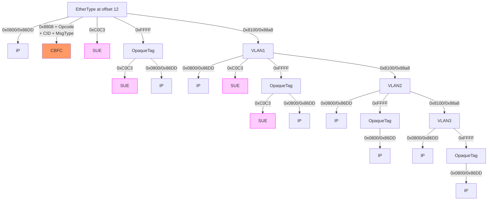
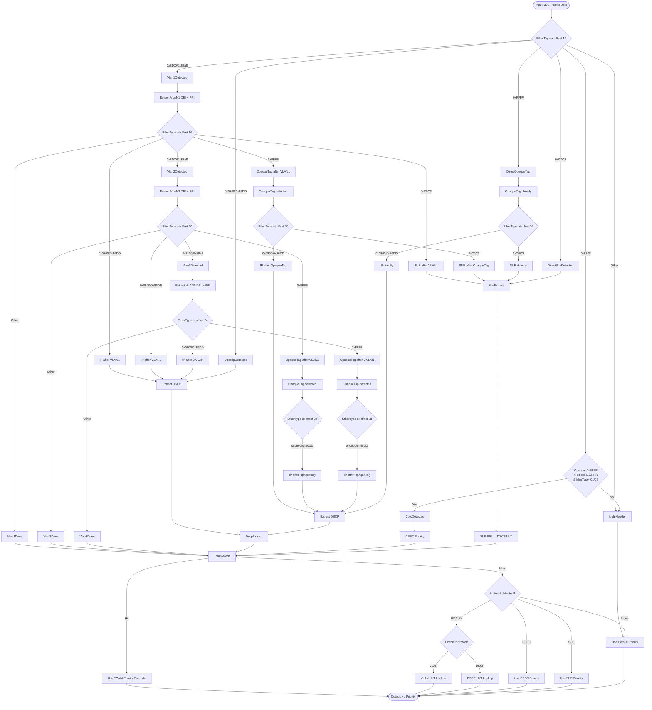
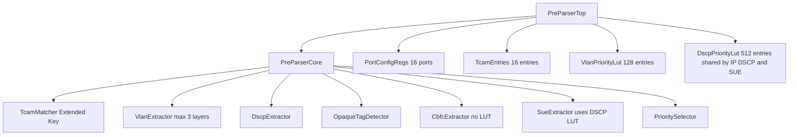

# Pre-Parser Module Design Document

## Revision History

| Version | Date | Author | Description |
|---------|------|--------|-------------|
| 1.0 | 2026-05-12 | - | Initial draft |
| 1.1 | 2026-05-13 | - | Added UEC CBFC CC Update and SUE PRI support, extended TCAM key |
| 1.2 | 2026-05-16 | - | Fixed CBFC EtherType (0xC0C1→0x8808), added configurable MACDA/MACSA/CID; fixed IPv4 DSCP bit fields; added IPv6 DSCP extraction; fixed CbfcExtractResult width; clarified trust mode fallback; documented TCAM limitation and DSCP LUT trade-off; fixed SUE bit offsets |
| 1.3 | 2026-05-16 | - | Made SUE EtherType configurable (default 0xC0C3); removed trust CBFC/SUE modes (trustMode: VLAN/DSCP only); TCAM entries use VALID/X/Y notation; field extraction uses byte-offset notation; Appendix A converted to mermaid packet diagrams; fixed SUE PRI from 5-bit to 6-bit |
| 1.4 | 2026-05-16 | - | Fixed mermaid packet diagrams: packet → packet-beta for correct rendering |

---

## 1. Feature List

### 1.1 Core Features

1. **Packet Priority Extraction**
   - Extract 4-bit priority from packet's first 32 bytes
   - Support VLAN-based priority (DEI + PRI from outermost tag)
   - Support IP-based priority (DSCP from IPv4/IPv6 header)
   - Support UEC CBFC CC Update priority (configurable per-port)
   - Support UEC SUE PRI priority (uses shared DSCP LUT, EtherType configurable, default 0xC0C3)
   - OpaqueTag does NOT provide priority - it only marks packet type; priority comes from VLAN.PRI or DSCP

2. **Port-based Trust Mode**
   - Per-port configuration for trust source selection
   - Trust VLAN mode: prioritize VLAN tag information
   - Trust DSCP mode: prioritize IP DSCP information (also applies to SUE PRI lookup)

3. **Priority Mapping Tables**
   - VLAN priority LUT: 16 ports × 16 priority levels = 128 entries
   - DSCP priority LUT: 16 ports × 64 DSCP values = 512 entries (shared by IP DSCP and SUE PRI)
   - CBFC priority: configurable per-port (no LUT)
   - OpaqueTag: no priority LUT (marks packet type only)

4. **TCAM-based Priority Override**
   - Per-port TCAM entry for DMAC/SMAC/EtherType matching
   - Extended key: DMAC(48b) + SMAC(48b) + EtherType(16b) = 112b total
   - Maskable matching for all three fields
   - TCAM hit overrides normal priority extraction

5. **Default Priority Handling**
   - Configurable default priority per port
   - Fallback when no priority source is available

---

## 2. Function Description

### 2.1 Overview

The Pre-Parser module is located before the main Parser in the packet processing pipeline. It performs fast priority extraction (4-bit) based on the first 32 bytes of the packet, enabling scheduling decisions before full packet parsing.

### 2.2 Header Parsing Tree

The module parses the following header combinations from the first 32 bytes. The parsing tree supports up to **3 VLAN layers**, up to **1 OpaqueTag**, and three protocol endpoints: **IP**, **SUE**, and **CBFC**.

**Unified Parsing Tree**:


**Protocol Endpoints**:

| Endpoint | EtherType | Max VLAN | Max OpaqueTag | Priority Source |
|----------|-----------|----------|---------------|-----------------|
| IP | 0x0800/0x86DD | 3 | 1 | DSCP via LUT |
| SUE | sueEtherType (def: 0xC0C3) | **1** | **1** | VLAN.PRI or DSCP via LUT |
| CBFC | 0x8808 (MAC Ctrl) | 0 | 0 | cbfcPri register |

**SUE Constraint**: SUE protocol supports at most **1 VLAN layer** and **1 OpaqueTag**. After 2 or more VLANs, only IP is valid (SUE paths are blocked). After OpaqueTag following 2 or 3 VLANs, only IP is valid.

**VLAN Detection Logic**:
- After parsing DMAC (6B), SMAC (6B), check EtherType at offset 12
- If EtherType = 0x8100 (802.1Q) or 0x88a8 (802.1ad), VLAN tag is present
- Each VLAN tag is 4 bytes: TPID (2B) + TCI (2B)
- After extracting a VLAN tag, check the next 2 bytes for additional VLAN tags or other EtherTypes
- Maximum 3 VLAN tags can be parsed within 32 bytes
- Priority is extracted from the **outermost** (first) VLAN tag only

**Priority Extraction from VLAN**:
```scala
// VLAN1 TCI at bytes 14–15 of packet data
// Byte 14:  PCP[2:0], DEI (bits 15–12 of TCI word)
// Byte 15:  VID[7:0]  (bits 11–4 of TCI word)
//           VID[3:0]  (bits 3–0 of TCI word)
val pcp = tci(15, 13)     // PCP (3 bits, TCI bits [15:13])
val dei = tci(12)          // DEI (1 bit,  TCI bit  [12])
val vid = tci(11, 0)      // VLAN ID (12 bits, TCI bits [11:0])
val vlanPrio = Cat(dei, pcp)  // 4-bit: {DEI, PCP[2:0]}
```

**Complete Parsing Sequence Enumeration** (13 valid sequences):

| # | Sequence | Endpoint | VLANs | OT |
|---|----------|----------|-------|----|
| 1 | Ether → IP | IP | 0 | 0 |
| 2 | Ether → OpaqueTag → IP | IP | 0 | 1 |
| 3 | Ether → VLAN1 → IP | IP | 1 | 0 |
| 4 | Ether → VLAN1 → OpaqueTag → IP | IP | 1 | 1 |
| 5 | Ether → VLAN1 → VLAN2 → IP | IP | 2 | 0 |
| 6 | Ether → VLAN1 → VLAN2 → OpaqueTag → IP | IP | 2 | 1 |
| 7 | Ether → VLAN1 → VLAN2 → VLAN3 → IP | IP | 3 | 0 |
| 8 | Ether → VLAN1 → VLAN2 → VLAN3 → OpaqueTag → IP | IP | 3 | 1 |
| 9 | Ether → SUE | SUE | 0 | 0 |
| 10 | Ether → OpaqueTag → SUE | SUE | 0 | 1 |
| 11 | Ether → VLAN1 → SUE | SUE | 1 | 0 |
| 12 | Ether → VLAN1 → OpaqueTag → SUE | SUE | 1 | 1 |
| 13 | Ether → CBFC | CBFC | 0 | 0 |

**Summary**: IP = 8 sequences, SUE = 4 sequences (≤1 VLAN), CBFC = 1 sequence. **Total: 13**.

### 2.3 Priority Extraction Flow



### 2.4 DSCP Priority Extraction

- **EtherType Detection**: Check bits[15:0] for 0x0800 (IPv4) or 0x86DD (IPv6)
- **IPv4 DSCP Extraction**: IP header starts at offset 14 bytes from packet start
  - Version: bits[7:4] at byte offset 14 (should be 4 for IPv4)
  - IHL: bits[3:0] at byte offset 14 (multiply by 4 for header length in bytes)
  - DSCP: bits[7:2] at byte offset 15 (IP header byte 1, 6 bits)
  - ECN: bits[1:0] at byte offset 15 (not used for priority)
- **IPv6 DSCP Extraction**: IP header starts at offset 14 bytes from packet start
  - Version: bits[7:4] at byte offset 14 (should be 6 for IPv6)
  - Traffic Class: bits[27:20] of the first 32-bit word (bits[3:0] at byte 14 + bits[7:0] at byte 15)
  - DSCP: Traffic Class bits [7:2] = byte 15 bits[7:2] (same bit position as IPv4 within the IP header)
  - ECN: Traffic Class bits [1:0] (not used for priority)
- **DSCP Extraction**: 6 bits from IP header (same bit positions for IPv4 and IPv6 within their respective headers)
- **LUT Key**: `{portId[3:0], dscp[5:1]}` (9 bits → 512 entries, DSCP drops 1 LSB)

### 2.5 UEC CBFC CC Update Priority Extraction

**Protocol Overview**:
- CBFC = Credit-Based Flow Control, used for congestion management in UEC
- CC_Update messages are 64B Ethernet MAC Control frames carrying 16 per-VC credit counters
- Refer to UEC Specification Section 5.2.6.2

**CC_Update Packet Format** (64B Ethernet frame):
| Packet Field | Offset (bytes) | Size | Value / Description |
|-------------|----------------|------|---------------------|
| MACDA | 0 | 6B | 01-80-C2-00-00-01 or individual address |
| MACSA | 6 | 6B | Individual address of source station |
| EtherType | 12 | 2B | **0x8808** (MAC Control) |
| Opcode | 14 | 2B | **0xFFFE** (Extension opcode) |
| CID | 16 | 3B | **FA-7A-CB** (UEC Company ID) |
| MsgType | 19 | 1B | 0x01 = CC_Update for VC[0:15], 0x02 = CC_Update for VC[16:31] |
| Data | 20 | 40B | 16 × 20-bit per-VC Credits Consumed counters |
| FCS | 60 | 4B | CRC32 |

**CBFC Detection Logic** (multi-field match within 32B window):
1. Check EtherType at offset 12: must be **0x8808**
2. Check MACDA at offset 0-5: must match **cbfcMacDa** register
3. Check MACSA at offset 6-11: must match **cbfcMacSa** register (all 1s = don't-care, skip check)
4. Check Opcode at offset 14: must be **0xFFFE**
5. Check CID at offset 16-18: must match **cbfcCid** register (default: FA-7A-CB)
6. Check MsgType at offset 19: must be **0x01** or **0x02**
7. All fields must match for CBFC identification; other 0x8808 frames (PAUSE, PFC) fall through to default

**Priority Handling**:
- CC_Update message does NOT carry a priority field in the UEC specification
- When CBFC message is detected, use **configurable per-port priority** directly (always, regardless of trust mode)
- No LUT mapping needed - priority is assigned from `cbfcPri` register

**Per-Port CBFC Priority Configuration**:
| Register | Width | Access | Description |
|----------|-------|--------|-------------|
| cbfcPri | 4 | RW | Configurable priority for CBFC CC Update packets |
| cbfcMacDa | 48 | RW | Expected MACDA for CBFC detection (default: 01-80-C2-00-00-01) |
| cbfcMacSa | 48 | RW | Expected MACSA for CBFC detection (default: don't-care / mask all) |
| cbfcCid | 24 | RW | Expected Company ID for CBFC detection (default: FA-7A-CB) |

**Note**: MACDA, MACSA, and CID are configurable at both sender and receiver as recommended by UEC specification. The MACSA field uses a mask register: when all bits of cbfcMacSa are set, MACSA matching is effectively disabled (don't-care).

### 2.6 UEC SUE PRI Priority Extraction

**Protocol Overview**:
- EtherType: **configurable** (`sueEtherType` register, default 0xC0C3)
- SUE = Stream Reservation Protocol, used for stream handling

**SUE Payload Structure**:
| Field | Bit Offset | Size (bits) |
|-------|------------|-------------|
| Ethertype | 0 | 16 |
| Version | 16 | 8 |
| Info | 24 | 7 |
| Stream-ID | 31 | 24 |
| **Priority** | **55** | **6** |
| Subtype | 61 | 8 |
| Length | 69 | 16 |
| reserved | 85 | 8 |
| TSPEC | 93 | 48 |

**Priority Handling**:
- Priority field is at bit offset 55 from SUE payload start, 6 bits wide
- 6-bit priority value uses the **shared DSCP LUT** (same as IP DSCP)
- Both SUE 6-bit PRI and IP 6-bit DSCP are handled identically
- SUE PRI and IP DSCP share the same LUT: `{portId[3:0], pri[5:1]}` (9 bits → 512 entries, LSB dropped)

### 2.7 Extended TCAM Matching

For each port, TCAM entry contains extended key fields:

**Extended TCAM Entry** (VALID/X/Y notation):

Each TCAM entry stores per-bit match state:
- **VALID**: entry enable (overall valid bit)
- **X**: don't-care mask per bit (`1` = don't-care, `0` = must match)
- **Y**: expected value per bit (relevant only when X=0)

```scala
class TcamEntry extends Bundle {
  val valid = Bool()              // VALID: entry enable
  val dmacX = UInt(48.W)          // X: don't-care mask (1=don't-care)
  val dmacY = UInt(48.W)          // Y: expected value
  val smacX = UInt(48.W)          // X: don't-care mask (1=don't-care)
  val smacY = UInt(48.W)          // Y: expected value
  val etherTypeX = UInt(16.W)     // X: don't-care mask (1=don't-care)
  val etherTypeY = UInt(16.W)     // Y: expected value
  val priority = UInt(4.W)
}
```

**Match Logic**:

Field extraction from 256-bit packet data (byte-offset notation):
```scala
// Extract fields by byte offset from packet start
val dmac      = data(47, 0)       // Bytes 0–5:  Destination MAC
val smac      = data(95, 48)      // Bytes 6–11: Source MAC
val etherType = data(111, 96)     // Bytes 12–13: EtherType / TPID

// TCAM match: each bit position (X=don't-care, Y=expected value)
val dmacMatch      = (dmac & ~entry.dmacX) === (entry.dmacY & ~entry.dmacX)
val smacMatch      = (smac & ~entry.smacX) === (entry.smacY & ~entry.smacX)
val etherTypeMatch = (etherType & ~entry.etherTypeX) === (entry.etherTypeY & ~entry.etherTypeX)

val tcam_hit = entry.valid && dmacMatch && smacMatch && etherTypeMatch
```

**Priority Override**: When `tcam_hit === true`, use `tcamEntry.priority` instead of LUT result.

**Limitation**: The TCAM EtherType field matches only the **outer EtherType** at bytes 12-13 (immediately after DMAC/SMAC). It cannot match inner EtherTypes after VLAN tags or OpaqueTag. This means TCAM can distinguish protocols like 0x8808 (CBFC), `sueEtherType` (SUE, default 0xC0C3), 0xFFFF (OpaqueTag), 0x0800/0x86DD (IP), 0x8100/0x88a8 (VLAN), but cannot differentiate based on the encapsulated protocol inside VLAN or OpaqueTag.

---

## 3. Module and Sub-Module Description

### 3.1 Module Hierarchy



### 3.2 PreParserTop

**Purpose**: Top-level module providing complete Pre-Parser functionality with all configuration registers.

**Parameters**:
| Parameter | Type | Default | Description |
|-----------|------|---------|-------------|
| portCount | Int | 16 | Number of ports |
| bytesToParse | Int | 32 | Bytes to parse from packet |
| tcamDepth | Int | 16 | TCAM depth (equals portCount) |
| maxVlanLayers | Int | 3 | Maximum VLAN layers to parse |

**IO Interface**:
```scala
// Input
val in_data = Input(UInt(256.W))    // 32 bytes packet data
val in_portId = Input(UInt(4.W))     // Port ID (0-15)
val in_valid = Input(Bool())

// Output
val out_priority = Output(UInt(4.W))
val out_valid = Output(Bool())
```

**Configuration Registers** (per port):
| Register | Width | Access | Description |
|----------|-------|--------|-------------|
| trustMode | 1 | RW | 0=VLAN, 1=DSCP |
| tcamEnable | 1 | RW | Enable TCAM override |
| defaultPri | 4 | RW | Default priority |
| cbfcPri | 4 | RW | Configurable priority for CBFC CC Update packets |

**Global Configuration Register**:
| Register | Width | Access | Description |
|----------|-------|--------|-------------|
| sueEtherType | 16 | RW | Global SUE EtherType (default: 0xC0C3) |

**Note**: OpaqueTag (0xFFFF) marks SUE packet type but does not provide priority. Priority is derived from VLAN.PRI or DSCP based on trustMode. CBFC and SUE priority are used automatically when detected (independent of trustMode).

### 3.3 PreParserCore

**Purpose**: Core processing logic for priority extraction.

**Input**: 32-byte packet data, port ID
**Output**: 4-bit priority, valid signal

**Sub-modules**:
1. **TcamMatcher**: Performs DMAC/SMAC/EtherType X/Y matching against per-port TCAM entry
2. **VlanExtractor**: Detects up to 3 VLAN tags and extracts DEI+PCP from outermost
3. **DscpExtractor**: Detects IPv4/IPv6 and extracts DSCP (6-bit)
4. **OpaqueTagDetector**: Detects OpaqueTag (0xFFFF) for SUE packet type marking
5. **CbfcExtractor**: Detects CBFC (0x8808, multi-field match: Opcode=0xFFFE + CID=FA-7A-CB + MsgType=01/02) - uses configurable cbfcPri directly (always, no trust mode required)
6. **SueExtractor**: Detects SUE (sueEtherType, default 0xC0C3) - extracts 6-bit PRI, uses shared DSCP LUT
7. **PrioritySelector**: Priority selection order: TCAM → CBFC/SUE auto-detect → trustMode (VLAN/DSCP) → default

**Note**: OpaqueTag does not provide priority - it only marks packet type (SUE). Priority is derived from VLAN.PRI or DSCP.

### 3.4 PortConfigRegs

**Purpose**: Stores per-port configuration.

**Structure**:
```scala
class PortConfig extends Bundle {
  val trustMode = UInt(1.W)    // 0=VLAN, 1=DSCP
  val tcamEnable = Bool()
  val defaultPri = UInt(4.W)
  val cbfcPri = UInt(4.W)          // Configurable priority for CBFC packets
  val cbfcMacDa = UInt(48.W)       // Expected MACDA for CBFC detection
  val cbfcMacSa = UInt(48.W)       // Expected MACSA for CBFC detection (all 1s = don't-care)
  val cbfcCid = UInt(24.W)         // Expected Company ID for CBFC detection
}
```

**Count**: 16 entries (one per port)

### 3.5 Extended TcamEntries

**Purpose**: Stores TCAM entries for DMAC/SMAC/EtherType matching.

**Structure** (VALID/X/Y notation):
```scala
class TcamEntry extends Bundle {
  val valid = Bool()              // VALID: entry enable
  val dmacX = UInt(48.W)          // X: don't-care mask (1=don't-care)
  val dmacY = UInt(48.W)          // Y: expected value
  val smacX = UInt(48.W)          // X: don't-care mask (1=don't-care)
  val smacY = UInt(48.W)          // Y: expected value
  val etherTypeX = UInt(16.W)     // X: don't-care mask (1=don't-care)
  val etherTypeY = UInt(16.W)     // Y: expected value
  val priority = UInt(4.W)
}
```

**Count**: 16 entries (one per port)

### 3.6 VlanPriorityLut

**Purpose**: Maps {portId, vlanPrio} to final priority.

**Size**: 128 entries × 4 bits
**Key Format**: `{portId[3:0], vlanPrio[3:0]}` (7 bits)
**Value Format**: 4-bit priority

### 3.7 DscpPriorityLut

**Purpose**: Maps {portId, pri} to final priority. Shared by IP DSCP and SUE PRI.

**Size**: 512 entries × 4 bits
**Key Format**:
- For IP DSCP: `{portId[3:0], dscp[5:1]}` (9 bits, drops 1 LSB to fit 512 entries)
- For SUE PRI: `{portId[3:0], suePrio[5:1]}` (9 bits, drops 1 LSB — same as IP DSCP)
**Value Format**: 4-bit priority

**Trade-off**: Both IP DSCP (6-bit) and SUE PRI (6-bit) drop 1 LSB to fit the 9-bit LUT key, reducing each from 64 to 32 distinct levels. DSCP values that differ only in the LSB (e.g., 0 and 1, 2 and 3, etc.) map to the same LUT entry and produce the same priority. Same for SUE PRI values with the same MSBs. This halves the storage overhead (2048 → 512 entries) at the cost of LSB precision per source.

---

## 4. Data Structure

### 4.1 Configuration Structures

#### PreParserConfig
```scala
case class PreParserConfig(
  portCount: Int = 16,
  bytesToParse: Int = 32,
  tcamDepth: Int = 16,
  maxVlanLayers: Int = 3
)
```

#### PortConfig
```scala
class PortConfig extends GenBundle {
  val trustMode = UInt(1.W)      // 0=VLAN, 1=DSCP
  val tcamEnable = Bool()
  val defaultPri = UInt(4.W)
  val cbfcPri = UInt(4.W)        // Configurable priority for CBFC packets
  val cbfcMacDa = UInt(48.W)     // Expected MACDA for CBFC detection
  val cbfcMacSa = UInt(48.W)     // Expected MACSA for CBFC detection (all 1s = don't-care)
  val cbfcCid = UInt(24.W)       // Expected Company ID for CBFC detection
}
```

### 4.2 Extended TCAM Structures

#### TcamEntry (VALID/X/Y notation)
```scala
class TcamEntry extends GenBundle {
  val valid = Bool()              // VALID: entry enable
  val dmacX = UInt(48.W)          // X: don't-care mask (1=don't-care)
  val dmacY = UInt(48.W)          // Y: expected value
  val smacX = UInt(48.W)          // X: don't-care mask (1=don't-care)
  val smacY = UInt(48.W)          // Y: expected value
  val etherTypeX = UInt(16.W)     // X: don't-care mask (1=don't-care)
  val etherTypeY = UInt(16.W)     // Y: expected value
  val priority = UInt(4.W)
}
```

### 4.3 IO Structures

#### PreParserInput
```scala
class PreParserInput extends GenBundle {
  val data = UInt(256.W)    // 32 bytes
  val portId = UInt(4.W)
  val valid = Bool()
}
```

#### PreParserOutput
```scala
class PreParserOutput extends GenBundle {
  val priority = UInt(4.W)
  val valid = Bool()
}
```

### 4.4 Internal Data Structures

#### VlanExtractResult
```scala
class VlanExtractResult extends Bundle {
  val vlanCount = UInt(2.W)       // Number of VLAN tags found (0-3)
  val vlanPrio = UInt(4.W)        // DEI + PRI from outermost VLAN
  val vlanVid = UInt(12.W)        // VID from outermost VLAN
  val hasOpaqueTag = Bool()
  val hasIp = Bool()
  val hasCbfc = Bool()
  val hasSue = Bool()
  val dscp = UInt(6.W)
}
```

#### OpaqueTagResult
```scala
class OpaqueTagResult extends Bundle {
  val isPresent = Bool()           // OpaqueTag detected (EtherType=0xFFFF)
  val format = UInt(4.W)           // Format/type for reference
  val length = UInt(2.W)           // 0=4B, 1=8B, 2=12B, 3=Reserved (in 4B units)
}
```

**Note**: OpaqueTag does not provide priority. It only marks the packet as SUE type. Priority comes from VLAN.PRI or DSCP.

#### CbfcExtractResult
```scala
class CbfcExtractResult extends Bundle {
  val isValid = Bool()
  val priority = UInt(4.W)        // 4-bit priority from cbfcPri register
}
```

#### SueExtractResult
```scala
class SueExtractResult extends Bundle {
  val isValid = Bool()
  val priority = UInt(6.W)        // 6-bit priority from SUE (same as IP DSCP)
}
```

#### PriorityResult
```scala
class PriorityResult extends Bundle {
  val priority = UInt(4.W)
  val source = UInt(3.W)         // 0=default, 1=tcam, 2=vlan, 3=dscp, 4=cbfc, 5=sue
  val valid = Bool()
}
```

---

## 5. Error Handling

### 5.1 Error Conditions

| Condition | Detection | Handling |
|-----------|-----------|----------|
| No recognized protocol header | EtherType not recognized | Use default priority |
| Trust mode=VLAN but packet has no VLAN tag | trustMode=0, no VLAN present | Use default priority |
| Trust mode=DSCP but no IP/SUE header | trustMode=1, no IP/SUE present | Use default priority |
| TCAM entry invalid | valid=false | Skip TCAM match |
| TCAM match fails | No X/Y match | Use priority from protocol path |
| VLAN count exceeds max (3) | vlanCount > 3 | Stop parsing, use partial result |
| OpaqueTag format invalid | format != 0x1 | Skip OpaqueTag, treat as no opaque |
| CBFC MsgType invalid | MsgType != 0x01/0x02 | Skip CBFC, treat as no cbfc |
| SUE EtherType mismatch | EtherType != sueEtherType | Skip SUE, treat as no sue |

### 5.2 Error Codes

```scala
object PreParserErrorCode extends ChiselEnum {
  val None = 0.U(4.W)
  val NoVlanNoIpNoProtocol = 1.U(4.W)    // No VLAN/IP/Protocol found, using default
  val InvalidEtherType = 2.U(4.W)
  val VlanOverflow = 3.U(4.W)              // More than 3 VLAN layers
  val InvalidOpaqueFormat = 4.U(4.W)      // OpaqueTag format not supported
  val InvalidCbfcVersion = 5.U(4.W)      // CBFC version not supported
  val InvalidSueVersion = 6.U(4.W)       // SUE version not supported
}
```

### 5.3 Error Propagation

- Error information is not typically passed out of Pre-Parser
- Error conditions result in default priority selection
- Priority result always includes valid signal indicating confidence

---

## 6. Initialization

### 6.1 Register Initialization

| Register | Reset Value | Description |
|----------|-------------|-------------|
| trustMode | 0 | Default to trust VLAN (0) |
| tcamEnable | false | TCAM disabled by default |
| defaultPri | 0 | Priority 0 as default |
| cbfcPri | 0 | CBFC priority 0 as default |
| cbfcMacDa | 0x0180C2000001 | Default MACDA for CBFC detection |
| cbfcMacSa | 0xFFFFFFFFFFFF | Don't-care (all 1s = skip MACSA check) |
| cbfcCid | 0xFA7ACB | Default UEC Company ID for CBFC detection |
| TcamEntry.valid | false | All TCAM entries invalid |

**Global Register**:
| Register | Reset Value | Description |
|----------|-------------|-------------|
| sueEtherType | 0xC0C3 | Global SUE EtherType |

### 6.2 Memory Initialization

#### VLAN Priority LUT
- Initialize with pass-through mapping: output = input priority
- May be overwritten by software with custom mappings

#### DSCP Priority LUT
- Initialize with pass-through mapping: `output = key[4:1]` (4 MSBs of the 5-bit key)
- Example: key=0b00000→output=0, key=0b00001→output=0, key=0b00010→output=1, key=0b00011→output=1, ...
- For IP DSCP: key = {portId, dscp[5:1]} drops LSB; adjacent DSCP pairs (e.g., 0/1, 2/3) map to the same output
- For SUE PRI: key = {portId, suePrio[5:1]} drops LSB (same treatment as IP DSCP)
- Both IP 6-bit DSCP and SUE 6-bit PRI share the same LUT structure
- May be overwritten by software with custom mappings

### 6.3 Configuration Sequence

1. **Power-on reset**: All registers set to default values
2. **Software initialization**:
   - Configure port trust modes (VLAN/DSCP)
   - Program TCAM entries if used
   - Program priority LUT values
   - Enable TCAM per port if needed
3. **Runtime updates**: Registers can be updated on-the-fly

### 6.4 Default Behavior

When uninitialized:
- All ports trust VLAN (trustMode=0)
- TCAM disabled
- Default priority = 0
- LUT tables contain pass-through values

---

## Appendix A: Packet Structure Diagrams

### A.1 Ethernet Header (14 bytes)

```
┌──────────────────────┬──────────────────────┬────────────────────────┐
│        DMAC          │         SMAC         │   EtherType / TPID     │
│        48b           │         48b          │         16b            │
│     Bytes 0–5        │      Bytes 6–11      │      Bytes 12–13       │
│      Bits 0–47       │      Bits 48–95      │      Bits 96–111       │
└──────────────────────┴──────────────────────┴────────────────────────┘
```

### A.2 VLAN Tag (4 bytes)

```
┌────────────────────────┬──────────┬─────┬─────────────────┐
│     TPID               │   PCP    │ DEI │      VID        │
│     16b                │   3b     │ 1b  │      12b        │
│  0x8100 or 0x88a8      │ Bits 3–1 │Bit 0│   Bits 11–0     │
│    Bits 0–15           │Bits 16–18│Bit19│   Bits 20–31    │
└────────────────────────┴──────────┴─────┴─────────────────┘
```

VLAN tag at byte offset: TPID[15:0], TCI[15:0] = {PCP[2:0], DEI, VID[11:0]}

### A.3 OpaqueTag Structure (4B or 8B)

```
┌────────────────────┬──────────────────────────────────────┐
│      Format        │         Reserved / Custom            │
│       4b           │              28b                    │
│     Bits 0–3       │            Bits 4–31                │
└────────────────────┴──────────────────────────────────────┘
```

OpaqueTag length: Format[3:0]=0x1 marks SUE type. Length field in result: 0=4B, 1=8B, 2=12B, 3=Reserved.

### A.4 IPv4 Header (20 bytes min)

```
┌──────────┬──────────┬──────────┬──────────┬──────────────────┐
│ Version  │   IHL    │   DSCP   │   ECN    │   Total Length   │
│   4b     │   4b     │   6b     │   2b     │       16b        │
│ Bits 0–3 │ Bits 4–7 │Bits 8–13 │Bits 14–15│    Bits 16–31    │
└──────────┴──────────┴──────────┴──────────┴──────────────────┘
```

IPv4 DSCP extraction: EtherType=0x0800, then byte 14 bits[7:2] = DSCP[5:0] (6-bit).

### A.5 IPv6 Header (40 bytes)

```
┌──────────┬─────────────────────┬──────────────────────┐
│ Version  │    Traffic Class    │     Flow Label       │
│   4b     │         8b          │        20b           │
│ Bits 0–3 │      Bits 4–11      │     Bits 12–31       │
└──────────┴─────────────────────┴──────────────────────┘
```

IPv6 DSCP extraction: EtherType=0x86DD, Traffic Class bits[7:2] = DSCP[5:0] (6-bit).

### A.6 CBFC CC_Update — First 20 bytes (within 32B window)

```
┌──────────────┬──────────────┬────────────────┬────────────────┬──────────────┬──────────────┐
│    MACDA     │    MACSA     │   EtherType    │     Opcode     │     CID      │   MsgType    │
│    48b       │    48b       │     16b        │      16b       │     24b      │     8b       │
│  Bytes 0–5   │  Bytes 6–11 │   Bytes 12–13  │   Bytes 14–15  │  Bytes 16–18 │   Byte 19    │
│   config     │   config    │    0x8808      │    0xFFFE      │def FA-7A-CB  │   01 or 02   │
└──────────────┴──────────────┴────────────────┴────────────────┴──────────────┴──────────────┘
```

Detection requires ALL fields match: EtherType=0x8808, Opcode=0xFFFE, CID=configurable, MsgType=0x01 or 0x02. MACDA/MACSA also checked if configured.

### A.7 SUE PRI Structure (12 bytes min)

```
┌──────────────┬──────────┬───────┬──────────────┬──────────┬──────────┬──────────┬──────────┐
│  EtherType   │ Version  │ Info  │  Stream-ID   │ Priority │ Subtype  │  Length  │ Reserved │
│    16b       │   8b     │  7b   │    24b       │   6b     │   8b     │   16b    │   8b     │
│   Bits 0–15  │Bits 16–23│24–30  │  Bits 31–54  │Bits 55–60│Bits 61–68│Bits 69–84│Bits 85–92│
│ def 0xC0C3   │          │       │              │  → DSCP  │          │          │          │
└──────────────┴──────────┴───────┴──────────────┴──────────┴──────────┴──────────┴──────────┘
```

SUE Priority: 6-bit field at bit offset 55, extracted and looked up via shared DSCP LUT (`{portId[3:0], pri[5:1]}`).

### A.8 Full 32-Byte Parse Window Layout

```
┌──────────────┬──────────────┬────────────────┬──────────────────────────────────┐
│     DMAC     │     SMAC     │ EtherType/TPID │       Additional Headers         │
│     48b      │     48b      │     16b        │              144b                │
│   Bytes 0–5  │  Bytes 6–11  │   Bytes 12–13  │           Bytes 14–31            │
│   Bits 0–47  │  Bits 48–95  │   Bits 96–111  │          Bits 112–255            │
│              │              │                │ VLAN2/3, OpaqueTag, IP/SUE/CBFC  │
└──────────────┴──────────────┴────────────────┴──────────────────────────────────┘
```

Parsing order: EtherType at bytes 12–13 determines path. Max 3 VLAN tags + 1 OpaqueTag within 32B. CBFC multi-field match checked at bytes 0–19.

---

## Appendix B: Priority Source Summary

| Source | EtherType | Priority Extraction | LUT Used |
|--------|-----------|---------------------|----------|
| VLAN | 0x8100/0x88a8 | DEI + PCP from outermost (4-bit) | VlanPriorityLut |
| IP DSCP | 0x0800/0x86DD | DSCP from header (6-bit) | DscpPriorityLut (shared) |
| OpaqueTag | 0xFFFF | No priority - marks SUE packet type only | None |
| CBFC | 0x8808 | Configurable per-port from cbfcPri (always, auto-detected) | None (register) |
| SUE | sueEtherType (def: 0xC0C3) | PRI from header (6-bit); auto-detected, always uses DSCP LUT | DscpPriorityLut (shared) |

**Note**: CBFC and SUE detection are independent of trustMode. When CBFC is detected, cbfcPri is used directly. When SUE is detected, its 6-bit PRI is always looked up via the shared DSCP LUT (`{portId[3:0], pri[5:1]}`). For non-CBFC/non-SUE packets, trustMode selects between VLAN (VlanPriorityLut) and DSCP (DscpPriorityLut). OpaqueTag only marks the packet as SUE type and does not provide priority.

---

## Appendix C: Document History

- 2026-05-12: Initial version created
- 2026-05-13: Added UEC CBFC CC Update and SUE PRI support, extended TCAM key to include EtherType
- 2026-05-16: v1.2/v1.3: Multiple fixes (CBFC EtherType, DSCP bit fields, SUE configurable, TCAM VALID/X/Y, mermaid packet diagrams, SUE 6-bit)
- 2026-05-16: v1.4: Fixed mermaid packet diagrams (packet → packet-beta)

```
┌──────────────┬──────────────┬──────────────────────┬──────────────────────┐
│   源端口     │   目的端口   │       序列号         │       确认号         │
│    16b       │    16b       │        32b           │        32b           │
│  Bits 0–15   │ Bits 16–31   │     Bits 32–63       │     Bits 64–95       │
└──────────────┴──────────────┴──────────────────────┴──────────────────────┘
┌──────────┬──────────┬─────────────────────────────────┬──────────────┐
│数据偏移  │   保留   │          Flags                  │    窗口      │
│   4b     │   6b     │ URG ACK PSH RST SYN FIN (6×1b)  │     16b      │
│Bits 96–99│Bits100–105│ Bits 106–111                   │ Bits 112–127 │
└──────────┴──────────┴─────────────────────────────────┴──────────────┘
┌──────────────┬──────────────┬──────────────────────┬──────────────────┐
│   校验和     │  紧急指针    │   选项和填充          │  数据(可变长度)  │
│    16b       │    16b       │       32b            │      64b+        │
│ Bits 128–143 │Bits 144–159  │   Bits 160–191       │   Bits 192–255+  │
└──────────────┴──────────────┴──────────────────────┴──────────────────┘
```

