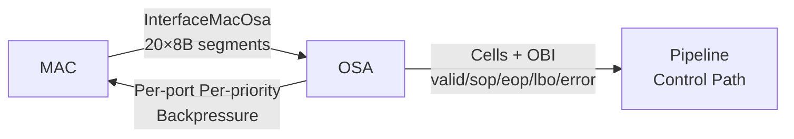
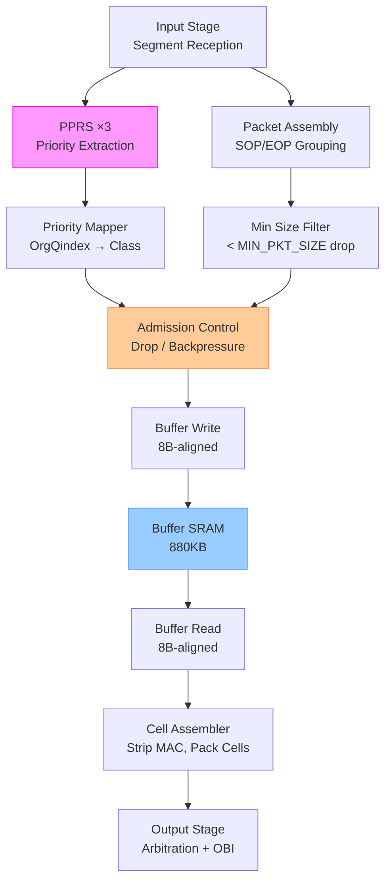
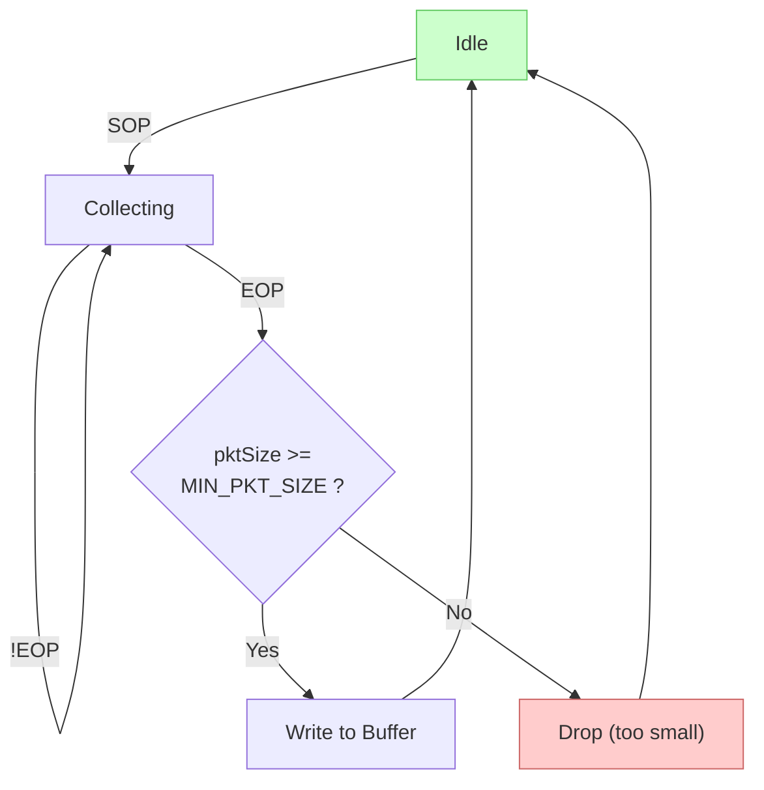
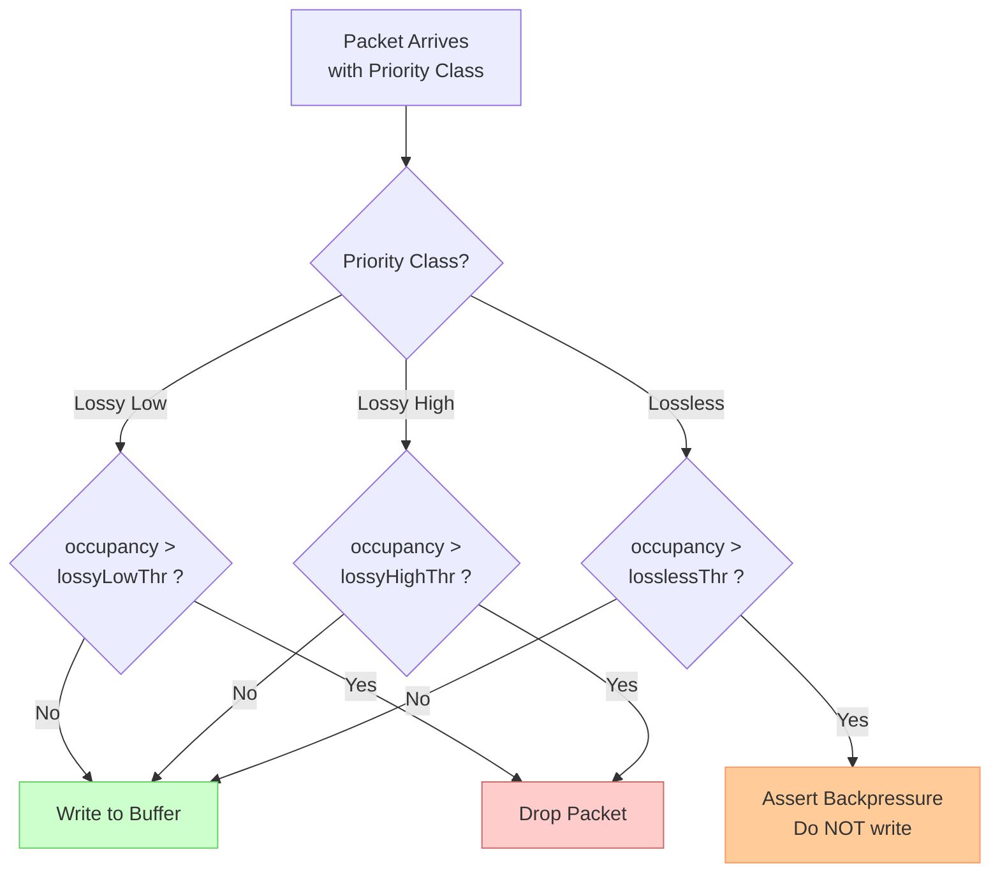
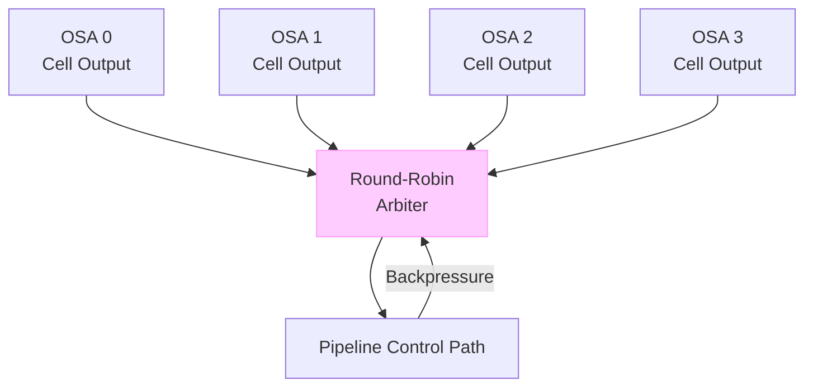
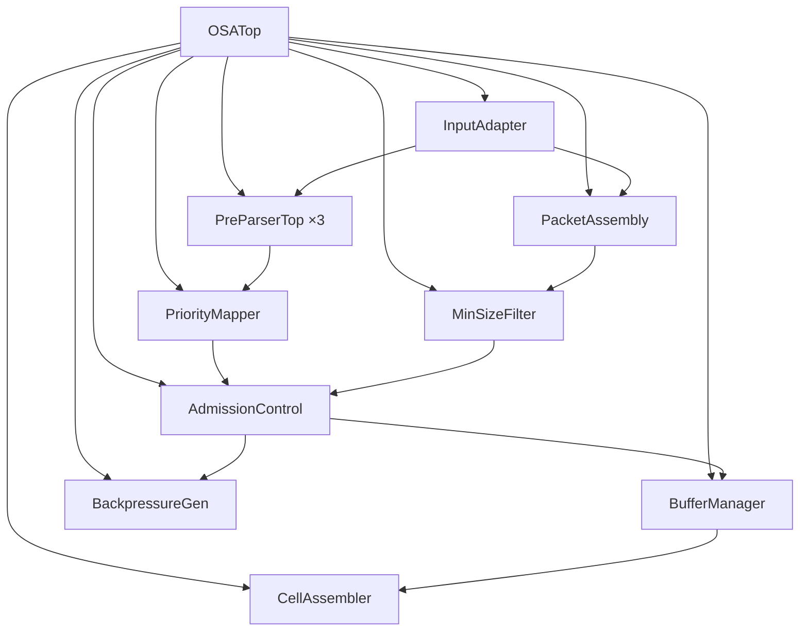
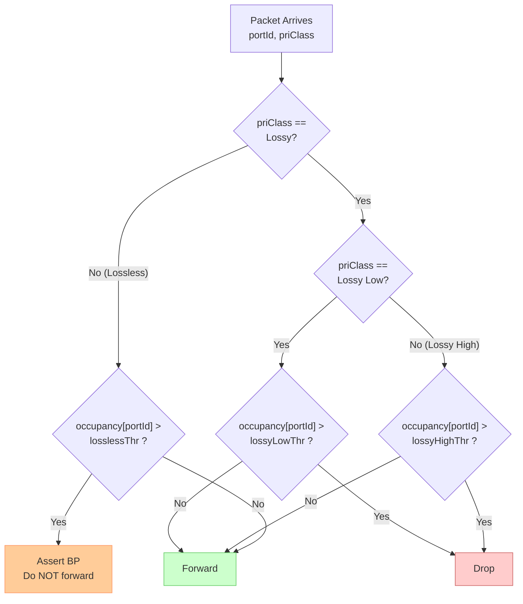
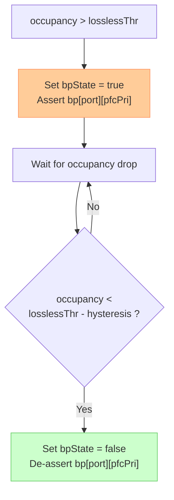
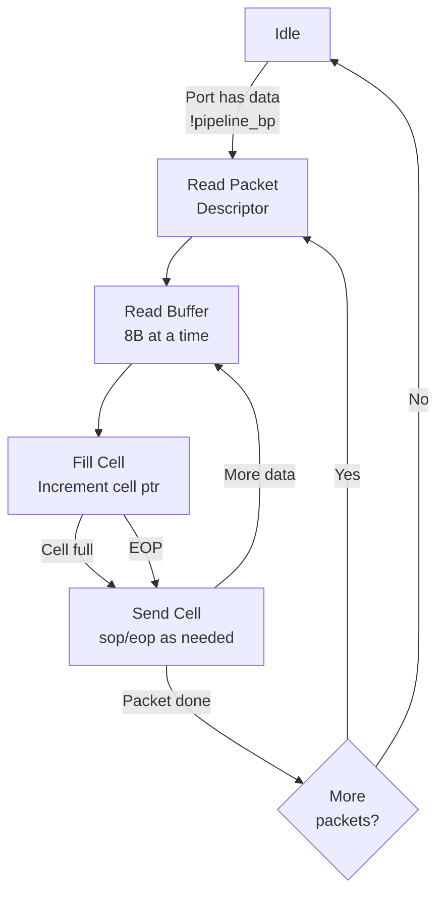
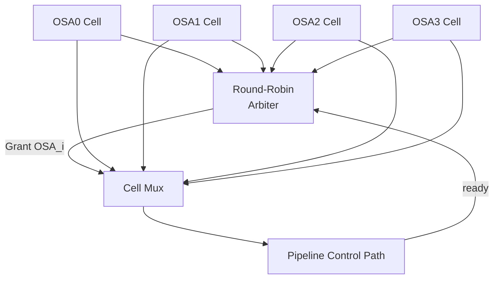

# Over Subscription Buffer (OSA) Design Document

## Revision History

| Version | Date | Author | Description |
|---------|------|--------|-------------|
| 1.0 | 2026-05-16 | - | Initial draft |
| 1.1 | 2026-05-16 | - | Fixed mermaid packet diagrams (packet → packet-beta); rewritten buffer capacity calculation with XOFF/XON/MTU analysis, previous-chip delay (614ns), and MAC delay (170ns) |

---

## 1. Feature List

### 1.1 Core Features

1. **Multi-Port Packet Input**
   - Receives packet segments from MAC via `InterfaceMacOsa`
   - 20 segments × 8B = 160B per cycle at 1.6 Tbps
   - Up to 3 new packets per cycle (SOP detection)
   - Support 200G / 400G / 800G / 1.6T port speeds

2. **Built-in PPRS Priority Extraction**
   - PreParser instantiated as internal sub-block
   - 3 parallel PreParser instances for multi-packet per cycle
   - Extracts 4-bit OrgQindex from first 32B per packet

3. **Configurable Priority Class Mapping**
   - 16-entry LUT maps OrgQindex[3:0] → 2-bit priority class
   - 4 priority classes: Lossy Low, Lossy High, Lossless Low, Lossless High
   - Each class maps to a configurable PFC priority level (0–7)

4. **Packet Assembly and Filtering**
   - SOP/EOP-based segment grouping into packets
   - 8B MAC header extraction (4B timestamp + 4B reserved)
   - Minimum packet size filtering (configurable `minPktSize`, default 64B)

5. **Shared Buffer with Per-Port Management**
   - Total capacity: 880 KB (absorbs 70m fiber at 1.6 Tbps)
   - 8B resolution write/read
   - Per-port occupancy tracking and threshold management

6. **Admission Control**
   - Per-port configurable thresholds: lossy low, lossy high, lossless
   - Drop lossy packets when occupancy exceeds corresponding threshold
   - Assert backpressure when lossless threshold exceeded

7. **Backpressure Generation**
   - Per-port, per-priority (8 PFC priorities) backpressure signals to MAC
   - MAC encapsulates PFC frames based on OSA backpressure
   - Configurable mapping from OSA 4-class to PFC 8-priority

8. **Cell Assembly and Output**
   - Configurable cell size: 192B–256B (parameter `cellSize`)
   - MAC header stripped from cell payload, sent as out-of-band info
   - Output interface: data + valid/sop/eop/lbo/error + out-of-band info

9. **Multi-OSA Output Arbitration**
   - 2–4 OSA instances share one pipeline control path
   - Round-robin arbitration for SOP cell transmission
   - Backpressure from pipeline propagates to OSA read path

---

## 2. Function Description

### 2.1 Overview

The OSA module sits between the MAC layer and the pipeline control path in a 1.6 Tbps packet processing system. It receives raw packet segments via `InterfaceMacOsa`, extracts packet priority using the built-in PPRS (PreParser) sub-block, buffers packets in a shared 880 KB SRAM, applies admission control based on priority and occupancy, and outputs cell-sized data units to the downstream pipeline.



### 2.2 Internal Pipeline Overview



### 2.3 Input Processing

The MAC interface delivers 20 segments per cycle, each segment being 8B (64-bit) with its own control signals:

```scala
class InterfaceMacOsa extends Bundle {
  val data  = Vec(20, UInt(8.W))   // 20 segments × 8B
  val valid = Vec(20, Bool())      // segment valid
  val sop   = Vec(20, Bool())      // start of packet
  val eop   = Vec(20, Bool())      // end of packet
  val err   = Vec(20, Bool())      // error flag (valid with EOP)
}
```

**Input processing steps per cycle**:

1. Scan all 20 segments for SOP assertions — up to 3 SOPs per cycle
2. For each SOP, record the segment index and start packet assembly
3. Route the first 32B (4 segments) of each new packet to the corresponding PPRS instance
4. Track in-flight packets across cycles until EOP
5. When EOP arrives with `err = true`, mark the packet as errored

**Segment-to-packet mapping**: The input adapter maintains a packet context table for up to 3 concurrent in-flight packets per port, tracking:
- Packet ID (assigned at SOP)
- Byte count (accumulated from SOP to EOP)
- Error flag (latched from EOP segment)
- MAC header (captured from first 8B)

### 2.4 PPRS Integration

The PreParser is instantiated as an internal sub-block. Since up to 3 packets may start in a single cycle, **3 parallel PreParser instances** are instantiated.

```scala
// PPRS instantiation (×3)
val pprs = Seq.fill(3)(Module(new PreParserTop(config)))

for (i <- 0 until 3) {
  pprs(i).io.in_data   := first32B(i)   // first 32B of new packet i
  pprs(i).io.in_portId := sopPortId(i)  // port ID from SOP segment
  pprs(i).io.in_valid  := sopDetected(i) // SOP detected for slot i
}
```

**Timing**: The PreParser has a fixed pipeline latency. The OSA input adapter aligns the packet data with the priority output:
- SOP cycle: capture first 32B, dispatch to PPRS
- PPRS latency (N cycles): packet assembly continues
- Priority valid cycle: OrgQindex delivered, written to packet descriptor

**Configuration sharing**: All PreParser instances share the same configuration registers (LUTs, TCAM entries, port configs) loaded via the OSA CSR interface.

### 2.5 Priority Mapping

The 4-bit OrgQindex from PPRS is mapped to a 2-bit priority class via a configurable LUT.

**Priority classes**:

| Class | Encoding | Description | Default PFC Priority |
|-------|----------|-------------|---------------------|
| Lossy Low | 0b00 | Best-effort, dropped first | 0 |
| Lossy High | 0b01 | Premium best-effort | 1 |
| Lossless Low | 0b10 | Low-priority lossless | 4 |
| Lossless High | 0b11 | High-priority lossless | 7 |

**OrgQindex LUT**:

```scala
class OrgQindexLut extends Bundle {
  val mapping = Vec(16, UInt(2.W))  // 16 entries × 2-bit class
  // Default: linear mapping
  // OrgQindex[3:2] → lossy/lossless, OrgQindex[1:0] → high/low
}
```

**PFC priority mapping**: Each of the 4 OSA priority classes maps to a configurable PFC priority (0–7):

```scala
class PfcPriMap extends Bundle {
  val lossyLowPfcp    = UInt(3.W)  // default: 0
  val lossyHighPfcp   = UInt(3.W)  // default: 1
  val losslessLowPfcp  = UInt(3.W)  // default: 4
  val losslessHighPfcp = UInt(3.W)  // default: 7
}
```

### 2.6 Packet Assembly

Packet assembly groups segments across cycles using SOP/EOP markers.



**MAC header handling**:
- First 8B of each packet = MAC header (4B timestamp + 4B reserved)
- MAC header is counted in packet size for min-size check
- MAC header is stored in buffer but **not** included in cell payload
- MAC header is extracted and sent as out-of-band info (OBI) with cells

**Concurrent packet tracking**: The input adapter tracks up to 3 in-flight packets per port using a content-addressable slot allocator. With 8 ports and up to 3 packets each, the per-port maximum in-flight context is 3. The worst case across all ports is 8 × 3 = 24 in-flight packets, but realistically constrained by buffer occupancy.

### 2.7 Buffer Write Path

Packets are written to the shared buffer in 8B-aligned segments.

**Write data format**:
- Each write entry: 64-bit data + EOP flag + byte-enable for last segment
- Byte enable handles non-8B-aligned packet tails
- Packet descriptor (metadata) stored separately in a descriptor FIFO

**Write addressing**:
- Buffer managed as a pool of 8B slots (110K entries for 880 KB)
- Per-port free list using bitmap allocator (reuse `Bitmap` from BaseCbb)
- Write address allocated at SOP, incremented per 8B segment

### 2.8 Admission Control

Admission control compares per-port buffer occupancy against configurable thresholds to decide: forward, drop, or backpressure.



**Threshold relationship**: `lossyLowThr < lossyHighThr < losslessThr`

- **Drop counter**: Per-port per-priority drop counters for statistics
- **Backpressure hysteresis**: Backpressure de-asserts when occupancy falls below `losslessThr − hysteresis`

### 2.9 Buffer Read Path

Buffer read is triggered when:
1. Cell assembler needs data to fill a cell
2. Downstream pipeline has no backpressure

**Read addressing**:
- Per-port read pointer tracks next 8B segment to read
- Reads proceed in packet order (FIFO per port)
- EOP flag in buffer entry indicates end of packet

**Read scheduling**: Round-robin across ports with pending data. Each port's read is gated by:
- Buffer not empty for that port
- Cell assembler ready to accept data
- No backpressure from pipeline control path

### 2.10 Cell Assembly

Packets are packed into fixed-size cells (configurable `cellSize`: 192B–256B). MAC headers are stripped and sent out-of-band.

**Cell structure**:

| Field | Size | Description |
|-------|------|-------------|
| Cell data | `cellSize` bytes | Pure packet payload (no MAC header) |
| SOP | 1 bit | First cell of a packet |
| EOP | 1 bit | Last cell of a packet |
| LBO | 1 bit | Last buffer output (last cell of last packet in buffer) |
| Error | 1 bit | Packet error flag |
| OBI | sideband | Out-of-band information |

**Cell packing rules**:
- A cell always starts at a packet boundary (SOP cell = start of new packet)
- If packet data < cell size, the cell is padded (byte enable per segment)
- If packet data > cell size, remaining data fills subsequent cells
- EOP marks the last cell containing data from this packet
- LBO indicates this is the last cell the OSA will send (buffer drained)

### 2.11 Multi-OSA Output Arbitration

When 2–4 OSA instances share one pipeline control path:



**Arbitration rules**:
- Round-robin across OSA instances with pending SOP cells
- Once an OSA wins arbitration and starts sending a packet, it continues until EOP
- Non-SOP cells follow the same OSA without re-arbitration
- Pipeline backpressure blocks all OSA outputs

### 2.12 Backpressure Generation

OSA generates per-port per-priority backpressure to MAC.

```scala
class BackpressureOutput extends Bundle {
  // 8 ports × 8 PFC priorities
  val bp = Vec(8, Vec(8, Bool()))
  // bp(port)(pfcPri) = true → MAC should send PFC pause for this port/priority
}
```

**Backpressure logic**:
- When per-port occupancy > `losslessThr`, assert BP for lossless priorities mapped to their PFC priority
- When occupancy > `lossyHighThr`, optionally assert BP for lossy-high PFC priority (configurable)
- BP de-asserts when occupancy < `threshold − hysteresis`
- Per-port per-priority BP mask register allows disabling BP per class

---

## 3. Module Hierarchy and Interfaces

### 3.1 OSATop — Top-Level Wrapper

```scala
class OSATop(config: OSAConfig) extends GenModule {
  val io = IO(new Bundle {
    // MAC interface (input)
    val mac = Flipped(new InterfaceMacOsa)

    // Backpressure to MAC (output)
    val macBp = Output(new BackpressureOutput)

    // Cell output to pipeline
    val cellOut = Decoupled(new CellOutputBundle(config))

    // CSR interface
    val csr = new OSAIO(config)
  })
}
```

### 3.2 Sub-Module Hierarchy



### 3.3 InputAdapter

Receives `InterfaceMacOsa` and produces internal packet stream with SOP/EOP alignment.

```scala
class InputAdapter(config: OSAConfig) extends GenModule {
  val io = IO(new Bundle {
    val mac = Flipped(new InterfaceMacOsa)

    // Output: up to 3 new packet headers per cycle
    val newPkt = Vec(3, new NewPacketDesc)
    val newPktValid = Vec(3, Bool())

    // Output: data stream aligned to packet boundaries
    val dataOut = Decoupled(new DataSegment)
  })
}

class NewPacketDesc extends GenBundle {
  val portId = UInt(3.W)
  val first32B = UInt(256.W)
  val slotId = UInt(2.W)  // which of 3 PPRS slots
}

class DataSegment extends GenBundle {
  val data = UInt(64.W)        // 8B segment
  val byteEn = UInt(8.W)       // byte enable
  val portId = UInt(3.W)
  val pktId = UInt(8.W)
  val isSOP = Bool()
  val isEOP = Bool()
  val err = Bool()
}
```

### 3.4 PacketAssembly

Groups segments into packets, accumulates size, extracts MAC header.

```scala
class PacketAssembly(config: OSAConfig) extends GenModule {
  val io = IO(new Bundle {
    val segIn = Flipped(Decoupled(new DataSegment))
    val pktOut = Decoupled(new PacketDesc)
  })
}

class PacketDesc extends GenBundle {
  val portId = UInt(3.W)
  val pktId = UInt(8.W)
  val macHeader = UInt(64.W)   // 4B timestamp + 4B reserved
  val byteCount = UInt(16.W)   // total packet size including MAC header
  val orgQindex = UInt(4.W)    // from PPRS
  val priClass = UInt(2.W)     // priority class after mapping
  val err = Bool()
}
```

### 3.5 PriorityMapper

Maps OrgQindex through configurable LUT to priority class.

```scala
class PriorityMapper(config: OSAConfig) extends GenModule {
  val io = IO(new Bundle {
    val orgQindex = Input(UInt(4.W))
    val priClass = Output(UInt(2.W))
    val lutWrAddr = Input(UInt(4.W))
    val lutWrData = Input(UInt(2.W))
    val lutWrEn = Input(Bool())
  })
}
```

### 3.6 BufferManager

Manages shared buffer SRAM with per-port occupancy tracking.

```scala
class BufferManager(config: OSAConfig) extends GenModule {
  val io = IO(new Bundle {
    // Write port
    val wrReq = Flipped(Decoupled(new BufWriteReq))
    // Read port
    val rdReq = Flipped(Decoupled(new BufReadReq))
    val rdData = Output(Valid(new BufReadData))

    // SRAM interface (TpMemoryPort)
    val mem = new TpMemoryPort(config.bufAddrWidth, 64)

    // Per-port occupancy
    val occupancy = Output(Vec(config.portCount, UInt(config.bufAddrWidth.W)))

    // Threshold configuration
    val thresholds = Input(Vec(config.portCount, new PortThresholds))
  })
}

class BufWriteReq extends GenBundle {
  val portId = UInt(3.W)
  val data = UInt(64.W)
  val byteEn = UInt(8.W)
  val isSOP = Bool()
  val isEOP = Bool()
  val pktId = UInt(8.W)
}

class BufReadReq extends GenBundle {
  val portId = UInt(3.W)
}

class BufReadData extends GenBundle {
  val data = UInt(64.W)
  val byteEn = UInt(8.W)
  val isSOP = Bool()
  val isEOP = Bool()
  val pktId = UInt(8.W)
}
```

### 3.7 AdmissionControl

Compares occupancy against per-port thresholds.

```scala
class AdmissionControl(config: OSAConfig) extends GenModule {
  val io = IO(new Bundle {
    val pktDesc = Input(Valid(new PacketDesc))
    val occupancy = Input(Vec(config.portCount, UInt(config.bufAddrWidth.W)))
    val thresholds = Input(Vec(config.portCount, new PortThresholds))

    val forward = Output(Bool())
    val drop = Output(Bool())
    val backpressure = Output(Bool())
  })
}

class PortThresholds extends GenBundle {
  val lossyLow = UInt(16.W)
  val lossyHigh = UInt(16.W)
  val lossless = UInt(16.W)
  val hysteresis = UInt(16.W)
}
```

### 3.8 CellAssembler

Reads from buffer and assembles cells.

```scala
class CellAssembler(config: OSAConfig) extends GenModule {
  val io = IO(new Bundle {
    // Buffer read interface
    val bufRdReq = Decoupled(new BufReadReq)
    val bufRdData = Flipped(Valid(new BufReadData))

    // Cell output
    val cellOut = Decoupled(new CellOutputBundle(config))

    // Packet descriptor for OBI
    val pktDesc = Flipped(Valid(new PacketDesc))
  })
}
```

### 3.9 BackpressureGenerator

Generates per-port per-priority backpressure signals.

```scala
class BackpressureGenerator(config: OSAConfig) extends GenModule {
  val io = IO(new Bundle {
    val occupancy = Input(Vec(config.portCount, UInt(config.bufAddrWidth.W)))
    val thresholds = Input(Vec(config.portCount, new PortThresholds))
    val pfcPriMap = Input(new PfcPriMap)
    val bpMask = Input(Vec(config.portCount, Vec(8, Bool())))

    val macBp = Output(new BackpressureOutput)
  })
}
```

---

## 4. Data Structures

### 4.1 InterfaceMacOsa — MAC Input Interface

```scala
class InterfaceMacOsa extends Bundle {
  val data  = Vec(20, UInt(8.W))   // 20 segments × 8B each
  val valid = Vec(20, Bool())      // segment valid
  val sop   = Vec(20, Bool())      // start of packet marker
  val eop   = Vec(20, Bool())      // end of packet marker
  val err   = Vec(20, Bool())      // error flag (valid with EOP)
}
```

**Timing constraints**:
- SOP and EOP are mutually exclusive in a segment unless the packet fits in one 8B segment
- `err` is only valid when `eop = true`
- Up to 3 SOPs may be asserted in a single cycle
- Minimum packet size: 64B (8 segments) including 8B MAC header

### 4.2 PacketDesc — Internal Packet Descriptor

```scala
class PacketDesc extends GenBundle {
  val portId = UInt(3.W)       // source port (0–7)
  val pktId = UInt(8.W)        // packet sequence ID within port
  val macHeader = UInt(64.W)   // 8B MAC header (4B TS + 4B reserved)
  val byteCount = UInt(16.W)   // total bytes including MAC header
  val orgQindex = UInt(4.W)    // 4-bit priority from PPRS
  val priClass = UInt(2.W)     // 2-bit priority class after mapping
  val err = Bool()             // packet error flag
}
```

### 4.3 OrgQindexLut — Priority Mapping Table

```scala
class OrgQindexLut extends GenBundle {
  val mapping = Vec(16, UInt(2.W))
  // Default mapping:
  //   0→0 (lossy low),   1→1 (lossy high)
  //   2→1 (lossy high),  3→1 (lossy high)
  //   4→2 (lossless low), 5→2 (lossless low)
  //   6→3 (lossless high),7→3 (lossless high)
  //   8→0, 9→1, 10→2, 11→3
  //   12→0, 13→1, 14→2, 15→3
}
```

### 4.4 CellOutputBundle — Cell Output Interface

```scala
class CellOutputBundle(config: OSAConfig) extends GenBundle {
  val data = UInt(64.W)          // 8B cell data segment
  val byteEn = UInt(8.W)         // byte enable for last segment
  val sop = Bool()               // SOP cell (first cell of packet)
  val eop = Bool()               // EOP cell (last cell of packet)
  val lbo = Bool()               // last buffer output (OSA drain complete)
  val error = Bool()             // packet error
  val obi = new OutOfBandInfo    // out-of-band information
}

class OutOfBandInfo extends GenBundle {
  val macHeader = UInt(64.W)     // 8B MAC header
  val portId = UInt(3.W)         // source port
  val pktId = UInt(8.W)          // packet ID
  val orgQindex = UInt(4.W)      // original PPRS priority
  val priClass = UInt(2.W)       // priority class
  val byteCount = UInt(16.W)     // packet size
  val timestamp = UInt(32.W)     // arrival timestamp (from MAC header)
}
```

### 4.5 BackpressureOutput — Backpressure Interface

```scala
class BackpressureOutput extends GenBundle {
  // 8 ports × 8 PFC priorities
  val bp = Vec(8, Vec(8, Bool()))
  // bp(port)(pfcPri) asserted → MAC generates PFC pause for port/priority
}

class PfcPriMap extends GenBundle {
  val lossyLowPfcp    = UInt(3.W)  // PFC priority for lossy low
  val lossyHighPfcp   = UInt(3.W)  // PFC priority for lossy high
  val losslessLowPfcp  = UInt(3.W)  // PFC priority for lossless low
  val losslessHighPfcp = UInt(3.W)  // PFC priority for lossless high
}
```

### 4.6 Buffer Entry Format

Each buffer entry stores one 8B segment:

```scala
class BufEntry extends GenBundle {
  val data = UInt(64.W)       // 8B packet data
  val byteEn = UInt(8.W)      // byte enable (for last segment)
  val isSOP = Bool()          // start of packet
  val isEOP = Bool()          // end of packet
  val pktId = UInt(8.W)       // packet ID (for descriptor lookup)
}
```

---

## 5. Configuration and Parameters

### 5.1 Module Parameters

| Parameter | Type | Default | Description |
|-----------|------|---------|-------------|
| portCount | Int | 8 | Number of network ports (max 8) |
| segmentsPerCycle | Int | 20 | Input segments per cycle |
| bytesPerSegment | Int | 8 | Bytes per segment |
| pprsLatency | Int | 4 | PreParser pipeline latency |
| maxPktPerCycle | Int | 3 | Max new packets per cycle |
| bufferSizeKB | Int | 880 | Buffer capacity in KB |
| bufferSizeEntries | Int | 112640 | Buffer entries (bufferSizeKB × 1024 / 8) |
| bufAddrWidth | Int | 17 | Buffer address width (ceil(log2(112640))) |
| cellSize | Int | 256 | Cell size in bytes (192–256) |
| cellSegments | Int | 32 | Segments per cell (cellSize / 8) |
| macHeaderSize | Int | 8 | MAC header size in bytes |
| minPktSize | Int | 64 | Minimum packet size (including MAC header) |
| maxPfcPriority | Int | 8 | PFC priority levels |
| osaCount | Int | 2 | Number of OSA instances sharing pipeline |

### 5.2 Per-Port Configuration Registers

| Register | Width | Access | Description |
|----------|-------|--------|-------------|
| portEnable | 1 | RW | Port enable |
| lossyLowThr | 16 | RW | Lossy low drop threshold (in 8B units) |
| lossyHighThr | 16 | RW | Lossy high drop threshold (in 8B units) |
| losslessThr | 16 | RW | Lossless backpressure threshold (in 8B units) |
| hysteresis | 16 | RW | Backpressure de-assert hysteresis |
| bpMask | 8 | RW | Per-PFC-priority backpressure mask (1=enable BP for this priority) |

### 5.3 Global Configuration Registers

| Register | Width | Access | Description |
|----------|-------|--------|-------------|
| minPktSize | 16 | RW | Minimum packet size (default: 64) |
| cellSize | 16 | RW | Cell size in bytes (default: 256, range: 192–256) |
| pfcPriMap | 12 | RW | Priority class → PFC priority mapping (4 × 3-bit) |
| dropCntClr | 1 | WO | Clear all drop counters |

### 5.4 Status Registers (Read-Only)

| Register | Width | Access | Description |
|----------|-------|--------|-------------|
| portOccupancy[0..7] | 17 | RO | Per-port buffer occupancy (8B units) |
| portDropCnt[0..7] | 32 | RO | Per-port drop counter |

---

## 6. Buffer Architecture

### 6.1 Memory Organization

The 880 KB buffer is implemented as a shared SRAM with per-port logical partitioning.

```
Buffer Address Space: 0x00000 – 0x1B7FF (112,640 entries × 8B = 880 KB)

Port 0 region: configurable start / size
Port 1 region: configurable start / size
...
Port 7 region: configurable start / size
```

**SRAM parameters**:

| Parameter | Value |
|-----------|-------|
| Data width | 64-bit (8B) |
| Address width | 17-bit (131,072 entries) |
| Total capacity | 880 KB (112,640 usable entries) |
| Read latency | 1 cycle |
| Write latency | 1 cycle |
| Memory port | Dual-port (TpMemoryPort): 1 write + 1 read |

### 6.2 SRAM Interface

Reuses `TpMemoryPort` from `BaseCbb/memory/Memory.scala`:

```scala
class TpMemoryPort(addrWidth: Int, dataWidth: Int) extends Bundle {
  val we = Output(Bool())
  val re = Output(Bool())
  val waddr = Output(UInt(addrWidth.W))
  val raddr = Output(UInt(addrWidth.W))
  val wdata = Output(UInt(dataWidth.W))
  val rdata = Input(UInt(dataWidth.W))
}
```

**BufferManager SRAM access arbitration**:
- Write has priority over read when both request same cycle
- Read request queued in a single-entry skid buffer to avoid data loss
- Write throughput: 1 entry/cycle (8B/cycle)
- Read throughput: 1 entry/cycle (8B/cycle)
- Combined throughput: 2 entries/cycle with dual-port SRAM

### 6.3 Per-Port Occupancy Tracking

Each port maintains:
- **Write pointer**: next free address in port's region (wrapped within region)
- **Read pointer**: next address to read (wrapped within region)
- **Occupancy counter**: `wrPtr − rdPtr` (mod region size)
- **Drop counter**: incremented per dropped packet

```scala
class PortOccupancy extends GenBundle {
  val wrPtr = UInt(17.W)
  val rdPtr = UInt(17.W)
  val occupancy = UInt(17.W)   // = wrPtr - rdPtr
  val dropCnt = UInt(32.W)     // wrap-around counter
  val bpState = Bool()         // current backpressure state
}
```

**Occupancy update rules**:
- Write: `occupancy += 1` per 8B segment written
- Read: `occupancy -= 1` per 8B segment read
- Drop: no occupancy change (packet not written)

### 6.4 Threshold Configuration

**Threshold constraints**:

```
0 ≤ lossyLowThr < lossyHighThr < losslessThr ≤ portRegionSize
```

**Default values** (in 8B units):

| Port Speed | lossyLowThr | lossyHighThr | losslessThr | hysteresis |
|------------|-------------|--------------|-------------|------------|
| 200G | 1024 | 2048 | 3072 | 128 |
| 400G | 2048 | 4096 | 6144 | 256 |
| 800G | 4096 | 8192 | 12288 | 512 |
| 1.6T | 8192 | 14080 | 14080 | 1024 |

> Note: Default values scale with port speed. Per-port region size determines absolute maximum thresholds.

---

## 7. Admission Control

### 7.1 Priority Classification

Packets are classified into 4 priority classes by the PriorityMapper LUT:

```
OrgQindex[3:0]  →  LUT[16]  →  priClass[1:0]

priClass:
  0 (0b00): Lossy Low   — drop at lossyLowThr
  1 (0b01): Lossy High  — drop at lossyHighThr
  2 (0b10): Lossless Low  — bp at losslessThr
  3 (0b11): Lossless High — bp at losslessThr
```

Both lossless classes use the same `losslessThr` for backpressure assertion. The distinction between low and high lossless is used by the pipeline control path for scheduling.

### 7.2 Drop Decision Flow



### 7.3 Backpressure Trigger Flow



**Backpressure assertions** (per port, per PFC priority):

| Condition | BP Signal Asserted |
|-----------|-------------------|
| `occupancy > losslessThr` | `bp[port][pfcPriLosslessLow]` and `bp[port][pfcPriLosslessHigh]` |
| `occupancy > lossyHighThr` (optional) | `bp[port][pfcPriLossyHigh]` if `bpMask` allows |
| `occupancy > lossyLowThr` (optional) | `bp[port][pfcPriLossyLow]` if `bpMask` allows |

### 7.4 PFC Integration with MAC

OSA does **not** generate PFC frames directly. Instead:
1. OSA asserts per-port per-priority BP signals
2. MAC monitors these BP signals
3. MAC generates and transmits standard 802.1Qbb PFC pause frames
4. MAC manages PFC timers (pause quanta) independently

---

## 8. Cell Assembly and Output

### 8.1 Cell Format

Cells are fixed-size data units (192B–256B) sent to the pipeline control path.

```
┌──────────────┬──────────────┬─────┬──────────────────────────────────┐
│  Segment 0   │  Segment 1   │ ... │          Segment 31              │
│     8B       │     8B       │     │             8B                   │
│  Bits 0–63   │ Bits 64–127  │     │       Bits 1984–2047             │
└──────────────┴──────────────┴─────┴──────────────────────────────────┘
  Cell size = cellSize (192B–256B, configurable). Total cellSegments = cellSize / 8.
```

**Control signals per cell segment**:

| Signal | Width | Description |
|--------|-------|-------------|
| valid | 1 | Segment valid |
| sop | 1 | First segment of a cell (also first cell of a packet) |
| eop | 1 | Last segment of a cell (also last cell of a packet) |
| lbo | 1 | Last buffer output (last cell OSA will ever send) |
| error | 1 | Packet contains error |

### 8.2 Out-of-Band Information

OBI accompanies the SOP segment of each packet's first cell:

```scala
class OutOfBandInfo extends GenBundle {
  val macHeader = UInt(64.W)     // 8B MAC header from original packet
  val portId = UInt(3.W)         // source port
  val pktId = UInt(8.W)          // packet sequence ID
  val orgQindex = UInt(4.W)      // original PPRS priority
  val priClass = UInt(2.W)       // mapped priority class
  val byteCount = UInt(16.W)     // total packet size (including MAC header)
  val timestamp = UInt(32.W)     // 4B timestamp from MAC header
}
```

**OBI timing**: OBI is valid on the same cycle as the SOP cell segment. Subsequent cells of the same packet carry the same OBI reference via implicit packet context.

### 8.3 Cell Assembly State Machine



**Cell packing details**:
- MAC header (8B) is **not** included in cell payload
- First cell after a gap always has SOP asserted
- When packet ends mid-cell, remaining bytes in cell are padded (byte-enable = 0)
- EOP asserted on the last cell segment containing packet data

### 8.4 Multi-OSA Output Arbitration



**Arbitration protocol**:
1. Each OSA asserts `cellOut.valid` when it has a SOP cell ready
2. Round-robin arbiter selects one OSA (grant)
3. Selected OSA transmits entire packet (SOP → EOP) without re-arbitration
4. After EOP, arbiter advances to next OSA with pending SOP
5. If no OSAs have data, arbiter stays idle
6. Pipeline backpressure (`cellOut.ready = false`) stalls the currently selected OSA

---

## 9. Error Handling

### 9.1 Error Conditions

| Condition | Detection | Handling |
|-----------|-----------|----------|
| Packet smaller than min size | `byteCount < minPktSize` at EOP | Drop packet, do not write to buffer |
| MAC input error | `err = true` with EOP segment | Mark packet as errored, forward with `error = true` |
| PPRS timeout | Priority not ready after max latency | Use default priority (configurable) |
| Buffer overflow | No free entries in port's region | Drop packet, increment overflow counter |
| Cell assembly underflow | Read pointer catches write pointer mid-packet | Assert LBO, drain and reset |
| Invalid cell size config | `cellSize < 192 \|\| cellSize > 256` | Use default (256B), flag error |
| Multi-OSA arbitration deadlock | No OSA sending data for timeout period | Force round-robin advance |

### 9.2 Error Propagation

- **Dropped packets**: No data written to buffer, no cells generated. Drop counter incremented.
- **Errored packets**: Written to buffer, forwarded to pipeline with `error = true`. Pipeline decides handling.
- **PPRS errors**: Fall back to default priority (configurable per port).

### 9.3 Error Counters

| Counter | Width | Description |
|---------|-------|-------------|
| minSizeDropCnt | 32 | Packets dropped due to min size violation |
| overflowDropCnt | 32 | Packets dropped due to buffer overflow |
| priDropCnt[4] | 32 | Packets dropped per priority class |
| pprsErrCnt | 32 | PPRS timeout / error count |
| cellUnderrunCnt | 32 | Cell assembly underrun count |

---

## 10. Initialization

### 10.1 Reset State

| Register / State | Reset Value | Description |
|------------------|-------------|-------------|
| portEnable | 0 (all ports) | All ports disabled |
| lossyLowThr | 0 | Drop threshold not active |
| lossyHighThr | 0 | Drop threshold not active |
| losslessThr | 0 | BP threshold not active |
| hysteresis | 0 | No hysteresis |
| bpMask | 0x00 | All BP masked |
| minPktSize | 64 | Default minimum packet size |
| cellSize | 256 | Default cell size |
| OrgQindex LUT | Linear mapping | OrgQindex[1:0]→high/low, OrgQindex[3:2]→lossy/lossless |
| PFC priority map | {0,1,4,7} | lossyLow→0, lossyHigh→1, losslessLow→4, losslessHigh→7 |
| Buffer pointers | 0 | All ports at zero |
| Drop counters | 0 | All counters zero |
| BP state | false | No backpressure asserted |

### 10.2 Configuration Sequence

1. **Power-on reset**: All registers at reset values, all ports disabled
2. **Global configuration**: Write `minPktSize`, `cellSize`, `pfcPriMap`
3. **Priority LUT configuration**: Write 16-entry OrgQindex mapping LUT
4. **Per-port configuration**: For each enabled port:
   - Set `portEnable = 1`
   - Configure `lossyLowThr`, `lossyHighThr`, `losslessThr`, `hysteresis`
   - Configure `bpMask` for desired backpressure behavior
5. **PPRS configuration**: Configure PreParser LUTs, TCAM entries, port configs via CSR
6. **Buffer initialization**: Reset buffer pointers, verify SRAM integrity (optional BIST)
7. **Enable data path**: Assert top-level enable; OSA starts accepting packets

### 10.3 Buffer Drain Procedure

On port disable or system shutdown:
1. Disable port input (`portEnable = 0`) — no new packets accepted
2. Wait for in-flight packets to complete (EOP received)
3. Continue reading buffer until occupancy = 0
4. Assert LBO on last cell to signal pipeline

---

## Appendix A: Packet and Cell Structure Diagrams

### A.1 Ethernet Packet with MAC Header

```
┌──────────────────┬──────────────────┬──────────────┬──────────────┬─────────────────────┐
│  MAC Timestamp   │   MAC Reserved   │     DMAC     │     SMAC     │   EtherType / TPID  │
│      32b         │       32b        │     48b      │     48b      │        16b          │
│   Bytes 0–3      │    Bytes 4–7     │   Bytes 8–13 │  Bytes 14–19 │     Bytes 20–21      │
│   Bits 0–31      │   Bits 32–63     │  Bits 64–111 │ Bits 112–159 │    Bits 160–175      │
└──────────────────┴──────────────────┴──────────────┴──────────────┴─────────────────────┘
  ← MAC Header (8B, prepended by MAC) →  ← Standard Ethernet Header (14B) →
```

### A.2 MAC Header Detail

```
┌─────────────────────────┬──────────────────────────┐
│       Timestamp         │        Reserved          │
│         32b             │          32b             │
│       Bytes 0–3         │        Bytes 4–7         │
│       Bits 0–31         │       Bits 32–63         │
└─────────────────────────┴──────────────────────────┘
```

### A.3 Cell Output Structure (256B)

```
┌──────────────┬──────────────┬──────────────┬──────────────┬─────┬──────────────────┐
│ Payload Seg0 │ Payload Seg1 │ Payload Seg2 │ Payload Seg3 │ ... │  Payload Seg31   │
│     8B       │     8B       │     8B       │     8B       │     │       8B         │
│  Bits 0–63   │ Bits 64–127  │Bits 128–191  │Bits 192–255  │     │  Bits 1984–2047  │
└──────────────┴──────────────┴──────────────┴──────────────┴─────┴──────────────────┘
  MAC header excluded from cell payload (sent as OBI)
```

### A.4 Out-of-Band Info (OBI) Structure

```
┌──────────────┬──────────┬──────────┬──────────────┬────────────┬──────────────┬────────────────┐
│  MAC Header  │ Port ID  │  Pkt ID  │  OrgQindex   │ Pri Class  │  Byte Count  │   Timestamp    │
│     64b      │   3b     │   8b     │     4b       │    2b      │     16b      │      32b       │
│  Bits 0–63   │Bits 64–66│Bits 67–74│  Bits 75–78  │Bits 79–80  │ Bits 81–96   │  Bits 97–128   │
│TS(32b)+Res(32b)│        │          │              │            │(incl MAC hdr)│(copy from MAC) │
└──────────────┴──────────┴──────────┴──────────────┴────────────┴──────────────┴────────────────┘
```

### A.5 InterfaceMacOsa — One Cycle (20 × 8B Segments)

```
┌──────────┬──────────┬──────────┬──────────┬─────┬───────────┐
│Segment 0 │Segment 1 │Segment 2 │Segment 3 │ ... │ Segment 19│
│   8B     │   8B     │   8B     │   8B     │     │    8B     │
│ valid[0] │ valid[1] │ valid[2] │ valid[3] │     │valid[19]  │
│ sop[0]   │ sop[1]   │ sop[2]   │ sop[3]   │     │sop[19]    │
│ eop[0]   │ eop[1]   │ eop[2]   │ eop[3]   │     │eop[19]    │
│ err[0]   │ err[1]   │ err[2]   │ err[3]   │     │err[19]    │
└──────────┴──────────┴──────────┴──────────┴─────┴───────────┘
  Total: 160B/cycle. Up to 3 SOPs per cycle.
```

---

## Appendix B: Buffer Capacity Calculation

### B.1 Key Parameters

| Parameter | Symbol | Value | Unit |
|-----------|--------|-------|------|
| Line rate | BW | 1.6 Tbps = 200 GB/s = 200 B/ns | — |
| Fiber length | L | 70 | m |
| Speed of light in fiber | v | ~2 × 10^8 (~5 ns/m) | m/s |
| One-way fiber delay | t_fiber | L / v = 350 | ns |
| Fiber round-trip time | RTT | 2 × t_fiber = 700 | ns |
| Previous-stage chip delay | t_prev | 614 | ns |
| Local MAC PFC generation delay | t_mac | 170 | ns |
| Maximum packet size (MTU) | MTU | 9600 | B |
| Buffer entry size | — | 8 | B |

### B.2 XOFF Space — Pause Absorption Buffer

When OSA detects per-port occupancy exceeding the `losslessThr`, it asserts backpressure to MAC. The MAC generates and transmits a PFC pause frame toward the sender. During the entire reaction chain, the sender continues transmitting at line rate. The XOFF buffer must absorb all data in flight during this period.

**XOFF reaction timeline**:

```
t=0            t=170ns       t=520ns          t=1134ns
  |--------------|-------------|-----------------|
  OSA asserts    MAC sends     PFC arrives       Sender stops
  BP to MAC      PFC frame     at prev chip      transmitting
                  |<----------->|<--------------->|
                  t_mac=170ns   t_fiber=350ns     t_prev=614ns
                  |                               |
                  |<----- Total XOFF delay = 1134ns ----->|
```

**Data accumulation during XOFF**:

At t=0 (BP assertion), the fiber already contains data sent by the sender during the preceding one-way delay:

| Component | Time Window | Data Volume |
|-----------|-------------|-------------|
| Data already in fiber at t=0 | t = [−350, 0] ns | 350 ns × 200 B/ns = 68.4 KB |
| Data sent while MAC generates PFC | t = [0, 170] ns | 170 ns × 200 B/ns = 34.0 KB |
| Data sent while PFC propagates to sender | t = [170, 520] ns | 350 ns × 200 B/ns = 68.4 KB |
| Data sent while prev chip processes PFC | t = [520, 1134] ns | 614 ns × 200 B/ns = 120.1 KB |
| **Subtotal (line-rate data)** | **t = [−350, 1134] = 1484 ns** | **290.0 KB** |

**MTU absorption**: After the sender processes the PFC frame, it may complete the current in-progress packet (up to MTU size) before stopping transmission:

| Component | Data Volume |
|-----------|-------------|
| MTU margin (one max-size packet in flight) | 9600 B ≈ 9.4 KB |

**Total XOFF space**:

```
XOFF = 290.0 KB + 9.4 KB ≈ 299.4 KB
```

### B.3 XON Space — Resume Absorption Buffer

When OSA de-asserts backpressure (occupancy drops below `losslessThr − hysteresis`), the MAC stops sending PFC frames. The sender detects PFC pause expiration and resumes transmission. During the resume delay, the OSA buffer drains but no new data arrives. The XON buffer ensures the pipeline does not underflow.

**XON reaction timeline**:

```
t=0            t=170ns       t=520ns          t=1134ns         t=1484ns
  |--------------|-------------|-----------------|-----------------|
  OSA de-asserts MAC stops     Sender detects   Sender resumes   New data
  BP             PFC           pause expired     transmission    arrives at OSA
                  |<----------->|<--------------->|<------------->|
                  t_mac=170ns   t_fiber=350ns     t_prev=614ns    t_fiber=350ns
                  |                                                 |
                  |<---------- Total XON delay = 1484ns ---------->|
```

**Data drained during XON (line-rate read)**:

| Component | Time Window | Data Volume |
|-----------|-------------|-------------|
| MAC de-assert processing | 170 ns | 170 ns × 200 B/ns = 34.0 KB |
| Signal propagation to sender | 350 ns | 350 ns × 200 B/ns = 68.4 KB |
| Prev chip resume processing | 614 ns | 614 ns × 200 B/ns = 120.1 KB |
| Data propagation back to OSA | 350 ns | 350 ns × 200 B/ns = 68.4 KB |
| **Total XON space** | **1484 ns** | **290.0 KB** |

### B.4 Total Buffer Requirement

```
Total = XOFF + XON
      = 299.4 KB + 290.0 KB
      ≈ 589.4 KB

Allocated: 880 KB
Margin:    880 / 589.4 ≈ 1.49×
```

The 1.49× margin provides headroom for:

- **Statistical multiplexing**: buffer shared across up to 8 ports; peak occupancy across all ports is less than the sum of individual worst-cases
- **Burst absorption**: packet bursts exceeding the MTU assumption
- **Implementation overhead**: 8B buffer resolution alignment, descriptor storage
- **Headroom for configuration flexibility**: per-port threshold tuning

### B.5 Per-Port Buffer Allocation (Example)

With 880 KB total and 8 ports, an example allocation scheme:

| Port Speed | Allocated Size | Entries (8B) | Notes |
|------------|---------------|--------------|-------|
| 200G | 40 KB | 5,120 | Lower bandwidth → smaller XOFF/XON requirement |
| 400G | 80 KB | 10,240 | |
| 800G | 160 KB | 20,480 | |
| 1.6T | 320 KB | 40,960 | Full rate → maximum XOFF/XON requirement |

Total for one 1.6T + one 800G + two 400G + four 200G = 880 KB (fully provisioned).

> **Note**: Allocation is configurable in software via per-port base address and size registers. The example above is a reference configuration, not a hard partition.

---

## Appendix C: Document History

| Date | Description |
|------|-------------|
| 2026-05-16 | Initial draft: OSA module design document v1.0 |
| 2026-05-16 | v1.1: Fixed mermaid packet diagrams (packet→packet-beta); rewritten buffer calculation with XOFF/XON/MTU, prev-chip delay (614ns), MAC delay (170ns) |


