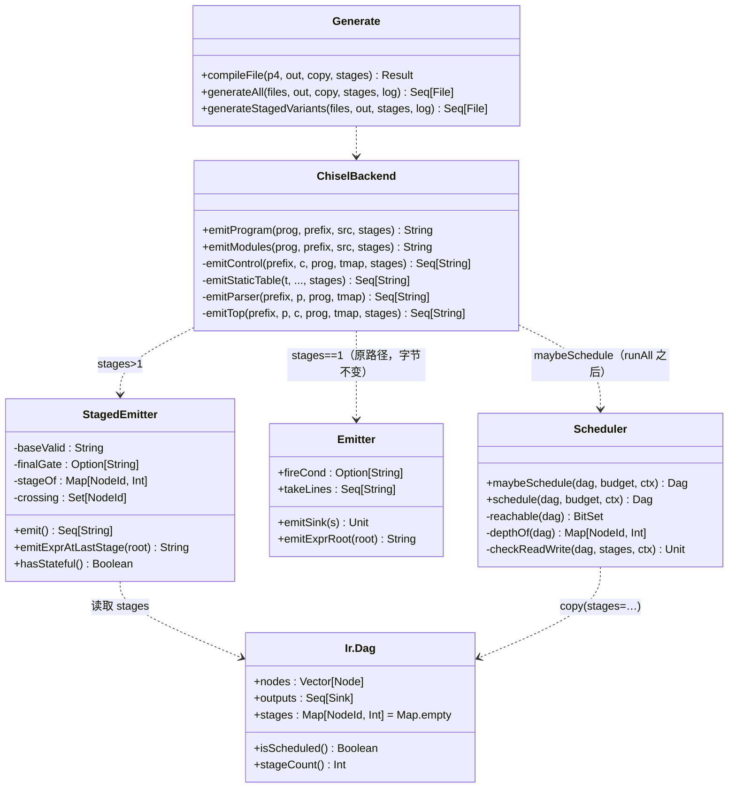
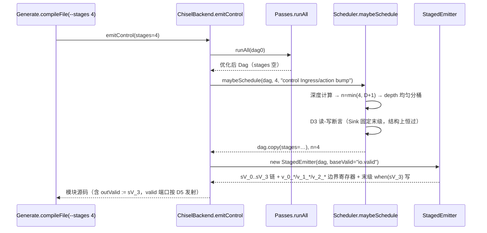
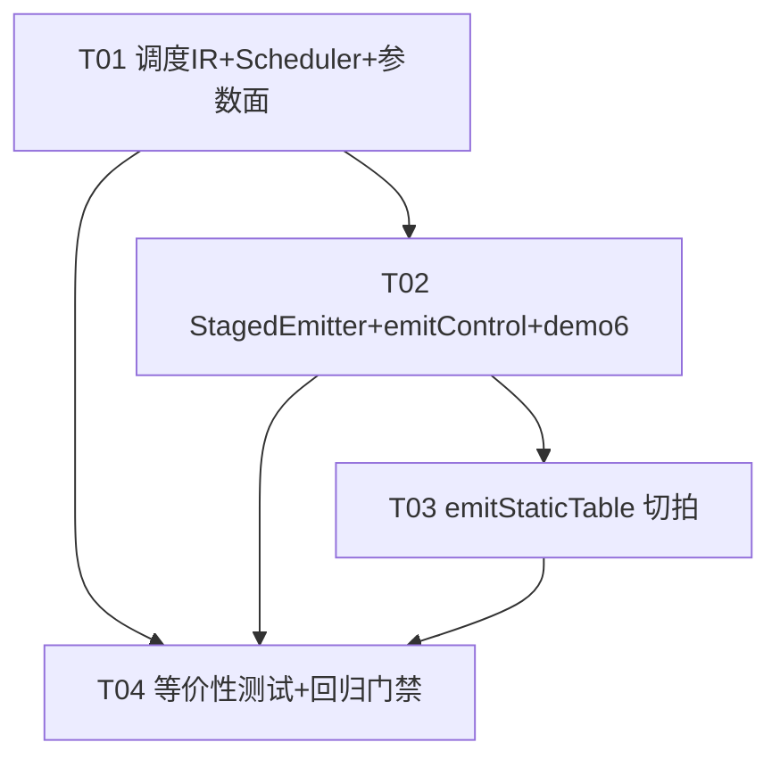

# P4 → Chisel 切拍功能 增量设计（含任务分解）

版本：v1.0
作者：高见远（架构师）
上游输入：`docs/P4toChisel_切拍_增量PRD.md` v0.1 + 主理人决策 D1~D5（作为硬约束）
状态：可实施

---

## 0. 决策回顾（硬约束）

| # | 决策 |
|---|------|
| D1 | 拍数预算 = CLI/生成器全局参数，不做 P4 注释指示 |
| D2 | 切分策略 = 按拓扑深度均匀切分（depth 分桶），不做延时模型、不支持固定级指定 |
| D3 | RegRead 与同名 RegWrite/CounterAdd 跨级破坏读-写语义时编译报 `P4Error`，不做写旁路 |
| D4 | 切拍模式（N>1）control 输出有效时序 = 末级 stageValid；默认模式（N=1）生成代码与现状**逐字节等价** |
| D5 | valid 输入端口仅在（externs 非空）或（启用切拍且级数>1）时发射；默认模式 IO 与现状完全一致 |

范围（按主理人裁定）：Action DAG 切拍 = P0；Control 内表匹配+action 组合路径切拍 = P1（表匹配第一版整体原子，MuxCase 内部不切）；Parser 提取逻辑切拍 = P1（**本文给出明确结论：第一版不做，见 §1.6**）。

---

## Part A：方案设计

### 1.1 IR 侧：调度标注方式

**选择：`Dag` 附带 `stages: Map[NodeId, Int]`，不改 `Node`。**

权衡过程：
- *方案 A（Node 加 `stage` 字段）*：`Node` 是 `sealed trait` 的 9 个 case class，加字段要改全部构造点（`IrBuilder`、`Passes.constFold/cse/dce` 的节点重建），且 `cse` 以 `Node` 结构做去重 key（`Ir.scala:225` `seen: HashMap[Node, NodeId]`），`stage` 混入 key 会破坏 CSE 语义（同一结构不同级被误判不同）。
- *方案 B（Dag 附 map，✅）*：`Dag` 是 case class，加一个带默认值 `Map.empty` 的字段，**所有现有构造点与 pass 零改动**（默认参数自动补齐）；调度结果与 DAG 本体解耦，符合 PRD "不修改 DAG 本身" 的约定；`copy(stages = ...)` 一行产出调度结果。

```scala
// Ir.scala 改动（仅此三处）
final case class Dag(nodes: Vector[Node], outputs: Seq[Sink],
                     stages: Map[NodeId, Int] = Map.empty) {
  /** stages 为空 = 未调度（全组合单拍） */
  def isScheduled: Boolean = stages.nonEmpty
  def stageCount: Int = if (stages.isEmpty) 1 else stages.values.max + 1
}
```

**pass 执行顺序（关键）**：`constFold → cse → dce → schedule`，即 **schedule 必须最后做**：
1. 三个优化 pass 都会重建节点（重编号 NodeId），先调度后优化会作废 stages 映射；
2. CSE 以节点结构去重，若在调度后运行会出现"跨级合并"——两个结构相同但落在不同级的节点被合并到某一级，产生级间数据依赖错误。调度放最后 + 调度后不再跑任何 pass，结构上杜绝该问题。
3. `Passes.runAll` 保持不变（`Ir.scala:291`），调度入口独立为 `Scheduler`（新文件，不塞进 `Passes`，避免暗示它是等价变换——它改的是调度信息，不是图）。

### 1.2 切拍 pass 算法（`SchedulePass.scala`，新文件）

```scala
package P4C
object Scheduler {
  /** budget=1 或 DAG 无法切时原样返回；否则返回带 stages 的 Dag。
    * ctx 用于错误信息定位（如 "control Ingress/action bump"）。 */
  def maybeSchedule(dag: Ir.Dag, budget: Int, ctx: String = ""): Ir.Dag
  def schedule(dag: Ir.Dag, budget: Int, ctx: String = ""): Ir.Dag
}
```

**步骤：**

1. **校验**：`budget < 1` → `P4Error(s"$ctx：拍数预算 N 必须 ≥ 1（got $budget）")`。`budget == 1` → 原样返回（stages 空）。
2. **可达性**：从 `dag.outputs` 出发做 `visitSink` 式 DFS（复用 `Ir.scala:117` 的遍历模式），只调度可达节点。
3. **拓扑深度**（memoized DFS）：
   - `Const` / `InputRef`：depth = 0（纯源，无逻辑）；
   - 其余节点（`Zext/Trunc/Bin/Slice/Cat/Mux/Not/RegRead`）：depth = 1 + max(操作数 depth)。`RegRead` 按普通节点处理（depth = 1 + depth(index)），**不强制第 0 级**——强制第 0 级是错的：若 index 是计算出来的（非叶子），第 0 级时 index 值尚不存在。`RegRead` 读到的是"第 k 拍时的状态"，其语义约束见步骤 6。
4. **分桶（D2：按深度均匀切分）**：设 `D = maxDepth`，实际级数 `n = min(budget, D + 1)`（DAG 深度不足预算时自然降级，不报错，由 Generate 日志告警实际级数——PRD P1-3 的"降级并告警"分支）。映射：
   ```
   stage(node) = min(n - 1, depth(node) * n / (D + 1))
   ```
   即把深度区间 `[0, D]` 均匀映射到 `[0, n-1]`。**选择理由**：切拍的目标是压缩关键路径，按深度值域均分直接保证每一级的组合深度 ≤ ⌈(D+1)/n⌉ 级逻辑；若按节点数均分，一条深链可能整个落在同一桶里，预算失效。该映射单调，桶是深度的连续区间，天然保证"操作数所在级 ≤ 使用者所在级"。
5. **Sink 规则：所有 Sink（OutputWrite/RegWrite/CounterAdd）固定在末级 `n-1`**（Sink 不是节点，不进 stages map，是发射约定）。理由见 §1.3。
6. **D3 读-写校验（防御性断言）**：对每个 extern 实例名 `X`，若 `max(stage(RegRead(_, X))) > min(stage(RegWrite/CounterAdd(X)))` → `P4Error`。**注意：在"Sink 固定末级"规则下该条件结构上不可能触发**（写恒在 n-1，读 ≤ n-1），但此断言必须保留：它守护未来把 Sink 提前到"最深输入级"的优化（PRD P2 方向）不静默引入语义错误。真正的风险点不是 DAG 内读-写次序，而是**跨调用的旧值窗口**，见 §1.3 末尾。
7. 返回 `dag.copy(stages = stageMap)`。

### 1.3 valid 链语义（后端契约）

设级数 n，`baseValid = io.valid`（D5：切拍模式下 valid 端口必发射）：

```
sV_0    = io.valid                                    // 组合 wire
sV_k    = RegEnable(sV_{k-1}, false.B, sV_{k-1})      // k = 1..n-1，valid 逐级寄存
```

- **第 0 级**：组合逻辑直接读 `io.*In`（`readPath` 解析）。
- **级间寄存器**：节点 `x` 在级 k 且存在处于级 > k 的消费者（节点或 Sink）时，发射 `val v_{k}_{j} = RegEnable(<级k表达式>, 0.U, sV_{k})`；级 k+1 及以后的消费者引用 `v_{k}_{j}`。无跨级消费者的节点按现有 refCount 规则内联/落 val（每级独立计数）。
- **第 n-1 级**：纯组合，结果直接被 OutputWrite / Sink 消费，不再寄存。
- **Sink 时序**：
  - `OutputWrite`：`io.xOut.y := <末级表达式>`（组合，与 `sV_{n-1}` 同拍有效）；
  - `RegWrite` / `CounterAdd`：`when (sV_{n-1} [&& 额外门控]) { ... }`（额外门控如表命中的 `hit_i`）。`sV_{n-1}` 已隐含 `io.valid`（valid 链逐级与传递），不重复取与。

**为什么 Stateful 写不可以在中间级生效**（三点，缺一不可）：
1. **原子性**：单拍版中一个 DAG 的所有写（多个 RegWrite/CounterAdd）在同一时钟沿同时生效。若写分散在中间级，一次调用的多个状态单元在不同拍提交，中途可被观察（`io.ex_*` 端口）到"半个 action"的效果——可观测语义改变。
2. **读旧值语义（D3 的根基）**：写固定末级 ⇒ 任何 RegRead（≤ n-1 级）都在写提交前完成组合读取，"同 DAG 读旧值"结构上成立。若允许中间级写，落在写之后的读会读到新值，必须引入写旁路（D3 明确不做）。
3. **D4 契约简单**：所有输出/状态更新统一在 `sV_{n-1}` 拍出现，下游（`emitTop`）只需一个 `outValid = sV_{n-1}`，等价性测试只需固定 N-1 拍延迟对齐。

**已知的跨调用语义窗口（文档化限制，非本期缺陷）**：级 k>0 的 RegRead 读到的是第 t+k 拍的状态。若前一次调用在其末级（第 t+N-1 拍）写该寄存器，背靠背调用（valid 连续 > N 拍）的第 0 级读发生在第 t+1 拍，读到旧值——单拍版会读到新值。**v1 契约：发起间隔（initiation interval）≥ N**。`emitTop` 的 fire 为一次性锁存（`ChiselBackend.scala:704` `done && !error && !fired`），天然满足；独立例化 control 模块的下游需自行保证，生成文件头注释写明。此窗口与 D3 无关（D3 只约束同一 DAG 内部），不需要运行时检查。

#### §1.3 实现修正（工程师寇豆码反馈，已采纳）

原 valid 链公式 `sV_k = RegEnable(sV_{k-1}, false.B, sV_{k-1})` 有缺陷：Chisel 的 `RegEnable` 在 en 为低时**保持旧值**，首个脉冲之后整条链永久锁高——末级每拍重复写、`outValid` 常高，违反"仅一次调用期间有效"的语义。

**修正为纯延迟线（延迟线即寄存器链，无需使能）**：

```
sV_k    = RegNext(sV_{k-1}, false.B)      // k = 1..n-1
```

`RegNext(data, init)` 每拍无条件采样，脉冲自动逐级传播并清零：`sV_k` 仅在第 k 拍为高（相对 `sV_0` 置位拍），之后自动回落，不存在锁存效应。

随之明确的时序契约：
- `io.valid` 必须是**单拍脉冲**；相邻两次脉冲的发起间隔（initiation interval）≥ N；
- `emitTop` 因此无需额外的 run 保持逻辑，`ingress.io.valid := fire`（fire 本身是单拍脉冲）即可满足契约；
- 数据边界寄存器仍用 `RegEnable(<expr>, 0.U, sV_k)`（数据需要保持到被下一级消费，使能语义正确），仅 valid 链改用 `RegNext`。

### 1.4 后端发射改造（`ChiselBackend.scala`，精确到函数）

**新增 `StagedEmitter`**（独立类，不动现有 `Emitter`——这是 D4 逐字节等价的结构保障）：

```scala
private final class StagedEmitter(
  dag: Dag,                 // 已调度（dag.isScheduled == true）
  readPath: Seq[String] => String,
  val indent: String,
  baseValid: String,        // "io.valid"
  finalGate: Option[String] // 末级额外门控，如 Some("hit_0")
) {
  // 构造时预计算：stageOf（来自 dag.stages）、每节点消费者所在级的最大值
  // crossing(id) = 存在级 > stage(id) 的消费者
  // API：
  //   def emit(): Seq[String]        // 完整级代码：sV 链 + 逐级 val/寄存器 + sink
  //   def emitExprAtLastStage(root: NodeId): String
  //                                  // root 是末级节点 → 组合表达式；
  //                                  // root 在更早级 → 返回其边界寄存器名 v_{k}_{j}
  //   def hasStateful: Boolean
}
```

内部发射顺序（Scala 2.12 兼容，纯字符串拼接，风格与现有 `Emitter` 一致）：
1. `val sV_0 = <baseValid>`；k=1..n-1：`val sV_k = RegEnable(sV_{k-1}, false.B, sV_{k-1})`（`chisel3.util.RegEnable(data, init, en)`，3.6.1 可用）。
2. 逐级 k=0..n-1：按 NodeId 序遍历级 k 节点，`go(id)` 解析操作数——同级 → 本级局部 memo/内联（refCount 按级重算）；低级 → `v_{k'}_{j}` 寄存器名。跨级节点在其所在级末尾发射 `val v_{k}_{j} = RegEnable(<expr>, 0.U, sV_{k})`（UInt 用 `0.U` init，保证 chiseltest 可预期）。
3. OutputWrite sink：`io.xOut.y := <末级表达式>`。
4. Stateful sink：`when (sV_{n-1} && <finalGate...>) { reg_x(i) := ...; cnt_x(i) := ... }`（复用 `Emitter.emitSink` 的字符串模板）。

**各函数改动清单：**

| 函数（行号） | 改动 |
|---|---|
| `emitModules` (:631) | 加参数 `stages: Int = 1`，透传 `emitControl` / `emitTop` |
| `emitProgram` (:719) | 加参数 `stages: Int = 1`，透传 `emitModules` |
| `emitControl` (:179) | ① 签名加 `stages: Int = 1`；② `:199` valid 端口条件改为 `if (stateful || stages > 1)`（D5）；③ `:232` `fire` 拆分：N=1 用现有 `Emitter(fire)` 完全不变；N>1 改用 `StagedEmitter(baseValid="io.valid")`；④ 三个 DAG 构造点（ActionCall :247、Assign :257、MethodCall :266）在 `Passes.runAll` 后追加 `Scheduler.maybeSchedule(dag, stages, s"control ${c.name}/...")`，并按是否 `isScheduled` 选 Emitter；⑤ stages>1 时 io Bundle 增发 `val outValid = Output(Bool())`， body 末尾 `io.outValid := sV_{n-1}`（D4：末级 stageValid 对外暴露） |
| `emitStaticTable` (:285) | 签名加 `stages`。key 构建（:303-319）与 `hit_i`（:324-327）保持第 0 级组合、结构不变（表匹配原子，D 范围裁定）；`entryDags`（:332-334）每个 entry DAG 经 `Scheduler.maybeSchedule` 后用 `StagedEmitter` 发射：stateful 写门控 = `sV_{n-1} && io.valid && hit_i`（:343 的 fire 字符串替换）；字段 MuxCase（:357-387）结构不变，但各 entry 的 `writeExprs` 改由 `StagedEmitter.emitExprAtLastStage` 提供——default entry 同样调度（各路径延迟一致，末级对齐）；注意 key 是第 0 级组合值，在整次调用期间输入稳定，末级直接引用 `hit_i`/`keyVal` 无需寄存（键来自 `io.*In` 寄存器输出，流水期间不变；若下游输入会变，属调用方契约） |
| `emitParser` (:486) | **不改**（结论见 §1.6） |
| `emitTop` (:653) | N=1 路径逐字节不变；stages>1 时 `:708` 改为 `io.outValid := ingress.io.outValid`（control 已在切拍模式暴露该端口），其余（`fired` 锁存、hdrValid 透传、`ex_*` 透传）不变。生成文件头注释增加时序契约说明（PRD 验收 5） |

**不变式**：`stages == 1` 时全部函数走原代码路径（默认参数 + `if (stages > 1)` 分支），`git diff` 生成的 `generated/p4c/*.scala` 必须为空。

### 1.5 CLI / 参数面（D1）

- `Generate.compileFile(p4Path, outDir, copyDir, stages: Int = 1)`：`stages < 1` → `P4Error`；透传 `emitProgram`。
- `Generate.generateAll(files, outDir, copyDir, stages: Int = 1, log)`：透传 `emitModules`；日志追加实际切分级数（对每个 DAG 汇总 max stageCount），如 `[P4C] demo6-deepchain.p4 -> Demo6Deepchain.scala (modules: Ingress, stages: Ingress=4)`。
- 新增 `Generate.generateStagedVariants(files, outDir, stages, log)`：仅供 `p4/demos/staged/` 目录使用，每文件以 `prefix + "Staged"` 为模块名前缀、按 budget=stages 发射**单个**变体（不发射 N=1 副本——N=1 基线由主 demos 目录的正常管线提供，避免 p4cgen 包内类名冲突）。测试等价性时：`Demo6DeepchainIngress`（主目录，N=1）vs `Demo6DeepchainStagedIngress`（staged 目录，N=4）。
- `P4cMain`：`P4cMain <in.p4> <outDir> [copyDir] [--stages N]`（追加式 flag 解析，缺省 1；N<1 报用法错误退出码 1）。
- `build.sbt`：
  ```scala
  val p4Stages = settingKey[Int]("P4C 拍数预算（1 = 不切拍）")
  p4Stages := sys.env.getOrElse("P4C_STAGES", "1").toInt
  // p4Generate 内：P4C.Generate.generateAll(demos, out, Some(copyDir), p4Stages.value, log)
  // 新增 staged 目录 generator：
  //   P4C.Generate.generateStagedVariants(
  //     (baseDirectory.value / "p4" / "demos" / "staged" * "*.p4").get,
  //     out, sys.env.getOrElse("P4C_STAGED_STAGES", "4").toInt, log)
  ```
  覆盖方式：`sbt 'set p4Stages := 3' p4Generate` 或环境变量 `P4C_STAGES=3 sbt compile`。

### 1.6 Parser 切拍：明确结论——**第一版不做（P1-2 降级为"不实现"，PRD 保留条目改为 Won't-this-iteration）**

论证（不是含糊、是结论）：`emitParser` 的单状态提取路径（`ChiselBackend.scala:533-548` `extractStatements`）是：

```scala
val w_inst = (io.in >> shift.U)(hb-1, 0)          // shift 是编译期常量（byteOff 固定）
r_x.f := w_inst(hi, lo)                            // 常量切片
```

- 常量移位 + 常量切片在 Firrtl 下均退化为**纯布线**（bit 选择），逻辑深度为 **0**；
- select 转移比较（:578）是单字段 `===` 常量比较，深度 1；
- 真正的时序瓶颈在**跨状态**的 FSM 结构（512-bit 窗口逐状态推进），而"FSM 结构改造 / FPP 固定窗口流水线"已被 PRD §4.1 列为非目标。

因此：对单状态内提取链做切拍，切的是深度为 0 的布线——插寄存器只增加面积与延迟，不改善时序。**结论：`emitParser` 本迭代零改动**；PRD P1-2 标记为"经架构分析不具备收益，不实现"，把 parser 流水化留在 FPP 独立立项。若未来 P4C 支持 variable-offset 提取（GranularExtract 方向），届时再启用 `StagedEmitter`（框架已就位）。

### 1.7 类图



### 1.8 调用时序（control action 切拍，N=4）



---

## Part B：任务分解

### 2.1 需要的包

无新增第三方依赖。沿用：chisel3 3.6.1 / chiseltest 0.6.2 / scalatest 3.2.20。编译器本体保持纯 Scala（2.12/2.13 双兼容，`project/p4c.sbt` 元构建约束），只用 `scala.collection.mutable`，禁 2.13-only API（不用 `LazyList`、不用 `CollectionConverters` 新写法）。

### 2.2 有序任务列表（4 个任务）

#### T01 调度基础设施与参数面（P0，依赖：无）

| 项 | 内容 |
|---|---|
| 文件 | `src/main/scala/P4C/Ir.scala`：`Dag` 加 `stages` 字段 + `isScheduled`/`stageCount`（§1.1）；新建 `src/main/scala/P4C/SchedulePass.scala`：`object Scheduler`（§1.2 全部算法）；`src/main/scala/P4C/Generate.scala`：`compileFile`/`generateAll` 加 `stages: Int = 1` 参数与校验、`P4cMain` 支持 `--stages N`、日志实际级数；`build.sbt`：`p4Stages` settingKey（env `P4C_STAGES` 覆盖）并传给 `generateAll` |
| 函数 | `Scheduler.schedule/maybeSchedule/depthOf/checkReadWrite`；`Generate.compileFile/generateAll`；`P4cMain.main` |
| 验收 | ① 元构建（Scala 2.12）编译通过；② 所有现有调用点因默认参数零改动，`sbt compile` 无警告级破坏；③ `P4cMain x.p4 out --stages 0` 报错退出；④ budget=1 时 `isScheduled == false` |

#### T02 后端分级发射 + control 直行切拍 + demo6（P0，依赖：T01）

| 项 | 内容 |
|---|---|
| 文件 | `src/main/scala/P4C/ChiselBackend.scala`：新增 `StagedEmitter`；`emitModules/emitProgram/emitControl/emitTop` 加 `stages` 参数；`emitControl` 的 valid 端口（D5）、outValid 端口、三个 DAG 点接入 `Scheduler.maybeSchedule`（§1.4 清单）；`src/main/scala/P4C/Generate.scala`：新增 `generateStagedVariants`（仅发射 prefix+"Staged" 变体）；新建 `p4/demos/demo6-deepchain.p4` 与 `p4/demos/staged/demo6-deepchain.p4`（同一程序两份，见 §2.3）；`build.sbt`：staged 目录第二个 sourceGenerator |
| 验收 | ① **零回归**：`sbt clean compile` 后 `diff` 生成目录 `generated/p4c/` 与改动前基线，逐字节一致（D4 硬门禁）；② `Demo6DeepchainStaged.scala` 生成代码可见 `sV_1..sV_3`、`RegEnable`、`io.valid`/`io.outValid` 端口；③ `emitTop` N=1 路径字节不变 |

#### T03 静态融合表切拍（P1，依赖：T02）

| 项 | 内容 |
|---|---|
| 文件 | `src/main/scala/P4C/ChiselBackend.scala`：`emitStaticTable` 加 `stages`——key/hit 保持第 0 级、entryDags 经 `Scheduler.maybeSchedule` + `StagedEmitter`、stateful fire = `sV_{n-1} && io.valid && hit_i`、MuxCase 操作数取自 `emitExprAtLastStage`、default entry 同样调度；新建 `p4/demos/staged/demo2-match.p4`、`p4/demos/staged/demo4-extern.p4`（主目录 demo 的拷贝，供生成 Staged 变体） |
| 验收 | ① `Demo2MatchStaged`/`Demo4ExternStaged` 类生成且编译通过；② 表项命中/未命中结构正确（hit 在末级与 action 数据同步）；③ 默认路径仍逐字节零回归 |

#### T04 等价性测试与零回归门禁（P0，依赖：T01、T02、T03）

| 项 | 内容 |
|---|---|
| 文件 | 新建 `src/test/scala/P4C/ScheduleSpec.scala`（纯 Scala 单测，无 chiseltest）：链式 Bin 深度 D=6 预算 3 → 级数 3、叶子级 0、最深节点级 2；budget=min(budget,D+1) 降级；budget<1 抛 P4Error；budget=1 原样返回。新建 `src/test/scala/P4C/Demo6StagesSpec.scala`：`Demo6DeepchainIngress`（N=1）vs `Demo6DeepchainStagedIngress`（N=4）同激励等价（输出字段 + Register/Counter 终值，容忍 3 拍延迟）；valid 低电平期间无写断言；`io.outValid` 在第 n-1 拍置位。新建 `src/test/scala/P4C/Demo4StagesSpec.scala`：demo4 staged 变体等价 + valid 门控（Demo2 表等价用例可并入本文件或单独 `Demo2MatchStagedSpec.scala`） |
| 验收 | ① 新增用例全绿；② P4C 22/22 + 新增全绿；③ 全仓 307/307 + 新增全绿；④ 生成文件头注释含时序契约（发起间隔 ≥ N） |

依赖图：



### 2.3 demo / 测试计划

**demo6-deepchain.p4**（触发切拍的核心 demo）：

```p4
#include <core.p4>
header ethernet_h { bit<48> dstAddr; bit<48> srcAddr; bit<16> etherType; }
struct headers_t { ethernet_h ethernet; }
struct metadata_t {
    bit<16> f0;  bit<16> f1;  /* … f15 */  bit<16> acc;
}
control Ingress(inout headers_t hdr, inout metadata_t meta) {
    Register(bit<16>, 8) stats;
    Counter(bit<32>, 8) hits;
    action chain() {
        // 16 项左结合加法链 → Bin 链深度 15，预算 4 时切成 4 级
        meta.acc = f0 + f1 + f2 + … + f15;   //（写成一条表达式）
        stats.write(8w0, meta.acc);
        hits.count(8w0);
    }
    apply { chain(); }
}
```

- 主目录 `p4/demos/demo6-deepchain.p4`：正常管线以 N=1 编译出 `Demo6DeepchainIngress`（等价性基线）；
- staged 目录 `p4/demos/staged/demo6-deepchain.p4`：`generateStagedVariants` 以 N=4 编译出 `Demo6DeepchainStagedIngress`（类名带 Staged 后缀，与基线共存于 p4cgen 包，无冲突）；
- 覆盖点：深度切分（15 深链）、D5（有 extern，valid 端口本来就发射）、stateful 末级写门控、outValid 时序。纯组合 stateless 切拍（valid 端口因切拍新增）由 staged demo2 覆盖。

**测试矩阵**：

| 用例 | 断言 |
|---|---|
| ScheduleSpec | 分桶正确性 / 降级 / 非法预算报错 / budget=1 恒等 |
| Demo6StagesSpec | N=1 vs N=4 输出与状态终值等价（延迟 3 拍）；valid=0 无写；outValid 时序 |
| Demo4StagesSpec | staged Register/Counter 等价 + valid 门控 |
| Demo2MatchStaged（并入 Demo4StagesSpec 或独立） | 命中/未命中各表项输出等价、hit 与数据同步 |
| 既有 Demo1~5Spec / FrontendSpec / IrPassSpec | 不改动，即回归门禁 |

---

## 3. 风险与约束

1. **Scala 2.12 兼容（元构建硬约束）**：`project/p4c.sbt` 把 P4C 源码挂进元构建（Scala 2.12）。新代码仅用 `mutable.HashMap/ArrayBuffer/BitSet`、字符串插值、case class copy——均为 2.12 安全；禁用 2.13-only集合API。CI 上先跑 `sbt compile`（元构建先行编译会暴露 2.12 问题）。
2. **Chisel 3.6.1 限制**：① 不用 `switch ... default`（本设计不引入新 switch）；② Bundle 不手写 `cloneType`（新增 `outValid = Output(Bool())` 是原生类型字段，无 cloneType 问题；不新增 Bundle 字段于自定义 Bundle 类）；③ `+&`/`-&` 保宽（沿用现有 `Emitter` 模板，`StagedEmitter` 复用同一表达式生成代码，避免重复实现）；④ `RegEnable(data, init, en)` 三参形式 3.6.1 可用。
3. **D4 零回归的验证手段（三重）**：
   - 结构隔离：N=1 走原 `Emitter` 与原函数路径，`StagedEmitter` 为平行新类；
   - 逐字节 diff：`sbt clean compile` 后 `diff -r generated/p4c <基线快照>` 必须为空（基线在 T02 开始前用 `cp -r generated/p4c /tmp/p4c-baseline` 固定）；
   - 测试门禁：全仓 307/307 + P4C 22/22 不改动通过。
4. **跨调用旧值窗口**（§1.3）：发起间隔 ≥ N 为文档化契约，Top 一次性 fire 天然满足；写进生成文件头注释。
5. **表 key 的跨拍稳定性假设**：`hit_i`/`keyVal` 第 0 级组合值在流水期间被末级直接引用，依赖"调用期间 `io.*In` 稳定"。Top 场景（parser 输出寄存后馈入）满足；独立例化场景写进头部契约注释。
6. **staged 目录拷贝维护**：demo2/demo4 在 staged 目录是拷贝，与主目录可能漂移——v1 接受（变体本来就允许不同源程序），在 staged 目录 README 注明同步责任。

---

## 4. 交付物对照（PRD 验收标准）

| PRD 验收 | 覆盖 |
|---|---|
| 1 默认零回归 | T02/T04 逐字节 diff + 307 门禁 |
| 2 Action 切拍正确性 | T02 + Demo6StagesSpec（N=2/3/4 中以 4 为主验证，2/3 由 ScheduleSpec 参数化覆盖分桶逻辑） |
| 3 Control 切拍 | T03 + Demo2 staged 等价 |
| 4 Parser 切拍 | §1.6 结论：不做（有论证），PRD P1-2 状态建议改"本迭代不实现" |
| 5 outValid 末级语义 | emitControl outValid 端口 + emitTop staged 分支 + 头注释契约 |
| 6 报错清晰 | `Scheduler` 携带 ctx 的 P4Error；budget<1 校验 |
