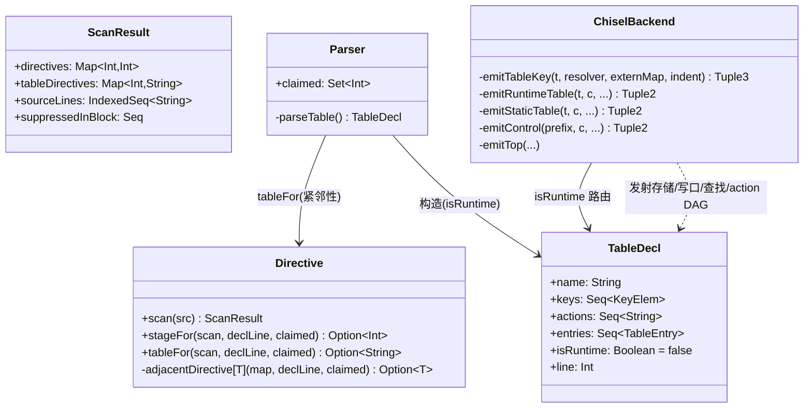
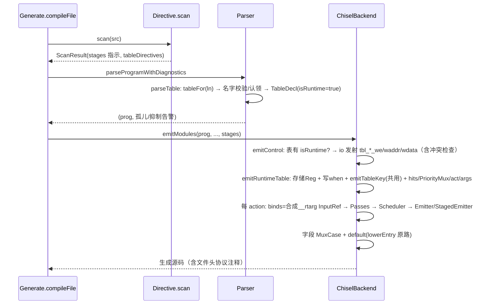
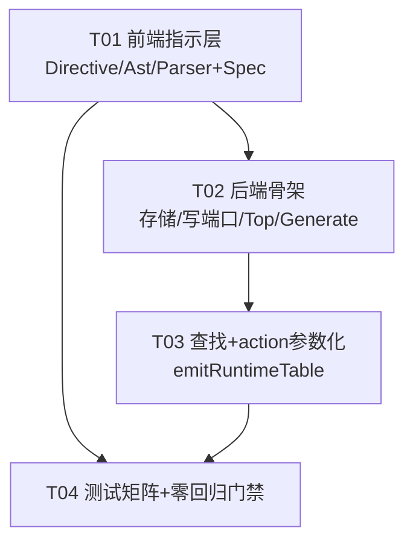

# P4 → Chisel 表项运行时可配置 增量设计

版本：v0.1（对应增量 PRD `docs/P4toChisel_运行时表项_增量PRD.md` v0.1）
作者：高见远（架构师）
状态：待评审（上游：主理人决策 D1–D5；下游：寇豆码实现、严过关测试）

---

## 0. 决策基线（主理人 D1–D5，本设计的硬约束）

| # | 决策 | 本设计的落实 |
|---|------|-------------|
| D1 | 运行时表标记 = P4 注释编译指示，复用 Directive 基础设施 | `// p4c: table <表名> runtime`，见 §1 |
| D2 | 存储 = Vec[Reg] 组合读；不引 SRAM、不预造 trait 体系 | `RegInit(VecInit(...))` 单 Vec 打包条目，见 §3.1；替换点仅在 `emitRuntimeTable` 的存储/写端口发射小节（注释标明） |
| D3 | default entry 编译期固定，仅普通表项可运行时写 | 见 §3.4 |
| D4 | 每表独立写端口（`tbl_<name>_*`），"写后下一条查找可见" | 见 §3.2/§3.5 |
| D5 | 静态模式零回归；运行时表与静态表同 control 共存 | 所有新增发射以 `isRuntime` / `exists(_.isRuntime)` 分支门控，见 §5.2 |

---

## Part A 方案设计

## 1. 指示语法与解析接入点

### 1.1 语法

```p4
// p4c: table cls_table runtime
table cls_table {
    key = { hdr.ethernet.etherType : exact; }
    actions = { set_cls; nop; }
    const entries = { default : nop(); }   // 仅允许 default 行（可省略，见 §3.4）
}
```

- 形态与既有 `// p4c: stages=N`（`Directive.scala` 类注释）统一：`// p4c:` 触发段 + 关键字参数。**带表名**而非裸 `runtime`：紧邻性已绑定目标声明，表名是冗余校验，用于把"指示贴错表"从静默错绑变成显式 `P4Error`（提示信息含两个表名，排障价值高）。
- 大小写/空白不敏感、允许行尾尾巴（与 `valueRe` 的 `(?:\s.*)?` 惯例一致）。

### 1.2 `Directive.scala` 扩展（不改既有 stages 路径的任何行为）

文件：`src/main/scala/P4C/Directive.scala`

1. **正则**：新增 `tableRe`（与 `valueRe`（L49）并列）：
   ```
   (?i)^\s*//\s*p4c\s*:\s*table\s+([A-Za-z_]\w*)\s+runtime\s*(?:\s.*)?$
   ```
2. **ScanResult**（L34–38）：追加字段 `tableDirectives: Map[Int, String]`（行号 → 表名），带默认值 `Map.empty`；`ScanResult.empty`（L42）与既有构造点零改动或走默认参数。
3. **scan()**（L56–85）：触发段命中且不在块注释内时，先试 `valueRe`（stages），再试 `tableRe`，都不匹配才抛现有"无法解析" `P4Error`（错误信息补充 table 语法提示）。块注释内抑制逻辑（L68–70）对两类指示统一生效——`tableDirectives` 的扫描放在同一 `triggerRe.findFirstMatchIn` 分支内，**共享 classify 注释状态机**（L57），不另起状态机。
4. **紧邻性匹配**：把 `stageFor`（L90–103）的"取 < declLine 的最大指示行 + 开区间全空白"逻辑抽为私有泛型辅助 `adjacentDirective[T](map: Map[Int, T], declLine: Int, claimed): Option[T]`；`stageFor` 与新增 `tableFor(scan, declLine, claimed): Option[String]` 都委托它。紧邻性/孤儿告警语义逐字保持（这是 D1 "复用 classify 状态机与紧邻性/告警语义"的落点）。

### 1.3 `Parser.scala` 挂载

文件：`src/main/scala/P4C/Parser.scala`

- `parseTable()`（L324–355）：`val ln = line` 已是 table 声明行（进入时 cur 为 `table` 关键字）。解析完表名后调用 `Directive.tableFor(scan, ln, claimed)`：
  - 命中且名字 ≠ 表名 → `P4Error`（行 $ln：`// p4c: table <X> runtime` 指示的表名与声明 `<name>` 不一致）；
  - 命中且名字一致 → 认领（写入 `claimed`，机制不变）。
- **Ast.scala** `TableDecl`（L70）追加字段 `isRuntime: Boolean = false`（默认值保证所有既有构造点零改动）。
- **孤儿告警**：`Parser$.parseProgramWithDiagnostics`（L577–590）的 orphan 推导扩展为遍历 `scan.directives ++ scan.tableDirectives`（table 指示未认领时告警文案为"未紧邻 table 声明"）。块注释内抑制告警（suppressed，L581–583）自动覆盖 table 指示，无需改动。

### 1.4 与 stages 指示的正交性

两类指示可同时存在：`// p4c: table X runtime` 紧邻 table 行、`// p4c: stages=N` 紧邻 control 行。同一行只承载一种指示（正则互斥）。table 指示不参与 `stagesOpt` 的认领，反之亦然——`adjacentDirective` 按"最近的指示行"取值，两类 map 独立扫描，互不干扰。

---

## 2. 生成代码总体形态（对照静态表）

以 demo2 风格的运行时表（exact 单 key，actions = {set_cls(bit<8>); nop;}，default nop）为例，`emitControl` 产出的增量结构：

```scala
final class Demo7RuntimeTableIngress extends Module {
  val io = IO(new Bundle {
    ...                                        // 既有 params 端口，不变
    val tbl_cls_table_we    = Input(Bool())    // 新增：写使能
    val tbl_cls_table_waddr = Input(UInt(2.W)) // 新增：写地址
    val tbl_cls_table_wdata = Input(UInt(28.W))// 新增：写数据（打包条目，见 §3.1）
  })
  ...
  // 表存储（D2：Vec[Reg] 组合读；替换 SRAM 时只改此处与 §3.2 写时序）
  val rt_cls_table = RegInit(VecInit(Seq.fill(4)(0.U(28.W))))
  // 写端口（D4：时钟沿写入；地址越界守卫见 §3.2）
  when (io.tbl_cls_table_we && io.tbl_cls_table_waddr < 4.U) {
    rt_cls_table(io.tbl_cls_table_waddr) := io.tbl_cls_table_wdata
  }

  // ---- table cls_table（运行时，4 项）----
  val key = ...                       // 与静态表完全相同的 key 发射（§3.3）
  val rt_cls_table_hits = VecInit(rt_cls_table.map { e =>
    e(27) && e(11, 0) === key }).asUInt   // per-entry: valid && key 匹配
  val rt_cls_table_hit = rt_cls_table_hits.orR
  val rt_cls_table_sel = rt_cls_table(PriorityMux(rt_cls_table_hits.zipWithIndex
    .map { case (h, i) => (h, i.U) }))    // 多命中：低地址优先（= 静态 MuxCase 声明序）
  val rt_cls_table_act = rt_cls_table_sel(13, 12)   // actionId 字段
  val rt_cls_table_args = rt_cls_table_sel(11, 4)   // 参数位串字段
  // action set_cls：一份参数化 DAG（参数 = rt_cls_table_args 切片）
  ...DAG 体（结构同静态表条目，Const → rt_cls_table_args(hi,lo)）...
  when (io.valid && rt_cls_table_hit && (rt_cls_table_act === 0.U)) { ...stateful... }
  // 字段写出：MuxCase(默认值, Seq((hit && act===i) -> expr_i, ...))
  ...
}
```

与静态表（`emitStaticTable`）的三点结构差异：

| 维度 | 静态表（emitStaticTable） | 运行时表（emitRuntimeTable，新增） |
|------|--------------------------|----------------------------------|
| hit 来源 | 每条目常量比较 `hit_i = key === 0x…` | 存储位串比较 `e(valid) && e(keySlice) === key` |
| action/参数 | 每条目内联完整 DAG，参数是 Const（常量折叠后） | 每 **action** 一份参数化 DAG，参数来自 `rt_*_args` 切片，按 `rt_*_act` actionId 选通 |
| 条目数量结构 | 条目数 = MuxCase 分支数 | 表深 size 独立于 actions 数；分支数 = 表的 action 数 |

---

## 3. 关键设计点

### 3.1 存储与条目编码（D2）

- **单 Vec 打包**：`val rt_<name> = RegInit(VecInit(Seq.fill(size)(0.U(entryW.W))))`，
  `entryW = 1 + actW + argW + keyBits`。
- **位布局（MSB → LSB，写死在生成文件头注释中，满足 PRD 验收 5）**：
  ```
  [entryW-1]                 : valid（1 = 表项有效）
  [entryW-2 : argW+keyBits]  : actionId（actW = max(1, bits(actions.size-1))，按 actions 声明序编号 0..k-1）
  [argW+keyBits-1 : keyBits] : 参数位串（argW = max(各 action 参数总宽)；单 action 的
                               Cat(参数按声明序，先声明在高位) 靠 LSB 存放，高位补 0，补位忽略）
  [keyBits-1 : 0]            : key（多 key 时 Cat 拼接、先声明在高位——与静态表 combineKeys 序一致）
  ```
- **编码权衡**（为什么不拆三个 Vec）：单条目单字 = 未来 SRAM 一行（P2-1 映射时是天然的一行 wide word），单写数据总线 `wdata` 一个口；代价是生成的查找切片表达式可读性略差——用生成文件头注释的布局表弥补。**不预造 trait/抽象层**（D2 明确不做），替换点 = `emitRuntimeTable` 内"存储与写端口"两段发射，以注释标明。
- **上电初始值**：全 0 条目 ⇒ valid=0 ⇒ 全 miss ⇒ 走 default action。运行时表**上电为空**，与静态表 const entries 的"上电即有内容"是行为差异点（写入 §4 测试矩阵与文件头注释）。
- **表深**：运行时表必须显式给表深。P4 语法无 size 字段——**约定**：运行时表用 `size` 属性或表深由……（见 §7 开放问题 Q1，本设计倾向：`const entries` 中 default 行可附 `@size` 不可行，改用**指示尾参数**：`// p4c: table cls_table runtime size=4`，缺省 size=4）。

### 3.2 写端口（D4）

- io 端口（每运行时表 3 个，命名与 `ex_*` 风格一致）：
  ```
  io.tbl_<name>_we    : Input(Bool())
  io.tbl_<name>_waddr : Input(UInt(addrW.W))   // addrW = max(1, log2ceil(size))
  io.tbl_<name>_wdata : Input(UInt(entryW.W))  // 布局同 §3.1，控制平面按布局拼装
  ```
- 写时序：`when (io.tbl_<name>_we && io.tbl_<name>_waddr < size.U) { rt_<name>(waddr) := wdata }`。
  - **越界守卫**：size 非 2 的幂（如 4 以外的 6）或 size=1 时 addrW 位宽有冗余组合，`waddr < size.U` 一行统一保证"非法地址写不破坏表内容"（PRD P0-2③）；2 的幂时该条件恒真，被 FIRRTL 常量折叠，零成本。
  - **原子性**：单字单口单时钟沿提交，结构上原子（PRD P0-2①）。
- **删除/置无效（P1-3 的免费半成品）**：写 `valid=0` 的 wdata 即删除该表项（回 miss）。写进文件头注释，不占本期实现工作量。
- **命名冲突防御**：`emitControl` 在发射 io 前检查 `s"tbl_${t.name}"` 与既有 io 成员（`<param>In/Out`、`valid`、`ex_*`、`outValid`）不冲突，冲突 → `P4Error`（信息含表名与冲突成员）。P4 侧 control 参数名与表名同处一命名空间，防御性检查成本一行。

### 3.3 查找逻辑（组合，零时延增量）

- **key 构建**：与静态表逐字同构（字段路径 lowering → Emitter → 多 key Cat）。实现上把 `emitStaticTable` L549–566 的 key 发射段抽为私有辅助 `emitTableKey(t, resolver, externMap, indent): (Seq[String], String, Int)`（返回行/键表达式/总宽），静态与运行时两路共用——抽取得当则静态路径输出**逐字节不变**（这是 D4 门禁的前提，验收见 §5.2）。
- **hit / 选择**：
  ```
  val rt_<name>_hits = VecInit(rt_<name>.map { e =>
    e(validBit) && e(keyBits+keyBits-1 段 === key) }).asUInt
  val rt_<name>_hit  = rt_<name>_hits.orR
  val rt_<name>_sel  = rt_<name>(PriorityMux(hits zip idx))   // §2 所示
  ```
  - `PriorityMux` 保证**重复 key 写入多条目时低地址优先**，与静态表 `MuxCase` 的声明序优先（`emitStaticTable` L657 的 muxPairs 顺序）语义对齐——文档化这一语义（文件头注释）。
  - `e(validBit)` 使空槽永不命中，空表自然全 miss。
- **与切拍 valid 链的关系（本增量的核心正确性论证）**：存储是 Reg 组合读，`rt_*_hits/_hit/_sel/_act/_args` 全部是**第 0 级组合信号**（相对 `io.valid` 零拍延迟）。`key` 来自 `io.*In`（调用期间稳定），`hit`/`act` 在末级被**组合引用**不寄存——与静态表 `hit_i`/`keyVal` 的处理完全一致（`emitStaticTable` 注释 L528–529）。valid 链 `sV_k = RegNext`（`StagedShared.chain`，L174–189）结构、`StagedEmitter` 边界寄存、发起间隔 ≥ N 契约**零改动**。D2 选中 Vec[Reg] 的根本原因即在此：SRAM 同步读会插入 1 拍，破坏这套契约（PRD §6-Q3 的问题被 D2 整体消解）。

### 3.4 action 参数运行时化（关键难点）

**静态表**：`lowerEntry`（ChiselBackend.scala L684–701）把条目实参 lower 成 Const，`Passes.runAll` 常量折叠后每个条目是一份参数为字面量的专用 DAG——"每条目一份逻辑"。

**运行时表选型**（采纳主理人建议）：**每 action 一份参数化 DAG 实例化 + 按 actionId Mux 选择参数**，而非按条目展开（条目数 = 表深 size，按条目展开会让逻辑规模乘 size，而 DAG 结构完全重复）。

- **IR 零改动**：不新增 ParamRef 节点。action 形参绑定改用**合成路径 InputRef**：
  ```scala
  // emitRuntimeTable 内，对表中每个 action a（id = i）：
  val b = new Ir.Builder
  val lowering = new ExprLowering(resolver, b, externMap)
  val binds: Map[String, (NodeId, Int)] = a.params.map { p =>
    // 参数位 = rt_<name>_args 的对应切片：InputRef(Seq("__rtarg", p.name), p.width)
    p.name -> ((b.node(InputRef(Seq("__rtarg", p.name), p.width)), p.width))
  }.toMap
  val outs = a.body.map { case asg: Assign => lowering.lowerAssign(...binds)
                          case mc: MethodCall => lowering.lowerMethodCall(mc, binds) }
  val dag = Passes.runAll(b.finish(outs))
  if (stages > 1) Scheduler.maybeSchedule(dag, stages, s"runtime table ${t.name}/${a.name}")
  ```
  `Emitter`/`StagedEmitter` 已把叶子读取抽象为 `readPath: Seq[String] => String`（L26、L227）；构造 Emitter 时传入的 readPath 对 `Seq("__rtarg", p.name)` 特判返回 `rt_<name>_args(<hi>, <lo>)`（切片偏移按 §3.1 布局从 LSB 计：`off_j = a.params.drop(j+1).map(_.width).sum`），其余路径走原 `readOf`。**DAG 结构与静态表条目完全相同，变的只是 Const 叶子 → 存储切片 InputRef**——这正是 Scheduler 加权模型、Sink 固定末级、D3 读-写次序校验全部原样成立的原因。
- **发射与选通**（双路，与静态表同构）：
  - **N=1**：每 action 一个 `Emitter(dag, readPath', indent, fireCond = Some("(io.valid) && rt_<name>_hit && (rt_<name>_act === i.U)"))`；stateful 写（RegWrite/CounterAdd，`takeLines` L87–93 自动包 `when(fireCond)`）只在选中时提交；OutputWrite 表达式收集进字段 MuxCase。
  - **stages>1**：每 action 一个 `StagedEmitter(dag, readPath', indent, baseValid = "io.valid"(或 "true.B"), finalGate = Some("rt_<name>_hit && (rt_<name>_act === i.U)"), shared)`，`emit(emitOutputs = false)` 后经 `emitExprAtLastStage`（L344–350）取字段值——流程与 `emitStaticTable` L589–614 逐行对应，仅 finalGate 从 `hit_i` 换成组合的命中+action 选通表达式。**Sink 固定末级语义不变**：stateful 写仍在末级 `when(sV_last && finalGate)` 提交，action DAG 的调度结构、边界寄存、D3 校验零改动。
- **字段写出**：`fieldOrder` 收集（L616–620 同构）→ 每字段
  `io.<p>Out.<f> := MuxCase(<default 值或透传 readExpr>, Seq((rt_hit && rt_act === i.U) -> expr_i, ...))`。
- **default entry（D3）**：编译期固定。
  - 语法：运行时表的 `const entries` **只允许 default 行**（可省略）；出现非 default 条目 → `P4Error: 行 ln：运行时表 'X' 不允许 const entries（仅允许 default 行）`（校验点：`emitControl` 的 `TableApply` 分支，L497–503，错误信息含表名——满足 PRD 验收 5）。静态表"无 entries"的既有报错（L499）不变。
  - 发射：default 的 DAG 走同一套参数化机制（其参数是 const，`lowerEntry` 原样可用），作为 MuxCase 的 fallback 与无 gate 的 stateful 写（`finalGate = None` / fireCond 仅 `io.valid`）——与静态表 default 路径（`hits = false`，L584、L606–608）行为一致。省略 default → 全字段透传（`rhs = readExpr`，静态表 None 分支同构）。
- **actionId 判空细节**：`actions` 列表中未被任何 DAG 使用到的字段（如某 action 无参数时 argW 可能仍 >0 由其他 action 决定）补零忽略；`actW` 位上不存在的 id（actions 数非 2 的幂）写入该 id → 所有选通条件为假 → 行为等同 default（文件头注释注明）。

### 3.5 并发可见性语义（PRD 故事 2 / 验收 3）

- 写在时钟沿提交（Reg）；查找是当前 Reg 值的组合函数。**写拍当拍的查找看到旧值；下一拍起的查找看到新值**——"旧值或新值之一、绝不撕裂"由"读的是稳定 Reg 值"结构保证，与拍序无关（不依赖内部实现细节，满足验收 3 的表述）。D4 承诺的"写后下一条查找可见"即此语义，写入生成文件头注释。
- 注意写口与查找**无互锁**：写不消费 valid、查找不感知 we，两条路径仅共享 Reg 阵列——控制平面若在查找进行中写表，语义就是上面的可见性承诺，无需额外握手。

### 3.6 Top 与文件头注释

- `emitTop`（L946–1019）：当 `c.tables.exists(_.isRuntime)` 时，把 control 的 `tbl_*` 写端口透出至 Top io（命名同名），并直连 `ingress.io.tbl_*`。不存在的静态场景零新增端口（D5）。
- `emitModules`（L909–941）文件头：存在运行时表时追加注释块——写接口协议（三端口时序）、条目位布局表、表深/key 宽/actW/argW 回显（满足 PRD 验收 5"编译期固定并回显"）、可见性语义、上电为空说明。静态程序头注释逐字不变。

### 3.7 Generate.scala 日志

`directiveLogs`（Generate.scala L18–25）追加：`prog.controls.flatMap(_.tables.filter(_.isRuntime).map(t => s"[P4C] $name: table ${t.name} runtime (directive)"))`。表深/key 宽/actW/argW 在后端发射时经 log 回显（复用 generateAll 的 log 通道，L58）。

---

## 4. demo 与测试计划

### 4.1 demo

`p4/demos/demo7-runtime-table.p4`（主目录 demo1–6 之后的空位；staged 目录的 demo7-directive.p4 是另一命名空间，不冲突）：control 内**一静态表 + 一运行时表共存**（验收 4），运行时表含 default 行。staged 目录变体（`--stages` 烟测）作为 P1 追加项，不阻塞本期。

### 4.2 测试矩阵（`src/test/scala/P4C/Demo7RuntimeTableSpec.scala`，chiseltest，风格对齐 Demo2MatchSpec）

| # | 用例 | 操作序列 → 断言 |
|---|------|----------------|
| 1 | 上电空表 miss | 复位后直接查找 → 全字段走 default |
| 2 | 写→命中 | poke(we=1,waddr=0,wdata=合法编码)，step(1)，we=0，查找命中 key → action+参数正确 |
| 3 | 更新已有项 | 覆写同 key 新 action/参数 → 旧动作不再出现、新参数生效 |
| 4 | 删除 | 写 valid=0 条目 → 该 key 回 miss |
| 5 | 覆盖写并发查找 | 写拍当拍发起查找 → 结果为旧值或新值之一（无撕裂断言：命中结果 ∈ {旧, 新} 集合） |
| 6 | 越界写 | size=4 时 waddr=5（若 addrW 有冗余）或用非幂 size 表 → 表内容不变（先写后回读验证） |
| 7 | 静态表共存 | 同 control 静态表行为与基线一致、运行时表独立工作 |
| 8 | actionId 非法值 | 写入未定义 actionId → 等同 default |

### 4.3 编译期/前端测试

- `DirectiveSpec.scala` / `QaDirectiveEdgeSpec.scala`：table 指示扫描、紧邻性（隔代码行 → 孤儿告警）、块注释内抑制、名字不匹配 → P4Error、与 stages 指示共存。
- `FrontendSpec.scala`：运行时表携带非 default const entries → P4Error（信息含表名）；运行时表省略 default → 编译通过。

---

## 5. 风险与约束

### 5.1 兼容性

- **Scala 2.13**：仅用既有风格设施（case class 默认参数、collect、zipWithIndex），无新依赖。
- **Chisel 3.6**：`RegInit(VecInit(Seq.fill(n)(0.U(w.W))))`、`VecInit(...).asUInt`、`PriorityMux(Seq[(Bool,UInt)])`、动态 Vec 索引均为 chisel3 3.6 稳定 API（`chisel3.util._`）。注意 `PriorityMux` 无命中时返回首元素——必须以 `rt_*_hit`（orR）作为使用前提，选通条件已含 hit，结构安全。
- **Vec 动态索引越界**：写口统一 `waddr < size.U` 守卫（§3.2），读口 `PriorityMux` 只产生 `< size` 的索引，无越界读。

### 5.2 D4 零回归验证手段（QA 标准动作，写进 T04 验收）

1. 所有新增发射代码以 `isRuntime` / `c.tables.exists(_.isRuntime)` 守卫；N=1 且无指示时（`isRuntime=false` ∀表）代码路径与现状汇合同点，`sbt clean compile` 后 `diff -r generated/p4c <基线>` 逐字节为空（含 staged/ 变体）。
2. 抽取 `emitTableKey` 等公共辅助时以"重构前后生成文本逐字节一致"为红线，先重构后增能，分两个 commit 便于 bisect。
3. 76/76 P4C、357/357 全仓基线只增不减。

### 5.3 其他风险

| 风险 | 缓解 |
|------|------|
| `tbl_<name>` 端口名与既有 io 成员冲突 | §3.2 的编译期 P4Error 检查 |
| 控制平面拼错 wdata 布局 | 文件头注释布局表 + 测试用例 2/3 用同一拼装函数 |
| size 缺省值选错 | §7-Q1 拍板后写入文件头注释回显 |
| actionDAG 参数切片偏移算错 | 测试 2/3 覆盖多参数 action（demo 设计 action 至少 2 参数） |

---

## 6. 类图与调用流





---

## 7. 开放问题（含倾向）

| # | 问题 | 倾向 |
|---|------|------|
| Q1 | **表深 size 的声明方式**：P4 子集无 size 语法。候选：(a) 指示尾参数 `// p4c: table X runtime size=4`；(b) 表内 `size = 4;` 属性行（parseTable 的 skipStmt 现在会吞掉，需显式解析）。**倾向 (a)**：全部新增语义收拢在指示一行内，与 D1 "沿用 Directive 基础设施"一致，parseTable 零改动；缺省 size=4，`tableRe` 捕获可选 `size=(\d+)`。**需主理人拍板后固化正则**。 |
| Q2 | 运行时表是否强制要求 default 行？ | 倾向**不强制**：缺省 = miss 全透传（与静态表 None fallback 同构），语义最简；demo 带上 default 以示范。 |
| Q3 | 重复 key 多命中"低地址优先"是否要升级为"后写优先"（覆盖语义直觉）？ | 本期**低地址优先**（= 静态 MuxCase 序，实现即 PriorityMux，零额外成本）；"后写优先"需维护写计数/交换逻辑，留 P1 与表满语义（PRD P1-2）一起定。 |
| Q4 | staged 目录的运行时表变体（--stages 等价性测试）是否进本期门禁？ | 倾向 P1：机制上与静态表切拍共用全部设施（§3.4 已论证），风险低；但 demo 与等价 spec 的编写量不小，先交 N=1 全矩阵，staged 烟测追加。 |

---

## Part B 任务分解

### 8. 依赖包

无新增第三方依赖（Scala 2.13 标准库 + 既有 chisel3 3.6.1 / chiseltest / scalatest）。

### 9. 有序任务列表（执行者：寇豆码）

#### T01 前端指示层：`// p4c: table X runtime` 扫描/挂载/告警（P0，无依赖）

- **文件**：
  - `src/main/scala/P4C/Directive.scala`：新增 `tableRe`；`ScanResult.tableDirectives`；`scan()` 双正则取值（块注释抑制共用）；抽 `adjacentDirective[T]` 泛型辅助，`stageFor` 重构委托 + 新增 `tableFor`。
  - `src/main/scala/P4C/Ast.scala`：`TableDecl` 追加 `isRuntime: Boolean = false`（L70）。
  - `src/main/scala/P4C/Parser.scala`：`parseTable()`（L324）挂载 tableFor + 表名一致性 P4Error；`parseProgramWithDiagnostics`（L577）orphan 告警扩展。
  - `src/test/scala/P4C/DirectiveSpec.scala`：table 指示扫描/紧邻性/orphan/名字不匹配/与 stages 共存用例。
  - `src/test/scala/P4C/QaDirectiveEdgeSpec.scala`：块注释抑制、指示贴错声明（贴到 control 上 → 孤儿告警）。
- **依赖**：无。
- **验收**：新增用例全绿；既有 stages 相关用例零改动全绿（`stageFor` 重构不改行为）。

#### T02 后端骨架：存储、写端口、Top 透出、日志（P0，依赖 T01）

- **文件**：
  - `src/main/scala/P4C/ChiselBackend.scala`：`emitControl`（L383）——io Bundle 前检测 `c.tables.exists(_.isRuntime)`，发射 `tbl_<name>_we/waddr/wdata`（addrW/entryW 公式见 §3.1/§3.2）+ `tbl_` 命名冲突 P4Error；模块体发射存储 `rt_<name>` 与写 `when`（越界守卫）；`emitTop`（L946）写端口透出（条件同上）；`emitModules`（L909）文件头协议注释（存在运行时表时）。
  - `src/main/scala/P4C/Generate.scala`：`directiveLogs`（L18）追加 runtime table 行。
  - `p4/demos/demo7-runtime-table.p4`：新建（§4.1，含静态表 + 运行时表共存；本期运行时表暂不含查找发射，T03 接管）。
- **依赖**：T01。
- **验收**：静态全量 `diff -r generated/p4c` 逐字节为空（D4 中途检查点）；demo7 编译通过且生成代码含三端口 + 存储 + 写逻辑。

#### T03 运行时查找与 action 参数化发射（P0，依赖 T02）

- **文件**：
  - `src/main/scala/P4C/ChiselBackend.scala`：抽 `emitTableKey`（emitStaticTable L549–566 段，重构后静态输出逐字节不变）；新增 `emitRuntimeTable`（§3.1–§3.4：hits/PriorityMux/act/args、per-action 合成 `__rtarg` InputRef binds、Emitter/StagedEmitter 双路、字段 MuxCase、default 走 lowerEntry）；`emitControl` 的 `TableApply` 分支（L497）按 `isRuntime` 路由 + "运行时表不允许非 default const entries"P4Error。
  - `p4/demos/demo7-runtime-table.p4`：补全 action 参数（至少一个 2 参数 action）。
  - `src/test/scala/P4C/FrontendSpec.scala`：运行时表 + 非 default entries → P4Error（含表名）；省略 default 可编译。
- **依赖**：T02。
- **验收**：demo7 生成代码含 §2 形态查找/选通/MuxCase；静态路径 diff 仍为空；FrontendSpec 新用例绿。

#### T04 测试矩阵 + 零回归门禁收口（P0，依赖 T01、T02、T03）

- **文件**：
  - `src/test/scala/P4C/Demo7RuntimeTableSpec.scala`：§4.2 八条矩阵（chiseltest 写口驱动 + step(1)）。
  - `p4/demos/demo7-runtime-table.p4`：按矩阵微调（非 2 幂 size 表用于越界用例等）。
  - `README.md`：写接口协议与条目位布局一节（对齐生成文件头注释）。
- **依赖**：T01–T03。
- **验收**：① demo7 八用例全绿；② `sbt clean compile` 后 `diff -r generated/p4c <基线>` 为空、`generated/p4c/staged` 含 staged 基线为空；③ P4C 76/76、全仓 357/357 只增不减；④ 生成文件头含写协议/布局/可见性/上电为空说明（PRD 验收 5）。

### 10. 任务依赖图


