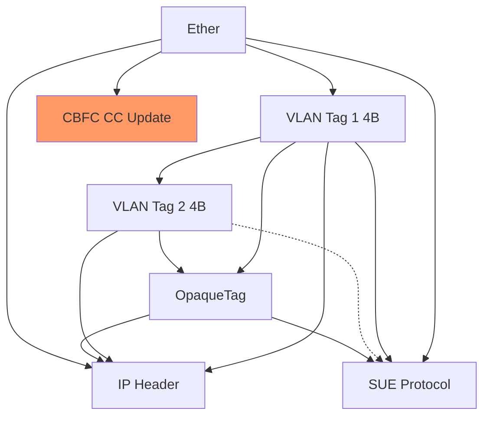
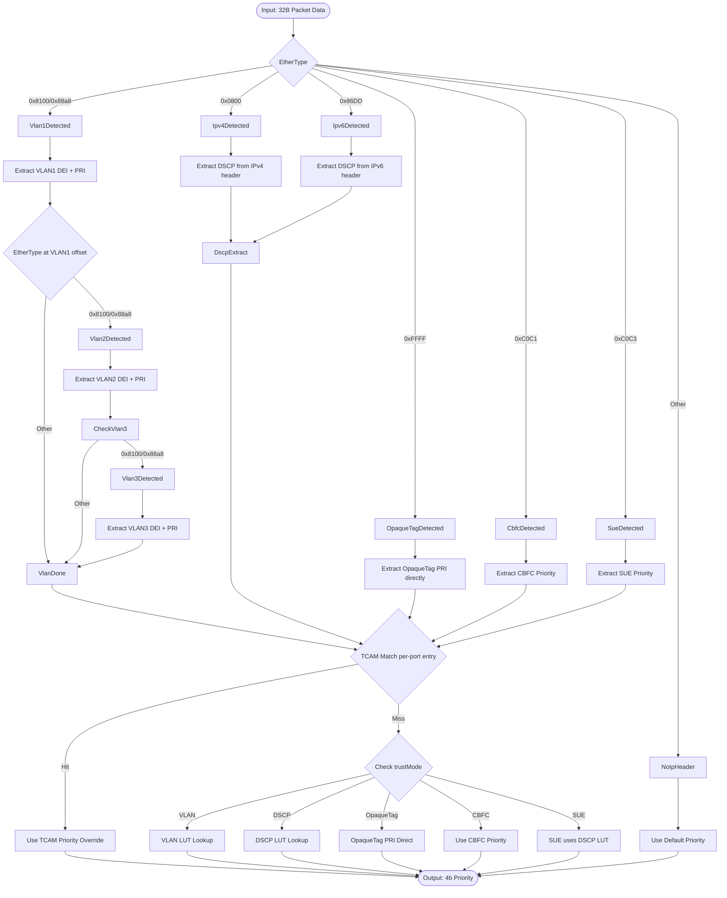
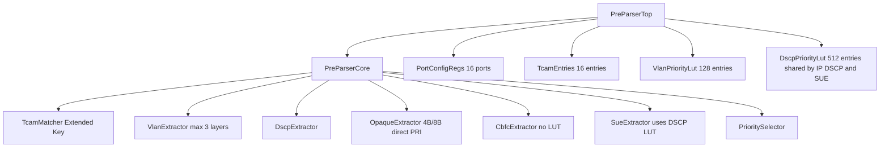

# Pre-Parser Module Design Document

## Revision History

| Version | Date | Author | Description |
|---------|------|--------|-------------|
| 1.0 | 2026-05-12 | - | Initial draft |
| 1.1 | 2026-05-13 | - | Added UEC CBFC CC Update and SUE PRI support, extended TCAM key |

---

## 1. Feature List

### 1.1 Core Features

1. **Packet Priority Extraction**
   - Extract 4-bit priority from packet's first 32 bytes
   - Support VLAN-based priority (DEI + PRI from outermost tag)
   - Support IP-based priority (DSCP from IPv4/IPv6 header)
   - Support OpaqueTag-based priority (4B/8B format, PRI directly used)
   - Support UEC CBFC CC Update priority (configurable per-port)
   - Support UEC SUE PRI priority (uses shared DSCP LUT)

2. **Port-based Trust Mode**
   - Per-port configuration for trust source selection
   - Trust VLAN mode: prioritize VLAN tag information
   - Trust DSCP mode: prioritize IP DSCP information
   - Trust OpaqueTag mode: prioritize OpaqueTag PRI
   - Trust CBFC mode: use configurable CBFC priority
   - Trust SUE mode: prioritize SUE PRI (via DSCP LUT)

3. **Priority Mapping Tables**
   - VLAN priority LUT: 16 ports × 16 priority levels = 128 entries
   - DSCP priority LUT: 16 ports × 64 DSCP values = 512 entries (shared by IP DSCP and SUE PRI)
   - CBFC priority: configurable per-port (no LUT)
   - OpaqueTag PRI: directly used (no LUT)

4. **TCAM-based Priority Override**
   - Per-port TCAM entry for DMAC/SMAC/EtherType matching
   - Extended key: DMAC(48b) + SMAC(48b) + EtherType(16b) = 112b total
   - Maskable matching for all three fields
   - TCAM hit overrides normal priority extraction

5. **Default Priority Handling**
   - Configurable default priority per port
   - Fallback when no priority source is available

---

## 2. Function Description

### 2.1 Overview

The Pre-Parser module is located before the main Parser in the packet processing pipeline. It performs fast priority extraction (4-bit) based on the first 32 bytes of the packet, enabling scheduling decisions before full packet parsing.

### 2.2 Supported Header Layers

The module supports parsing of the following header layers (up to 3 VLAN tags + 1 OpaqueTag + protocol-specific headers):



### 2.3 Priority Extraction Flow



### 2.4 VLAN Tag Parsing (Up to 3 Layers)

The module supports parsing up to 3 layers of VLAN tags (QinQ/QinQinQ):


**VLAN Detection Logic**:
- After parsing DMAC (6B), SMAC (6B), check EtherType at offset 12
- If EtherType = 0x8100 (802.1Q) or 0x88a8 (802.1ad), VLAN tag is present
- Each VLAN tag is 4 bytes: TPID (2B) + TCI (2B)
- After extracting a VLAN tag, check the next 2 bytes for additional VLAN tags
- Maximum 3 VLAN tags can be parsed within 32 bytes
- Priority is extracted from the **outermost** (first) VLAN tag only

**Priority Extraction from VLAN**:
```scala
// TCI (Tag Control Information) at bits[47:32] after TPID
val pri = data(47, 45)    // PCP/Priority (3 bits)
val dei = data(44)        // DEI (1 bit)
val vid = data(43, 32)     // VLAN ID (12 bits)
val vlanPrio = Cat(dei, pri)  // 4-bit: {DEI, PRI[2:0]}
```

### 2.5 OpaqueTag Parsing

OpaqueTag is a custom tag that can appear after VLAN tags and before IP header:

**OpaqueTag Detection**:
- EtherType = 0xFFFF indicates OpaqueTag
- OpaqueTag structure (4 bytes or 8 bytes):
  - bits[3:0]: Format/type (0x1 = custom priority)
  - bits[7:4]: Priority/PRI value (4-bit, no DEI in OpaqueTag)
  - bits[31:8] or bits[63:32]: Reserved/custom data

**Priority Handling**:
- OpaqueTag PRI is extracted directly (4-bit) without LUT mapping
- When trust mode = OpaqueTag, the extracted PRI is used directly as priority

### 2.6 DSCP Priority Extraction

- **EtherType Detection**: Check bits[15:0] for 0x0800 (IPv4) or 0x86DD (IPv6)
- **IPv4 Header Detection**: At offset 14 bytes from packet start
  - Version: bits[3:0] at byte offset 14
  - IHL: bits[7:4] at byte offset 14 (multiply by 4 for header length)
  - DSCP: bits[47:42] at byte offset 17 (after IHL)
- **DSCP Extraction**: 6 bits from IPv4 header
- **LUT Key**: `{portId[3:0], dscp[5:0]}` (9 bits → 512 entries)

### 2.7 UEC CBFC CC Update Priority Extraction

**Protocol Overview**:
- EtherType: 0xC0C1
- CBFC = Credit-Based Flow Control, used for congestion management

**CBFC Payload Structure**:
| Field | Offset (bytes) | Size (bits) |
|-------|----------------|-------------|
| Ethertype | 0 | 16 |
| Version | 1 | 8 |
| Priority | 1.5 | 12 |
| Max_Credit | 2.25 | 32 |
| Accumulated_Credits | 4.25 | 32 |
| reserved | 6.25 | 12 |
| Sequence_Number | 7 | 16 |
| protocol演算法 | 8 | 16 |

**Priority Handling**:
- Priority field is bits[24:35] from CBFC payload start (after EtherType+Version)
- When CBFC message is detected and trust mode = CBFC, use **configurable per-port priority** directly
- No LUT mapping needed - priority is assigned from `cbfcPri` register

**Per-Port CBFC Priority Configuration**:
| Register | Width | Access | Description |
|----------|-------|--------|-------------|
| cbfcPri | 4 | RW | Configurable priority for CBFC CC Update packets |

### 2.8 UEC SUE PRI Priority Extraction

**Protocol Overview**:
- EtherType: 0xC0C3
- SUE = Stream Reservation Protocol, used for stream handling

**SUE Payload Structure**:
| Field | Offset (bytes) | Size (bits) |
|-------|----------------|-------------|
| Ethertype | 0 | 16 |
| Version | 1 | 8 |
| Info | 1.875 | 7 |
| Stream-ID | 2 | 24 |
| **Priority** | **3.5** | **5** |
| Subtype | 3.875 | 8 |
| Length | 4.375 | 16 |
| reserved | 5.125 | 8 |
| TSPEC | 5.625 | 48 |

**Priority Handling**:
- Priority field is bits[56:60] from SUE payload start
- 5-bit priority value uses the **shared DSCP LUT**
- SUE PRI and IP DSCP share the same LUT: `{portId[3:0], pri[4:0]}` (8 bits → 512 entries)

### 2.9 Extended TCAM Matching

For each port, TCAM entry contains extended key fields:

**Extended TCAM Entry**:
```scala
class TcamEntry extends Bundle {
  val dmacMask = UInt(48.W)
  val dmacValue = UInt(48.W)
  val smacMask = UInt(48.W)
  val smacValue = UInt(48.W)
  val etherTypeMask = UInt(16.W)
  val etherTypeValue = UInt(16.W)
  val priority = UInt(4.W)
  val valid = Bool()
}
```

**Match Logic**:
```scala
val dmac = data(47, 0)
val smac = data(95, 48)
val etherType = data(111, 96)

val dmacMatch = ((dmac ^ entry.dmacValue) & entry.dmacMask) === 0.U
val smacMatch = ((smac ^ entry.smacValue) & entry.smacMask) === 0.U
val etherTypeMatch = ((etherType ^ entry.etherTypeValue) & entry.etherTypeMask) === 0.U

val tcam_hit = entry.valid && dmacMatch && smacMatch && etherTypeMatch
```

**Priority Override**: When `tcam_hit === true`, use `tcamEntry.priority` instead of LUT result.

---

## 3. Module and Sub-Module Description

### 3.1 Module Hierarchy



### 3.2 PreParserTop

**Purpose**: Top-level module providing complete Pre-Parser functionality with all configuration registers.

**Parameters**:
| Parameter | Type | Default | Description |
|-----------|------|---------|-------------|
| portCount | Int | 16 | Number of ports |
| bytesToParse | Int | 32 | Bytes to parse from packet |
| tcamDepth | Int | 16 | TCAM depth (equals portCount) |
| maxVlanLayers | Int | 3 | Maximum VLAN layers to parse |

**IO Interface**:
```scala
// Input
val in_data = Input(UInt(256.W))    // 32 bytes packet data
val in_portId = Input(UInt(4.W))     // Port ID (0-15)
val in_valid = Input(Bool())

// Output
val out_priority = Output(UInt(4.W))
val out_valid = Output(Bool())
```

**Configuration Registers** (per port):
| Register | Width | Access | Description |
|----------|-------|--------|-------------|
| trustMode | 3 | RW | 000=VLAN, 001=DSCP, 010=OpaqueTag, 011=CBFC, 100=SUE |
| tcamEnable | 1 | RW | Enable TCAM override |
| defaultPri | 4 | RW | Default priority |
| cbfcPri | 4 | RW | Configurable priority for CBFC CC Update packets |

### 3.3 PreParserCore

**Purpose**: Core processing logic for priority extraction.

**Input**: 32-byte packet data, port ID
**Output**: 4-bit priority, valid signal

**Sub-modules**:
1. **TcamMatcher**: Performs DMAC/SMAC/EtherType mask matching against per-port TCAM entry
2. **VlanExtractor**: Detects up to 3 VLAN tags and extracts DEI+PRI from outermost
3. **DscpExtractor**: Detects IPv4/IPv6 and extracts DSCP
4. **OpaqueExtractor**: Detects OpaqueTag (4B/8B) and extracts PRI directly (no LUT)
5. **CbfcExtractor**: Detects CBFC (0xC0C1) - uses configurable priority from port config
6. **SueExtractor**: Detects SUE (0xC0C3) - uses shared DSCP LUT
7. **PrioritySelector**: Multiplexes between TCAM, VLAN, DSCP, OpaqueTag, CBFC, and SUE paths

### 3.4 PortConfigRegs

**Purpose**: Stores per-port configuration.

**Structure**:
```scala
class PortConfig extends Bundle {
  val trustMode = UInt(3.W)    // 000=VLAN, 001=DSCP, 010=OpaqueTag, 011=CBFC, 100=SUE
  val tcamEnable = Bool()
  val defaultPri = UInt(4.W)
  val cbfcPri = UInt(4.W)      // Configurable priority for CBFC packets
}
```

**Count**: 16 entries (one per port)

### 3.5 Extended TcamEntries

**Purpose**: Stores TCAM entries for DMAC/SMAC/EtherType matching.

**Structure**:
```scala
class TcamEntry extends Bundle {
  val dmacMask = UInt(48.W)
  val dmacValue = UInt(48.W)
  val smacMask = UInt(48.W)
  val smacValue = UInt(48.W)
  val etherTypeMask = UInt(16.W)
  val etherTypeValue = UInt(16.W)
  val priority = UInt(4.W)
  val valid = Bool()
}
```

**Count**: 16 entries (one per port)

### 3.6 VlanPriorityLut

**Purpose**: Maps {portId, vlanPrio} to final priority.

**Size**: 128 entries × 4 bits
**Key Format**: `{portId[3:0], vlanPrio[3:0]}` (7 bits)
**Value Format**: 4-bit priority

### 3.7 DscpPriorityLut

**Purpose**: Maps {portId, pri} to final priority. Shared by IP DSCP and SUE PRI.

**Size**: 512 entries × 4 bits
**Key Format**:
- For IP DSCP: `{portId[3:0], dscp[5:0]}` (9 bits)
- For SUE PRI: `{portId[3:0], suePrio[4:0]}` (8 bits)
**Value Format**: 4-bit priority

---

## 4. Data Structure

### 4.1 Configuration Structures

#### PreParserConfig
```scala
case class PreParserConfig(
  portCount: Int = 16,
  bytesToParse: Int = 32,
  tcamDepth: Int = 16,
  maxVlanLayers: Int = 3
)
```

#### PortConfig
```scala
class PortConfig extends GenBundle {
  val trustMode = UInt(3.W)      // 000=VLAN, 001=DSCP, 010=OpaqueTag, 011=CBFC, 100=SUE
  val tcamEnable = Bool()
  val defaultPri = UInt(4.W)
  val cbfcPri = UInt(4.W)        // Configurable priority for CBFC packets
}
```

### 4.2 Extended TCAM Structures

#### TcamEntry
```scala
class TcamEntry extends GenBundle {
  val dmacMask = UInt(48.W)
  val dmacValue = UInt(48.W)
  val smacMask = UInt(48.W)
  val smacValue = UInt(48.W)
  val etherTypeMask = UInt(16.W)
  val etherTypeValue = UInt(16.W)
  val priority = UInt(4.W)
  val valid = Bool()
}
```

### 4.3 IO Structures

#### PreParserInput
```scala
class PreParserInput extends GenBundle {
  val data = UInt(256.W)    // 32 bytes
  val portId = UInt(4.W)
  val valid = Bool()
}
```

#### PreParserOutput
```scala
class PreParserOutput extends GenBundle {
  val priority = UInt(4.W)
  val valid = Bool()
}
```

### 4.4 Internal Data Structures

#### VlanExtractResult
```scala
class VlanExtractResult extends Bundle {
  val vlanCount = UInt(2.W)       // Number of VLAN tags found (0-3)
  val vlanPrio = UInt(4.W)        // DEI + PRI from outermost VLAN
  val vlanVid = UInt(12.W)        // VID from outermost VLAN
  val hasOpaqueTag = Bool()
  val hasIp = Bool()
  val hasCbfc = Bool()
  val hasSue = Bool()
  val dscp = UInt(6.W)
}
```

#### OpaqueExtractResult
```scala
class OpaqueExtractResult extends Bundle {
  val isValid = Bool()
  val format = UInt(4.W)
  val length = UInt(2.W)         // 0=4B, 1=8B (in 4B units)
  val priority = UInt(4.W)      // PRI directly extracted (no LUT)
}
```

#### CbfcExtractResult
```scala
class CbfcExtractResult extends Bundle {
  val isValid = Bool()
  val priority = UInt(12.W)       // 12-bit priority from CBFC
}
```

#### SueExtractResult
```scala
class SueExtractResult extends Bundle {
  val isValid = Bool()
  val priority = UInt(5.W)        // 5-bit priority from SUE
}
```

#### PriorityResult
```scala
class PriorityResult extends Bundle {
  val priority = UInt(4.W)
  val source = UInt(3.W)         // 0=default, 1=tcam, 2=vlan, 3=dscp, 4=opaque, 5=cbfc, 6=sue
  val valid = Bool()
}
```

---

## 5. Error Handling

### 5.1 Error Conditions

| Condition | Detection | Handling |
|-----------|-----------|----------|
| No VLAN, OpaqueTag, IP, CBFC, or SUE header | EtherType not recognized | Use default priority |
| VLAN priority extraction but trust mode is DSCP | trustMode=001 | Skip VLAN, use DSCP path |
| DSCP extraction but trust mode is VLAN | trustMode=000 | Skip DSCP, use VLAN path |
| OpaqueTag extraction but trust mode is VLAN | trustMode=000 | Skip OpaqueTag, use VLAN path |
| CBFC extraction but trust mode is SUE | trustMode=100 | Skip CBFC, use SUE path |
| SUE extraction but trust mode is CBFC | trustMode=011 | Skip SUE, use CBFC path |
| TCAM entry invalid | valid=false | Skip TCAM match |
| TCAM match fails | No mask match | Use normal priority path |
| VLAN count exceeds max (3) | vlanCount > 3 | Stop parsing, use partial result |
| OpaqueTag format invalid | format != 0x1 | Skip OpaqueTag, treat as no opaque |
| CBFC version invalid | version != expected | Skip CBFC, treat as no cbfc |
| SUE version invalid | version != expected | Skip SUE, treat as no sue |

### 5.2 Error Codes

```scala
object PreParserErrorCode extends ChiselEnum {
  val None = 0.U(4.W)
  val NoVlanNoIpNoProtocol = 1.U(4.W)    // No VLAN/IP/Protocol found, using default
  val InvalidEtherType = 2.U(4.W)
  val VlanOverflow = 3.U(4.W)              // More than 3 VLAN layers
  val InvalidOpaqueFormat = 4.U(4.W)      // OpaqueTag format not supported
  val InvalidCbfcVersion = 5.U(4.W)      // CBFC version not supported
  val InvalidSueVersion = 6.U(4.W)       // SUE version not supported
}
```

### 5.3 Error Propagation

- Error information is not typically passed out of Pre-Parser
- Error conditions result in default priority selection
- Priority result always includes valid signal indicating confidence

---

## 6. Initialization

### 6.1 Register Initialization

| Register | Reset Value | Description |
|----------|-------------|-------------|
| trustMode | 0 | Default to trust VLAN (000) |
| tcamEnable | false | TCAM disabled by default |
| defaultPri | 0 | Priority 0 as default |
| cbfcPri | 0 | CBFC priority 0 as default |
| TcamEntry.valid | false | All TCAM entries invalid |

### 6.2 Memory Initialization

#### VLAN Priority LUT
- Initialize with pass-through mapping: output = input priority
- May be overwritten by software with custom mappings

#### DSCP Priority LUT
- Initialize with pass-through mapping: output = pri[5:2] for DSCP, pri for SUE
- Shared by IP DSCP and SUE PRI
- May be overwritten by software with custom mappings

### 6.3 Configuration Sequence

1. **Power-on reset**: All registers set to default values
2. **Software initialization**:
   - Configure port trust modes (VLAN/DSCP/OpaqueTag/CBFC/SUE)
   - Program TCAM entries if used
   - Program priority LUT values
   - Enable TCAM per port if needed
3. **Runtime updates**: Registers can be updated on-the-fly

### 6.4 Default Behavior

When uninitialized:
- All ports trust VLAN (trustMode=000)
- TCAM disabled
- Default priority = 0
- LUT tables contain pass-through values

---

## Appendix A: Bit Field Map for 32-Byte Input

```
Byte[0]   [7:0]   DMAC[7:0]
Byte[1]   [7:0]   DMAC[15:8]
Byte[2]   [7:0]   DMAC[23:16]
Byte[3]   [7:0]   DMAC[31:24]
Byte[4]   [7:0]   DMAC[39:32]
Byte[5]   [7:0]   DMAC[47:40]

Byte[6]   [7:0]   SMAC[7:0]
Byte[7]   [7:0]   SMAC[15:8]
Byte[8]   [7:0]   SMAC[23:16]
Byte[9]   [7:0]   SMAC[31:24]
Byte[10]  [7:0]   SMAC[39:32]
Byte[11]  [7:0]   SMAC[47:40]

Byte[12]  [7:0]   EtherType[7:0]
Byte[13]  [7:0]   EtherType[15:8]

[If VLAN Layer 1 (0x8100 or 0x88a8):]
Byte[14]  [7:0]   VLAN1 TPID[7:0]
Byte[15]  [7:0]   VLAN1 TPID[15:8]
Byte[16]  [7:0]   VLAN1 TCI[7:0]  -- PCP[2:0], DEI
Byte[17]  [7:0]   VLAN1 TCI[15:8] -- VID[7:0]

[If VLAN Layer 2 (after VLAN1):]
Byte[18]  [7:0]   VLAN2 TPID[7:0]
Byte[19]  [7:0]   VLAN2 TPID[15:8]
Byte[20]  [7:0]   VLAN2 TCI[7:0]  -- PCP[2:0], DEI
Byte[21]  [7:0]   VLAN2 TCI[15:8] -- VID[7:0]

[If VLAN Layer 3 (after VLAN2):]
Byte[22]  [7:0]   VLAN3 TPID[7:0]
Byte[23]  [7:0]   VLAN3 TPID[15:8]
Byte[24]  [7:0]   VLAN3 TCI[7:0]  -- PCP[2:0], DEI
Byte[25]  [7:0]   VLAN3 TCI[15:8] -- VID[7:0]

[If OpaqueTag (0xFFFF):]
Byte[26]  [7:0]   OpaqueTag Format[3:0], Reserved[7:4]
Byte[27]  [7:0]   OpaqueTag Priority[3:0], Reserved[7:4]
Byte[28-29] [7:0] OpaqueTag Data (optional for 8B format)

[If CBFC (0xC0C1):]
Byte[14]  [7:0]   CBFC Version
Byte[15-16] [11:0] CBFC Priority[11:4]
Byte[17]  [3:0]   CBFC Priority[3:0]

[If SUE (0xC0C3):]
Byte[14]  [7:0]   SUE Version
Byte[15-17] [23:0] SUE Stream-ID
Byte[17-18] [4:0] SUE Priority[4:0]
```

### OpaqueTag Structure (4 bytes or 8 bytes)

| Field | Bits | Description |
|-------|------|-------------|
| Format | 3:0 | 0x1 = Custom Priority, 0x0 = Reserved, others = Future |
| Priority | 7:4 | 4-bit PRI value (no DEI in OpaqueTag) |
| Reserved | 31:8 or 63:32 | Reserved for future use or custom data |

### CBFC CC Update Structure

| Field | Offset (bytes) | Size (bits) | Description |
|-------|----------------|-------------|-------------|
| Ethertype | 0 | 16 | 0xC0C1 |
| Version | 1 | 8 | Protocol version |
| Priority | 1.5 | 12 | Priority value (bits 24-35 from payload start) |
| Max_Credit | 2.25 | 32 | Maximum credit |
| Accumulated_Credits | 4.25 | 32 | Accumulated credits |
| reserved | 6.25 | 12 | Reserved |
| Sequence_Number | 7 | 16 | Sequence number |
| protocol演算法 | 8 | 16 | Protocol algorithm |

### SUE PRI Structure

| Field | Offset (bytes) | Size (bits) | Description |
|-------|----------------|-------------|-------------|
| Ethertype | 0 | 16 | 0xC0C3 |
| Version | 1 | 8 | Protocol version |
| Info | 1.875 | 7 | Information field |
| Stream-ID | 2 | 24 | Stream identifier |
| Priority | 3.5 | 5 | Priority value (bits 56-60 from payload start) |
| Subtype | 3.875 | 8 | Message subtype |
| Length | 4.375 | 16 | Message length |
| reserved | 5.125 | 8 | Reserved |
| TSPEC | 5.625 | 48 | Traffic specification |

---

## Appendix B: Priority Source Summary

| Source | EtherType | Priority Extraction | LUT Used |
|--------|-----------|---------------------|----------|
| VLAN | 0x8100/0x88a8 | DEI + PRI from outermost (4-bit) | VlanPriorityLut |
| IP DSCP | 0x0800/0x86DD | DSCP from header (6-bit) | DscpPriorityLut (shared) |
| OpaqueTag | 0xFFFF | PRI directly (4-bit) | None (direct) |
| CBFC | 0xC0C1 | Configurable per-port | None (register) |
| SUE | 0xC0C3 | PRI from header (5-bit) | DscpPriorityLut (shared) |

---

## Appendix C: Document History

- 2026-05-12: Initial version created
- 2026-05-13: Added UEC CBFC CC Update and SUE PRI support, extended TCAM key to include EtherType