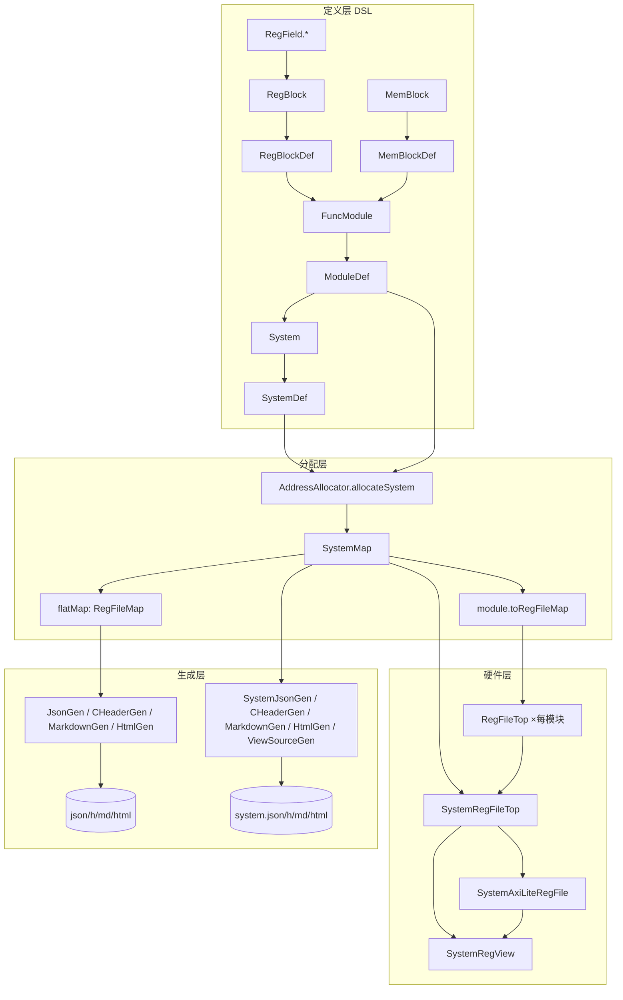

# RegCbb 系统级架构设计文档（v2.1）

> 本文档描述 RegCbb_v2 的**系统级扩展**：多功能模块 / 多寄存器块（RegBlock）/ 多存储器块（MemBlock）组合、
> 模块间地址自动/手工分配、系统级地址译码分发汇聚、纯 IR 文档生成。
> 配套：`docs/BaseCbb_设计文档/13_RegCbb.md`（单块架构）、`docs/寄存器编写指导.md`（定义指南）。

---

## 1. 系统级设计目标（对应需求 6 项）

| # | 需求 | 实现 |
|---|------|------|
| 1 | 功能片段可组合：多个 RegBlock 合入一个功能模块 | `ModuleDef.regBlocks`（可多个） |
| 2 | Reg 和 Memory 采用不同的 RegBlock | `RegBlockDef`（纯寄存器）/ `MemBlockDef`（纯存储器）分离 |
| 3 | 系统含多模块，地址自动/手工分配 | `SystemDef.modules` + `AddressAllocator.allocateSystem`（自动跳过占用 / 手工指定） |
| 4 | 模块间地址译码与分发汇聚 | `SystemRegFileTop`（模块命中译码 → 分发 → MuxCase 汇聚）；AXI 版 `SystemAxiLiteRegFile` |
| 5 | 不依赖外围逻辑可生成文档 | 全部 `gen/*`（含 `SystemGen`）仅消费 IR + 分配结果 |
| 6 | 完整设计文档 | 本文档 |

---

## 2. 层级模型

```
┌─────────────────────────────────────────────────────────────┐
│ SystemDef（系统）                                            │
│  ┌────────────────────┐   ┌────────────────────┐            │
│  │ ModuleDef A        │   │ ModuleDef B        │            │
│  │  baseAddress: 手工  │   │  baseAddress: 自动  │            │
│  │  ┌───────────────┐ │   │  ┌───────────────┐ │            │
│  │  │ RegBlockDef A1│ │   │  │ RegBlockDef B1│ │            │
│  │  │  (RegDef × n) │ │   │  │  (RegDef × n) │ │            │
│  │  └───────────────┘ │   │  └───────────────┘ │            │
│  │  ┌───────────────┐ │   │  ┌───────────────┐ │            │
│  │  │ RegBlockDef A2│ │   │  │ MemBlockDef B1│ │            │
│  │  │  (RegDef × m) │ │   │  │  (MemoryDef×k)│ │            │
│  │  └───────────────┘ │   │  └───────────────┘ │            │
│  │  ┌───────────────┐ │   └────────────────────┘            │
│  │  │ MemBlockDef A1│ │                                     │
│  │  │  (MemoryDef×j)│ │                                     │
│  │  └───────────────┘ │                                     │
│  └────────────────────┘                                     │
└─────────────────────────────────────────────────────────────┘
```

**关键区别（相对 v2.0）**：
- v2.0：`RegBlockDef` = 寄存器 + 存储器混合的单块，地址内嵌块定义。
- v2.1：`RegBlockDef`（纯寄存器）与 `MemBlockDef`（纯存储器）**分离**；地址**上移**到模块/系统层，由分配器统一管理。

---

## 3. IR 层（Def.scala）

### 3.1 RegBlockDef — 纯寄存器块（功能片段）

```scala
case class RegBlockDef(name: String, registers: Seq[RegDef], description: String = "")
// byteSize = Σ reg.byteSize（寄存器字对齐后的字节数）
```
- 校验：至少 1 个寄存器、寄存器名不重复。
- 语义：一个"寄存器功能片段"（如"控制/状态组"、"数据/测试组"），可独立复用、组合进任意模块。

### 3.2 MemBlockDef — 纯存储器块

```scala
case class MemBlockDef(name: String, memories: Seq[MemoryDef], description: String = "")
// byteSize = Σ mem.byteSize
```
- 校验：至少 1 个存储器、存储器名不重复。
- 语义：与 RegBlockDef **分离**的存储器片段（地址空间独立管理）。

### 3.2.1 MemoryDef — 存储器（支持 entry 域段）

```scala
case class MemoryDef(
  name: String, depth: Int, dataWidth: Int,
  memType: MemoryAccessType = SP,
  baseAddress: Option[BigInt] = None,
  description: String = "",
  atomic: Boolean = true,
  entryFields: Seq[RegFieldDef] = Seq.empty,   // ★ entry 域段（可选）
) {
  val entryFieldOffsets: Seq[Int]   // 占据位宽内 LSB-first 紧凑位偏移
  val expandedDataWidth: Int        // ★ 规则 3：>32bit 时占据 2 的幂宽度（如 96→128）
  val dataBaseOffset: Int           // ★ 规则 3：>32bit 时有效数据从高 bit 位开始放
}
object MemoryDef { def fromBundle(name, depth, fields, ...): MemoryDef }  // ★ dataWidth 自动取字段位宽和
```

**★ 布局规则（寄存器与存储器统一）**：
1. **位域图（bit diagram / HTML bitfield）**：小端序显示，**左边=高 bit 位、右边=低 bit 位**（MSB-first）。
2. **字段表格（Markdown/HTML/JSON 字段表）**：**先打印高 bit 位，再打印低 bit 位**（MSB-first）。
3. **字节序**：**每 word（32bit）内部小端**（bit0=LSB）；**word 间顺序为大端**（低地址=高有效 word）。
4. **地址布局**：
   - 寄存器/存储器总位宽 **≤ 32bit**：占据 32bit（1 word），有效数据**右对齐在低 bit 位**（bit[0..w-1]）；
   - 寄存器/存储器总位宽 **> 32bit**：占据**能容纳其位宽的 2 的幂**宽度（如 40→64、96→128），
     **有效数据从高 bit 位开始放**（低 bit 位为 padding 0）。字段/entry 位偏移从 `expandedBits - totalBits` 起；
     多字访问按 **word 间大端**：`wordSel=0`（低地址）为最高有效 word，原子提交发生在写 `wordSel=0`。

**★ entry 域段（MemoryDef.entryFields）**：
- 每个 entry 的字段布局（**声明顺序 = LSB-first 紧凑排列**，即声明在前的字段占低位；`entryFieldOffsets` 为对应位偏移，含规则 3 的 `dataBaseOffset`），位宽和必须 == `dataWidth`（校验）。
- **来源可为 RegBundle**：`MemoryDef.fromBundle` / `MemBuilder.bundle(...)` 自动推导 dataWidth；
  Chisel `Bundle.elements` 返回声明逆序，`toEntryFields` 内部 `reverse` 恢复声明序，保证 tag→LSB。
- 域段信息输出到所有文档，**字段表格按规则 2 MSB-first 排列**（高位在上）：
  JSON（`entryFields` 数组按 bitOffset 降序）、C 头（`_MEM_<FIELD>_MASK/_SHIFT` 宏）、
  Markdown/HTML（entry 域段表：位/字段/访问/复位/描述/枚举，高位在上）。
- 硬件语义：entry 域段是**元数据**（软件视图），不影响总线访问路径（整字读写仍按占据位宽原子/非原子处理）。
- 硬件语义：entry 域段是**元数据**（软件视图），不影响总线访问路径（整字读写仍按 dataWidth 原子/非原子处理）。

**示例**（RegBundle 定义 entry）：
```scala
class FifoDescEntry extends RegBundle {
  val desc = new RegBundle {           // 嵌套 = 一组连续域段
    val tag = UInt(8.W)
    val len = UInt(16.W)
    Attr += (tag -> FieldAttr("描述标签"))
    Attr += (len -> FieldAttr("数据长度"))
  }
  val crc = UInt(8.W)                  // 叶子 = 单域段
  Attr += (crc -> FieldAttr("CRC 校验"))
}
// DSL：mm.bundle(new FifoDescEntry) → dataWidth=32, tag[7:0]|len[23:8]|crc[31:24]
// 直接：MemoryDef.fromBundle("rx_desc", 32, BundleToRegDefs.toEntryFields(new FifoDescEntry))
```

### 3.3 ModuleDef — 功能模块

```scala
case class ModuleDef(
  name: String,
  regBlocks: Seq[RegBlockDef] = Seq.empty,   // 可多个
  memBlocks: Seq[MemBlockDef] = Seq.empty,   // 可多个
  baseAddress: Option[BigInt] = None,        // None = 系统自动；Some = 手工
  memBaseAddress: Option[BigInt] = None,     // None = 自动紧随寄存器区；Some = 手工
  description: String = ""
)
// regByteSize / memByteSize / allRegisters / allMemories
```
- 校验：至少 1 个块、块名不重复（regBlocks 内、memBlocks 内各自唯一）。

### 3.4 SystemDef — 系统

```scala
case class SystemDef(
  name: String,
  modules: Seq[ModuleDef],
  deviceName: String = "",
  description: String = ""
)
// devName / allRegisters / allMemories
```

---

## 4. 地址分配层（AddressAllocator.scala）

### 4.1 分配结果类型

```scala
case class RegBlockAllocation(block: RegBlockDef, baseAddress: BigInt, regs: Seq[RegAllocation])
case class MemBlockAllocation(block: MemBlockDef, baseAddress: BigInt, mems: Seq[MemAllocation])
case class ModuleAllocation(module: ModuleDef, baseAddress: BigInt,
                            regBlocks: Seq[RegBlockAllocation], memBlocks: Seq[MemBlockAllocation],
                            memBaseAddress: BigInt) {
  def regByteSize / memByteSize / sizeBytes / allRegs / allMems
  def toRegFileMap: RegFileMap      // 模块级映射（供模块 RegFileTop / 单模块文档）
}
case class SystemMap(system: SystemDef, modules: Seq[ModuleAllocation]) {
  def allRegsAbsolute: Seq[RegAllocation]   // 平铺（byteOffset = 绝对地址）
  def allMemsAbsolute: Seq[MemAllocation]
  def flatMap: RegFileMap                   // 系统级平铺映射（供 io.user / 系统文档）
  def moduleByName / regByName
  def summarize: String
}
```

### 4.2 分配算法（allocateSystem）

```
next = moduleBaseAddress（默认 0）
for module in system.modules:
  base = module.baseAddress.getOrElse(next)          # 自动或手工
  # 寄存器区：各 RegBlock 连续排布（字段 LSB-first、寄存器 word 对齐）
  regOff = 0
  for rb in module.regBlocks:
    rbBase = base + regOff
    regs   = allocateRegisters(rb.registers) 偏移 + regOff
    regOff += rb.byteSize
  # 存储器区：module.memBaseAddress 或 align4(base + regOff)
  memOff = module.memBaseAddress.getOrElse(align4(base + regOff))
  for mb in module.memBlocks: 连续分配 mem.baseAddress
  end = align4(memOff); next = max(next, end)        # 跳过已占用（含手工模块）
```

- **自动**：模块基址从系统起点起连续分配，自动跳过先前模块占用区（含手工指定模块占用的区域）。
- **手工**：`module.baseAddress = Some(x)` / `module.memBaseAddress = Some(y)`，分配器保证不与其它区域重叠。

### 4.3 兼容便捷入口

- `allocate(block: RegBlockDef, regBaseAddress = 0): RegFileMap` —— 纯寄存器单块。
- `allocateModule(m: ModuleDef): ModuleAllocation` —— 单模块。
- `allocate(registers, memories, regBase, memBase, name, deviceName, desc)` —— 旧式混合块迁移期使用（内部拆为 RegBlock + MemBlock）。

---

## 5. 硬件层（hw/）

### 5.1 SystemRegFileTop — 系统级译码分发汇聚

```scala
class SystemRegFileTop(sysMap: SystemMap, addrWidth = 32, dataWidth = 32) extends Module
// io.wr/rd/addr/wdata/rdata：系统总线（字节地址，32bit）
// io.user：RegUserRecord（全系统所有模块寄存器平铺）
// io.memPorts：MemPortRecord（全系统所有模块存储器平铺）
```

**两级译码结构**：
```
系统总线 (wr/rd/addr/wdata)
   │
   ▼ 模块命中译码（moduleHits = addr ∈ [ma.base, ma.base + ma.sizeBytes)）
   ├──► Module uart 的 RegFileTop（模块内再按寄存器/memory 地址译码）
   ├──► Module gpio 的 RegFileTop
   └──► 未命中 → 无模块接收
   │
   ▼ 读数据汇聚
io.rdata := MuxCase(0, moduleHits.zip(moduleRdata))
```

- **分发**：`wr/rd` 只发给命中模块（`top.io.wr := io.wr && hit`），未命中模块输入冻结，天然隔离。
- **汇聚**：读数据按模块命中 MuxCase 选择，未命中返回 0。
- **用户面**：全系统寄存器/存储器平铺 Record，`SystemRegView` 提供模块分组命名。
- **每模块一个 RegFileTop 实例**（`module_<name>` 命名），模块内复用 v2.0 的全部寄存器/存储器语义
  （多字原子、W1C/RC、MemPortIO 请求-响应等）。

### 5.2 SystemAxiLiteRegFile — AXI4-Lite 系统包装

```scala
class SystemAxiLiteRegFile(sysMap, addrWidth = 32, dataWidth = 32)
// io.axi：AxiLiteBusIO；io.user / io.memPorts 同 SystemRegFileTop
```
- 内部包装 `SystemRegFileTop`，AXI→简单总线转换逻辑与 `AxiLiteRegFile` 相同（单笔在途写、读 1 拍延迟）。

### 5.3 SystemRegView — 三级命名访问

```scala
class SystemRegView(sysMap: SystemMap, flatView: RegView) {
  def reg(name): RegHandle                       // 全系统平铺（寄存器名全局唯一）
  def module(name): ModuleRegHandle              // 模块级
  def modules: Seq[ModuleRegHandle]
}
class ModuleRegHandle {
  def reg(name): RegHandle                       // 模块内寄存器
  def regs: Seq[RegHandle]
  def block(name): BlockRegHandle                // 模块 → 寄存器块
  def blocks: Seq[BlockRegHandle]
  def memBlock(name): MemBlockHandle             // 模块 → 存储器块
}
class BlockRegHandle { def reg(name): RegHandle; def regs: Seq[RegHandle] }
class MemBlockHandle { def mems: Seq[MemAllocation] }
```

用法：
```scala
sysRegs.module("uart").block("ctrl_regs").reg("ctrl").field("baud_div").value
sysRegs.module("gpio").reg("gpio_ctl").field("out").value
sysRegs.reg("scratch")                                  // 平铺
```

---

## 6. DSL 层（dsl/RegBlockDsl.scala）

| 构造器 | 返回 | 说明 |
|--------|------|------|
| `RegField.rw/ro/wo/rc/rs/w1c/w1s/w1t(...)` | RegFieldDef | 字段级入口（不变） |
| `RegBlock(name) { b => b.reg(...); b.regs(Seq) }` | **RegBlockDef** | 纯寄存器块（b 无 mem 方法） |
| `MemBlock(name) { mb => mb.mem(...); mb.mems(Seq) }` | **MemBlockDef** | 纯存储器块（`mm.bundle(new EntryBundle)` 支持 entry 域段来自 RegBundle，dataWidth 自动推导） |
| `FuncModule(name) { m => m.regBlock(rb); m.memBlock(mb); m.baseAddress(x); m.memBaseAddress(y) }` | **ModuleDef** | 功能模块（`FuncModule` 避免与 chisel3.Module 冲突；便捷 `m.reg(...)`/`m.mem(...)` 自动聚合为单块） |
| `System(name) { s => s.module(md); s.device(...); s.desc(...) }` | **SystemDef** | 系统 |

示例（完整见 `demo/UartDemo.scala`）：
```scala
val sys = System("uart_system") { s =>
  s.device("UART")
  s.module(FuncModule("uart") { m =>
    m.baseAddress(0x40000000L); m.memBaseAddress(0x40001000L)
    m.regBlock(RegBlock("ctrl_regs") { b =>
      b.reg("ctrl") { r => r.field(RegField.rw("tx_en", 1)); r.field(RegField.ro("version", 4)) }
      b.reg("irq_w1c") { r => r.field(RegField.w1c("tx_done", 1)) }
    })
    m.regBlock(RegBlock("data_regs") { b => b.reg("scratch"){...}; b.regs(BundleToRegDefs.toRegDefs(bundle)) })
    m.memBlock(MemBlock("uart_mems") { mb =>
      mb.mem("tx_fifo") { mm => mm.depth(64).dataWidth(64).sp().atomic() }
    })
  })
  s.module(FuncModule("gpio") { m => m.regBlock(...) })   // 自动地址
}
```

---

## 7. 生成层（gen/）

### 7.1 单块生成器（适配后，RegFileMap 参数不变）

`JsonGen` / `CHeaderGen` / `MarkdownGen` / `HtmlGen` / `ViewSourceGen` —— 输入 `RegFileMap`（模块级）。

### 7.2 系统级生成器（新增 gen/SystemGen.scala）

| 生成器 | 输出 | 内容 |
|--------|------|------|
| `SystemJsonGen.generate(sysMap)` | `*.json` | 系统 + 模块列表（基址/sizeBytes）+ 寄存器块/存储器块树 + 字段 |
| `SystemCHeaderGen.generate(sysMap)` | `*.h` | 每模块 `_BASE` 宏 + 每寄存器地址/字段 MASK/SHIFT/RST 宏（`DEV_MOD_REG_FIELD` 三级） |
| `SystemMarkdownGen.generate(sysMap)` | `*.md` | 系统地址总览 + 每模块/每寄存器块/每寄存器位域表 + 存储器块表 |
| `SystemHtmlGen.generate(sysMap)` | `*.html` | 同 Markdown 的 HTML 版（自包含 CSS），**含左侧侧边栏模块导航**（可折叠，点击跳转模块/寄存器块/寄存器/存储器）+ **每模块"寄存器一览"表**（寄存器名/绝对地址/大小/访问/复位/功能概述，名称可跳转到详细说明）+ 全部锚点（`#mod_*`/`#blk_*`/`#reg_*`/`#mem_*`，`:target` 高亮） |
| `SystemViewSourceGen.generate(sysMap, className, pkg)` | `*.scala` | 三级具名视图类：`class SysRegs(view){ val uart = view.module("uart"); val uartCtrlRegs = view.module("uart").block("ctrl_regs") }` |

**关键点（需求 5）**：所有生成器只消费 `SystemMap`（IR + 分配结果），**不实例化任何硬件模块、不依赖外围逻辑**，因此定义完备即可生成完整文档。

---

## 8. Demo（demo/UartDemo.scala）

| 类 | 说明 |
|----|------|
| `UartDemoDef.build` | 系统定义：`uart` 模块（2 个 RegBlock + 1 个 MemBlock）+ `gpio` 模块（自动地址） |
| `UartDemo` / `UartAxiDemo` | 单模块（uart）总线/AXI 版（兼容 v2.0 用法，取 `sysMap.moduleByName("uart").toRegFileMap`） |
| `UartSystemDemo` / `UartSystemAxiDemo` | **系统级**：SystemRegFileTop / SystemAxiLiteRegFile + SystemRegView 三级访问 + 外部 SRAM 挂接 |
| `EmitAll` | 一键生成：system.json/.h/.md/.html/SystemRegs.scala + uart_regs.* + 4 个 Verilog |

实测地址布局：
```
Module uart   @ 0x40000000 (手工)    RegBlock ctrl_regs @ 0x40000000（ctrl/status/tx/rx/irq）
                                    RegBlock data_regs @ 0x40000018（scratch/data64/.../bundle）
                                    MemBlock uart_mems @ 0x40001000（tx_fifo 0x1000 / tx_fifo_plain 0x1200）
Module gpio   @ 0x40001400 (自动)    RegBlock gpio_regs @ 0x40001400（gpio_ctl/gpio_irq）
```

---

## 9. 代码调用关系图



**数据流**：`SystemDef → allocateSystem → SystemMap` 为单一事实源，向下分叉为
① 硬件（SystemRegFileTop 内每模块 RegFileTop）② 用户视图（SystemRegView）③ 文档/软件视图（gen/*）。
任何一层都不修改定义，仅消费 IR —— 保证"一次定义，多处派生"。

---

## 10. 文件清单（v2.1 变更）

| 文件 | 变更 |
|------|------|
| `Def.scala` | RegBlockDef 重构为纯寄存器块；新增 MemBlockDef / ModuleDef / SystemDef |
| `AddressAllocator.scala` | RegFileMap 字段重构（blockName/deviceName/description/regBase/memBase）；新增 RegBlockAllocation / MemBlockAllocation / ModuleAllocation / SystemMap；新增 allocateSystem / allocateModule / allocate 便捷；兼容旧混合块入口 |
| `hw/RegCore.scala` | RegFileTop 适配 `map.regBaseAddress`（原 `map.block.regBaseAddress`） |
| `hw/SystemRegFileTop.scala` | **新增**：SystemRegFileTop（译码分发汇聚）+ SystemAxiLiteRegFile |
| `hw/RegView.scala` | 适配；新增 SystemRegView / ModuleRegHandle / BlockRegHandle / MemBlockHandle |
| `hw/AxiLite.scala` | 不变（AxiLiteRegFile 仍用于单模块） |
| `dsl/RegBlockDsl.scala` | RegBlock 重构（纯寄存器）；新增 MemBlock / FuncModule / System 构造器 + ModuleBuilder（含 memBaseAddress） |
| `dsl/RegBundle.scala` | toBlock 返回纯 RegBlockDef；新增 toModule；**新增 toEntryFields（RegBundle → memory entry 域段）** |
| `dsl/RegBlockDsl.scala` | MemBuilder 新增 `bundle()`/`entryFields()`（entry 域段入口，dataWidth 自动推导） |
| `Def.scala` | MemoryDef 新增 `entryFields`/`entryFieldOffsets` + `MemoryDef.fromBundle` 工厂 |
| `gen/*`（Json/CHeader/Markdown/Html） | memory 部分输出 entry 域段（JSON 数组 / C 字段宏 / MD·HTML 域段表） |
| `gen/SystemGen.scala` | 系统级生成器同步输出 entry 域段 |
| `gen/SystemGen.scala` | **新增**：5 个系统级生成器 |
| `gen/JsonGen/CHeaderGen/MarkdownGen/HtmlGen` | 适配新 RegFileMap 字段；HtmlGen 增加侧边栏导航 + 寄存器锚点跳转 |
| `demo/UartDemo.scala` | 迁移到系统级 DSL；新增 UartSystemDemo / UartSystemAxiDemo；EmitAll 扩展 |
| `test/SystemRegTest.scala` | **新增**：12 个系统级测试（含 ★3 个 entry 域段测试） |

---

## 11. 验证

```
sbt compile                        ✓
sbt "testOnly SystemRegTest"       12/12 ✓（地址分配/译码分发/隔离/未命中/三级视图/文档/内存/AXI/★entry域段×3）
sbt "testOnly UartRegTest"         9/9 ✓（无回归）
sbt test                           全量 ✓（220+3）
runMain EmitAll                    生成 system.* + uart_regs.* + 4×Verilog ✓
```

## 12. 已知限制与后续

1. `SystemRegFileTop` 数据总线 32bit（与 RegFileTop 一致）；多模块共享单一时钟域。
2. 系统级未做模块间优先级仲裁（同一周期只允许一个模块命中——地址互斥保证天然无冲突）。
3. 可扩展：模块独立使能/复位、每模块独立时钟、系统级中断汇总、CSV/Excel 文档导出。
