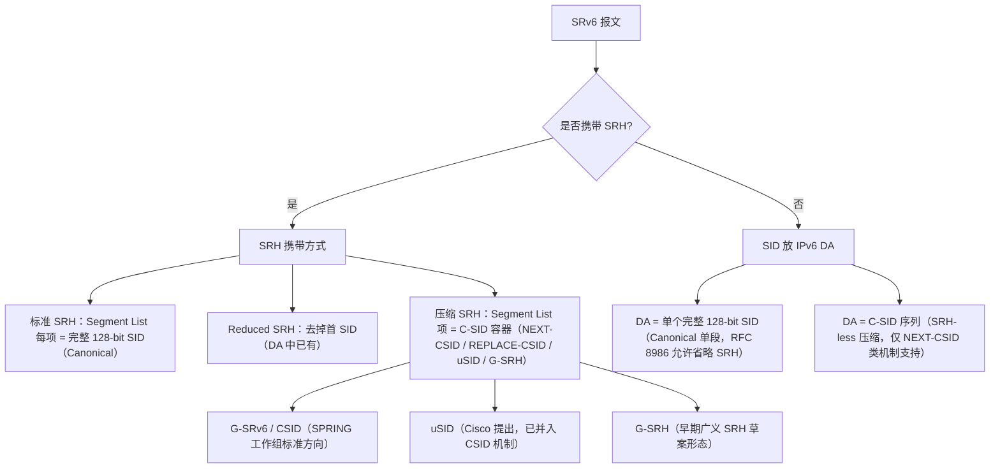
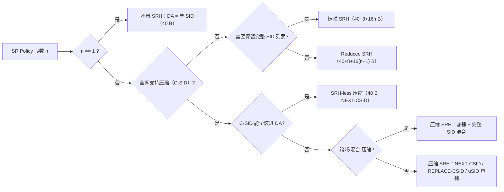

# SRv6 头格式全景分析：Canonical / Non-Canonical / 压缩格式 / 是否携带 SRH

> **文档说明**：本文档系统梳理 SRv6（Segment Routing over IPv6）的各类报文头封装格式，
> 包括标准（Canonical）SRH、非标准（Non-Canonical）变体、压缩 SRv6（G-SRv6 / CSID / uSID），
> 以及"是否携带 SRH（Segment Routing Header）"这一关键维度。
> 所有报文格式图使用 **Mermaid `packet-beta`** 绘制（需 Mermaid ≥ v11.2，GitHub / [mermaid.live](https://mermaid.live) 均支持；
> 若渲染器版本过低，可将每个 `packet-beta` 图替换为 `block-beta` 或等宽文本图）。

---

## 1. 术语澄清：Canonical 与 Non-Canonical 的准确含义

> ⚠️ **重要提示**：IETF 正式标准中**并没有** "Canonical SRv6 / Non-Canonical SRv6" 的正式术语定义。
> 这是业界（尤其运营商与设备商资料）的通俗说法，对应关系如下：

| 通俗说法 | 正式对应 | 参考标准 |
| --- | --- | --- |
| **Canonical（标准/规范格式）** | RFC 8754 定义的**标准 SRH** + RFC 8986 定义的**完整 128-bit SID**（Segment List 每项一个完整 IPv6 地址）；或 RFC 8986 允许的**单 SID 放 DA、不带 SRH** 形态 | [RFC 8754](https://www.rfc-editor.org/rfc/rfc8754)、[RFC 8986](https://www.rfc-editor.org/rfc/rfc8986) |
| **Non-Canonical（非标准/变体格式）** | 一切偏离标准 SRH 编码的形态，包括：① 省略 SRH（SID 直放 DA）；② Reduced SRH（去首 SID）；③ 压缩 SRH（C-SID 容器）；④ SRH-less 压缩（C-SID 全放 DA） | RFC 8754 §4.1.1、RFC 8986 §5.1/5.2、CSID 草案 |
| **压缩 SRv6（Compressed）** | C-SID（Compressed SID）容器编码：G-SRv6 / CSID（NEXT-CSID、REPLACE-CSID）、uSID（微段） | [draft-ietf-spring-srv6-srh-compression](https://datatracker.ietf.org/doc/draft-ietf-spring-srv6-srh-compression)（CSID）、[draft-filsfils-spring-net-pgm-extension-srv6-usid](https://datatracker.ietf.org/doc/draft-filsfils-spring-net-pgm-extension-srv6-usid)（uSID）、[RFC 9602](https://www.rfc-editor.org/rfc/rfc9602) |

**两个正交维度**（本文档的核心组织方式）：



---

## 2. 基础：IPv6 头 + SRv6 SID 结构

### 2.1 IPv6 基础头（40 字节 / 320 bit）


- SRv6 报文就是普通 IPv6 报文：**Next Header = 43（Routing）** 时后面跟 SRH；
- 不带 SRH 时，**DA 直接承载 SID**（见 §4.1），Next Header 指向上层协议。

### 2.2 SRv6 SID 结构（RFC 8986 §3.1）

RFC 8986 定义 SID = **LOC:FUNCT:ARG**，Locator 可表示为 **B:N**（B = SRv6 SID Block 前缀，N = 节点标识）：


- 约束：**L + F + A ≤ 128**，不足 128 bit 时低位补 0（RFC 8986 §3.1）；
- 定位：标准 SID 就是**普通 IPv6 地址**，在中间节点按最长前缀匹配转发（RFC 9602 §3 明确 SID 即前缀）；
- 相关地址空间：RFC 9602 为 SRv6 SID 分配了专用前缀 **`5f00::/16`**（IANA 特殊用途地址注册表）。

---

## 3. Canonical SRv6（标准格式）：完整 SRH

### 3.1 标准 SRH（RFC 8754，Routing Type = 4）

SRH 固定部分 8 字节 + Segment List（每项 128 bit）+ 可选 TLV。以下为 3 段路径（3 个 SID）的完整 SRH：


**字段语义与关键规则**：

| 字段 | 位宽 | 说明 |
| --- | --- | --- |
| Next Header | 8 | 指向 SRH 之后的头/载荷（RFC 8200 §4.4） |
| Hdr Ext Len | 8 | SRH 长度（不含前 8 字节）÷ 8，即 = (总长-8)/8 |
| Routing Type | 8 | **= 4**（Segment Routing） |
| Segments Left | 8 | 到达本节点后**剩余待处理段数**（活动段索引） |
| Last Entry | 8 | Segment List 最后一个元素的索引（0 基） |
| Flags | 8 | RFC 8754 初版全部保留（传输置 0、接收忽略）；**RFC 9259 定义 bit1 = O（OAM 标志，掩码 0x40）** |
| Tag | 16 | 标记报文分组/类别，未用置 0 |
| Segment List[0..n] | 128×n | **编码顺序与 SR Policy 相反**：Segment List[0] 是**最后一个**段，Segment List[n] 是**第一个**段 |
| TLV | 可变 | 可选，如 Padding TLV、HMAC TLV（RFC 8754 §2.1） |

**核心处理逻辑（RFC 8754 §4.3 伪代码要点）**：

```text
当节点收到 DA = 本地 SID 的报文并处理 SRH：
  if Segments Left == 0:  跳到 Next Header 指向的上层头（本节点为终点/解封装点）
  else:
    校验 Last Entry / Segments Left 合法性（Hdr Ext Len 与索引一致）
    Segments Left -= 1
    DA ← Segment List[Segments Left]     // 更新活动段
    Hop Limit -= 1，按新 DA 转发
```

> 注意：**DA 恒等于 Segment List[Segments Left]**（"Active Segment"），这是所有 SRH 变体的公共前提。

### 3.2 SRH Flags 位图（RFC 8754 + RFC 9259 + IANA 注册）


### 3.3 完整封装示例：H.Encaps（RFC 8986 §5.1）

入口节点将原始报文封装进 IPv6+SRH 隧道（示例路径 S1→S2→S3，SL=2）：

```text
IPv6 头:  SA=T(入口), DA=S1, NH=43
SRH:      NH=IPv6(41), HEL=6, RT=4, SL=2, LE=2, Flags=0, Tag=0
          Segment List = (S3, S2, S1)   // 注意：S3 在 [0]，S1 在 [2]
内层:     原始 IPv6/IPv4 报文
```


### 3.4 SRH TLV（RFC 8754 §2.1）


- **Padding TLV**：Type 0–3，用于对齐（SRH 总长为 8 字节整数倍）；
- **HMAC TLV**：Type 5，携带 HMAC 摘要，用于验证 Segment List 未被篡改（bit7=0，不可变）。

---

## 4. Non-Canonical SRv6（非标准 / 变体格式）

### 4.1 不带 SRH：单 SID 直放 DA（RFC 8986 §5.1/5.2 明确允许）

> RFC 8986 §5.1 / §5.2 原文：
> *"The push of the SRH MAY be omitted when the SRv6 Policy only contains one segment and
> there is no need to use any flag, tag, or TLV."*

当路径只有一个 SID 时，SRH 可以**完全省略**，SID 直接放在 IPv6 DA 中——这是最"轻"的 SRv6 头格式（常用于单段 L3VPN 出口行为 End.DT6 / End.DX6 等）：


### 4.2 Reduced SRH（RFC 8754 §4.1.1 / RFC 8986 §5.2 H.Encaps.Red）

**Reduced SRH 不包含第一个 SID**（它已在 DA 中），Last Entry = n-2。以 3 段路径为例：


### 4.3 早期广义 SRH：G-SRH（draft-cl-spring-generalized-srv6-for-cmpr）

G-SRv6 早期方案（已演进为 CSID 草案）不改动 SRH 固定头，而是把 **Segment List 区重解释**为
"G-SID 容器 + Common Prefix + 完整 SID 混合"，从而在**同一个 SRH 内混合**标准 SID 与压缩 G-SID：


> 该草案的贡献是提出 **G-SID Container**（128-bit 槽装多个 32-bit G-SID）与 **COC Flavor**，
> 其思想被后续 CSID 草案的 NEXT-CSID / REPLACE-CSID 吸收。

### 4.4 SRH-less 压缩：C-SID 序列全放 DA

当压缩后的 C-SID 序列能全部装进 128-bit DA（即一个 NEXT-CSID 容器的 Argument 区）时，**可以不带 SRH**。
CSID 草案明确：*"If no SRH is present, the SR segment endpoint node ignores the index value in the SID
Argument … and processes the upper-layer header as per [RFC 8986]"*（即最后一个 C-SID 之后按 End 行为收尾）。


---

## 5. 压缩 SRv6（Compressed）头格式

### 5.1 总览：为什么压缩？怎么压缩？

- **动机**：每个标准 SID 占 128 bit，长路径（如 8–10 段）会带来巨大隧道头开销；
- **原理**（CSID 草案 §3）：同一 SR 域内所有 SID 共享相同的 **Locator-Block**（最高位前缀），
  压缩即**去掉重复的 Locator-Block 与填充位**，只保留每个 SID 的"节点+功能"部分（C-SID）；
- **标准状态**：压缩机制当前以 I-D 推进——[draft-ietf-spring-srv6-srh-compression](https://datatracker.ietf.org/doc/draft-ietf-spring-srv6-srh-compression)
  （CSID，2025-02 版 -23），其 REPLACE-CSID 部分**更新 RFC 8754**（允许 Segment List 条目为 packed C-SID 容器）；
  uSID（Cisco）已并入该机制。RFC 9602 §4 也专门讨论了 C-SID 容器。

### 5.2 NEXT-CSID Flavor（C-SID 容器 = 标准 128-bit SID 结构）

容器本身是一个**完整 128-bit SID**：Locator-Block + 首个 C-SID 的 Loc-Node+Function + Argument 区
**顺次装载后续 C-SID**。每个容器可装 K 个 C-SID，K = ⌊(128 − LBL) / LNFL⌋。
示例（LBL=48, LNFL=16, AL=64 → K=5）：


**压缩后整体报文**（8 个 C-SID 压成 2 个容器 → SRH = 8 + 2×16 = 40 Bytes）：


**端点处理**（NEXT-CSID）：每到一个 C-SID，节点把 Argument 中下一个 C-SID **搬进 DA 的
Loc-Node+Function 位置**（覆盖当前活动 C-SID），实现在 DA 内"滑窗"前进，无需读写 SRH；
容器内 C-SID 用尽后才递减 SL 并取下一个 SRH 条目。→ 这也是它能 **SRH-less**（§4.4）的原因。

### 5.3 REPLACE-CSID Flavor（Packed 容器，更新 RFC 8754）

REPLACE-CSID 的 CSID 序列 = **首容器（完整 128-bit SID，Argument 存索引）** + **后续 packed 容器**。
packed 容器把 128-bit 槽拆成 K = ⌊128/LNFL⌋ 个位置，**第二个 C-SID 放在最低位（pos K-1）**，依次向左。
示例（LNFL=32 → K=4）：


**整体压缩 SRH**（7 个 C-SID → 1 首容器 + 2 packed 容器 = 8+3×16 = 56 Bytes，
对照标准 SRH 8+7×16 = 120 Bytes）：


**端点处理**（REPLACE-CSID）：处理时更新 Argument 中的**索引**（index），索引指到 packed 容器中下一个
C-SID 的位置；索引回绕（0）时递减 SL 并移动到下一个 Segment List 条目；**无 SRH 时忽略索引直接收尾**（见 §4.4 引文）。

### 5.4 uSID（微段，Cisco / draft-filsfils-spring-net-pgm-extension-srv6-usid）

uSID 草案将 128-bit SID 组织为 **uSID Block（域内共享前缀）+ uSID（长度可配，常见 32-bit）+ Argument**；
Cisco 常用部署为 **B:N:F:A 各 32-bit**，其中路由前缀 /64 = B:N::/64（Block+Node），uSID 即 32-bit 的节点/功能值（GIB 全局 / LIB 本地）。
装载时每个 128-bit SRH 槽可放 **4 个 32-bit uSID**——与 NEXT-CSID 容器机制一致。


- uSID 行为：uN（节点转发，≈End）、uA（邻接，≈End.X）、uDT（解封装+VRF 查表，≈End.DT）、uDX（≈End.DX）；
- 当前 uSID 的**报文编码已并入 CSID 草案**（NEXT-CSID 兼容），Cisco 设备按 32-bit C-SID 装载；
- 相关地址规划：uSID Block 通常取 `fc00::/16` 等专用前缀（配合 RFC 9602 的 5f00::/16 语义）。

### 5.5 压缩 SID 长度与混合编码

C-SID 长度（LNFL）可按部署选择（16/32/48/64 bit 等），Segment List 中可以**混合**压缩容器与
未压缩的完整 SID（CSID 草案 §3：压缩失败的部分保留完整 128-bit 条目），也支持跨域 Locator-Block 交换
（End.LBS / End.XLBS，§7）。

---

## 6. "是否携带 SRH" 完整对照矩阵

| # | 形态 | SID 编码 | 携带 SRH？ | SRH 内容 | 隧道头开销 | 标准状态 | 典型场景 |
| --- | --- | --- | --- | --- | --- | --- | --- |
| 1 | SRv6 无 SRH（单 SID） | 完整 128-bit | **否** | — | 40 B | RFC 8986 §5.1/5.2 允许 | 单段 L3VPN（End.DT6/DX6） |
| 2 | SRv6 + 标准 SRH | 完整 128-bit | **是** | 每项一个完整 SID | 40 + 8 + 16n B | RFC 8754/8986 | 多段 TE、TI-LFA |
| 3 | SRv6 + Reduced SRH | 完整 128-bit（首段在 DA） | **是**（少一项） | 去首 SID，LE=n−2 | 40 + 8 + 16(n−1) B | RFC 8754 §4.1.1、RFC 8986 §5.2 | 头长优化 |
| 4 | G-SRv6 NEXT-CSID | 压缩 C-SID 容器 | **是**（标准 SRH 结构） | 容器序列（每容器 K 个 C-SID） | 40 + 8 + 16×⌈n/K⌉ B | CSID 草案 §4.1 | 长路径压缩 |
| 5 | G-SRv6 REPLACE-CSID | 压缩 C-SID packed 容器 | **是**（更新 RFC 8754） | 首容器 + packed 容器 | 40 + 8 + 16×⌈(n−1)/K⌉ + 16 B | CSID 草案 §4.2 | 长路径压缩（主流） |
| 6 | SRH-less 压缩 | 压缩 C-SID 全在 DA | **否** | — | 40 B | CSID 草案（NEXT-CSID 特例） | 极短路径（≤K 个 C-SID） |
| 7 | uSID | 32-bit uSID（B:N:F:A） | **是**（槽 = 4×32bit） | uSID 序列 | 同 #4/#5 | 并入 CSID 草案 | Cisco 生态 |
| 8 | 原始 G-SRH | 混合 完整 SID + G-SID 容器 | **是**（Segment List 重解释） | 容器 + Common Prefix + 完整 SID | 40 + 8 + 16×m B | 早期草案（已演进） | 历史参考 |

> 注：n = 段数；K = 每容器 C-SID 数；⌈·⌉ 向上取整。标准 SRH 每增加一段 +16 B，
> REPLACE-CSID 每增加 K 段才 +16 B——这是压缩的核心收益。

**决策树（按部署诉求选择封装）**：



---

## 7. 开销对比示例（8 段路径，LBL=48/LNFL=32）

| 封装形态 | 隧道头 | 相对标准 SRH 节省 |
| --- | --- | --- |
| 标准 SRH（#2） | 40 + 8 + 16×8 = **176 B** | 基准 |
| Reduced SRH（#3） | 40 + 8 + 16×7 = **160 B** | 9% |
| NEXT-CSID 压缩（#4，K=2，⌈8/2⌉=4 容器） | 40 + 8 + 16×4 = **112 B** | 36% |
| REPLACE-CSID 压缩（#5，K=4，1+⌈7/4⌉=3 容器） | 40 + 8 + 16×3 = **96 B** | 45% |
| SRH-less 压缩（#6，仅当 n≤K） | **40 B** | 77% |

> 头部开销仅指 IPv6+SRH；实际报文还包含内层载荷，压缩收益随段数增加而放大。

---

## 8. 参考标准与文档

| 文档 | 内容 | 状态 |
| --- | --- | --- |
| [RFC 8754](https://www.rfc-editor.org/rfc/rfc8754) | Segment Routing Header（标准 SRH、TLV、处理伪代码） | 标准（2020） |
| [RFC 8986](https://www.rfc-editor.org/rfc/rfc8986) | SRv6 Network Programming（SID 格式、End 行为、H.Encaps 系列） | 标准（2021） |
| [RFC 9259](https://www.rfc-editor.org/rfc/rfc9259) | SRv6 OAM（定义 SRH Flags 的 O 位） | 标准（2022） |
| [RFC 9602](https://www.rfc-editor.org/rfc/rfc9602) | SRv6 SID 与 IPv6 寻址架构（C-SID 讨论、5f00::/16 分配） | Informational（2024） |
| [draft-ietf-spring-srv6-srh-compression](https://datatracker.ietf.org/doc/draft-ietf-spring-srv6-srh-compression) | CSID：NEXT-CSID / REPLACE-CSID 压缩编码（更新 RFC 8754） | I-D（2025-02，-23） |
| [draft-filsfils-spring-net-pgm-extension-srv6-usid](https://datatracker.ietf.org/doc/draft-filsfils-spring-net-pgm-extension-srv6-usid) | uSID（B:N:F:A、uN/uA/uDT/uDX） | I-D（已并入 CSID） |
| [draft-cl-spring-generalized-srv6-for-cmpr](https://datatracker.ietf.org/doc/draft-cl-spring-generalized-srv6-for-cmpr) | 原始 G-SRv6 / G-SRH / G-SID 容器 | I-D（历史） |
| [draft-srcompdt-spring-compression-requirement](https://datatracker.ietf.org/doc/draft-srcompdt-spring-compression-requirement) | SRv6 SID 列表压缩需求（SRCOMP DT） | I-D |

---

*本文档基于上述 RFC/草案原文核对生成；"Canonical / Non-Canonical" 为业界通俗分类，文中均给出了与正式标准的一一对应。*
